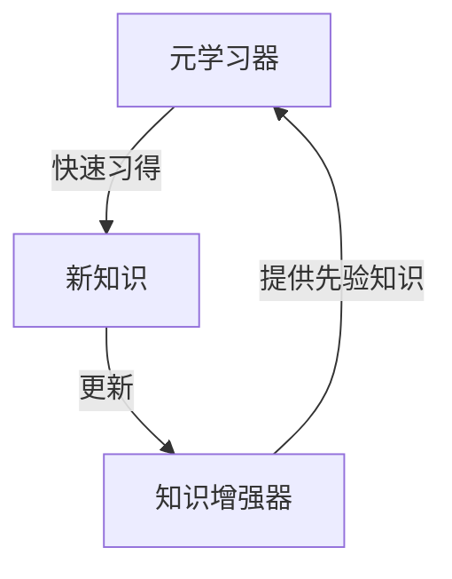

# MAML赋能:智能对话系统新思路

## 1.背景介绍

### 1.1 对话系统的重要性

在当今信息时代,人机交互已经成为不可或缺的一部分。对话系统作为人机交互的重要形式,在各个领域扮演着越来越重要的角色。无论是智能助手、客户服务还是教育培训,对话系统都为我们提供了高效、自然的交互方式。然而,传统的对话系统往往存在一些缺陷,比如缺乏上下文理解能力、知识库有限等,这极大地限制了它们的实用性和用户体验。

### 1.2 MAML的崛起

为了解决这些问题,Meta AI研究院提出了一种新的对话系统范式——MAML(Meta-Augmented Meta Learner)。MAML利用元学习和知识增强的思想,赋予对话系统更强大的理解和推理能力。它能够从少量数据中快速学习,并将先验知识与新获取的知识相结合,形成更加全面和上下文相关的理解。

### 1.3 MAML的独特优势

相较于传统方法,MAML具有以下独特优势:

- 快速学习能力:能够从少量数据中快速习得新知识和技能
- 知识迁移能力:可将已有知识灵活应用到新领域
- 上下文理解能力:能够捕捉对话的语境和用户意图
- 知识增强能力:持续吸收新知识,不断完善自身

这些优势使得MAML非常适合应用于各种对话场景,有望带来全新的人机交互体验。

## 2.核心概念与联系

### 2.1 元学习(Meta-Learning)

元学习是MAML的核心理念之一。它旨在学习一种通用的学习策略,使模型能够在新的任务上快速习得,而不必从头开始训练。具体来说,元学习算法会在一系列不同但相关的任务上训练,从而学习到一种可迁移的表示和策略,使模型在遇到新任务时,只需少量数据和训练就能完成知识迁移。

这一思想源于人类的学习方式。我们往往不会对每个新事物都一无所知,而是能够基于已有的知识和经验快速习得新概念。元学习赋予了机器这种"学习如何学习"的能力。

### 2.2 知识增强(Knowledge Augmentation)

知识增强是MAML的另一个核心概念。它指的是利用外部知识源(如知识库、语料库等)来增强模型的知识表示和推理能力。

传统的对话系统往往依赖有限的训练数据,因此其知识覆盖面有限。而MAML则可以将大规模的结构化和非结构化知识源融入模型中,从而获得更加丰富、全面的知识表示,提高对话理解和生成的质量。

### 2.3 元学习与知识增强的融合

MAML将元学习和知识增强有机结合,充分发挥两者的优势:

- 元学习使模型具备快速习得新知识的能力
- 知识增强为模型提供了广博的知识基础
- 二者相互促进,形成正向循环

当遇到新领域或新任务时,MAML可以基于现有知识快速习得相关知识,并将新获取的知识合理融入知识库中,不断扩充和完善自身。这种动态的知识获取和更新机制,使MAML能够持续进化,跟上不断变化的需求。

## 3.核心算法原理具体操作步骤  

MAML的核心算法由两个主要部分组成:元学习器(Meta-Learner)和知识增强器(Knowledge Augmenter)。下面将分步骤介绍其工作原理。

### 3.1 元学习器

元学习器的目标是学习一种通用的学习策略,使模型能够快速习得新任务。它的工作过程如下:

1. **任务采样**: 从一系列相关任务的分布中采样一批任务
2. **内循环更新**: 对于每个任务,在其支持集(support set)上进行几步梯度更新,模拟快速学习的过程
3. **外循环优化**: 在所有任务的查询集(query set)上计算损失,并通过对模型参数进行梯度下降优化,提高在新任务上的泛化能力

这种两个循环交替进行的优化方式,被称为"优化过程的优化"(Optimization of Optimization Process),是MAML的核心所在。通过在多个任务上反复训练,模型逐步学习到一个高效的学习策略,从而获得快速习得新知识的能力。

#### MAML算法伪代码

$$
\begin{aligned}
\textbf{Input:}\\
&\alpha, \beta  &&\textit{// 学习率}\\
&p(\mathcal{T}) &&\textit{// 任务分布}\\
\textbf{Initialise:}\\
&\theta &&\textit{// 模型初始参数}\\
\textbf{while} \; \text{not done} \; \textbf{do}\\
&\mathcal{T}_i \sim p(\mathcal{T}) &&\textit{// 采样批任务}\\
&\textbf{for} \; \mathcal{T} \in \mathcal{T}_i \; \textbf{do}\\
&\qquad \theta' = \theta - \alpha \nabla_\theta \mathcal{L}_\mathcal{T}^{train}(\theta) &&\textit{// 内循环更新}\\
&\textbf{end}\\
&\theta \leftarrow \theta - \beta \nabla_\theta \sum_{\mathcal{T} \in \mathcal{T}_i} \mathcal{L}_\mathcal{T}^{val}(\theta') &&\textit{// 外循环优化}\\
\textbf{end}\\
\end{aligned}
$$

其中 $\mathcal{L}_\mathcal{T}^{train}$ 和 $\mathcal{L}_\mathcal{T}^{val}$ 分别代表任务 $\mathcal{T}$ 的训练损失和验证损失。

### 3.2 知识增强器

知识增强器的作用是将外部知识源融入模型,丰富其知识表示。这个过程分为以下几步:

1. **知识提取**: 从各种知识源(如知识库、文本语料等)中提取相关的结构化和非结构化知识
2. **知识表示**: 将提取的知识转化为机器可以理解的形式,如知识图谱、向量表示等
3. **知识融合**: 将知识表示注入模型,可以通过参数化的记忆模块、注意力机制等方式实现
4. **知识更新**: 在与用户交互的过程中,不断从对话中获取新知识,并更新知识库

通过这一过程,MAML可以充分利用现有的知识资源,获得广博的知识基础。同时,它还具备持续学习和更新知识的能力,确保知识始终保持新鲜和相关性。

### 3.3 元学习器与知识增强器的协同

MAML的元学习器和知识增强器相互配合,共同赋予模型强大的理解和推理能力:

1. 知识增强器为元学习器提供了丰富的先验知识
2. 元学习器能够快速吸收和理解知识增强器提供的新知识
3. 元学习器在新任务上快速习得的知识,会反过来更新和完善知识增强器的知识库
4. 两者形成正向循环,模型的能力不断得到增强

如下图所示,MAML的工作流程就是元学习器和知识增强器在这个循环中不断互馈:

通过这种紧密协作,MAML可以在不断变化的环境中持续进化,学习新知识、解决新问题,从而提供卓越的对话体验。

## 4.数学模型和公式详细讲解举例说明

在上一节中,我们已经介绍了MAML的核心算法原理和伪代码。现在,让我们进一步深入探讨其中的数学模型和公式。

### 4.1 元学习的形式化表述

我们先来看元学习的形式化表述。假设有一个模型 $f_\theta$,其参数为 $\theta$。在某个任务 $\mathcal{T}$ 上,我们的目标是最小化损失函数 $\mathcal{L}_\mathcal{T}(f_\theta)$。传统的方法是直接在该任务上对 $\theta$ 进行优化:

$$
\theta^* = \arg\min_\theta \mathcal{L}_\mathcal{T}(f_\theta)
$$

而元学习的思路则是先在一系列相关任务 $p(\mathcal{T})$ 上训练,学习到一个高效的学习策略(称为元学习器 $\mathcal{M}$),使得在遇到新任务时,只需少量步骤即可找到好的解:

$$
\theta_\mathcal{T}^* = \mathcal{M}_\phi(\mathcal{T}, \theta)
$$

其中 $\phi$ 是元学习器的参数,通过在任务分布 $p(\mathcal{T})$ 上最小化以下目标函数进行优化:

$$
\min_\phi \mathbb{E}_{\mathcal{T} \sim p(\mathcal{T})} \big[ \mathcal{L}_\mathcal{T}\big(f_{\theta_\mathcal{T}^*}\big) \big] \quad \text{where} \quad \theta_\mathcal{T}^* = \mathcal{M}_\phi(\mathcal{T}, \theta)
$$

这种"学习如何学习"的思路,赋予了模型快速习得新知识的能力。

### 4.2 MAML算法的数学推导

接下来,我们具体看一下MAML算法是如何实现上述元学习过程的。

在MAML中,元学习器 $\mathcal{M}$ 被参数化为一个模型初始化加上若干步梯度更新。具体来说,对于任务 $\mathcal{T}$,先在其支持集(support set) $\mathcal{D}_\mathcal{T}^{train}$ 上进行 $k$ 步梯度更新:

$$
\begin{aligned}
\theta_0 &= \theta \\
\theta_i &= \theta_{i-1} - \alpha \nabla_\theta \mathcal{L}_\mathcal{T}^{train}(f_{\theta_{i-1}}; \mathcal{D}_\mathcal{T}^{train}), \quad i=1,...,k
\end{aligned}
$$

然后在查询集(query set) $\mathcal{D}_\mathcal{T}^{val}$ 上计算损失,并对模型初始参数 $\theta$ 进行梯度下降优化:

$$
\theta \leftarrow \theta - \beta \nabla_\theta \mathcal{L}_\mathcal{T}^{val}(f_{\theta_k}; \mathcal{D}_\mathcal{T}^{val})
$$

这个过程在多个任务上重复进行,使得 $\theta$ 逐步学习到一种通用的快速学习策略。

### 4.3 知识增强的数学模型

除了元学习之外,MAML还融入了知识增强的思想。知识增强模块可以用一个函数 $g_\psi$ 表示,其参数为 $\psi$。该函数将外部知识 $\mathcal{K}$ 映射到模型 $f_\theta$ 的参数空间,从而增强模型的知识表示:

$$
\theta' = g_\psi(\theta, \mathcal{K})
$$

在训练过程中,我们同时优化 $\theta$ 和 $\psi$,使得模型能够充分利用外部知识,提高对话理解和生成的质量。

具体来说,损失函数 $\mathcal{L}$ 不仅依赖于模型参数 $\theta$,还依赖于知识增强函数 $g_\psi$:

$$
\mathcal{L}(\theta, \psi) = \mathcal{L}\big(f_{g_\psi(\theta, \mathcal{K})}\big)
$$

在优化时,我们对 $\theta$ 和 $\psi$ 同时进行梯度下降:

$$
\begin{aligned}
\theta &\leftarrow \theta - \alpha \nabla_\theta \mathcal{L}(\theta, \psi) \\
\psi &\leftarrow \psi - \beta \nabla_\psi \mathcal{L}(\theta, \psi)
\end{aligned}
$$

通过这种方式,MAML可以学习到一种高效的知识融合策略,充分利用外部知识源丰富自身的表示能力。

### 4.4 元学习与知识增强的融合

最后,我们看一下MAML是如何将元学习和知识增强有机结