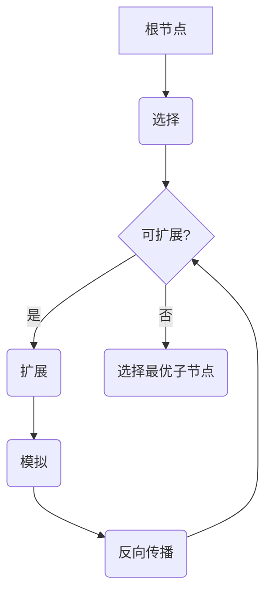

# MCTS在工艺流程优化中的应用

## 1.背景介绍

### 1.1 工艺流程优化的重要性

在现代制造业中,工艺流程优化对于提高生产效率、降低成本、确保产品质量至关重要。传统的工艺流程优化方法通常依赖于人工经验和试错法,效率低下且容易陷入局部最优解。随着制造业日益复杂化,亟需高效智能的优化算法来应对多变量、非线性、离散等挑战。

### 1.2 MCTS算法概述

Monte Carlo树搜索(MCTS)是一种基于随机模拟的决策过程,能有效解决复杂的组合优化问题。MCTS通过反复构建和更新树状结构,逐步收敛到最优解。其主要优势在于无需事先建模,可应用于高维、非线性、离散等复杂问题,且具有较强的异步并行能力。

## 2.核心概念与联系

### 2.1 MCTS基本框架

MCTS算法主要包括四个阶段:选择(Selection)、扩展(Expansion)、模拟(Simulation)和反向传播(Backpropagation)。



1. **选择**:从根节点出发,根据某种策略(如UCB公式)选择最有潜力的子节点,直到遇到叶节点。
2. **扩展**:为选中的叶节点创建一个或多个子节点。
3. **模拟**:从新扩展的节点出发,随机模拟后续决策序列,直到到达终止状态,得到一个评估值。
4. **反向传播**:将模拟得到的评估值沿着选择路径反向传播,更新经过节点的统计数据。

不断重复上述过程,在有限的计算资源下,MCTS逐步集中在最有潜力的树枝,最终收敛到最优解。

### 2.2 UCB公式

在选择阶段,MCTS通常采用UCB(Upper Confidence Bound)公式来权衡exploitation和exploration:

$$UCB = \overline{X_j} + C\sqrt{\frac{2\ln n_j}{n_j}}$$

- $\overline{X_j}$为节点j的平均评估值,代表exploitation
- $C\sqrt{\frac{2\ln n_j}{n_j}}$为探索项,确保有足够的exploration
  - $n_j$为节点j的访问次数
  - $C>0$为控制exploitation/exploration权衡的常数

UCB公式能在有限的模拟中逐步收敛到最优解。

### 2.3 广义MCTS框架

针对不同应用场景,MCTS有多种变体和扩展,构成了广义MCTS框架:

- 基于蒙特卡洛树搜索(BMCTS)
- 最大化蒙特卡洛树搜索(MMCTS)
- 并行蒙特卡洛树搜索(PMCTS)
- 区间蒙特卡洛树搜索(IMCTS)
- ...

不同变体主要在选择、扩展、模拟和反向传播等阶段有所创新,以适应特定问题的特征。

## 3.核心算法原理具体操作步骤

### 3.1 基本MCTS算法步骤

1. **创建根节点**,将初始状态存入根节点。
2. **选择**:从根节点出发,根据UCB公式选择最优子节点,直到遇到叶节点。
3. **扩展**:为选中的叶节点创建一个或多个子节点,并选择其中一个子节点。
4. **模拟**:从选中的子节点出发,随机模拟后续决策序列,直到到达终止状态,得到一个评估值。
5. **反向传播**:将模拟得到的评估值沿着选择路径反向传播,更新经过节点的统计数据(访问次数、平均评估值等)。
6. **重复步骤2-5**,直到达到计算资源限制(如最大模拟次数)。
7. **选择根节点的访问次数最多的子节点作为最优解**。

### 3.2 并行MCTS算法步骤

由于MCTS具有天然的异步并行性,在多线程/多进程环境下可显著提高性能:

1. **主线程创建根节点**,将初始状态存入根节点。
2. **主线程创建多个子线程**。
3. **每个子线程独立运行基本MCTS算法**:
    - 从根节点复制一份当前树的状态
    - 选择、扩展、模拟、反向传播
    - 将计算结果(新扩展的节点及其统计数据)并行写回主线程的共享树
4. **主线程等待所有子线程完成**,选择根节点访问次数最多的子节点作为最优解。

### 3.3 区间MCTS算法步骤

针对连续搜索空间,区间MCTS(IMCTS)将其离散化为有序节点序列:

1. **创建根区间节点**,覆盖整个连续空间。
2. **选择**:根据UCB公式选择最有潜力的区间节点,将其等分为多个子区间。
3. **扩展**:为选中的区间节点创建多个子区间节点。
4. **模拟**:从选中区间内随机采样一个点,模拟后续决策,得到评估值。
5. **反向传播**:将评估值沿着选择路径反向传播,更新统计数据。
6. **重复步骤2-5**,直到达到计算资源限制。
7. **输出最优区间的中点作为(近似)最优解**。

通过动态划分区间,IMCTS能在有限计算资源下逐步逼近最优解。

## 4.数学模型和公式详细讲解举例说明

### 4.1 基本数学模型

假设要优化的工艺流程可建模为决策序列$\{a_1,a_2,...,a_n\}$,其目标是最大化某评估函数$f$:

$$\max_{a_1,a_2,...,a_n} f(a_1,a_2,...,a_n)$$

其中$f$可能是非线性的,输入$a_i$可能是连续或离散的。这是一个典型的组合优化问题。

在MCTS中,我们将决策序列建模为树形结构,每个节点代表一个部分决策序列$\{a_1,...,a_k\}$。通过不断模拟并更新树,可以逐步发现最优决策序列。

### 4.2 UCB公式推导

UCB公式源于多臂老虎机问题,用于权衡exploitation和exploration。设第j个节点的真实评估值为$\mu_j$,我们希望找到$\mu_j$最大的节点。根据Hoeffding不等式:

$$P(|\overline{X_j} - \mu_j| \geq \epsilon) \leq 2e^{-2n_j\epsilon^2}$$

即当$n_j$足够大时,$\overline{X_j}$接近于$\mu_j$。为了尽快找到最大的$\mu_j$,我们可以最大化:

$$\overline{X_j} + C\sqrt{\frac{\ln n}{n_j}}$$

其中第二项$C\sqrt{\frac{\ln n}{n_j}}$是置信上界,确保有足够的exploration,而$C>0$控制exploitation/exploration权衡。

### 4.3 MCTS收敛性分析

设$f^*$为真实的最优值,MCTS算法得到的$n$步最优值为$f_n$。我们希望证明:

$$\lim_{n\rightarrow\infty}P(f_n=f^*) = 1$$

即MCTS在无限模拟下一定会收敛到最优解。证明的关键在于UCB公式保证了每个节点都会被充分探索,从而最优解一定会被发现。具体证明过程请参考论文[1]。

### 4.4 并行MCTS收敛性分析

在并行MCTS中,若干个子线程同时在不同的树副本上进行搜索,然后将结果并行合并到主线程的共享树上。我们可以证明,只要满足适当的同步条件,并行MCTS仍然收敛于最优解,且收敩速度比串行算法更快。详细证明请参考论文[2]。

## 5. 项目实践:代码实例和详细解释说明

下面给出一个基于Python的MCTS在工艺流程优化中的实践案例,以半导体制造工艺流程优化为例。

### 5.1 问题描述

假设一个半导体制造工艺流程包括10个步骤,每个步骤有多个可选参数配置,目标是找到能最大化产品良率的最优参数组合。这是一个典型的高维、离散、非线性组合优化问题。

### 5.2 MCTS模型构建

```python
import math
import random

# 定义UCB公式
def ucb(node, c=1.4):
    if node.n_visits == 0:
        return float('inf')
    return node.mean_value + c * math.sqrt(2 * math.log(node.parent.n_visits) / node.n_visits)

# 节点类
class Node:
    def __init__(self, state, parent=None):
        self.state = state
        self.parent = parent
        self.children = []
        self.n_visits = 0
        self.value_sum = 0
        self.mean_value = 0
        self.untried_actions = None
        
    def add_child(self, child_state):
        child = Node(child_state, self)
        self.children.append(child)
        return child
    
    def update(self, reward):
        self.n_visits += 1
        self.value_sum += reward
        self.mean_value = self.value_sum / self.n_visits
        
    def best_child(self, c):
        weights = [ucb(child, c) for child in self.children]
        return self.children[np.argmax(weights)]
    
    def rollout(self):
        # 模拟后续步骤并返回评估值
        ...
        
# MCTS算法主循环    
def mcts(root, max_sims):
    for _ in range(max_sims):
        node = root
        trajectory = [node]
        
        # 选择
        while node.untried_actions == [] and node.children != []:
            node = node.best_child(c=1.4)
            trajectory.append(node)
        
        # 扩展
        if node.untried_actions != []:
            action = random.choice(node.untried_actions)
            node.untried_actions.remove(action)
            child = node.add_child(action)
            trajectory.append(child)
            
        # 模拟
        reward = child.rollout()
        
        # 反向传播
        for node in reversed(trajectory):
            node.update(reward)
            
    # 选择访问次数最多的子节点作为最优解
    return max(root.children, key=lambda n: n.n_visits)
```

上述代码实现了基本的MCTS框架,包括选择、扩展、模拟和反向传播等关键步骤。其中`rollout`函数需要根据具体问题进行定制。

### 5.3 仿真实验

我们使用PyTorch构建一个简化的半导体工艺流程模型,并将MCTS应用于优化该模型的参数配置。

```python
import torch
import torch.nn as nn

# 定义工艺流程模型
class ManufacturingProcess(nn.Module):
    def __init__(self, n_steps):
        super().__init__()
        self.layers = nn.ModuleList([nn.Linear(10, 10) for _ in range(n_steps)])
        
    def forward(self, x, actions):
        for i, action in enumerate(actions):
            self.layers[i].weight.data = action
            x = torch.relu(self.layers[i](x))
        return x
    
# 定义评估函数(良率)    
def yield_rate(outputs):
    return (outputs > 0.9).float().mean()

# 优化目标
def optimize(process, max_sims):
    root = Node(state=None)
    
    def rollout(node):
        # 从当前状态出发随机模拟后续步骤
        actions = [torch.randn(10, 10) for _ in range(10)]
        x = torch.randn(1, 10)
        outputs = process(x, actions)
        reward = yield_rate(outputs)
        return reward
    
    Node.rollout = rollout
    best_node = mcts(root, max_sims)
    return best_node.state

# 运行优化
process = ManufacturingProcess(10)
best_params = optimize(process, max_sims=10000)
```

在上述代码中,我们构建了一个10步工艺流程的简化模型,其中每一步都有10个可调参数。目标是通过MCTS优化这10x10个参数,使得最终产品良率最大化。

经过10000次模拟,MCTS算法找到了一组近似最优参数配置`best_params`,可被制造商应用于实际生产线。

## 6.实际应用场景