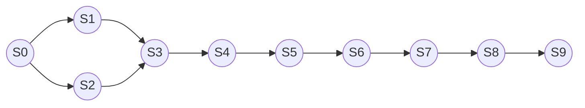
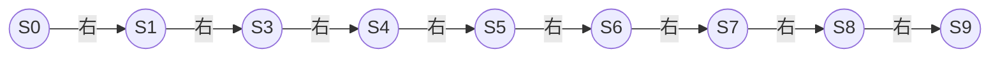

# MDP的可解释性和可信赖性

## 1.背景介绍

### 1.1 什么是MDP

马尔可夫决策过程(Markov Decision Process, MDP)是一种强大的数学框架,广泛应用于决策理论、强化学习、运筹学和人工智能领域。MDP为智能体在不确定环境中做出最优决策提供了形式化的建模和求解方法。

在MDP中,智能体与环境进行交互,观察当前状态,执行动作,并获得奖励或惩罚。智能体的目标是找到一个策略(policy),即状态到动作的映射,使得长期累积奖励最大化。

### 1.2 MDP的重要性

MDP已成为人工智能和机器学习领域中最重要和最广泛研究的主题之一。它为智能系统提供了一个坚实的理论基础,使其能够在复杂的、不确定的环境中做出明智的决策。MDP在许多实际应用中发挥着关键作用,如机器人规划、自动驾驶、资源优化、游戏AI等。

然而,随着MDP在关键任务和高风险领域的应用不断增加,其可解释性和可信赖性变得至关重要。我们需要确保智能系统的决策过程是透明的、可理解的,并且其行为是可预测和可控的。

## 2.核心概念与联系

### 2.1 可解释性(Interpretability)

可解释性指的是智能系统决策过程的透明度和可理解性。一个可解释的MDP系统应该能够清晰地解释其做出特定决策的原因和依据。这包括:

1. 对状态的表示和解释
2. 对动作选择的理由说明
3. 对奖励函数设计的解释
4. 对长期策略的可视化和解释

提高MDP的可解释性有助于建立人类对系统的信任,并促进人机协作。它还有助于发现系统中的偏差和错误,从而提高系统的鲁棒性和公平性。

### 2.2 可信赖性(Trustworthiness)

可信赖性指的是智能系统行为的可预测性、安全性和稳健性。一个可信赖的MDP系统应该满足以下条件:

1. 策略的稳定性和一致性
2. 对意外情况和异常输入的鲁棒性
3. 对安全约束和伦理规范的遵循
4. 对不确定性和噪声的适应能力

提高MDP的可信赖性对于部署在关键任务和高风险环境中的智能系统至关重要。它有助于减少意外行为和失败的风险,确保系统的安全性和可靠性。

### 2.3 可解释性与可信赖性的关系

可解释性和可信赖性是相互关联的概念。一个可解释的系统有助于建立人类对其决策过程的信任,从而提高其可信赖性。同时,一个可信赖的系统也更容易被理解和解释,因为它的行为更加一致和可预测。

然而,提高可解释性和可信赖性也存在一些权衡和挑战。例如,过于简单的模型可能更容易解释,但可能无法捕捉复杂环境的细微差异,从而降低了可信赖性。反之,高度复杂的模型可能更加准确和可信赖,但其决策过程可能难以解释。

因此,在设计MDP系统时,需要权衡可解释性和可信赖性之间的关系,并根据具体应用场景做出适当的权衡。

## 3.核心算法原理具体操作步骤

### 3.1 MDP的形式化定义

马尔可夫决策过程(MDP)可以形式化定义为一个元组 $(S, A, P, R, \gamma)$,其中:

- $S$ 是一个有限的状态集合
- $A$ 是一个有限的动作集合
- $P(s'|s,a)$ 是状态转移概率,表示在状态 $s$ 下执行动作 $a$ 后转移到状态 $s'$ 的概率
- $R(s,a)$ 是奖励函数,表示在状态 $s$ 下执行动作 $a$ 获得的即时奖励
- $\gamma \in [0, 1)$ 是折现因子,用于权衡即时奖励和长期奖励的重要性

智能体的目标是找到一个策略 $\pi: S \rightarrow A$,使得在遵循该策略时,从任意初始状态出发的期望累积折现奖励最大化,即:

$$
\max_\pi \mathbb{E}_\pi \left[ \sum_{t=0}^\infty \gamma^t R(s_t, a_t) \right]
$$

其中 $s_t$ 和 $a_t$ 分别表示在时间步 $t$ 的状态和动作。

### 3.2 价值函数和贝尔曼方程

在MDP中,我们通常使用价值函数来评估一个策略的好坏。对于一个给定的策略 $\pi$,其在状态 $s$ 下的价值函数 $V^\pi(s)$ 定义为:

$$
V^\pi(s) = \mathbb{E}_\pi \left[ \sum_{t=0}^\infty \gamma^t R(s_t, a_t) \big| s_0 = s \right]
$$

同样,我们可以定义一个状态-动作价值函数 $Q^\pi(s,a)$,表示在状态 $s$ 下执行动作 $a$,然后遵循策略 $\pi$ 所能获得的期望累积奖励:

$$
Q^\pi(s,a) = \mathbb{E}_\pi \left[ \sum_{t=0}^\infty \gamma^t R(s_t, a_t) \big| s_0 = s, a_0 = a \right]
$$

价值函数和状态-动作价值函数满足以下贝尔曼方程:

$$
\begin{aligned}
V^\pi(s) &= \sum_{a \in A} \pi(a|s) \left( R(s,a) + \gamma \sum_{s' \in S} P(s'|s,a) V^\pi(s') \right) \\
Q^\pi(s,a) &= R(s,a) + \gamma \sum_{s' \in S} P(s'|s,a) \sum_{a' \in A} \pi(a'|s') Q^\pi(s',a')
\end{aligned}
$$

利用上述方程,我们可以通过动态规划或蒙特卡罗方法来计算给定策略下的价值函数和状态-动作价值函数。

### 3.3 策略优化算法

在计算出价值函数或状态-动作价值函数后,我们可以使用策略优化算法来寻找最优策略。常见的策略优化算法包括:

1. **策略迭代(Policy Iteration)**: 交替执行策略评估(计算当前策略的价值函数)和策略改进(根据价值函数更新策略)的过程,直到收敛到最优策略。

2. **价值迭代(Value Iteration)**: 直接计算最优价值函数,然后从最优价值函数中导出最优策略。

3. **Q-Learning**: 一种基于时序差分(Temporal Difference)的无模型强化学习算法,通过不断更新状态-动作价值函数来逼近最优策略。

4. **策略梯度(Policy Gradient)**: 直接优化策略参数,使期望累积奖励最大化。常用于连续状态和动作空间的情况。

上述算法都有各自的优缺点和适用场景。在实际应用中,需要根据具体问题的特点和约束条件选择合适的算法。

## 4.数学模型和公式详细讲解举例说明

在前面的章节中,我们已经介绍了MDP的形式化定义、价值函数和贝尔曼方程。现在,我们将通过一个具体示例来详细解释这些数学模型和公式。

### 4.1 示例:机器人导航

考虑一个机器人导航的问题,如下图所示:



机器人需要从起点 $S_0$ 导航到终点 $S_9$。在每个状态下,机器人可以选择向左移动或向右移动。如果机器人到达终点,它将获得 +10 的奖励;如果走入死胡同,将获得 -10 的惩罚;其他情况下,每一步移动都会获得 -1 的惩罚。我们假设状态转移是确定性的,即机器人的动作总是会产生预期的结果。折现因子 $\gamma = 0.9$。

我们可以将这个问题建模为一个MDP:

- 状态集合 $S = \{S_0, S_1, \ldots, S_9\}$
- 动作集合 $A = \{\text{左}, \text{右}\}$
- 状态转移概率 $P(s'|s,a)$ 为确定性的,例如 $P(S_1|S_0, \text{右}) = 1$
- 奖励函数 $R(s,a)$ 如上所述

现在,我们的目标是找到一个最优策略 $\pi^*$,使得从起点 $S_0$ 出发的期望累积奖励最大化。

### 4.2 计算价值函数和状态-动作价值函数

我们可以使用价值迭代算法来计算最优价值函数 $V^*(s)$ 和最优状态-动作价值函数 $Q^*(s,a)$。算法的具体步骤如下:

1. 初始化 $V^*(s) = 0$ 对于所有状态 $s$
2. 重复以下步骤直到收敛:
   - 对于每个状态 $s$ 和动作 $a$,计算:
     $$
     Q^*(s,a) = R(s,a) + \gamma \sum_{s' \in S} P(s'|s,a) V^*(s')
     $$
   - 对于每个状态 $s$,更新:
     $$
     V^*(s) = \max_{a \in A} Q^*(s,a)
     $$

通过上述迭代过程,我们可以得到最优价值函数和最优状态-动作价值函数。例如,对于起点 $S_0$,我们可以计算出 $V^*(S_0) = 6.26$,表示在遵循最优策略时,从 $S_0$ 出发的期望累积奖励为 6.26。

### 4.3 导出最优策略

一旦我们计算出了最优状态-动作价值函数 $Q^*(s,a)$,就可以很容易地导出最优策略 $\pi^*$:

$$
\pi^*(s) = \arg\max_{a \in A} Q^*(s,a)
$$

也就是说,在每个状态 $s$ 下,我们选择能够最大化 $Q^*(s,a)$ 的动作作为最优动作。

对于我们的机器人导航示例,最优策略如下:



这个最优策略将机器人从起点 $S_0$ 导航到终点 $S_9$,并获得最大的期望累积奖励。

通过这个示例,我们可以更好地理解MDP中的数学模型和公式,以及如何应用它们来求解实际问题。

## 4.项目实践: 代码实例和详细解释说明

在上一节中,我们通过一个机器人导航的示例介绍了MDP的数学模型和公式。现在,我们将使用Python编写代码来实现这个示例,并详细解释每一步的操作。

### 4.1 定义MDP

首先,我们定义MDP的各个组成部分:

```python
import numpy as np

# 状态集合
states = [0, 1, 2, 3, 4, 5, 6, 7, 8, 9]

# 动作集合
actions = ['left', 'right']

# 状态转移概率
transitions = {
    0: {'left': 0, 'right': 1},
    1: {'left': 0, 'right': 3},
    2: {'left': 0, 'right': 3},
    3: {'left': 1, 'right': 4},
    4: {'left': 3, 'right': 5},
    5: {'left': 4, 'right': 6},
    6: {'left': 5, 'right': 7},
    7: {'left': 6, 'right': 