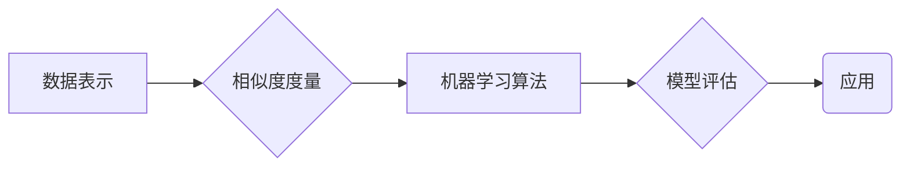

# Mahout原理与代码实例讲解

作者：禅与计算机程序设计艺术

## 1. 背景介绍

### 1.1 大数据时代的机器学习挑战
随着互联网和物联网技术的飞速发展，全球数据量正以前所未有的速度增长，我们正迈入一个前所未有的“大数据”时代。海量数据的出现为机器学习带来了前所未有的机遇，同时也带来了巨大的挑战。传统的机器学习算法往往难以处理如此庞大的数据集，计算效率低下，难以满足实际应用需求。

### 1.2  Mahout：面向海量数据的可扩展机器学习库
为了应对大数据时代机器学习的挑战，Apache Mahout应运而生。Mahout是一个开源的机器学习库，基于Hadoop平台，专为处理海量数据而设计。它提供了一系列可扩展的机器学习算法，包括聚类、分类、推荐和频繁项集挖掘等，能够高效地处理TB甚至PB级别的数据。

### 1.3 Mahout的优势和特点
Mahout的主要优势和特点包括：

- **可扩展性：** Mahout基于Hadoop平台，能够利用Hadoop的分布式计算能力，处理海量数据。
- **算法丰富：** Mahout提供了丰富的机器学习算法，涵盖了聚类、分类、推荐、频繁项集挖掘等多个领域。
- **易用性：** Mahout提供了简单的API接口，易于使用和扩展。
- **活跃的社区：** Mahout拥有活跃的开源社区，用户可以获得丰富的文档、教程和技术支持。

## 2. 核心概念与联系

在深入了解Mahout的具体算法之前，我们需要先了解一些核心概念以及它们之间的联系。

### 2.1 数据表示
Mahout中常用的数据表示方式是向量和矩阵。

- **向量：**  向量是机器学习中最基本的数据结构之一，它可以用来表示一个样本的特征。例如，一个用户的年龄、性别、职业等信息可以用一个向量来表示。
- **矩阵：**  矩阵是由多个向量组成的二维数组，它可以用来表示多个样本的特征。

### 2.2 相似度度量
相似度度量是机器学习中一个重要的概念，它用于衡量两个样本之间的相似程度。Mahout中常用的相似度度量方法包括：

- **欧氏距离：**  欧氏距离是两个向量之间的直线距离，它是最常用的相似度度量方法之一。
- **余弦相似度：**  余弦相似度用于衡量两个向量之间的夹角，夹角越小，相似度越高。
- **Pearson相关系数：**  Pearson相关系数用于衡量两个变量之间的线性相关程度。

### 2.3  机器学习算法分类
Mahout中的机器学习算法可以分为以下几类：

- **监督学习：**  监督学习是指利用已知标签的样本训练模型，然后利用训练好的模型对未知标签的样本进行预测。常见的监督学习算法包括线性回归、逻辑回归、支持向量机等。
- **无监督学习：**  无监督学习是指在没有已知标签的样本的情况下，对数据进行建模。常见的无监督学习算法包括聚类、降维、关联规则挖掘等。
- **强化学习：**  强化学习是指智能体通过与环境的交互来学习如何最大化奖励。

### 2.4 核心概念之间的联系
下图展示了Mahout中核心概念之间的联系：



## 3. 核心算法原理与具体操作步骤

### 3.1 聚类算法

#### 3.1.1  K-Means算法

##### 3.1.1.1 算法原理
K-Means算法是一种常用的聚类算法，它将数据集分成K个簇，每个簇的中心点是该簇内所有点的平均值。

##### 3.1.1.2 算法步骤
1. 随机选择K个点作为初始的簇中心点。
2. 计算每个点到K个簇中心点的距离，并将该点分配到距离最近的簇中。
3. 重新计算每个簇的中心点。
4. 重复步骤2和3，直到簇中心点不再发生变化或者达到最大迭代次数。

##### 3.1.1.3 代码实例
```java
// 创建一个KMeans聚类器
KMeansClusterer clusterer = new KMeansClusterer(conf, input, output, measure, k, maxIterations, convergenceDelta, runClustering);

// 运行聚类算法
List<List<Point>> clusters = clusterer.cluster(data);

// 打印聚类结果
for (List<Point> cluster : clusters) {
  System.out.println("Cluster:");
  for (Point point : cluster) {
    System.out.println(point);
  }
}
```

#### 3.1.2 Canopy算法

##### 3.1.2.1 算法原理
Canopy算法是一种快速聚类算法，它可以用来快速地将数据集分成多个簇，为K-Means算法提供初始的簇中心点。

##### 3.1.2.2 算法步骤
1. 从数据集中随机选择一个点作为第一个Canopy的中心点。
2. 计算数据集中所有点到该中心点的距离。
3. 将距离小于T1的点加入到该Canopy中。
4. 将距离小于T2但大于T1的点从数据集中移除。
5. 重复步骤1到4，直到所有点都被分配到Canopy中。

##### 3.1.2.3 代码实例
```java
// 创建一个Canopy聚类器
CanopyClusterer clusterer = new CanopyClusterer(conf, input, output, measure, T1, T2);

// 运行聚类算法
List<Canopy> canopies = clusterer.cluster(data);

// 打印聚类结果
for (Canopy canopy : canopies) {
  System.out.println("Canopy:");
  System.out.println("Center: " + canopy.getCenter());
  System.out.println("Points:");
  for (Point point : canopy.getPoints()) {
    System.out.println(point);
  }
}
```

### 3.2 分类算法

#### 3.2.1 逻辑回归算法

##### 3.2.1.1 算法原理
逻辑回归算法是一种常用的分类算法，它利用逻辑函数将线性回归模型的输出转换为概率值。

##### 3.2.1.2 算法步骤
1. 初始化模型参数。
2. 利用训练数据计算模型的预测值。
3. 计算预测值与真实值之间的误差。
4. 利用梯度下降算法更新模型参数。
5. 重复步骤2到4，直到模型收敛。

##### 3.2.1.3 代码实例
```java
// 创建一个逻辑回归分类器
LogisticRegressionClassifier classifier = new LogisticRegressionClassifier(conf, input, output, numFeatures, lambda);

// 训练模型
classifier.train(trainingData);

// 利用模型进行预测
Vector predictions = classifier.classify(testData);

// 评估模型性能
ConfusionMatrix confusionMatrix = new ConfusionMatrix(testData.getLabels(), predictions);
System.out.println("Accuracy: " + confusionMatrix.getAccuracy());
```

#### 3.2.2 支持向量机算法

##### 3.2.2.1 算法原理
支持向量机算法是一种常用的分类算法，它通过寻找一个最优的超平面将不同类别的样本分开。

##### 3.2.2.2 算法步骤
1. 将数据映射到高维空间。
2. 在高维空间中寻找一个最优的超平面。
3. 利用核函数将高维空间的计算转换为低维空间的计算。

##### 3.2.2.3 代码实例
```java
// 创建一个支持向量机分类器
SupportVectorMachineClassifier classifier = new SupportVectorMachineClassifier(conf, input, output, numFeatures, kernel);

// 训练模型
classifier.train(trainingData);

// 利用模型进行预测
Vector predictions = classifier.classify(testData);

// 评估模型性能
ConfusionMatrix confusionMatrix = new ConfusionMatrix(testData.getLabels(), predictions);
System.out.println("Accuracy: " + confusionMatrix.getAccuracy());
```

### 3.3 推荐算法

#### 3.3.1 基于用户的协同过滤算法

##### 3.3.1.1 算法原理
基于用户的协同过滤算法是一种常用的推荐算法，它利用用户之间的相似性来进行推荐。

##### 3.3.1.2 算法步骤
1. 计算用户之间的相似度。
2. 找到与目标用户最相似的K个用户。
3. 将这K个用户喜欢的物品推荐给目标用户。

##### 3.3.1.3 代码实例
```java
// 创建一个基于用户的协同过滤推荐器
UserBasedRecommender recommender = new UserBasedRecommender(conf, input, output, similarity);

// 训练模型
recommender.train(dataModel);

// 为用户推荐物品
List<RecommendedItem> recommendations = recommender.recommend(userId, howMany);

// 打印推荐结果
for (RecommendedItem recommendation : recommendations) {
  System.out.println("Item: " + recommendation.getItemID() + ", Value: " + recommendation.getValue());
}
```

#### 3.3.2 基于物品的协同过滤算法

##### 3.3.2.1 算法原理
基于物品的协同过滤算法是一种常用的推荐算法，它利用物品之间的相似性来进行推荐。

##### 3.3.2.2 算法步骤
1. 计算物品之间的相似度。
2. 找到与目标用户喜欢的物品最相似的K个物品。
3. 将这K个物品推荐给目标用户。

##### 3.3.2.3 代码实例
```java
// 创建一个基于物品的协同过滤推荐器
ItemBasedRecommender recommender = new ItemBasedRecommender(conf, input, output, similarity);

// 训练模型
recommender.train(dataModel);

// 为用户推荐物品
List<RecommendedItem> recommendations = recommender.recommend(userId, howMany);

// 打印推荐结果
for (RecommendedItem recommendation : recommendations) {
  System.out.println("Item: " + recommendation.getItemID() + ", Value: " + recommendation.getValue());
}
```

## 4. 数学模型和公式详细讲解举例说明

### 4.1 K-Means算法

#### 4.1.1 目标函数
K-Means算法的目标函数是最小化所有点到其所属簇中心点的距离的平方和，即：
$$
J = \sum_{i=1}^{K} \sum_{x \in C_i} ||x - \mu_i||^2
$$
其中，$C_i$表示第$i$个簇，$\mu_i$表示第$i$个簇的中心点，$x$表示数据集中的一個点。

#### 4.1.2 算法流程
K-Means算法的流程如下：

1. 初始化K个簇中心点。
2. **迭代：**
   - 将每个点分配到距离最近的簇中心点所在的簇中。
   - 重新计算每个簇的中心点。
3. 直到簇中心点不再发生变化或者达到最大迭代次数，停止迭代。

#### 4.1.3 举例说明
假设我们有以下数据集：

```
(1, 1), (2, 2), (3, 3), (8, 8), (9, 9), (10, 10)
```

我们想要将这些数据分成2个簇，初始的簇中心点为(1, 1)和(2, 2)。

**迭代1：**
- 将(1, 1)分配到簇1，将(2, 2)分配到簇2，将(3, 3)分配到簇2，将(8, 8)分配到簇2，将(9, 9)分配到簇2，将(10, 10)分配到簇2。
- 重新计算簇1的中心点为(1, 1)，重新计算簇2的中心点为(6, 6)。

**迭代2：**
- 将(1, 1)分配到簇1，将(2, 2)分配到簇1，将(3, 3)分配到簇2，将(8, 8)分配到簇2，将(9, 9)分配到簇2，将(10, 10)分配到簇2。
- 重新计算簇1的中心点为(1.5, 1.5)，重新计算簇2的中心点为(8.5, 8.5)。

**迭代3：**
- 将(1, 1)分配到簇1，将(2, 2)分配到簇1，将(3, 3)分配到簇1，将(8, 8)分配到簇2，将(9, 9)分配到簇2，将(10, 10)分配到簇2。
- 重新计算簇1的中心点为(2, 2)，重新计算簇2的中心点为(9, 9)。

此时，簇中心点不再发生变化，停止迭代。

最终的聚类结果为：

- 簇1：{(1, 1), (2, 2), (3, 3)}
- 簇2：{(8, 8), (9, 9), (10, 10)}

### 4.2 逻辑回归算法

#### 4.2.1 模型表示
逻辑回归模型的数学表达式为：
$$
h_\theta(x) = \frac{1}{1 + e^{-\theta^T x}}
$$
其中，$h_\theta(x)$表示样本$x$属于正类的概率，$\theta$是模型的参数向量，$x$是样本的特征向量。

#### 4.2.2 损失函数
逻辑回归算法的损失函数是对数似然函数的负数，即：
$$
J(\theta) = -\frac{1}{m} \sum_{i=1}^{m} [y^{(i)} \log h_\theta(x^{(i)}) + (1 - y^{(i)}) \log (1 - h_\theta(x^{(i)}))]
$$
其中，$m$是样本的数量，$y^{(i)}$是第$i$个样本的真实标签，$h_\theta(x^{(i)})$是第$i$个样本的预测概率。

#### 4.2.3 梯度下降算法
逻辑回归算法的参数更新公式为：
$$
\theta_j := \theta_j - \alpha \frac{\partial J(\theta)}{\partial \theta_j}
$$
其中，$\alpha$是学习率，$\frac{\partial J(\theta)}{\partial \theta_j}$是损失函数对参数$\theta_j$的偏导数。

#### 4.2.4 举例说明
假设我们有以下数据集：

| x1 | x2 | y |
|---|---|---|
| 1 | 1 | 0 |
| 2 | 2 | 0 |
| 3 | 3 | 1 |
| 4 | 4 | 1 |

我们想要利用逻辑回归算法训练一个模型，用于预测样本属于正类还是负类。

**初始化模型参数：**
- $\theta_0 = 0$
- $\theta_1 = 0$
- $\theta_2 = 0$

**迭代1：**
- 计算预测值：
  - $h_\theta(x^{(1)}) = 0.5$
  - $h_\theta(x^{(2)}) = 0.5$
  - $h_\theta(x^{(3)}) = 0.5$
  - $h_\theta(x^{(4)}) = 0.5$
- 计算损失函数：
  - $J(\theta) = 0.6931471805599453$
- 更新模型参数：
  - $\theta_0 := 0 - 0.1 * (-0.5) = 0.05$
  - $\theta_1 := 0 - 0.1 * (-0.5) = 0.05$
  - $\theta_2 := 0 - 0.1 * (-0.5) = 0.05$

**迭代2：**
- 计算预测值：
  - $h_\theta(x^{(1)}) = 0.52497918747894$
  - $h_\theta(x^{(2)}) = 0.549833997312478$
  - $h_\theta(x^{(3)}) = 0.574442516811658$
  - $h_\theta(x^{(4)}) = 0.598687660112455$
- 计算损失函数：
  - $J(\theta) = 0.6911441385531875$
- 更新模型参数：
  - $\theta_0 := 0.05 - 0.1 * (-0.47502081252106) = 0.097502081252106$
  - $\theta_1 := 0.05 - 0.1 * (-0.450166002687522) = 0.0950166002687522$
  - $\theta_2 := 0.05 - 0.1