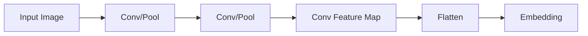

# MatchingNetworks：构建样本间的桥梁

作者：禅与计算机程序设计艺术

## 1. 背景介绍

### 1.1 传统机器学习的局限性

传统的机器学习算法如支持向量机(SVM)、决策树等在大数据时代取得了巨大的成功，但它们在处理小样本学习任务时往往捉襟见肘。这些算法通常需要大量的有标注训练数据才能取得良好的性能，而现实世界中很多场景下只能获得少量训练样本，比如医学图像分类、人脸识别等。

### 1.2 元学习(Meta-Learning)的崛起

元学习作为解决小样本学习问题的一种有前景的方法近年来得到了广泛关注。元学习旨在学习如何学习，通过在一系列不同但相关的任务上训练，模型能够快速适应新的任务，哪怕新任务只有很少的训练样本。元学习的思想源自人类的学习方式，我们可以根据过去的学习经验，在新领域快速掌握新技能。

### 1.3 孪生网络(Siamese Networks)的启发

孪生网络由两个共享参数的神经网络组成，被用于检测两个输入样本是否属于同一个类别。通过学习一个度量函数，孪生网络能判断两个样本的相似程度。这启发我们在元学习中引入类似的思想，通过学习样本之间的相似性，来增强模型对新类别的泛化能力。

## 2. 核心概念与联系

### 2.1 度量学习(Metric Learning)
- 目标：学习一个度量函数d(x,y)来度量两个样本x和y之间的距离/相似度。
- 应用：人脸识别、图像检索、行人重识别等。
- 主流算法：
  - 对比损失(Contrastive Loss)
  - 三元组损失(Triplet Loss)
  - N元组损失(N-pair Loss)

### 2.2 注意力机制(Attention Mechanism)
- 从大量信息中选择出对当前任务目标更关键的信息。
- 应用：机器翻译、图像字幕、语音识别等。
  - seq2seq中引入注意力机制处理长文本
  - 视觉注意力模型关注图像的关键区域
  - 谷歌的Transformer完全基于attention

### 2.3 记忆网络(Memory Networks)
- 结合大容量外部存储，捕捉长时依赖。
- 通过寻址(addressing)和读写(read/write)操作来存取信息。
- 应用：问答系统、对话系统、语言模型等。

### 2.4 概念之间的联系
- 样本间度量学习为MatchingNetworks的核心
- 引入注意力机制来为不同支持样本分配不同权重
- 借鉴记忆网络中的寻址思想，实现one-shot learning

## 3. 核心算法原理

### 3.1 问题定义
给定一个支持集S，其中包含N个类别，每个类别有K个样本。再给定一个查询集Q，要求预测查询集中每个样本的类别标签。

### 3.2 编码器(Encoder)
- 将支持集S中的样本$x_i$映射为一个D维的embedding $f(x_i)$
- 编码器可以是CNN也可以是LSTM等其他网络
- CNN编码器示意图:



### 3.3 注意力核(Attention Kernel)
- 定义为一个softmax归一化的、用余弦相似度的注意力核:

$$a(x,x_i) = \frac{e^{c(f(x),f(x_i))}}{\sum_{j\in S} e^{c(f(x),f(x_j))}}$$

其中，$c(f(x),f(x_j))$表示两个样本嵌入向量$f(x)$和$f(x_j)$的余弦相似度。

### 3.4 标签推断

对于查询样本$\hat{x}$, 我们首先计算其对每个支持样本$x_i$的注意力权重$a(\hat{x},x_i)$。然后基于加权求和来预测其概率分布:

$$P(\hat{y}|\hat{x},S) = \sum_{i\in S} a(\hat{x},x_i) y_i$$

其中，$y_i$是样本$x_i$的one-hot标签向量。

### 3.5 目标函数

MatchingNetworks的训练目标是最小化负log似然损失函数:

$$J(\theta) = -\log P(\hat{y}|\hat{x},S)$$

参数$θ$包括编码器和注意力核中的权重，通过随机梯度下降等优化算法来更新。

## 4.数学模型和公式详细讲解

### 4.1 注意力核的归一化

注意力核中使用了softmax函数对相似度进行归一化:

$$a(x,x_i) = \frac{e^{c(f(x),f(x_i))}}{\sum_{j\in S} e^{c(f(x),f(x_j))}}$$

对分母进行展开，可以得到:

$$\sum_{j\in S} e^{c(f(x),f(x_j))} = e^{c(f(x),f(x_1))} + e^{c(f(x),f(x_2))} + ... + e^{c(f(x),f(x_K))}$$

归一化后，所有注意力权重之和为1，即$\sum_{i\in S}a(\hat{x},x_i)=1$。这保证了最终的概率分布$P(\hat{y}|\hat{x},S) $是一个有效的概率分布。

### 4.2 余弦相似度

两个向量$u$和$v$的余弦相似度定义为:

$$\cos(u,v) = \frac{u^Tv}{||u|| \cdot ||v||}$$

其中，$u^Tv$表示向量$u$和$v$的内积，$||u||$和$||v||$分别表示$u$和$v$的$L_2$范数。可以看出:
- 余弦相似度的取值范围是[-1,1]
- 夹角为0度的两个向量余弦相似度为1
- 夹角为180度的两个向量余弦相似度为-1
- 夹角为90度的两个向量余弦相似度为0

所以余弦相似度可以很好地度量两个向量的相似程度。MatchingNetworks用它作为注意力核，可以有效地捕捉样本之间的相关性。

## 5.项目实践

下面我们用PyTorch实现一个简单的MatchingNetworks:

```python
import torch
import torch.nn as nn
import torch.nn.functional as F

class MatchingNet(nn.Module):
    def __init__(self, encoder):
        super(MatchingNet, self).__init__()
        self.encoder = encoder

    def forward(self, support_x, support_y, query_x):
        # encode
        support_z = self.encoder(support_x)
        query_z = self.encoder(query_x)

        # cosine similarity
        similarity = F.cosine_similarity(query_z[:,None,:], support_z[None,:,:], dim=2)
        
        # attention kernel
        attention = F.softmax(similarity, dim=1) 

        # label inference
        proba = torch.matmul(attention, support_y)

        return proba
        
``` 

其中，encoder可以是任意神经网络，比如一个简单的CNN:

```python
class CNNEncoder(nn.Module):
    def __init__(self):
        super(CNNEncoder, self).__init__()
        self.conv1 = nn.Conv2d(3, 64, 3, padding=1)
        self.pool1 = nn.MaxPool2d(2, 2)
        self.conv2 = nn.Conv2d(64, 64, 3, padding=1)
        self.pool2 = nn.MaxPool2d(2, 2)
        self.conv3 = nn.Conv2d(64, 64, 3, padding=1)
        self.pool3 = nn.MaxPool2d(2, 2)

    def forward(self, x):
        x = F.relu(self.conv1(x))
        x = self.pool1(x)

        x = F.relu(self.conv2(x))
        x = self.pool2(x)

        x = F.relu(self.conv3(x))
        x = self.pool3(x)

        x = x.view(x.size(0), -1)
        return x
```

训练时，从数据集中采样一个batch的任务，每个任务包含支持集和查询集。然后将其传入MatchingNet进行前向计算，得到查询集的预测概率分布。最后基于真实标签计算交叉熵损失，并通过反向传播更新模型参数。测试时，对每个测试任务重复以上过程，计算查询样本的预测准确率并平均。

## 6.应用场景
### 6.1 医学图像分类
* 挑战:传统DNN需要大量标注数据,医学图像标注成本高
* MatchingNetworks可通过少量样本快速学习新类别,适合小样本场景
* 应用:皮肤病智能诊断,眼底图像分类等

### 6.2 人脸识别
* 现有面部数据库的类别(人)难以覆盖现实世界
* MatchingNetworks可快速为新人生成可用的面部特征
* 结合孪生网络和Triplet Loss进一步提升性能

### 6.3 机器人视觉
- 机器人探索新环境时获得的样本有限 
- 通过MatchingNetworks和少量参考帧识别新物体
- 赋予机器人快速学习和适应的能力

## 7. 工具和资源推荐
- 论文笔记:https://zhuanlan.zhihu.com/p/164928347  
- 开源代码:https://github.com/BoyuanJiang/matching-networks-pytorch  
- 数据集:Omniglot,mini-ImageNet  
- PyTorch教程:https://pytorch.org/tutorials/

## 8. 总结
- MatchingNetworks是一种有前景的元学习方法,在小样本学习中表现优异
- 通过注意力核自适应地为不同支持样本分配权重,提高了模型鲁棒性
- 无需对新类别进行再训练,具有快速泛化的能力

### 8.1 优势
* 训练和测试过程一致,没有fine-tuning环节
* 引入记忆机制,通过存储支持集来适应新任务
* 学习任务无关的相似性度量,具有较好的泛化性

### 8.2 局限
- 元训练样本的分布需与元测试任务相近,泛化能力有待进一步验证
- 对支持集样本数较敏感,小样本支持集性能下降明显

### 8.3 未来方向
* 结合图神经网络(GNN)处理复杂的结构化数据
* 探索无监督和半监督的元学习,减轻标注负担
* 在更大规模和更多领域的数据集上验证算法性能

## 9. 附录

### 9.1 如何选择编码器结构?
编码器可采用CNN,LSTM等常见网络结构。但应与任务数据特点相适应,如对于视觉任务宜采用CNN,序列任务可用LSTM。此外,编码器应尽量简单,避免过拟合。

### 9.2 如何避免支持集过拟合?
支持集样本量较少时,模型容易过拟合。一些缓解方法:
1. 数据增强:对支持集样本进行旋转,缩放等变换
2. 正则化:加入权重衰减,dropout等正则化手段
3. 元数据增强:从元训练集中采样更多的训练任务

### 9.3 模型对embedding空间有何要求?
MatchingNet假设不同类别在embedding空间是可分的,因此embedding空间应具有较好的判别性。可采用对比损失,Triplet Loss等度量学习方法对embedding空间施加约束。

### 9.4 匹配网络与孪生网络的区别?
两者均用于小样本学习,但有以下区别:
- 匹配网络将每个支持样本视为单独的类别,而孪生网络学习成对样本的相似性
- 匹配网络可看作孪生网络的推广,不限于两两比较,可对多个样本相似性建模
- 匹配网络通过注意力机制融合不同支持样本,更适合小样本场景

### 9.5 匹配网络能否处理零样本学习?
匹配网络不适用于零样本学习,因为它需要为每个类别至少提供一个支持样本。处理零样本问题可使用基于属性或语义的方法,通过属性描述或类别名称等辅助信息建立seen和unseen类别的联系。