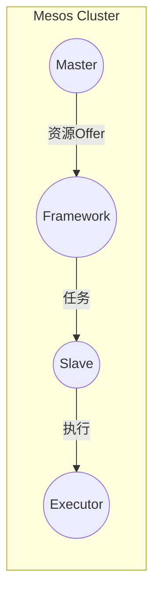

## 1. 背景介绍

### 1.1 分布式系统发展历程与挑战

随着互联网技术的飞速发展，数据中心规模不断扩大，传统的单机计算模式已经无法满足日益增长的计算需求。分布式系统应运而生，它将多台计算机连接起来，协同工作，共同完成计算任务。然而，构建和管理大规模分布式系统面临着诸多挑战：

* **资源管理：** 如何高效地分配和利用集群中的计算资源（CPU、内存、磁盘等）？
* **任务调度：** 如何将应用程序的任务合理地分配到不同的节点上执行，以保证负载均衡和高效率？
* **容错性：** 如何在节点故障的情况下，保证应用程序的正常运行？
* **可扩展性：** 如何方便地扩展集群规模，以应对不断增长的计算需求？

为了解决这些挑战，各种分布式系统框架和平台层出不穷，例如 Hadoop、Spark、Kubernetes 等。而 Mesos 作为一个优秀的分布式资源管理框架，以其灵活、高效、可扩展等特点，在众多框架中脱颖而出。

### 1.2 Mesos 简介

Mesos 是一个开源的集群管理器，它提供了一种高效、灵活的方式来管理集群资源。Mesos 采用两级调度架构，将资源管理和任务调度分离，使得系统更加灵活和可扩展。

* **Master 节点：** 负责管理集群资源，并将资源分配给不同的 Framework。
* **Slave 节点：** 负责执行 Framework 分配的任务。
* **Framework：** 运行在 Mesos 之上的应用程序，负责定义应用程序的任务类型和资源需求。

Mesos 的核心思想是将集群中的所有资源（CPU、内存、磁盘等）抽象成一个资源池，然后将资源分配给不同的 Framework。Framework 可以根据自身的需求，申请和使用资源，从而实现资源的弹性伸缩。

## 2. 核心概念与联系

### 2.1  两级调度架构

Mesos 采用两级调度架构，将资源管理和任务调度分离，提高了系统的灵活性和可扩展性。

* **第一级调度：** Master 节点将资源 Offer 给 Framework，Framework 可以根据自身的需求选择接受或拒绝 Offer。
* **第二级调度：** Framework 将任务分配到接受 Offer 的 Slave 节点上执行。

### 2.2 资源 Offer

Master 节点会定期地向 Framework 发送资源 Offer，资源 Offer 包含了可用的 CPU、内存、磁盘等资源信息。Framework 可以根据自身的需求，选择接受或拒绝 Offer。

### 2.3 任务

任务是 Framework 提交给 Mesos 执行的基本单元，每个任务都需要指定所需的资源量。

### 2.4 Executor

Executor 是运行在 Slave 节点上的进程，负责执行 Framework 分配的任务。

### 2.5 核心概念关系图



## 3. 核心算法原理具体操作步骤

### 3.1 资源调度算法

Mesos 的资源调度算法主要基于 Dominant Resource Fairness (DRF) 算法，该算法的目标是在多个 Framework 之间公平地分配资源。

**DRF 算法原理：**

1. 计算每个 Framework 的 dominant resource，即该 Framework 占用的资源比例最大的资源类型。
2. 根据 dominant resource 的比例，为每个 Framework 分配资源。

**DRF 算法操作步骤：**

1. Master 节点收集所有 Slave 节点的资源信息。
2. Master 节点计算每个 Framework 的 dominant resource。
3. Master 节点根据 dominant resource 的比例，为每个 Framework 分配资源 Offer。

### 3.2 任务调度算法

Mesos 的任务调度算法允许 Framework 自定义调度策略，例如：

* **延迟调度：** 优先调度资源需求较低的 task。
* **数据本地化调度：** 优先将 task 调度到数据所在的节点上执行。

**自定义调度算法操作步骤：**

1. Framework 收到 Master 节点的资源 Offer。
2. Framework 根据自定义的调度策略，选择接受或拒绝 Offer。
3. 如果 Framework 接受 Offer，则将 task 分配到对应的 Slave 节点上执行。

## 4. 数学模型和公式详细讲解举例说明

### 4.1 DRF 算法数学模型

假设集群中有 $m$ 个资源类型，$n$ 个 Framework，每个 Framework $i$ 的资源需求向量为 $d_i = (d_{i1}, d_{i2}, ..., d_{im})$，其中 $d_{ij}$ 表示 Framework $i$ 对资源类型 $j$ 的需求量。

**Dominant Resource Share (DRS):**

Framework $i$ 的 DRS 定义为：

$$
DRS_i = \max_{j=1}^{m} \frac{\sum_{k=1}^{n} a_{kj} d_{ij}}{\sum_{k=1}^{n} a_{kj}}
$$

其中 $a_{kj}$ 表示 Framework $k$ 分配到的资源类型 $j$ 的数量。

**DRF 算法目标：**

最小化所有 Framework 的 DRS 之间的最大差距，即：

$$
\min \max_{i,j} |DRS_i - DRS_j|
$$

### 4.2  DRF 算法举例说明

假设集群中有 2 个 Slave 节点，每个 Slave 节点有 4 个 CPU 和 8GB 内存。有两个 Framework：

* Framework A：需要 2 个 CPU 和 4GB 内存。
* Framework B：需要 4 个 CPU 和 2GB 内存。

**计算 DRS：**

* Framework A 的 dominant resource 是 CPU，DRS 为 2/4 = 0.5。
* Framework B 的 dominant resource 是 CPU，DRS 为 4/4 = 1。

**分配资源：**

为了最小化 DRS 之间的差距，Master 节点可以将一个 Slave 节点的资源全部分配给 Framework A，另一个 Slave 节点的资源全部分配给 Framework B。

## 5. 项目实践：代码实例和详细解释说明

### 5.1 编写 Framework

以下是一个简单的 Framework 代码示例，该 Framework 会启动一个 Executor，并在 Executor 中打印 "Hello, Mesos!"：

```java
import org.apache.mesos.*;
import org.apache.mesos.Protos.*;

public class ExampleFramework {

  public static void main(String[] args) {
    // 创建 FrameworkInfo 对象
    FrameworkInfo.Builder frameworkBuilder = FrameworkInfo.newBuilder()
        .setId("example-framework")
        .setName("Example Framework")
        .setUser(""); // 使用当前用户

    // 创建 Scheduler 对象
    Scheduler scheduler = new Scheduler() {
      @Override
      public void registered(SchedulerDriver driver, FrameworkID frameworkId,
                             MasterInfo masterInfo) {
        System.out.println("Registered with Mesos master: " + masterInfo.getHostname());
      }

      @Override
      public void resourceOffers(SchedulerDriver driver, List<Offer> offers) {
        // 处理资源 Offer
        for (Offer offer : offers) {
          // 创建 TaskInfo 对象
          TaskID taskId = TaskID.newBuilder().setValue("task-" + System.currentTimeMillis()).build();
          ExecutorInfo executor = ExecutorInfo.newBuilder()
              .setExecutorId(ExecutorID.newBuilder().setValue("default").build())
              .setName("Example Executor")
              .setCommand(CommandInfo.newBuilder()
                  .setValue("java -cp <path/to/jar> ExampleExecutor")
                  .build())
              .build();
          TaskInfo task = TaskInfo.newBuilder()
              .setName("example-task