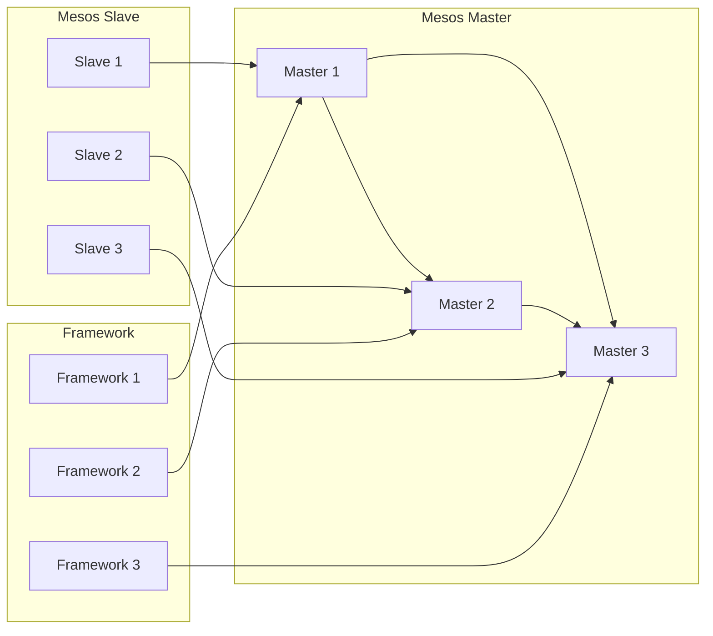

# Mesos调度器架构及原理

作者：禅与计算机程序设计艺术

## 1. 背景介绍

### 1.1 分布式系统资源管理的挑战

随着大数据和云计算时代的到来，分布式系统越来越普遍。如何高效地管理和调度分布式系统中的资源成为了一个巨大的挑战。传统的资源管理方式，例如手动分配资源、使用脚本进行自动化管理等，已经无法满足日益增长的需求。

### 1.2 Mesos的诞生背景

Mesos诞生于Twitter，旨在解决大规模分布式系统资源管理的难题。它是一个开源的集群管理器，能够有效地管理和调度数据中心内的资源，为应用程序提供可靠、高效的运行环境。

### 1.3 Mesos的优势

相比于传统的资源管理方式，Mesos具有以下优势：

* **高可用性:**  Mesos采用主从架构，即使某个节点出现故障，也不会影响整个集群的正常运行。
* **可扩展性:** Mesos可以轻松地扩展到数千个节点，满足大规模集群的需求。
* **资源隔离:** Mesos可以将不同应用程序的资源进行隔离，避免相互干扰。
* **支持多种框架:** Mesos支持多种计算框架，例如Hadoop、Spark、Kubernetes等，可以方便地运行各种类型的应用程序。

## 2. 核心概念与联系

### 2.1 Mesos架构

Mesos采用主从架构，主要包含以下三个组件：

* **Mesos Master:** 负责管理集群中的所有资源，并将资源分配给不同的Framework。
* **Mesos Slave:** 负责管理节点上的资源，并执行Framework提交的任务。
* **Framework:**  运行在Mesos之上的计算框架，例如Hadoop、Spark等。

下图展示了Mesos的架构图：



### 2.2 资源调度机制

Mesos采用两级调度机制：

* **资源提供:** Mesos Slave节点定期向Mesos Master节点汇报可用的资源信息，例如CPU、内存、磁盘空间等。
* **资源分配:**  Mesos Master节点根据Framework的需求，将资源分配给不同的Framework。

### 2.3 任务执行流程

1. Framework向Mesos Master注册，并提交任务运行所需的资源信息。
2. Mesos Master根据资源调度算法，将资源分配给Framework。
3. Framework接收资源分配信息，并将任务发送到指定的Mesos Slave节点上执行。
4. Mesos Slave节点启动任务执行器，执行任务。
5. 任务执行完成后，Mesos Slave节点将结果返回给Framework。

## 3. 核心算法原理具体操作步骤

### 3.1 资源调度算法

Mesos支持多种资源调度算法，例如：

* ** Dominant Resource Fairness (DRF):**  DRF是一种基于公平性的资源调度算法，它可以确保每个Framework获得与其资源需求成比例的资源。
* **Capacity Scheduler:**  Capacity Scheduler是一种基于容量的资源调度算法，它可以为每个Framework预留一定比例的资源。
* **Fair Scheduler:**  Fair Scheduler是一种基于公平性和容量的资源调度算法，它可以兼顾公平性和资源利用率。

### 3.2 资源分配流程

1. Mesos Master节点收到Framework的资源请求后，会根据当前集群的资源使用情况，计算出每个Framework可以获得的资源份额。
2. Mesos Master节点根据资源调度算法，选择一个最优的资源分配方案。
3. Mesos Master节点将资源分配信息发送给Framework。

### 3.3 任务调度流程

1. Framework收到资源分配信息后，会选择合适的Mesos Slave节点来运行任务。
2. Framework将任务发送到选择的Mesos Slave节点上。
3. Mesos Slave节点启动任务执行器，执行任务。

## 4. 数学模型和公式详细讲解举例说明

### 4.1 Dominant Resource Fairness (DRF)

DRF算法的核心思想是：**每个用户应该获得与其 dominant share 成比例的资源**。

* **Dominant share:** 一个用户的 dominant share 是指该用户在所有资源类型中占用的最大份额。
* **资源份额:**  一个用户在某种资源类型上的资源份额是指该用户在该资源类型上的资源需求与其 dominant share 的比值。

例如，假设集群中有两个用户 A 和 B，分别提交了以下资源请求：

* 用户 A: 1 CPU, 2GB 内存
* 用户 B: 2 CPU, 1GB 内存

则用户的 dominant share 分别为：

* 用户 A: max(1/2, 2/1) = 2
* 用户 B: max(2/2, 1/1) = 1

用户的资源份额分别为：

* 用户 A: CPU: 1/2 / 2 = 0.25, 内存: 2/1 / 2 = 1
* 用户 B: CPU: 2/2 / 1 = 1, 内存: 1/1 / 1 = 1

根据 DRF 算法，用户 A 的 CPU 资源份额为 0.25，用户 B 的 CPU 资源份额为 1，因此用户 B 将获得更多的 CPU 资源。

### 4.2 Capacity Scheduler

Capacity Scheduler 算法的核心思想是：**为每个队列预留一定比例的资源**。

例如，假设集群中有两个队列 A 和 B，分别预留了 50% 的资源。用户 A 提交了一个需要 2 个 CPU 和 4GB 内存的任务，用户 B 提交了一个需要 1 个 CPU 和 2GB 内存的任务。

* 队列 A 的资源使用情况: 0 CPU, 0GB 内存
* 队列 B 的资源使用情况: 0 CPU, 0GB 内存

由于队列 A 和队列 B 都还有空闲资源，因此两个任务都可以被调度。

* 队列 A 的资源使用情况: 2 CPU, 4GB 内存
* 队列 B 的资源使用情况: 1 CPU, 2GB 内存

### 4.3 Fair Scheduler

Fair Scheduler 算法结合了 DRF 和 Capacity Scheduler 的优点，可以兼顾公平性和资源利用率。

## 5. 项目实践：代码实例和详细解释说明

### 5.1 编写一个简单的 Mesos Framework

```python
from __future__ import print_function

from mesos.interface import scheduler
from mesos.native import MesosSchedulerDriver, MesosSchedulerDriverCore, FrameworkInfo

class MyScheduler(scheduler.Scheduler):
    def __init__(self):
        pass

    def registered(self, driver, frameworkId, masterInfo):
        print("Registered with framework ID:", frameworkId)

    def resourceOffers(self, driver, offers):
        for offer in offers:
            cpus = memory = 0
            for resource in offer.resources:
                if resource.name == "cpus":
                    cpus = resource.scalar.value
                elif resource.name == "mem":
                    memory = resource.scalar.value

            print("Received offer for", cpus, "CPUs and", memory, "MB memory")

if __name__ == "__main__":
    framework = FrameworkInfo()
    framework.user = "" # Have Mesos fill in the current user.
    framework.name = "MyFramework"

    driver = MesosSchedulerDriver(
        MyScheduler(),
        framework,
        "zk://localhost:2181/mesos" # assumes the master is running locally
    )

    status = 0 if driver.run() == DRIVER_STOPPED else 1

    # Ensure that the driver process terminates.
    driver.stop()

    exit(status)
```

### 5.2 运行 Mesos Framework

1. 启动 Mesos Master 和 Slave 节点。
2. 编译并运行上述代码。
3. 查看 Mesos Web UI，可以看到 Framework 已经注册成功，并收到了资源 offer。

## 6. 实际应用场景

### 6.1 大数据处理

Mesos 可以作为大数据处理平台的资源管理器，例如 Hadoop、Spark 等。

### 6.2 微服务架构

Mesos 可以作为微服务架构的资源管理器，例如 Marathon、Kubernetes 等。

### 6.3 云平台

Mesos 可以作为云平台的资源管理器，例如 Apache CloudStack、OpenStack 等。

## 7. 总结：未来发展趋势与挑战

### 7.1 未来发展趋势

* **更细粒度的资源调度:**  随着容器技术的普及，未来 Mesos 将支持更细粒度的资源调度，例如 CPU、内存、网络带宽等。
* **更智能的资源管理:**  未来 Mesos 将集成机器学习等技术，实现更智能的资源管理，例如自动扩容、自动缩容等。
* **与其他云平台的集成:**  未来 Mesos 将更好地与其他云平台集成，例如 AWS、Azure、Google Cloud Platform 等。

### 7.2 面临的挑战

* **安全性:**  Mesos 需要解决安全问题，例如防止恶意攻击、保护用户数据等。
* **易用性:**  Mesos 需要进一步提高易用性，降低用户使用门槛。
* **生态系统:**  Mesos 需要构建更加完善的生态系统，吸引更多的开发者和用户。

## 8. 附录：常见问题与解答

### 8.1 Mesos 和 Kubernetes 的区别是什么？

Mesos 和 Kubernetes 都是开源的集群管理器，但它们的设计目标和应用场景有所不同。

* **设计目标:**  Mesos 的设计目标是成为一个通用的集群管理器，可以支持多种计算框架。而 Kubernetes 的设计目标是为容器化应用提供一个高效的运行环境。
* **应用场景:**  Mesos 适用于运行各种类型的应用程序，例如大数据处理、微服务架构、云平台等。而 Kubernetes 更适用于运行容器化应用。

### 8.2 如何监控 Mesos 集群？

可以使用以下工具来监控 Mesos 集群：

* **Mesos Web UI:**  Mesos 提供了一个 Web UI，可以查看集群的状态信息、任务运行情况等。
* **Prometheus:**  Prometheus 是一个开源的监控系统，可以收集和存储 Mesos 集群的指标数据。
* **Grafana:**  Grafana 是一个开源的数据可视化工具，可以将 Prometheus 收集的指标数据以图表的形式展示出来。


##  总结

本文详细介绍了 Mesos 调度器架构及原理，包括其背景、核心概念、算法原理、项目实践、应用场景、未来发展趋势以及常见问题解答。希望本文能够帮助读者更好地理解 Mesos，并在实际项目中应用 Mesos。 
