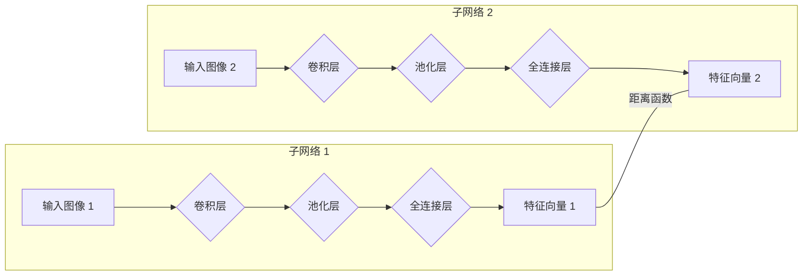

# Metric Learning 在医疗影像分析中的实践与挑战

## 1. 背景介绍

### 1.1 医疗影像分析的兴起

近年来，随着医疗信息化的快速发展，医疗影像数据呈现爆炸式增长。如何从海量影像数据中提取有效信息，辅助医生进行疾病诊断和治疗，成为医疗领域亟待解决的关键问题。医疗影像分析作为人工智能技术在医疗领域的落地应用，近年来取得了显著进展，并在疾病诊断、治疗方案制定、预后评估等方面展现出巨大潜力。

### 1.2 传统方法的局限性

传统的医疗影像分析方法主要依赖于人工设计特征，例如形状、纹理、颜色等，然后利用机器学习算法进行分类或回归。然而，这些方法存在以下局限性：

* **人工设计特征依赖于专家经验，主观性强，泛化能力有限。**
* **医学影像数据通常具有高噪声、高维度、样本量小等特点，传统方法难以有效处理。**

### 1.3 深度学习的突破

深度学习作为一种强大的特征表示学习方法，近年来在计算机视觉、自然语言处理等领域取得了突破性进展。深度学习模型能够自动从数据中学习层次化的特征表示，有效克服了传统方法的局限性，在医疗影像分析领域展现出巨大优势。

### 1.4 Metric Learning 的优势

Metric Learning（度量学习）是一种通过学习样本之间的距离或相似度来进行分类或聚类的机器学习方法。与传统的深度学习方法相比，Metric Learning 具有以下优势：

* **能够学习到更具区分性的特征表示，提高模型的泛化能力。**
* **对样本量需求较小，适用于医学影像数据样本量有限的情况。**
* **可以用于解决一些特定问题，例如图像检索、人脸识别等。**


## 2. 核心概念与联系

### 2.1 Metric Learning

Metric Learning 的核心目标是学习一个距离函数 $d(x_i, x_j)$，用于衡量样本 $x_i$ 和 $x_j$ 之间的相似度。该距离函数应该满足以下性质：

* **非负性：** $d(x_i, x_j) \ge 0$
* **同一性：** $d(x_i, x_j) = 0$ 当且仅当 $x_i = x_j$
* **对称性：** $d(x_i, x_j) = d(x_j, x_i)$
* **三角不等式：** $d(x_i, x_k) \le d(x_i, x_j) + d(x_j, x_k)$

常用的距离函数包括欧氏距离、曼哈顿距离、余弦距离等。

### 2.2 深度度量学习 (Deep Metric Learning)

深度度量学习是将深度学习与度量学习相结合，利用深度神经网络学习样本的特征表示，并在此基础上进行度量学习。常用的深度度量学习方法包括：

* **孪生网络 (Siamese Network)**
* **三元组网络 (Triplet Network)**

### 2.3 医疗影像分析中的应用

Metric Learning 在医疗影像分析中有着广泛的应用，例如：

* **医学图像检索：** 通过学习图像之间的相似度，可以实现快速准确的医学图像检索。
* **医学图像分类：** 通过学习不同类别样本之间的距离，可以实现对医学图像的分类。
* **医学图像分割：** 通过学习像素之间的相似度，可以实现对医学图像的分割。
* **医学图像配准：** 通过学习不同模态或不同时间点图像之间的相似度，可以实现对医学图像的配准。

## 3. 核心算法原理具体操作步骤

### 3.1 孪生网络 (Siamese Network)

#### 3.1.1 网络结构

孪生网络由两个结构相同的子网络组成，共享相同的权重。每个子网络接收一个输入样本，并将其映射到一个特征向量。两个特征向量之间的距离用于衡量两个输入样本的相似度。



#### 3.1.2 损失函数

常用的孪生网络损失函数是 Contrastive Loss，其定义如下：

$$
L = \frac{1}{2N} \sum_{i=1}^N \left( y_i d(x_i, x_i')^2 + (1-y_i) max(0, m - d(x_i, x_i'))^2 \right)
$$

其中：

* $N$ 为样本数量
* $x_i$ 和 $x_i'$ 是来自同一类别或不同类别的样本对
* $y_i$ 表示 $x_i$ 和 $x_i'$ 是否来自同一类别，相同为 1，不同为 0
* $d(x_i, x_i')$ 表示 $x_i$ 和 $x_i'$ 之间的距离
* $m$ 是一个 margin 参数，用于控制不同类别样本之间的距离

#### 3.1.3 训练过程

1. 从数据集中随机选择样本对 $(x_i, x_i')$。
2. 将样本对输入孪生网络，计算两个特征向量之间的距离。
3. 根据损失函数计算损失值。
4. 使用梯度下降算法更新网络参数。

### 3.2 三元组网络 (Triplet Network)

#### 3.2.1 网络结构

三元组网络由三个结构相同的子网络组成，共享相同的权重。每个子网络接收一个输入样本，并将其映射到一个特征向量。三个特征向量之间的关系用于衡量三个输入样本之间的相似度。

```mermaid
graph LR
subgraph 子网络 1
    A[Anchor 图像] --> B{卷积层}
    B --> C{池化层}
    C --> D{全连接层}
    D --> E[Anchor 特征向量]
end
subgraph 子网络 2
    F[Positive 图像] --> G{卷积层}
    G --> H{池化层}
    H --> I{全连接层}
    I --> J[Positive 特征向量]
end
subgraph 子网络 3
    K[Negative 图像] --> L{卷积层}
    L --> M{池化层}
    M --> N{全连接层}
    N --> O[Negative 特征向量]
end
E ---|距离|< J
E ---|距离|> O
```

#### 3.2.2 损失函数

常用的三元组网络损失函数是 Triplet Loss，其定义如下：

$$
L = \frac{1}{N} \sum_{i=1}^N max(0, d(a_i, p_i) - d(a_i, n_i) + m)
$$

其中：

* $N$ 为样本数量
* $a_i$ 是 Anchor 样本
* $p_i$ 是与 $a_i$ 来自同一类别的 Positive 样本
* $n_i$ 是与 $a_i$ 来自不同类别的 Negative 样本
* $d(a_i, p_i)$ 表示 $a_i$ 和 $p_i$ 之间的距离
* $d(a_i, n_i)$ 表示 $a_i$ 和 $n_i$ 之间的距离
* $m$ 是一个 margin 参数，用于控制 Positive 样本和 Negative 样本之间的距离

#### 3.2.3 训练过程

1. 从数据集中随机选择三元组 $(a_i, p_i, n_i)$。
2. 将三元组输入三元组网络，计算三个特征向量之间的距离。
3. 根据损失函数计算损失值。
4. 使用梯度下降算法更新网络参数。


## 4. 数学模型和公式详细讲解举例说明

### 4.1  Contrastive Loss 

以 Contrastive Loss 为例，我们详细讲解其数学模型和公式。

#### 4.1.1 公式解释

$$
L = \frac{1}{2N} \sum_{i=1}^N \left( y_i d(x_i, x_i')^2 + (1-y_i) max(0, m - d(x_i, x_i'))^2 \right)
$$

该公式可以分为两部分理解：

* **第一部分：** $y_i d(x_i, x_i')^2$，表示来自同一类别的样本对之间的距离应该尽可能小。
* **第二部分：** $(1-y_i) max(0, m - d(x_i, x_i'))^2$，表示来自不同类别的样本对之间的距离应该大于 $m$。

#### 4.1.2 举例说明

假设我们有两个样本 $x_1$ 和 $x_2$，它们来自不同的类别。我们使用欧氏距离作为距离函数，并设置 $m=1$。

* 如果 $d(x_1, x_2) = 0.5$，则 Contrastive Loss 为：
  $$
  L = \frac{1}{2} \left( 0 \times 0.5^2 + 1 \times max(0, 1 - 0.5)^2 \right) = 0.125
  $$
* 如果 $d(x_1, x_2) = 1.5$，则 Contrastive Loss 为：
  $$
  L = \frac{1}{2} \left( 0 \times 1.5^2 + 1 \times max(0, 1 - 1.5)^2 \right) = 0
  $$

从上面的例子可以看出，当来自不同类别的样本对之间的距离小于 $m$ 时，Contrastive Loss 会产生惩罚，促使网络学习到更具区分性的特征表示。


## 5. 项目实践：代码实例和详细解释说明

### 5.1 基于 TensorFlow 的医学图像分类

```python
import tensorflow as tf

# 定义孪生网络
def siamese_network(input_shape):
    input_layer = tf.keras.layers.Input(shape=input_shape)
    # 添加卷积层、池化层、全连接层等
    # ...
    output_layer = tf.keras.layers.Dense(units=128, activation='relu')(x)
    return tf.keras.Model(inputs=input_layer, outputs=output_layer)

# 定义 Contrastive Loss
def contrastive_loss(y_true, y_pred, margin=1.0):
    # ...

# 加载数据集
(x_train, y_train), (x_test, y_test) = tf.keras.datasets.cifar10.load_data()

# 创建孪生网络模型
input_shape = (32, 32, 3)
siamese_model = siamese_network(input_shape)

# 编译模型
siamese_model.compile(loss=contrastive_loss, optimizer='adam')

# 训练模型
siamese_model.fit(x_train, y_train, epochs=10, batch_size=32)

# 评估模型
siamese_model.evaluate(x_test, y_test)
```

### 5.2 代码解释

1. 首先，我们定义了孪生网络的结构，包括卷积层、池化层、全连接层等。
2. 然后，我们定义了 Contrastive Loss 函数。
3. 接着，我们加载了 CIFAR-10 数据集，并创建了孪生网络模型。
4. 我们使用 Contrastive Loss 和 Adam 优化器编译了模型。
5. 最后，我们训练并评估了模型。

## 6. 实际应用场景

### 6.1 肺结节检测

肺癌是全球范围内最常见的恶性肿瘤之一，早期诊断和治疗对于提高患者生存率至关重要。低剂量螺旋 CT (LDCT) 作为肺癌筛查的主要手段，能够有效检测早期肺癌。然而，LDCT 影像数据量巨大，人工阅片效率低下且容易出错。

Metric Learning 可以用于自动检测 LDCT 影像中的肺结节。例如，可以使用孪生网络学习肺结节和正常组织之间的距离，从而实现对肺结节的自动识别。

### 6.2 糖尿病视网膜病变分级

糖尿病视网膜病变 (DR) 是糖尿病的常见并发症之一，是导致视力损害的主要原因之一。DR 的早期诊断和治疗对于预防视力丧失至关重要。眼底彩照是诊断 DR 的常用方法，但人工阅片效率低下且容易出错。

Metric Learning 可以用于自动对 DR 进行分级。例如，可以使用三元组网络学习不同 DR 等级之间的距离，从而实现对 DR 的自动分级。

## 7. 工具和资源推荐

### 7.1 TensorFlow

TensorFlow 是 Google 开发的开源机器学习平台，提供了丰富的深度学习工具和资源，可以方便地实现 Metric Learning 算法。

### 7.2 PyTorch

PyTorch 是 Facebook 开发的开源机器学习平台，提供了灵活的深度学习框架，也支持 Metric Learning 算法的实现。

### 7.3 Keras

Keras 是构建和训练深度学习模型的高阶 API，可以运行在 TensorFlow、Theano 或 CNTK 之上，也支持 Metric Learning 算法的实现。

## 8. 总结：未来发展趋势与挑战

### 8.1 未来发展趋势

* **与其他技术的结合：** 将 Metric Learning 与其他技术相结合，例如迁移学习、强化学习等，可以进一步提高模型的性能。
* **多模态数据融合：** 将不同模态的医学影像数据，例如 CT、MRI、PET 等，融合到 Metric Learning 模型中，可以提供更全面的信息，提高模型的鲁棒性。
* **可解释性研究：** 研究 Metric Learning 模型的可解释性，可以帮助医生更好地理解模型的决策过程，提高模型的可信度。

### 8.2 面临挑战

* **数据质量问题：** 医学影像数据通常存在噪声、伪影等问题，这会影响 Metric Learning 模型的性能。
* **数据标注问题：** 医学影像数据的标注需要专业的医生，成本高昂且容易出错，这限制了 Metric Learning 模型的训练数据规模。
* **模型泛化能力问题：** 由于医学影像数据的多样性和复杂性，Metric Learning 模型的泛化能力是一个挑战。


## 9. 附录：常见问题与解答

### 9.1  Metric Learning 和传统的分类方法有什么区别？

传统的分类方法通常是学习一个从输入空间到类别标签的映射函数，而 Metric Learning 是学习一个距离函数，用于衡量样本之间的相似度。

### 9.2  Metric Learning 有哪些常见的应用场景？

Metric Learning 在图像检索、人脸识别、目标跟踪、推荐系统等领域都有广泛的应用。

### 9.3  如何选择合适的 Metric Learning 算法？

选择合适的 Metric Learning 算法需要考虑具体的应用场景、数据集特点、计算资源等因素。
