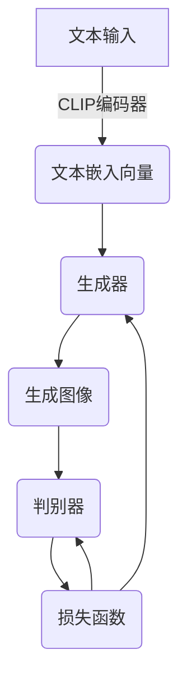

# Midjourney原理与代码实例讲解

## 1.背景介绍

### 1.1 人工智能与计算机视觉的发展

人工智能(AI)和计算机视觉(CV)是当今科技领域最令人兴奋和快速发展的领域之一。近年来,深度学习(Deep Learning)的兴起,特别是卷积神经网络(Convolutional Neural Networks, CNN)和变分自编码器(Variational Autoencoders, VAE)等模型的出现,极大地推动了AI和CV的进步。

### 1.2 生成式对抗网络(GAN)的崛起

2014年,伊恩·古德费勒(Ian Goodfellow)等人提出了生成式对抗网络(Generative Adversarial Networks, GAN)模型,这是一种全新的生成模型范式。GAN由两个神经网络组成:生成器(Generator)和判别器(Discriminator)。它们相互对抗,生成器试图生成逼真的数据分布,而判别器则试图区分生成的数据和真实数据。这种对抗训练可以产生非常逼真的图像、音频和文本。

### 1.3 文本到图像(Text-to-Image)的崛起

随着GAN等生成模型的不断改进,文本到图像(Text-to-Image)任务变得前所未有的可行。通过将文本嵌入作为输入,生成模型可以合成与给定文本描述相匹配的图像。这为创作和设计带来了全新的可能性,开辟了人机协作的新领域。

### 1.4 Midjourney的崛起

Midjourney是一家专注于人工智能生成艺术的初创公司,由David Holz创立。它采用了最先进的文本到图像生成模型,允许用户通过简单的文本描述生成逼真的图像。Midjourney在2022年7月对公众开放,迅速在艺术家和创作者中获得了巨大的人气。

## 2.核心概念与联系

### 2.1 生成式深度学习

生成式深度学习(Generative Deep Learning)是深度学习的一个重要分支,侧重于从底层数据分布中生成新的、逼真的样本。这与判别式深度学习(Discriminative Deep Learning)形成鲜明对比,后者专注于从输入数据中学习映射或模式。

生成式模型在计算机视觉、自然语言处理、音频合成等领域有着广泛的应用。常见的生成式模型包括VAE、GAN、自回归模型(Autoregressive Models)等。

### 2.2 生成式对抗网络(GAN)

GAN是生成式深度学习中最成功和最具影响力的模型之一。它由生成器G和判别器D组成,两者相互对抗。生成器G从潜在空间(Latent Space)中采样,并尝试生成逼真的数据样本;而判别器D则努力区分生成的样本和真实数据。

GAN的训练过程可以形象地看作一场棋局,生成器和判别器相互对抗,不断提高对方的能力。理想情况下,生成器最终可以生成无法与真实数据区分的样本。

数学上,GAN可以形式化为一个min-max游戏:

$$\min_G \max_D V(D,G) = \mathbb{E}_{x\sim p_\text{data}(x)}[\log D(x)] + \mathbb{E}_{z\sim p_z(z)}[\log(1-D(G(z)))]$$

其中,$p_\text{data}$是真实数据分布,$p_z$是潜在变量$z$的先验分布。

### 2.3 文本到图像生成

文本到图像生成(Text-to-Image Generation)任务是将自然语言描述(如"一只蓝色的狗在草地上奔跑")转换为相应的图像表示。这需要模型同时理解自然语言和视觉概念,并学会将两者之间的语义关联映射到图像上。

最新的文本到图像模型通常采用编码器-解码器(Encoder-Decoder)架构,其中编码器处理文本输入,解码器(通常是GAN)则生成相应的图像。一些突破性的工作包括DALL-E、Stable Diffusion和Midjourney等。

### 2.4 Midjourney与CLIP

Midjourney采用了CLIP(Contrastive Language-Image Pre-training)模型作为文本编码器。CLIP是一种自监督的视觉语言模型,可以高效地从大量(文本,图像)对中学习对齐的视觉语义表示。

CLIP编码器将文本输入映射到与图像编码相同的向量空间中。Midjourney的生成器G则努力生成与该文本向量匹配的图像,而判别器D评估生成图像的质量和相关性。这种设计使Midjourney能够高效地将自然语言映射到逼真的图像上。

## 3.核心算法原理具体操作步骤 

### 3.1 Midjourney系统架构概览

Midjourney采用了编码器-生成器-判别器的架构,如下图所示:



1. 文本输入首先被CLIP编码器编码为向量表示。
2. 生成器G接收该向量和噪声向量作为输入,生成一个初始图像。
3. 判别器D评估生成图像的质量和相关性,并产生一个损失值。
4. 生成器和判别器根据这个损失值通过反向传播算法进行参数更新。
5. 重复以上过程,直到生成满意的图像输出。

### 3.2 CLIP编码器

CLIP编码器将文本输入映射到与图像编码共享的向量空间中。这是通过在大规模(文本,图像)数据集上进行对比学习(Contrastive Learning)实现的。

具体来说,CLIP使用一个Transformer作为文本编码器,一个ResNet作为图像编码器。在训练过程中,CLIP最大化了相关(文本,图像)对的相似度得分,同时最小化了不相关对的得分。通过这种方式,CLIP学会了对齐的跨模态表示。

### 3.3 生成器(Generator)

Midjourney的生成器G是一个条件GAN,接收文本嵌入向量和噪声向量作为输入。G的架构灵感来自于StyleGAN,使用卷积层和自注意力层构建编码器和解码器。

生成器的目标是生成与给定文本嵌入向量相匹配的图像。为此,G最小化了判别器D对生成图像的惩罚,以及生成图像与文本嵌入的向量距离。

### 3.4 判别器(Discriminator)

判别器D的作用是评估生成图像的质量和相关性。D接收生成图像和文本嵌入向量作为输入,输出一个标量值,表示输入对的真实性评分。

D被训练为最大化真实(图像,文本)对的评分,同时最小化生成对的评分。这迫使生成器G生成更加逼真和相关的图像,以"欺骗"判别器。

### 3.5 对抗训练

Midjourney的训练过程遵循标准的GAN对抗训练范式:

1. 从真实数据集中采样一批(图像,文本)对。
2. 使用CLIP编码器获取文本嵌入向量。
3. 从噪声先验分布中采样一批噪声向量。
4. 将噪声向量和文本嵌入输入生成器,生成一批假图像。
5. 将真实图像对和生成图像对输入判别器,计算对应的真实性评分。
6. 计算生成器和判别器的损失,并通过反向传播算法更新它们的参数。

该过程反复进行,直到生成器生成的图像足够逼真和相关。

## 4.数学模型和公式详细讲解举例说明

在Midjourney中,生成器G和判别器D的损失函数是模型训练的关键。我们将详细探讨这些损失函数的数学表达。

### 4.1 生成器损失

Midjourney的生成器损失函数包含两个部分:对抗损失和感知损失。

**对抗损失**是标准GAN对抗损失的变体:

$$\mathcal{L}_\text{adv} = \mathbb{E}_{\boldsymbol{z} \sim p_\boldsymbol{z}, \boldsymbol{y} \sim p_\text{data}} \big[-\log D(G(\boldsymbol{z} | \boldsymbol{y}))\big]$$

其中,$\boldsymbol{z}$是噪声向量,$\boldsymbol{y}$是文本嵌入向量,$p_\boldsymbol{z}$和$p_\text{data}$分别是它们的先验分布。

**感知损失**则衡量生成图像与文本嵌入向量之间的相似性:

$$\mathcal{L}_\text{per} = \mathbb{E}_{\boldsymbol{z} \sim p_\boldsymbol{z}, \boldsymbol{y} \sim p_\text{data}} \big[\|f(G(\boldsymbol{z} | \boldsymbol{y})) - \boldsymbol{y}\|_2^2\big]$$

这里,$f$是一个感知编码器网络,将图像映射到与文本嵌入相同的向量空间。

生成器G的总损失是这两项的加权和:

$$\mathcal{L}_G = \lambda_1 \mathcal{L}_\text{adv} + \lambda_2 \mathcal{L}_\text{per}$$

其中$\lambda_1$和$\lambda_2$是权重系数。

通过最小化这个损失函数,生成器G被迫生成既逼真(对抗损失低)又与文本相关(感知损失低)的图像。

### 4.2 判别器损失

判别器D的损失函数也包含两个部分。

**真实对损失**衡量判别器对真实(图像,文本)对的评分:

$$\mathcal{L}_\text{real} = \mathbb{E}_{\boldsymbol{x} \sim p_\text{data}, \boldsymbol{y} \sim p_\text{data}} \big[-\log D(\boldsymbol{x} | \boldsymbol{y})\big]$$

**生成对损失**衡量判别器对生成(图像,文本)对的评分:

$$\mathcal{L}_\text{fake} = \mathbb{E}_{\boldsymbol{z} \sim p_\boldsymbol{z}, \boldsymbol{y} \sim p_\text{data}} \big[-\log(1 - D(G(\boldsymbol{z} | \boldsymbol{y}) | \boldsymbol{y}))\big]$$

判别器D的总损失就是这两项的和:

$$\mathcal{L}_D = \mathcal{L}_\text{real} + \mathcal{L}_\text{fake}$$

通过最小化这个损失函数,判别器D被训练为最大化真实对的评分,同时最小化生成对的评分,从而提高对真伪图像的区分能力。

### 4.3 训练算法

Midjourney采用标准的交替训练算法,交替优化生成器G和判别器D的损失函数。具体步骤如下:

1. 从真实数据集和噪声先验分布中采样一批数据。
2. 固定生成器G,更新判别器D的参数以最小化$\mathcal{L}_D$。
3. 固定判别器D,更新生成器G的参数以最小化$\mathcal{L}_G$。
4. 重复以上过程,直到模型收敛。

该算法可以看作是最小化以下值函数的过程:

$$\min_G \max_D V(D,G) = \mathbb{E}_{\boldsymbol{x} \sim p_\text{data}} \big[\log D(\boldsymbol{x} | \boldsymbol{y})\big] + \mathbb{E}_{\boldsymbol{z} \sim p_\boldsymbol{z}} \big[\log(1 - D(G(\boldsymbol{z} | \boldsymbol{y}) | \boldsymbol{y}))\big]$$

这就是标准GAN的优化目标,只是加入了条件文本嵌入向量$\boldsymbol{y}$。

通过这种对抗训练方式,生成器G和判别器D相互促进,最终达到一种动态平衡,使得生成器能够生成高质量的、与文本描述相符的图像。

## 5. 项目实践:代码实例和详细解释说明

在本节中,我们将通过一个简化的Midjourney实现示例,更好地理解其核心原理。为了便于说明,我们将使用PyTorch深度学习框架,并针对MNIST手写数字数据集进行文本到图像生成任务。

### 5.1 导入库和定义超参数

```python
import torch
import torch.nn as nn
import tor