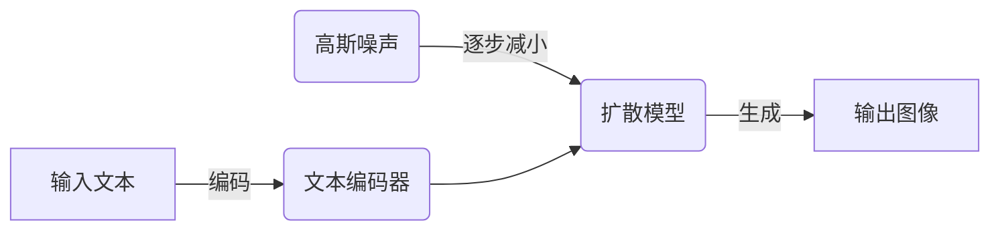
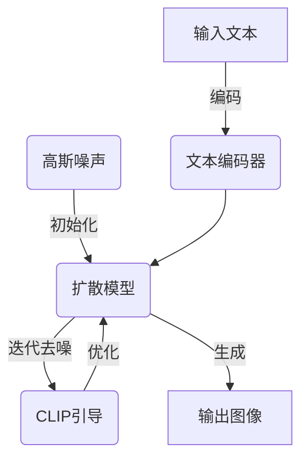

# Midjourney：走向未来的挑战与展望

## 1. 背景介绍

### 1.1 人工智能与创意的融合

人工智能(AI)技术的飞速发展正在重塑各个领域,其中图像生成AI已成为引领创意革命的先锋力量。Midjourney作为一款基于稳定扩散模型的文本到图像生成工具,凭借其卓越的创意表现力和易用性,在短时间内获得了广泛关注和应用。

### 1.2 Midjourney的崛起

Midjourney由一家总部位于旧金山的初创公司Midjourney Inc.开发,于2022年3月首次向公众开放。它采用了最先进的人工智能模型,能够根据用户输入的文本描述生成令人惊艳的图像,为艺术家、设计师和创意工作者带来了前所未有的创作体验。

### 1.3 创意表达的新时代

Midjourney的出现标志着人工智能正式步入创意领域,为创作者提供了一种全新的表达方式。通过简单的文本输入,用户可以将抽象概念转化为视觉形象,实现想象力与技术的完美融合。这种创新不仅推动了艺术和设计领域的发展,也为其他行业带来了新的启发和机遇。

## 2. 核心概念与联系

### 2.1 稳定扩散模型

Midjourney的核心技术是基于稳定扩散模型(Stable Diffusion)的文本到图像生成算法。稳定扩散模型是一种新型的生成式对抗网络(GAN),它通过逐步减小高斯噪声来生成图像,并使用文本编码器来指导生成过程,确保输出图像与输入文本相符。



### 2.2 注意力机制

注意力机制(Attention Mechanism)是稳定扩散模型中的关键组成部分。它允许模型在生成图像时,selectively关注输入文本的不同部分,从而捕捉文本中的细节和语义信息。这种机制确保了生成图像与输入文本的高度相关性。

### 2.3 CLIP模型

Midjourney还利用了CLIP(Contrastive Language-Image Pre-training)模型,这是一种用于图像-文本对比任务的双编码器模型。CLIP模型能够学习图像和文本之间的语义关联,从而提高Midjourney生成图像的质量和相关性。

### 2.4 创意与技术的融合

Midjourney的成功不仅在于其强大的技术实力,更重要的是它将创意与技术完美融合。用户可以通过富有想象力的文本描述驱动图像生成过程,实现创意表达的无限可能。这种人机协作的创作模式,为艺术家和设计师提供了全新的创作体验。

## 3. 核心算法原理具体操作步骤

### 3.1 文本编码

Midjourney首先将用户输入的文本描述通过文本编码器转换为语义向量表示。这个过程利用了自然语言处理技术,将文本中的单词和短语映射到高维语义空间中的向量。

$$
\boldsymbol{e} = \text{TextEncoder}(\text{input\_text})
$$

其中$\boldsymbol{e}$是文本的编码向量,TextEncoder是预训练的文本编码器模型。

### 3.2 噪声采样

接下来,Midjourney从高斯分布中采样一个噪声张量$\boldsymbol{x}_T$,作为生成过程的初始状态。这个噪声张量代表了一个纯粹的随机图像。

$$
\boldsymbol{x}_T \sim \mathcal{N}(\boldsymbol{0}, \boldsymbol{I})
$$

### 3.3 逐步扩散

Midjourney采用扩散模型(Diffusion Model)进行图像生成。扩散模型是一种基于马尔可夫链的生成模型,它通过逐步减小噪声来生成图像。具体来说,扩散模型包含一系列扩散步骤$T$,在每个步骤$t$,模型会根据当前的噪声图像$\boldsymbol{x}_t$和文本编码$\boldsymbol{e}$,预测下一步的去噪图像$\boldsymbol{x}_{t-1}$。

$$
\boldsymbol{x}_{t-1} = \boldsymbol{x}_t - \beta_t \cdot \text{DiffusionModel}(\boldsymbol{x}_t, \boldsymbol{e}, t)
$$

其中$\beta_t$是一个小于1的常数,控制去噪的强度。DiffusionModel是一个基于U-Net架构的卷积神经网络,它接受当前噪声图像$\boldsymbol{x}_t$、文本编码$\boldsymbol{e}$和时间步长$t$作为输入,输出下一步的去噪图像预测。

### 3.4 CLIP引导

为了提高生成图像的质量和相关性,Midjourney还引入了CLIP模型进行引导。CLIP模型能够计算图像和文本之间的相似度分数,Midjourney利用这个分数作为额外的损失项,引导扩散模型生成与输入文本更加相关的图像。

$$
\mathcal{L}_\text{CLIP} = -\text{CLIP}(\boldsymbol{x}_t, \boldsymbol{e})
$$

其中CLIP是预训练的CLIP模型,输出图像$\boldsymbol{x}_t$和文本编码$\boldsymbol{e}$之间的相似度分数。Midjourney在训练过程中,将CLIP损失$\mathcal{L}_\text{CLIP}$与扩散模型的原始损失相结合,从而优化模型参数。

### 3.5 生成与采样

经过$T$步迭代,扩散模型将最终输出一个去噪后的图像$\boldsymbol{x}_0$。由于扩散过程存在随机性,因此每次运行都会生成略有不同的图像。Midjourney可以通过多次采样和排序,从中选择最佳的图像输出。



## 4. 数学模型和公式详细讲解举例说明

### 4.1 文本编码器

Midjourney使用基于Transformer架构的编码器模型将文本转换为语义向量表示。给定一个输入文本序列$\boldsymbol{x} = (x_1, x_2, \ldots, x_n)$,编码器通过自注意力机制捕捉单词之间的依赖关系,并输出对应的向量表示$\boldsymbol{e} = (e_1, e_2, \ldots, e_n)$。

自注意力机制的计算过程如下:

$$
\begin{aligned}
\boldsymbol{Q} &= \boldsymbol{X} \boldsymbol{W}^Q \\
\boldsymbol{K} &= \boldsymbol{X} \boldsymbol{W}^K \\
\boldsymbol{V} &= \boldsymbol{X} \boldsymbol{W}^V \\
\text{Attention}(\boldsymbol{Q}, \boldsymbol{K}, \boldsymbol{V}) &= \text{softmax}\left(\frac{\boldsymbol{Q}\boldsymbol{K}^\top}{\sqrt{d_k}}\right)\boldsymbol{V}
\end{aligned}
$$

其中$\boldsymbol{W}^Q$、$\boldsymbol{W}^K$和$\boldsymbol{W}^V$分别是查询(Query)、键(Key)和值(Value)的线性投影矩阵,$d_k$是键的维度。

通过多头注意力机制和位置编码,编码器能够有效地捕捉文本的上下文信息,生成高质量的语义向量表示。

### 4.2 扩散模型

稳定扩散模型是一种基于马尔可夫链的生成模型,它通过逐步减小噪声来生成图像。具体来说,给定一个初始噪声图像$\boldsymbol{x}_T \sim \mathcal{N}(\boldsymbol{0}, \boldsymbol{I})$,扩散模型通过$T$步迭代,逐步去噪并生成最终的图像$\boldsymbol{x}_0$。

在每个时间步$t$,扩散模型根据当前的噪声图像$\boldsymbol{x}_t$和条件信息(如文本编码$\boldsymbol{e}$),预测下一步的去噪图像$\boldsymbol{x}_{t-1}$:

$$
\boldsymbol{x}_{t-1} = \boldsymbol{x}_t - \beta_t \cdot \text{DiffusionModel}(\boldsymbol{x}_t, \boldsymbol{e}, t)
$$

其中$\beta_t$是一个小于1的常数,控制去噪的强度。DiffusionModel是一个基于U-Net架构的卷积神经网络,它接受当前噪声图像$\boldsymbol{x}_t$、文本编码$\boldsymbol{e}$和时间步长$t$作为输入,输出下一步的去噪图像预测。

在训练过程中,扩散模型的目标是最小化噪声图像$\boldsymbol{x}_t$和真实图像$\boldsymbol{x}_0$之间的均方差损失:

$$
\mathcal{L}_\text{simple} = \mathbb{E}_{\boldsymbol{x}_0, \epsilon, t} \left[\left\|\epsilon - \text{DiffusionModel}(\boldsymbol{x}_t, t)\right\|^2\right]
$$

其中$\epsilon$是一个从正态分布采样的噪声张量,用于扰动真实图像$\boldsymbol{x}_0$生成噪声图像$\boldsymbol{x}_t$。

为了提高生成图像的质量和相关性,Midjourney还引入了CLIP模型作为额外的损失项,引导扩散模型生成与输入文本更加相关的图像。

### 4.3 CLIP引导

CLIP(Contrastive Language-Image Pre-training)是一种用于图像-文本对比任务的双编码器模型。它能够学习图像和文本之间的语义关联,并计算它们之间的相似度分数。

在Midjourney中,CLIP模型被用作一种引导机制,以提高生成图像与输入文本的相关性。具体来说,Midjourney在训练过程中,将CLIP损失$\mathcal{L}_\text{CLIP}$与扩散模型的原始损失相结合,从而优化模型参数。

$$
\mathcal{L}_\text{CLIP} = -\text{CLIP}(\boldsymbol{x}_t, \boldsymbol{e})
$$

其中CLIP是预训练的CLIP模型,输出图像$\boldsymbol{x}_t$和文本编码$\boldsymbol{e}$之间的相似度分数。最小化$\mathcal{L}_\text{CLIP}$可以使生成的图像与输入文本更加相关。

最终,Midjourney的总体损失函数是扩散模型损失$\mathcal{L}_\text{simple}$和CLIP损失$\mathcal{L}_\text{CLIP}$的加权和:

$$
\mathcal{L} = \mathcal{L}_\text{simple} + \lambda \mathcal{L}_\text{CLIP}
$$

其中$\lambda$是一个超参数,用于平衡两个损失项的重要性。

通过优化这个损失函数,Midjourney能够生成高质量且与输入文本高度相关的图像。

### 4.4 示例:文本到图像生成

以下是一个使用Midjourney生成图像的示例。给定输入文本"a futuristic city with flying cars and neon lights"(一个未来城市,有飞行汽车和霓虹灯光),Midjourney经过上述步骤生成了如下图像:


在这个例子中,我们可以看到Midjourney成功地将文本描述转化为视觉形象。图像中呈现了一座科技感十足的未来城市,有飞行的汽车在霓虹灯光的映衬下穿梭而过,完美地捕捉了输入文本的核心元素。

## 5. 项目实践:代码实例和详细解释说明

由于Midjourney是一款商业化的在线服务,它的具体代码实现并未公开。不过,我们可以通过一个简化的Python示例,来模拟Midjourney的核心流程。

```python
import torch
import torch.nn as nn
import torch.nn.functional as F
from PIL import Image

# 文本编