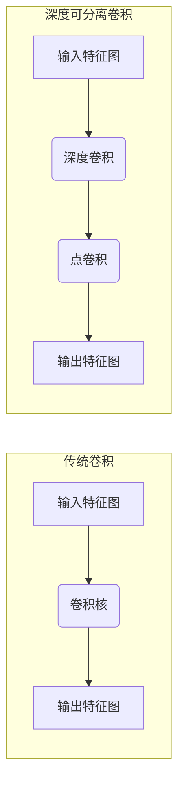
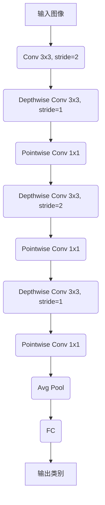

## 1. 背景介绍

### 1.1 移动设备视觉识别的兴起

近年来，随着移动设备的普及和计算能力的提升，移动设备上的视觉识别应用呈现爆炸式增长。从人脸识别解锁手机，到基于图像的搜索，再到实时的物体检测与跟踪，视觉识别技术正在深刻地改变着我们的生活方式。

### 1.2 移动端深度学习模型的挑战

然而，将深度学习模型部署到移动设备上仍然面临着巨大的挑战：

* **计算资源受限:** 移动设备的计算能力和内存容量远低于服务器和桌面电脑，无法运行复杂的深度神经网络模型。
* **功耗限制:** 深度学习模型的推理过程通常需要大量的计算，这会导致移动设备的电池快速耗尽。
* **模型大小:** 大型深度学习模型通常包含数百万甚至数十亿个参数，这使得模型文件过大，难以存储和传输。

### 1.3 MobileNet的诞生

为了解决上述挑战，Google团队于2016年提出了MobileNet模型。MobileNet是一种轻量级深度神经网络，专为移动设备和嵌入式设备设计。它在保持较高准确率的同时，显著降低了模型的计算量、参数量和存储空间，使得在移动设备上进行实时的视觉识别成为可能。


## 2. 核心概念与联系

### 2.1 深度可分离卷积 (Depthwise Separable Convolution)

MobileNet的核心在于深度可分离卷积，它将传统的卷积操作分解为两个步骤：

1. **深度卷积 (Depthwise Convolution):** 对输入特征图的每个通道分别进行卷积操作，使用不同的卷积核。
2. **点卷积 (Pointwise Convolution):** 使用 $1 \times 1$ 的卷积核对深度卷积的输出特征图进行线性组合，融合不同通道的信息。

#### 2.1.1 深度可分离卷积的优势

相比于传统的卷积操作，深度可分离卷积具有以下优势:

* **减少计算量:** 深度可分离卷积的计算量约为传统卷积的 $1/8$ 到 $1/9$。
* **减少参数量:** 深度可分离卷积的参数量约为传统卷积的 $1/N$，其中 $N$ 为输入特征图的通道数。
* **提高模型的泛化能力:** 深度可分离卷积可以看作是对输入特征图进行更精细的特征提取，有助于提高模型的泛化能力。

#### 2.1.2 深度可分离卷积的示意图



### 2.2 MobileNet的网络结构

MobileNet的网络结构主要由深度可分离卷积模块堆叠而成，并使用全局平均池化 (Global Average Pooling) 代替全连接层，进一步减少模型的参数量。

#### 2.2.1 MobileNet的网络结构图



### 2.3 MobileNet的两个超参数

MobileNet引入了两个超参数，用于控制模型的计算量和准确率之间的平衡：

* **宽度乘数 (Width Multiplier):** 用于控制每层卷积核的数量，取值范围为 $(0, 1]$，值越小，模型越小，计算量越低，但准确率也会降低。
* **分辨率乘数 (Resolution Multiplier):** 用于控制输入图像的分辨率，取值范围为 $(0, 1]$，值越小，输入图像越小，计算量越低，但准确率也会降低。


## 3. 核心算法原理具体操作步骤

### 3.1 深度可分离卷积的操作步骤

以一个 $3 \times 3$ 的深度可分离卷积为例，其操作步骤如下:

1. **深度卷积:** 对输入特征图的每个通道分别进行 $3 \times 3$ 的卷积操作，得到与输入特征图相同通道数的输出特征图。
2. **点卷积:** 使用 $1 \times 1$ 的卷积核对深度卷积的输出特征图进行线性组合，得到最终的输出特征图。

#### 3.1.1 深度卷积的计算过程

假设输入特征图的大小为 $H \times W \times C$，卷积核的大小为 $K \times K$，则深度卷积的计算过程如下:

```
for c in range(C):
    for i in range(H - K + 1):
        for j in range(W - K + 1):
            output[i, j, c] = sum(input[i+m, j+n, c] * kernel[m, n] for m in range(K) for n in range(K))
```

#### 3.1.2 点卷积的计算过程

假设深度卷积的输出特征图的大小为 $H \times W \times C$，点卷积的卷积核的数量为 $N$，则点卷积的计算过程如下:

```
for n in range(N):
    for i in range(H):
        for j in range(W):
            output[i, j, n] = sum(input[i, j, c] * kernel[c, n] for c in range(C))
```

### 3.2 MobileNet的训练过程

MobileNet的训练过程与传统的卷积神经网络类似，可以使用随机梯度下降 (SGD) 等优化算法进行训练。

#### 3.2.1 数据预处理

在训练之前，需要对输入图像进行预处理，例如：

* **图像缩放:** 将输入图像缩放到模型输入大小。
* **图像归一化:** 对输入图像进行归一化，例如将像素值缩放到 $[0, 1]$ 区间。

#### 3.2.2 损失函数

MobileNet通常使用交叉熵损失函数进行训练。

#### 3.2.3 优化算法

MobileNet可以使用随机梯度下降 (SGD) 等优化算法进行训练。


## 4. 数学模型和公式详细讲解举例说明

### 4.1 深度可分离卷积的计算量

假设输入特征图的大小为 $H \times W \times C$，卷积核的大小为 $K \times K$，输出特征图的通道数为 $N$，则:

* 传统卷积的计算量为 $H \times W \times C \times K \times K \times N$。
* 深度可分离卷积的计算量为 $H \times W \times C \times K \times K + H \times W \times C \times N$。

因此，深度可分离卷积的计算量约为传统卷积的 $1/(N+K^2/N)$，当 $N$ 较大时，可以近似为 $1/N$。

### 4.2 MobileNet的参数量

假设 MobileNet 的网络结构中包含 $M$ 个深度可分离卷积模块，每个模块的输入特征图的通道数为 $C_i$，输出特征图的通道数为 $C_{i+1}$，卷积核的大小为 $K \times K$，则 MobileNet 的参数量为:

```
sum(C_i * K * K + C_i * C_{i+1} for i in range(M))
```


## 5. 项目实践：代码实例和详细解释说明

### 5.1 使用 TensorFlow 实现 MobileNet

```python
import tensorflow as tf

# 定义 MobileNet 模型
def MobileNet(input_shape, num_classes):
    inputs = tf.keras.Input(shape=input_shape)

    # 第一层卷积
    x = tf.keras.layers.Conv2D(32, 3, strides=2, padding='same', activation='relu')(inputs)

    # 深度可分离卷积模块
    x = _depthwise_separable_conv(x, 64, strides=1)
    x = _depthwise_separable_conv(x, 128, strides=2)
    x = _depthwise_separable_conv(x, 128, strides=1)
    x = _depthwise_separable_conv(x, 256, strides=2)
    x = _depthwise_separable_conv(x, 256, strides=1)
    x = _depthwise_separable_conv(x, 512, strides=2)

    # 全局平均池化
    x = tf.keras.layers.GlobalAveragePooling2D()(x)

    # 输出层
    outputs = tf.keras.layers.Dense(num_classes, activation='softmax')(x)

    return tf.keras.Model(inputs=inputs, outputs=outputs)

# 定义深度可分离卷积模块
def _depthwise_separable_conv(inputs, filters, strides):
    x = tf.keras.layers.DepthwiseConv2D(3, strides=strides, padding='same', activation='relu')(inputs)
    x = tf.keras.layers.Conv2D(filters, 1, strides=1, padding='same', activation='relu')(x)
    return x

# 创建 MobileNet 模型
model = MobileNet(input_shape=(224, 224, 3), num_classes=1000)

# 打印模型结构
model.summary()

# 编译模型
model.compile(optimizer='adam', loss='sparse_categorical_crossentropy', metrics=['accuracy'])

# 加载数据
(x_train, y_train), (x_test, y_test) = tf.keras.datasets.cifar10.load_data()

# 训练模型
model.fit(x_train, y_train, epochs=10)

# 评估模型
loss, accuracy = model.evaluate(x_test, y_test)
print('Loss:', loss)
print('Accuracy:', accuracy)
```

### 5.2 代码解释

* `MobileNet` 函数定义了 MobileNet 模型的结构，包括第一层卷积、深度可分离卷积模块、全局平均池化和输出层。
* `_depthwise_separable_conv` 函数定义了深度可分离卷积模块，包括深度卷积和点卷积。
* `model.summary()` 打印模型的结构信息。
* `model.compile()` 编译模型，指定优化算法、损失函数和评估指标。
* `model.fit()` 训练模型，指定训练数据、训练轮数等参数。
* `model.evaluate()` 评估模型，计算模型在测试集上的损失和准确率。


## 6. 实际应用场景

### 6.1 图像分类

MobileNet 可以用于图像分类任务，例如：

* **物体识别:** 识别图像中的物体，例如人、车、动物等。
* **场景识别:** 识别图像中的场景，例如街道、室内、海滩等。
* **人脸识别:** 识别图像中的人脸，用于人脸解锁、人脸支付等应用。

### 6.2 物体检测

MobileNet 可以用于物体检测任务，例如：

* **行人检测:** 检测图像或视频中的行人，用于自动驾驶、安防等应用。
* **车辆检测:** 检测图像或视频中的车辆，用于交通监控、自动驾驶等应用。
* **人脸检测:** 检测图像中的人脸，用于人脸识别、人脸关键点检测等应用。

### 6.3 语义分割

MobileNet 可以用于语义分割任务，例如：

* **自动驾驶:** 对道路场景进行语义分割，识别道路、车辆、行人等，用于自动驾驶系统的决策。
* **医学影像分析:** 对医学影像进行语义分割，识别肿瘤、器官等，用于辅助医生进行诊断。


## 7. 总结：未来发展趋势与挑战

### 7.1 未来发展趋势

* **更轻量级的模型:** 随着移动设备计算能力的不断提升，未来将出现更加轻量级的深度学习模型，以满足更低功耗、更小存储空间的需求。
* **模型压缩技术:** 模型压缩技术可以进一步压缩模型的大小，同时保持模型的准确率，例如量化、剪枝等技术。
* **硬件加速:** 专门为深度学习设计的硬件加速器，例如 GPU、TPU 等，可以显著提高深度学习模型的推理速度。

### 7.2 面临的挑战

* **模型的准确率:** 尽管 MobileNet 在保持较小模型尺寸的同时，已经取得了不错的准确率，但与大型模型相比，仍然存在一定的差距。
* **模型的泛化能力:** 轻量级模型的泛化能力通常不如大型模型，需要更多的数据和更精细的调参才能达到理想的效果。


## 8. 附录：常见问题与解答

### 8.1 MobileNet 与其他轻量级模型的比较？

除了 MobileNet，还有其他一些轻量级深度学习模型，例如 SqueezeNet、ShuffleNet 等。这些模型各有优缺点，选择合适的模型需要根据具体的应用场景和需求进行评估。

### 8.2 如何选择 MobileNet 的超参数？

MobileNet 的超参数，例如宽度乘数和分辨率乘数，需要根据具体的应用场景和需求进行调整。通常可以使用网格搜索等方法寻找最佳的超参数组合。

### 8.3 如何将 MobileNet 部署到移动设备上？

可以使用 TensorFlow Lite 等工具将 MobileNet 模型转换为移动设备可以运行的格式，并在移动设备上进行部署。
