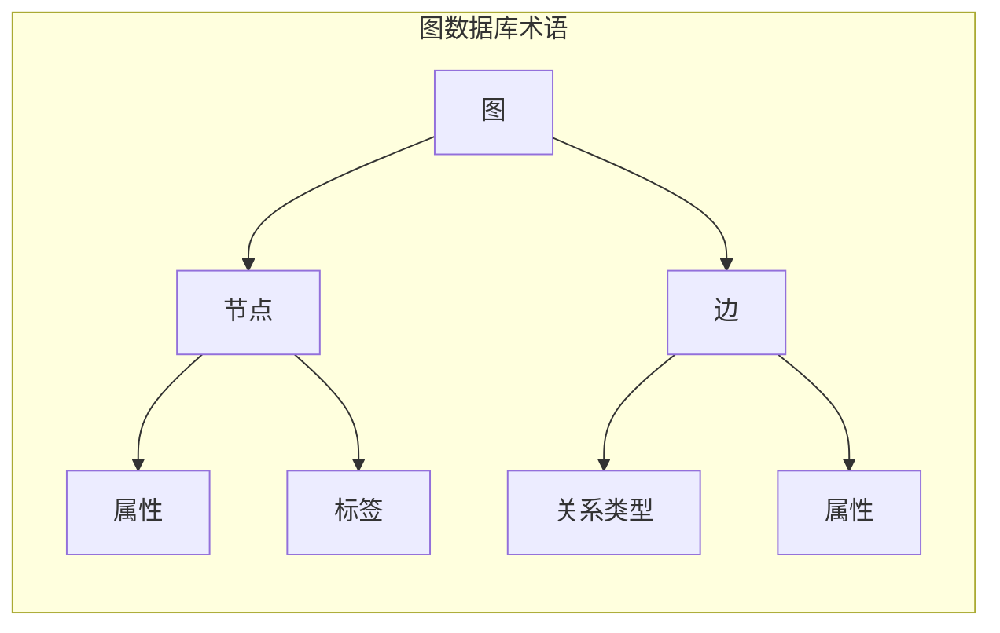
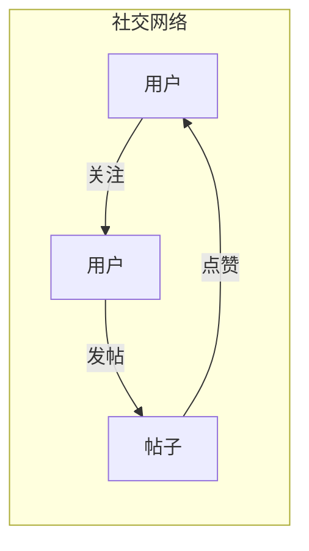

# Neo4j图数据库原理与Cypher代码实例讲解

作者：禅与计算机程序设计艺术

## 1. 背景介绍

### 1.1  关系型数据库的局限性

在信息时代，数据量呈爆炸式增长，数据之间的关系也越来越复杂。传统的**关系型数据库 (Relational Database, RDBMS)** 在处理高度关联的数据时面临着一些挑战：

* **数据模型复杂:**  RDBMS 使用二维表格来存储数据，并通过外键建立表之间的关系。当数据关系复杂时，需要建立多张表和外键，导致数据模型难以理解和维护。
* **查询效率低下:**  对于涉及多表连接的复杂查询，RDBMS 的性能会急剧下降。
* **无法有效表达语义关系:**  RDBMS 只能表达实体之间的简单关系，无法表达更丰富的语义信息。

### 1.2 图数据库的兴起

为了解决 RDBMS 面临的挑战，**图数据库 (Graph Database)** 应运而生。图数据库是一种 NoSQL 数据库，它使用图论中的**节点 (Node)** 和**边 (Relationship/Edge)** 来存储数据和关系，更加直观和高效地表达现实世界中的复杂关系。

### 1.3 Neo4j 简介

**Neo4j** 是目前最流行的开源图数据库之一，它具有以下特点：

* **原生图存储:**  Neo4j 使用原生图存储引擎，数据以图的形式存储在磁盘上，查询效率高。
* **属性图模型:**  Neo4j 支持属性图模型，可以为节点和边添加任意数量的属性，方便存储和查询数据。
* **强大的 Cypher 查询语言:**  Cypher 是一种声明式的图查询语言，易于学习和使用，可以高效地查询和操作图数据。
* **活跃的社区支持:**  Neo4j 拥有庞大的用户群体和活跃的社区，提供丰富的学习资源和技术支持。

## 2. 核心概念与联系

### 2.1 图 (Graph)

图是由节点 (Node) 和边 (Relationship/Edge) 组成的集合。节点表示实体，边表示实体之间的关系。

### 2.2 节点 (Node)

节点表示现实世界中的实体，例如：人、地点、事物等。每个节点都有一个唯一的 ID 和一组属性。

### 2.3 边 (Relationship/Edge)

边表示节点之间的关系，例如：朋友关系、父子关系、雇佣关系等。每条边都有一个方向，从一个节点指向另一个节点，表示关系的方向。边也可以有自己的属性。

### 2.4 属性 (Property)

属性是键值对，用于描述节点和边的特征。例如：人的姓名、年龄、地址等。

### 2.5 标签 (Label)

标签用于对节点进行分类。例如：可以将所有的人节点标记为 "Person" 标签，将所有的地点节点标记为 "Location" 标签。一个节点可以有多个标签。

### 2.6 关系类型 (Relationship Type)

关系类型用于对边进行分类。例如：可以将朋友关系标记为 "FRIEND" 类型，将父子关系标记为 "FATHER" 类型。

### 2.7 图数据库术语关系图



## 3. 核心算法原理具体操作步骤

### 3.1 创建节点

```cypher
CREATE (n:Person { name: "Tom", age: 30 })
```

* `CREATE`: 创建语句关键字。
* `(n:Person)`: 创建一个名为 `n` 的节点，并将其标记为 "Person"。
* `{ name: "Tom", age: 30 }`: 设置节点的属性，包括 `name` 和 `age`。

### 3.2 创建关系

```cypher
MATCH (a:Person { name: "Tom" }), (b:Person { name: "Jerry" })
CREATE (a)-[r:FRIEND]->(b)
```

* `MATCH`: 匹配语句关键字，用于查找节点。
* `(a:Person { name: "Tom" })`: 查找名为 "Tom" 的 "Person" 节点，并将其赋值给变量 `a`。
* `(b:Person { name: "Jerry" })`: 查找名为 "Jerry" 的 "Person" 节点，并将其赋值给变量 `b`。
* `CREATE (a)-[r:FRIEND]->(b)`: 创建一条从节点 `a` 到节点 `b` 的 "FRIEND" 关系，并将其赋值给变量 `r`。

### 3.3 查询数据

#### 3.3.1 查询所有节点

```cypher
MATCH (n) RETURN n
```

* `MATCH (n)`: 匹配所有节点，并将其赋值给变量 `n`。
* `RETURN n`: 返回所有匹配到的节点。

#### 3.3.2 查询特定节点

```cypher
MATCH (n:Person { name: "Tom" }) RETURN n
```

* `MATCH (n:Person { name: "Tom" })`: 查找名为 "Tom" 的 "Person" 节点，并将其赋值给变量 `n`。
* `RETURN n`: 返回匹配到的节点。

#### 3.3.3 查询关系

```cypher
MATCH (a:Person)-[r:FRIEND]->(b:Person) RETURN a, r, b
```

* `MATCH (a:Person)-[r:FRIEND]->(b:Person)`: 查找所有 "Person" 节点之间的 "FRIEND" 关系，并将起点节点赋值给变量 `a`，关系赋值给变量 `r`，终点节点赋值给变量 `b`。
* `RETURN a, r, b`: 返回匹配到的起点节点、关系和终点节点。

### 3.4 更新数据

#### 3.4.1 更新节点属性

```cypher
MATCH (n:Person { name: "Tom" }) SET n.age = 35
```

* `MATCH (n:Person { name: "Tom" })`: 查找名为 "Tom" 的 "Person" 节点，并将其赋值给变量 `n`。
* `SET n.age = 35`: 将节点 `n` 的 `age` 属性设置为 35。

#### 3.4.2 更新关系属性

```cypher
MATCH (a:Person)-[r:FRIEND]->(b:Person) SET r.since = 2010
```

* `MATCH (a:Person)-[r:FRIEND]->(b:Person)`: 查找所有 "Person" 节点之间的 "FRIEND" 关系，并将关系赋值给变量 `r`。
* `SET r.since = 2010`: 将关系 `r` 的 `since` 属性设置为 2010。

### 3.5 删除数据

#### 3.5.1 删除关系

```cypher
MATCH (a:Person)-[r:FRIEND]->(b:Person) DELETE r
```

* `MATCH (a:Person)-[r:FRIEND]->(b:Person)`: 查找所有 "Person" 节点之间的 "FRIEND" 关系，并将关系赋值给变量 `r`。
* `DELETE r`: 删除关系 `r`。

#### 3.5.2 删除节点

```cypher
MATCH (n:Person { name: "Tom" }) DETACH DELETE n
```

* `MATCH (n:Person { name: "Tom" })`: 查找名为 "Tom" 的 "Person" 节点，并将其赋值给变量 `n`。
* `DETACH DELETE n`: 删除节点 `n` 及其所有关系。

## 4. 数学模型和公式详细讲解举例说明

### 4.1 图论基础

图论是数学的一个分支，研究图 (Graph) 的性质和应用。图是由节点 (Node) 和边 (Relationship/Edge) 组成的集合。

#### 4.1.1 节点度 (Degree)

节点的度是指与该节点相连的边的数量。

#### 4.1.2 路径 (Path)

路径是指图中连接两个节点的一系列边。

#### 4.1.3  最短路径 (Shortest Path)

最短路径是指图中连接两个节点的最短路径。

### 4.2 Neo4j 中的图算法

Neo4j 提供了丰富的图算法，可以用于分析和挖掘图数据。

#### 4.2.1  PageRank 算法

PageRank 算法用于计算网页的重要性，它基于以下假设：

* 一个网页被链接的次数越多，其重要性越高。
* 链接到一个网页的网页越重要，则该网页的重要性越高。

PageRank 算法的公式如下：

```
PR(A) = (1-d) + d * SUM(PR(T)/C(T))
```

其中：

* `PR(A)` 表示网页 A 的 PageRank 值。
* `d` 是阻尼系数，通常设置为 0.85。
* `PR(T)` 表示链接到网页 A 的网页 T 的 PageRank 值。
* `C(T)` 表示网页 T 的出度，即链接到其他网页的数量。

#### 4.2.2 社区发现算法 (Community Detection)

社区发现算法用于将图中的节点划分为不同的社区，使得社区内部的节点之间连接紧密，而社区之间的节点连接稀疏。

常见的社区发现算法包括：

* **Louvain 算法:**  一种基于贪婪算法的社区发现算法。
* **Label Propagation 算法:**  一种基于标签传播的社区发现算法。

## 5. 项目实践：代码实例和详细解释说明

### 5.1  社交网络分析

#### 5.1.1  数据模型



#### 5.1.2 创建数据

```cypher
// 创建用户节点
CREATE (user1:User { name: "Alice" })
CREATE (user2:User { name: "Bob" })
CREATE (user3:User { name: "Charlie" })

// 创建关注关系
CREATE (user1)-[:FOLLOWS]->(user2)
CREATE (user2)-[:FOLLOWS]->(user3)

// 创建帖子节点
CREATE (post1:Post { content: "Hello, world!", author: user1 })
CREATE (post2:Post { content: "My first post!", author: user2 })

// 创建点赞关系
CREATE (user1)-[:LIKES]->(post2)
CREATE (user3)-[:LIKES]->(post1)
```

#### 5.1.3 查询数据

* 查询 Alice 关注的所有用户：

```cypher
MATCH (alice:User { name: "Alice" })-[:FOLLOWS]->(user)
RETURN user
```

* 查询所有点赞过帖子的用户：

```cypher
MATCH (user)-[:LIKES]->(post)
RETURN user
```

* 查询 Bob 发布的所有帖子：

```cypher
MATCH (bob:User { name: "Bob" })-[:AUTHORED]->(post)
RETURN post
```

## 6. 实际应用场景

### 6.1 社交网络

* 好友推荐
* 社区发现
* 影响力分析

### 6.2  推荐系统

* 商品推荐
* 内容推荐
* 个性化推荐

### 6.3  知识图谱

* 语义搜索
* 问答系统
* 知识推理

### 6.4  网络安全

* 欺诈检测
* 入侵检测
* 风险控制

## 7. 工具和资源推荐

### 7.1  Neo4j Desktop

Neo4j Desktop 是一个用于管理 Neo4j 数据库的桌面应用程序，它提供了图形界面，方便用户创建、启动、停止数据库实例，以及运行 Cypher 查询。

### 7.2  Neo4j Browser

Neo4j Browser 是一个基于 Web 的图形界面，用于查询和可视化 Neo4j 数据库。

### 7.3  Cypher 查询语言

Cypher 是一种声明式的图查询语言，易于学习和使用，可以高效地查询和操作图数据。

## 8. 总结：未来发展趋势与挑战

### 8.1  未来发展趋势

* **图数据库将更加普及:** 随着数据量和数据关系的不断增长，图数据库将成为处理复杂数据的首选方案。
* **图数据库将与其他技术融合:** 图数据库将与人工智能、机器学习等技术深度融合，为用户提供更加智能化的数据分析和挖掘服务。
* **图数据库将更加易用:** 图数据库的工具和平台将更加完善，用户使用门槛将进一步降低。

### 8.2  挑战

* **性能优化:**  随着数据量的增长，图数据库的性能优化将面临更大的挑战。
* **数据一致性:**  图数据库需要保证数据的一致性，尤其是在分布式环境下。
* **安全问题:**  图数据库需要解决数据安全和访问控制等问题。

## 9. 附录：常见问题与解答

### 9.1  Neo4j 与关系型数据库的区别是什么？

| 特性 | Neo4j | 关系型数据库 |
|---|---|---|
| 数据模型 | 图 | 表 |
| 查询语言 | Cypher | SQL |
| 关系处理 | 原生支持 | 通过外键 |
| 查询效率 | 高 | 对于复杂查询较低 |
| 数据规模 | 可扩展性强 | 可扩展性有限 |

### 9.2  Cypher 中如何使用索引？

可以使用 `CREATE INDEX` 语句创建索引。例如，为 `User` 节点的 `name` 属性创建索引：

```cypher
CREATE INDEX ON :User(name)
```

### 9.3  如何学习 Neo4j 和 Cypher？

* **Neo4j 官网:** https://neo4j.com/
* **Neo4j 文档:** https://neo4j.com/docs/
* **Neo4j 图数据库实战:**  吴广磊 著

##  结束语

本文介绍了 Neo4j 图数据库的基本原理、Cypher 查询语言以及一些常见的应用场景，并对图数据库的未来发展趋势和挑战进行了展望。希望本文能够帮助读者更好地理解和使用 Neo4j 图数据库。