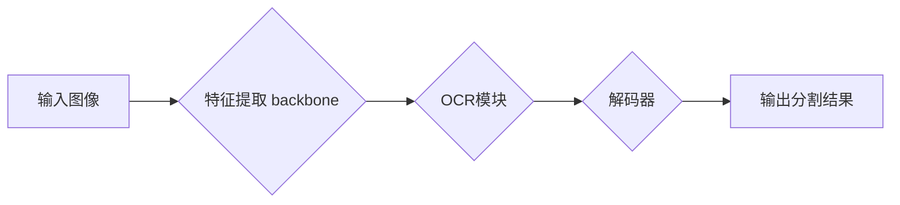
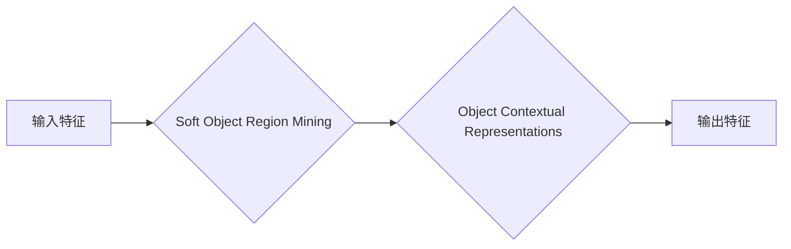

##  OCRNet原理与代码实例讲解

作者：禅与计算机程序设计艺术

## 1. 背景介绍

### 1.1 OCR技术概述

光学字符识别（Optical Character Recognition, OCR）是指将图像形式的文本转换为可编辑的电子文本的技术。它是模式识别、人工智能和计算机视觉领域的一个重要研究方向，广泛应用于文档数字化、信息检索、自然语言处理、自动驾驶等领域。

### 1.2 语义分割与OCR的关系

传统的OCR方法通常采用基于字符分割的方法，即将图像分割成单个字符，然后识别每个字符。近年来，随着深度学习技术的快速发展，基于语义分割的OCR方法逐渐成为主流。

语义分割是指将图像中的每个像素分类到预定义的类别中，例如人、车、道路等。在OCR任务中，语义分割可以用于识别图像中的文本区域和非文本区域，从而将OCR问题转化为对文本区域的识别问题。

### 1.3 OCRNet的提出背景

传统的基于语义分割的OCR方法通常采用编码器-解码器结构，例如FCN、U-Net等。这些方法存在以下问题：

* **上下文信息利用不足：**编码器-解码器结构在编码过程中会丢失一些空间信息，导致解码器无法充分利用上下文信息进行准确的分割。
* **特征分辨率低：**由于编码器-解码器结构的瓶颈层，解码器得到的特征分辨率较低，不利于识别小目标和复杂形状的文本。

为了解决上述问题，OCRNet被提出，它是一种基于关系的语义分割网络，可以更好地利用上下文信息和提高特征分辨率。

## 2. 核心概念与联系

### 2.1 OCRNet网络结构

OCRNet采用了一种新颖的**对象上下文表征（Object Contextual Representations，OCR）**模块，该模块可以捕获丰富的上下文信息，并将其用于增强特征表示。OCRNet的整体网络结构如下图所示：



* **特征提取 backbone：**用于提取图像的特征，可以使用ResNet、HRNet等网络结构。
* **OCR模块：**用于捕获上下文信息并增强特征表示。
* **解码器：**用于将特征解码为分割结果。

### 2.2 对象上下文表征（OCR）模块

OCR模块是OCRNet的核心组件，其结构如下图所示：



* **Soft Object Region Mining：**用于生成每个像素的软对象区域，即该像素属于不同对象的概率。
* **Object Contextual Representations：**用于根据软对象区域计算每个像素的上下文表示。

#### 2.2.1 Soft Object Region Mining

Soft Object Region Mining模块使用一个轻量级的网络来预测每个像素属于不同对象的概率，该网络的输入是backbone提取的特征图，输出是一个与输入特征图大小相同的概率图。

#### 2.2.2 Object Contextual Representations

Object Contextual Representations模块根据Soft Object Region Mining模块生成的概率图计算每个像素的上下文表示。具体来说，对于每个像素，它首先根据概率图找到与其相关的其他像素，然后将这些像素的特征加权平均，得到该像素的上下文表示。

### 2.3 OCRNet的特点

* **有效利用上下文信息：**OCR模块可以捕获丰富的上下文信息，并将其用于增强特征表示，从而提高分割精度。
* **高分辨率特征：**OCRNet采用了一种级联的结构，可以逐步提高特征分辨率，有利于识别小目标和复杂形状的文本。
* **端到端训练：**OCRNet可以进行端到端的训练，简化了训练过程。

## 3. 核心算法原理具体操作步骤

### 3.1 网络训练

OCRNet的训练过程可以分为以下步骤：

1. **数据预处理：**对图像进行预处理，例如缩放、归一化等。
2. **数据增强：**对训练数据进行数据增强，例如随机裁剪、翻转等，以增加模型的鲁棒性。
3. **网络初始化：**初始化网络参数。
4. **前向传播：**将训练数据输入网络，计算网络输出。
5. **计算损失函数：**计算网络输出与真实标签之间的损失。
6. **反向传播：**根据损失函数计算网络参数的梯度。
7. **参数更新：**使用梯度下降等优化算法更新网络参数。
8. **重复步骤4-7，直到网络收敛。**

### 3.2 网络推理

OCRNet的推理过程可以分为以下步骤：

1. **数据预处理：**对图像进行预处理，例如缩放、归一化等。
2. **网络前向传播：**将预处理后的图像输入网络，计算网络输出。
3. **后处理：**对网络输出进行后处理，例如使用CRF进行边界优化。
4. **文本识别：**使用文本识别模型对分割结果进行识别。

## 4. 数学模型和公式详细讲解举例说明

### 4.1 Soft Object Region Mining

Soft Object Region Mining模块使用一个轻量级的网络来预测每个像素属于不同对象的概率，该网络可以使用交叉熵损失函数进行训练：

$$
L_{ce} = -\frac{1}{N} \sum_{i=1}^{N} \sum_{c=1}^{C} y_{ic} \log(p_{ic})
$$

其中：

* $N$ 是像素的数量。
* $C$ 是类别的数量。
* $y_{ic}$ 是像素 $i$ 属于类别 $c$ 的真实标签。
* $p_{ic}$ 是像素 $i$ 属于类别 $c$ 的预测概率。

### 4.2 Object Contextual Representations

Object Contextual Representations模块根据Soft Object Region Mining模块生成的概率图计算每个像素的上下文表示。具体来说，对于每个像素 $i$，它首先根据概率图找到与其相关的其他像素 $j$，然后将这些像素的特征 $f_j$ 加权平均，得到该像素的上下文表示 $o_i$：

$$
o_i = \frac{\sum_{j=1}^{N} w_{ij} f_j}{\sum_{j=1}^{N} w_{ij}}
$$

其中：

* $w_{ij}$ 是像素 $i$ 和像素 $j$ 之间的权重，可以使用高斯函数计算：

$$
w_{ij} = \exp(-\frac{||p_i - p_j||^2}{2\sigma^2})
$$

* $p_i$ 和 $p_j$ 分别是像素 $i$ 和像素 $j$ 的坐标。
* $\sigma$ 是高斯函数的标准差。

## 5. 项目实践：代码实例和详细解释说明

### 5.1 环境搭建

* Python 3.7+
* PyTorch 1.7+
* OpenCV
* Pillow

### 5.2 数据准备

使用ICDAR 2015数据集进行训练和测试。

### 5.3 代码实现

```python
import torch
import torch.nn as nn
import torch.nn.functional as F

class OCRNet(nn.Module):
    def __init__(self, num_classes):
        super(OCRNet, self).__init__()

        # backbone
        self.backbone = ResNet50()

        # OCR module
        self.ocr_module = OCRModule(2048, num_classes)

        # decoder
        self.decoder = Decoder(num_classes)

    def forward(self, x):
        # feature extraction
        features = self.backbone(x)

        # OCR module
        contextual_features = self.ocr_module(features)

        # decoder
        output = self.decoder(contextual_features)

        return output

class OCRModule(nn.Module):
    def __init__(self, in_channels, num_classes):
        super(OCRModule, self).__init__()

        # soft object region mining
        self.soft_object_region_mining = nn.Conv2d(in_channels, num_classes, kernel_size=1)

        # object contextual representations
        self.object_contextual_representations = ObjectContextualRepresentations(in_channels)

    def forward(self, x):
        # soft object region mining
        soft_object_regions = self.soft_object_region_mining(x)

        # object contextual representations
        contextual_features = self.object_contextual_representations(x, soft_object_regions)

        return contextual_features

class ObjectContextualRepresentations(nn.Module):
    def __init__(self, in_channels):
        super(ObjectContextualRepresentations, self).__init__()

        self.in_channels = in_channels

    def forward(self, features, soft_object_regions):
        # calculate weights
        weights = self.calculate_weights(soft_object_regions)

        # apply weights
        contextual_features = self.apply_weights(features, weights)

        return contextual_features

    def calculate_weights(self, soft_object_regions):
        # calculate spatial distances
        spatial_distances = self.calculate_spatial_distances(soft_object_regions)

        # calculate weights using Gaussian kernel
        weights = torch.exp(-spatial_distances / (2 * 0.5**2))

        return weights

    def calculate_spatial_distances(self, soft_object_regions):
        # get coordinates
        coordinates = self.get_coordinates(soft_object_regions)

        # calculate pairwise distances
        spatial_distances = torch.cdist(coordinates, coordinates, p=2)

        return spatial_distances

    def get_coordinates(self, soft_object_regions):
        batch_size, _, height, width = soft_object_regions.size()

        # create meshgrid
        x_coordinates, y_coordinates = torch.meshgrid(torch.arange(width), torch.arange(height))

        # repeat for batch size
        x_coordinates = x_coordinates.unsqueeze(0).repeat(batch_size, 1, 1)
        y_coordinates = y_coordinates.unsqueeze(0).repeat(batch_size, 1, 1)

        # concatenate coordinates
        coordinates = torch.cat((x_coordinates.unsqueeze(-1), y_coordinates.unsqueeze(-1)), dim=-1)

        return coordinates

    def apply_weights(self, features, weights):
        # reshape features and weights
        batch_size, channels, height, width = features.size()
        features = features.view(batch_size, channels, -1)
        weights = weights.view(batch_size, -1, 1)

        # apply weights
        contextual_features = torch.bmm(features, weights)

        # reshape contextual features
        contextual_features = contextual_features.view(batch_size, channels, height, width)

        return contextual_features

class Decoder(nn.Module):
    def __init__(self, num_classes):
        super(Decoder, self).__init__()

        # upsampling
        self.upsample = nn.Upsample(scale_factor=4, mode='bilinear', align_corners=True)

        # classification
        self.classification = nn.Conv2d(256, num_classes, kernel_size=1)

    def forward(self, x):
        # upsampling
        x = self.upsample(x)

        # classification
        output = self.classification(x)

        return output

# create model
model = OCRNet(num_classes=2)

# train model
# ...

# evaluate model
# ...
```

### 5.4 代码解释

* `OCRNet` 类是OCRNet模型的主类，它包含backbone、OCR模块和解码器。
* `OCRModule` 类是OCR模块的主类，它包含soft object region mining和object contextual representations。
* `ObjectContextualRepresentations` 类是object contextual representations模块的主类，它包含计算权重、应用权重等方法。
* `Decoder` 类是解码器的主类，它包含上采样和分类。

## 6. 实际应用场景

OCRNet可以应用于各种OCR任务，例如：

* **文档数字化：**将纸质文档转换为可编辑的电子文档。
* **车牌识别：**识别车辆的车牌号码。
* **身份证识别：**识别身份证上的信息。
* **名片识别：**识别名片上的信息。

## 7. 总结：未来发展趋势与挑战

OCRNet是一种有效的基于语义分割的OCR方法，它可以更好地利用上下文信息和提高特征分辨率。未来，OCR技术的发展趋势和挑战包括：

* **多语言OCR：**开发支持多种语言的OCR模型。
* **手写体OCR：**提高手写体文本的识别精度。
* **复杂场景OCR：**提高复杂场景下文本的识别精度，例如光照变化、遮挡等。

## 8. 附录：常见问题与解答

### 8.1 OCRNet与其他OCR方法相比有什么优势？

OCRNet相比于其他OCR方法，主要有以下优势：

* **有效利用上下文信息：**OCR模块可以捕获丰富的上下文信息，并将其用于增强特征表示，从而提高分割精度。
* **高分辨率特征：**OCRNet采用了一种级联的结构，可以逐步提高特征分辨率，有利于识别小目标和复杂形状的文本。
* **端到端训练：**OCRNet可以进行端到端的训练，简化了训练过程。

### 8.2 OCRNet有哪些局限性？

OCRNet也存在一些局限性，例如：

* **计算复杂度高：**OCR模块的计算复杂度较高，可能会影响模型的推理速度。
* **对训练数据要求高：**OCRNet需要大量的标注数据进行训练，才能达到较好的效果。

### 8.3 如何提高OCRNet的性能？

可以尝试以下方法来提高OCRNet的性能：

* **使用更强大的backbone网络：**例如HRNet、ResNeXt等。
* **使用更多的数据进行训练：**可以使用数据增强技术来扩充训练数据。
* **调整网络结构：**可以尝试调整OCR模块的结构，例如使用不同的卷积核大小、通道数等。
