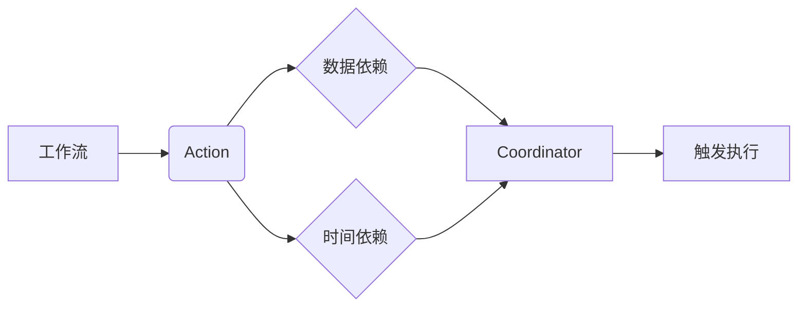

## 1. 背景介绍

### 1.1 大数据时代的数据处理挑战
随着互联网和物联网技术的飞速发展，全球数据量呈爆炸式增长，我们正迈入一个前所未有的大数据时代。海量数据的出现为各行各业带来了巨大的机遇和挑战，如何高效地处理、分析和利用这些数据成为了企业和组织亟需解决的关键问题。

在大数据领域，传统的批处理系统已经难以满足日益增长的数据处理需求。为了应对这一挑战，各种分布式计算框架应运而生，例如 Hadoop MapReduce、Spark、Flink 等。这些框架能够将大规模数据分布到多台机器上进行并行处理，从而显著提升数据处理效率。

### 1.2 工作流调度系统的重要性
然而，仅仅依靠分布式计算框架还不足以构建完整的大数据处理解决方案。在大数据处理过程中，通常需要执行一系列相互依赖的任务，例如数据采集、数据清洗、数据转换、特征提取、模型训练、模型评估等等。这些任务之间 often 存在着复杂的依赖关系，例如某个任务的执行需要依赖于前一个任务的输出结果。

为了有效地管理和执行这些复杂的数据处理流程，我们需要引入工作流调度系统。工作流调度系统能够按照预先定义的规则和依赖关系，自动地调度和执行各个任务，并监控任务的执行状态，从而确保整个数据处理流程的顺利完成。

### 1.3 Oozie：Hadoop 生态系统中的优秀工作流调度系统
在 Hadoop 生态系统中，Oozie 是一款功能强大且 widely used 的工作流调度系统。它可以帮助我们定义、管理和执行复杂的数据处理工作流，并与 Hadoop 生态系统中的其他组件（例如 Hadoop Distributed File System (HDFS)、MapReduce、Pig、Hive 等） seamlessly 集成。

## 2. 核心概念与联系

### 2.1 工作流（Workflow）
在 Oozie 中，工作流是指由一系列 actions 组成的有向无环图（DAG）。每个 action 代表一个具体的计算任务，例如运行一个 MapReduce 作业、执行一个 Hive 查询或者运行一段 Java 代码。工作流定义了 actions 之间的依赖关系，以及 actions 的执行顺序。

### 2.2 Coordinator
Coordinator 是 Oozie 提供的一种机制，用于周期性地触发和执行工作流。通过 Coordinator，我们可以定义工作流的执行时间、执行频率、依赖条件等等。例如，我们可以创建一个 Coordinator，每天凌晨 2 点触发执行一个工作流，用于处理前一天的日志数据。

### 2.3 数据依赖（Data Dependency）
Coordinator 可以根据数据依赖关系来决定是否触发工作流的执行。例如，我们可以定义一个 Coordinator，只有当 HDFS 上某个目录下存在新的数据文件时，才触发执行工作流。

### 2.4 时间依赖（Time Dependency）
Coordinator 还可以根据时间依赖关系来决定是否触发工作流的执行。例如，我们可以定义一个 Coordinator，每天凌晨 2 点触发执行一个工作流，用于处理前一天的日志数据。

### 2.5 核心概念之间的联系

下图展示了 Oozie Coordinator 的核心概念之间的联系：



## 3. 核心算法原理具体操作步骤

### 3.1 定义 Coordinator 应用程序
要使用 Oozie Coordinator，首先需要定义一个 Coordinator 应用程序。Coordinator 应用程序是一个 XML 文件，用于描述 Coordinator 的配置信息，例如：

* Coordinator 的名称
* Coordinator 的执行频率
* Coordinator 的开始时间和结束时间
* Coordinator 依赖的数据集
* Coordinator 触发的工作流

以下是一个简单的 Coordinator 应用程序示例：

```xml
<coordinator-app name="my-coordinator-app"
                 frequency="${coord:days(1)}"
                 start="2024-05-23T00:00Z"
                 end="2024-05-30T00:00Z"
                 timezone="UTC"
                 xmlns="uri:oozie:coordinator:0.1">
  <datasets>
    <dataset name="my-input-data" frequency="${coord:days(1)}" initial-instance="2024-05-22T00:00Z">
      <uri-template>hdfs://my-cluster:8020/user/hadoop/input-data/${YEAR}-${MONTH}-${DAY}</uri-template>
    </dataset>
  </datasets>
  <input-events>
    <data-in name="my-input-data" dataset="my-input-data">
      <instance>${coord:latest(0)}</instance>
    </data-in>
  </input-events>
  <action>
    <workflow>
      <app-path>hdfs://my-cluster:8020/user/hadoop/my-workflow.xml</app-path>
    </workflow>
  </action>
</coordinator-app>
```

### 3.2 上传 Coordinator 应用程序到 HDFS
定义好 Coordinator 应用程序后，需要将其上传到 HDFS 上。

### 3.3 使用 Oozie 命令行工具提交 Coordinator 应用程序
上传完成后，可以使用 Oozie 命令行工具提交 Coordinator 应用程序。

```
oozie job -oozie http://my-oozie-server:11000/oozie -config my-coordinator-app.xml -run
```

### 3.4 Oozie Coordinator 的执行流程
提交 Coordinator 应用程序后，Oozie 会按照以下步骤执行 Coordinator：

1. Oozie 会根据 Coordinator 的定义，计算出 Coordinator 的执行时间。
2. 在每个执行时间点，Oozie 会检查 Coordinator 的依赖条件是否满足。
3. 如果依赖条件满足，Oozie 会触发执行 Coordinator 关联的工作流。
4. Oozie 会监控工作流的执行状态，并记录工作流的执行结果。

## 4. 数学模型和公式详细讲解举例说明
本节内容不涉及数学模型和公式。

## 5. 项目实践：代码实例和详细解释说明

### 5.1 示例场景
假设我们需要每天凌晨 2 点处理前一天的 Nginx 访问日志，并将处理结果存储到 Hive 表中。

### 5.2 创建工作流
首先，我们需要创建一个 Oozie 工作流，用于处理 Nginx 访问日志。

```xml
<workflow-app name="process-nginx-logs" xmlns="uri:oozie:workflow:0.5">
  <start to="generate-date"/>
  <action name="generate-date">
    <java>
      <job-tracker>${jobTracker}</job-tracker>
      <name-node>${nameNode}</name-node>
      <main-class>com.example.GenerateDate</main-class>
      <arg>${date}</arg>
    </java>
    <ok to="process-logs"/>
    <error to="kill"/>
  </action>
  <action name="process-logs">
    <hive>
      <job-tracker>${jobTracker}</job-tracker>
      <name-node>${nameNode}</name-node>
      <script>process_logs.hql</script>
      <param>date=${date}</param>
    </hive>
    <ok to="end"/>
    <error to="kill"/>
  </action>
  <kill name="kill">
    <message>Workflow failed, killing</message>
  </kill>
  <end name="end"/>
</workflow-app>
```

这个工作流包含三个 actions：

* **generate-date**: 这个 action 运行一个 Java 程序，用于生成日期字符串。
* **process-logs**: 这个 action 运行一个 Hive 脚本，用于处理 Nginx 访问日志。
* **kill**: 这个 action 用于终止工作流的执行。

### 5.3 创建 Coordinator 应用程序
接下来，我们需要创建一个 Oozie Coordinator 应用程序，用于周期性地触发和执行工作流。

```xml
<coordinator-app name="daily-nginx-log-processing"
                 frequency="${coord:days(1)}"
                 start="2024-05-23T02:00Z"
                 end="2024-05-30T02:00Z"
                 timezone="UTC"
                 xmlns="uri:oozie:coordinator:0.1">
  <datasets>
    <dataset name="nginx-logs" frequency="${coord:days(1)}" initial-instance="2024-05-22T00:00Z">
      <uri-template>hdfs://my-cluster:8020/user/hadoop/nginx-logs/${YEAR}-${MONTH}-${DAY}</uri-template>
    </dataset>
  </datasets>
  <input-events>
    <data-in name="nginx-logs" dataset="nginx-logs">
      <instance>${coord:latest(0)}</instance>
    </data-in>
  </input-events>
  <action>
    <workflow>
      <app-path>hdfs://my-cluster:8020/user/hadoop/process-nginx-logs.xml</app-path>
      <configuration>
        <property>
          <name>date</name>
          <value>${coord:formatTime(coord:dateOffset(coord:nominalTime(), -1, 'DAY'), 'yyyy-MM-dd')}</value>
        </property>
      </configuration>
    </workflow>
  </action>
</coordinator-app>
```

这个 Coordinator 应用程序定义了以下内容：

* **frequency**: Coordinator 的执行频率为每天一次。
* **start**: Coordinator 的开始时间为 2024 年 5 月 23 日凌晨 2 点。
* **end**: Coordinator 的结束时间为 2024 年 5 月 30 日凌晨 2 点。
* **datasets**: Coordinator 依赖的数据集为 `nginx-logs`，它每天都会生成新的数据文件。
* **input-events**: Coordinator 会检查 `nginx-logs` 数据集中是否存在新的数据文件，如果存在，则触发执行工作流。
* **action**: Coordinator 会触发执行名为 `process-nginx-logs` 的工作流，并传递一个名为 `date` 的参数，该参数的值为前一天的日期字符串。

### 5.4 运行 Coordinator 应用程序
将工作流和 Coordinator 应用程序上传到 HDFS 后，可以使用 Oozie 命令行工具提交 Coordinator 应用程序。

```
oozie job -oozie http://my-oozie-server:11000/oozie -config daily-nginx-log-processing.xml -run
```

### 5.5 代码解释说明
* `coord:days(1)`: 表示时间间隔为 1 天。
* `coord:latest(0)`: 表示获取数据集中最新的数据实例。
* `coord:nominalTime()`: 表示 Coordinator 的计划执行时间。
* `coord:dateOffset(coord:nominalTime(), -1, 'DAY')`: 表示计算前一天的日期。
* `coord:formatTime(..., 'yyyy-MM-dd')`: 表示将日期格式化为 `yyyy-MM-dd` 的字符串。

## 6. 实际应用场景

### 6.1 数据仓库 ETL 流程调度
在数据仓库的构建过程中，通常需要定期从多个数据源中抽取、转换和加载数据。Oozie Coordinator 可以用于调度和管理这些 ETL 流程。

### 6.2 机器学习模型训练和部署
机器学习模型的训练和部署通常需要执行一系列复杂的任务，例如数据预处理、特征工程、模型训练、模型评估等等。Oozie Coordinator 可以用于调度和管理这些任务，并根据模型的性能指标自动触发模型的重新训练和部署。

### 6.3 日志分析和报表生成
Oozie Coordinator 可以用于调度和管理日志分析和报表生成流程。例如，我们可以使用 Oozie Coordinator 每天凌晨 2 点触发执行一个工作流，用于处理前一天的日志数据，并生成相应的报表。

## 7. 工具和资源推荐

### 7.1 Apache Oozie 官方网站
[https://oozie.apache.org/](https://oozie.apache.org/)

### 7.2 Oozie Tutorial
[https://oozie.apache.org/docs/5.2.0/CoordinatorFunctionalSpec.html](https://oozie.apache.org/docs/5.2.0/CoordinatorFunctionalSpec.html)

### 7.3 Oozie Examples
[https://github.com/apache/oozie/tree/master/examples/src/main/apps](https://github.com/apache/oozie/tree/master/examples/src/main/apps)


## 8. 总结：未来发展趋势与挑战

### 8.1 云原生工作流调度系统
随着云计算技术的快速发展，越来越多的企业开始将数据和应用程序迁移到云平台上。云原生工作流调度系统应运而生，例如 Apache Airflow、Argo 等。这些系统能够与云平台的各种服务无缝集成，并提供更加灵活、高效和可靠的工作流调度功能。

### 8.2 Serverless 工作流调度
Serverless 计算是一种新兴的云计算模式，它允许开发者无需管理服务器即可运行代码。Serverless 工作流调度系统能够将工作流分解成一个个独立的函数，并在 Serverless 平台上运行这些函数。这种方式可以进一步降低运维成本，并提高资源利用率。

### 8.3 人工智能驱动的智能工作流调度
随着人工智能技术的不断发展，人工智能驱动的智能工作流调度系统将会越来越普及。这些系统能够利用机器学习算法自动优化工作流的执行效率，并根据实际情况动态调整工作流的执行计划。

## 9. 附录：常见问题与解答

### 9.1 如何调试 Oozie Coordinator 应用程序？
可以使用 Oozie Web UI 或 Oozie 命令行工具来调试 Coordinator 应用程序。

### 9.2 如何处理 Coordinator 应用程序执行失败的情况？
Oozie 提供了多种机制来处理 Coordinator 应用程序执行失败的情况，例如重试机制、告警机制等等。

### 9.3 如何监控 Oozie Coordinator 应用程序的执行状态？
可以使用 Oozie Web UI 或 Oozie 命令行工具来监控 Coordinator 应用程序的执行状态。