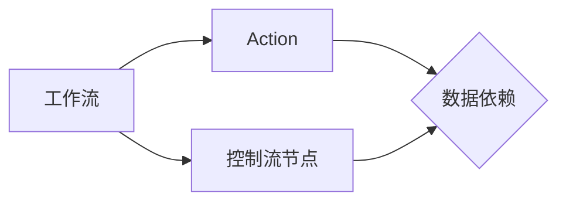

# Oozie在金融行业的实践应用

作者：禅与计算机程序设计艺术

## 1. 背景介绍

### 1.1 金融行业数据处理挑战

随着金融科技的快速发展，金融行业积累了海量的数据，如何高效地处理这些数据成为了一个巨大的挑战。传统的批处理系统难以满足日益增长的数据量和复杂的业务需求，主要体现在以下几个方面：

* **海量数据处理**: 金融交易数据量巨大，传统的批处理系统难以处理如此庞大的数据量，导致处理时间过长。
* **复杂业务逻辑**: 金融业务逻辑复杂，涉及多个系统和数据源，传统的批处理系统难以满足灵活性和扩展性的要求。
* **实时性要求**: 金融行业对数据处理的实时性要求越来越高，传统的批处理系统难以满足实时分析和决策的需求。

### 1.2 Oozie：大数据工作流调度引擎

为了应对这些挑战，大数据技术应运而生。Oozie 是 Apache 基金会开源的一款工作流调度引擎，专门用于管理和调度 Hadoop 生态系统中的各种任务。它提供了一种可靠、可扩展的方式来定义、管理和执行复杂的数据处理流程。

### 1.3 Oozie 在金融行业的优势

Oozie 在金融行业具有以下优势：

* **可靠性**: Oozie 能够保证工作流的可靠执行，即使在某些任务失败的情况下也能保证整个流程的完整性。
* **可扩展性**: Oozie 支持分布式架构，能够轻松扩展以处理海量数据和复杂的业务逻辑。
* **灵活性**: Oozie 支持多种类型的任务，包括 Hadoop 任务、Java 程序、脚本等，能够满足金融行业多样化的业务需求。
* **易用性**: Oozie 提供了简单易用的 Web 界面和命令行工具，方便用户进行工作流的定义、管理和监控。

## 2. 核心概念与联系

### 2.1 工作流 (Workflow)

工作流是 Oozie 中的核心概念，它定义了一系列按特定顺序执行的任务。工作流由多个 Action 节点组成，每个 Action 节点代表一个具体的任务，例如 MapReduce 任务、Hive 查询、Spark 任务等。

### 2.2 动作 (Action)

Action 是工作流中的基本执行单元，它代表一个具体的任务。Oozie 支持多种类型的 Action，例如 Hadoop 任务、Java 程序、脚本等。

### 2.3 控制流节点 (Control Flow Node)

控制流节点用于控制工作流的执行流程，例如判断条件、循环执行等。Oozie 支持多种类型的控制流节点，例如 Decision 节点、Fork 节点、Join 节点等。

### 2.4 数据依赖

Oozie 允许用户定义 Action 之间的数据依赖关系，以确保任务按照正确的顺序执行。例如，一个 Hive 查询任务可能依赖于一个 MapReduce 任务的输出结果。

### 2.5 核心概念关系图



## 3. 核心算法原理与具体操作步骤

### 3.1 工作流定义

Oozie 工作流使用 XML 格式定义，包含了一系列 Action 和控制流节点。以下是一个简单的示例：

```xml
<workflow-app xmlns="uri:oozie:workflow:0.1" name="example-workflow">
    <start to="mapreduce-node"/>
    <action name="mapreduce-node">
        <map-reduce>
            <job-tracker>${jobTracker}</job-tracker>
            <name-node>${nameNode}</name-node>
            <configuration>
                <property>
                    <name>mapred.mapper.class</name>
                    <value>com.example.WordCount$Map</value>
                </property>
                <property>
                    <name>mapred.reducer.class</name>
                    <value>com.example.WordCount$Reduce</value>
                </property>
            </configuration>
        </map-reduce>
        <ok to="end"/>
        <error to="fail"/>
    </action>
    <kill name="fail">
        <message>Job failed, error message[${wf:errorMessage(wf:lastErrorNode())}]</message>
    </kill>
    <end name="end"/>
</workflow-app>
```

### 3.2 工作流提交

可以使用 Oozie 命令行工具或者 Web 界面提交工作流。提交工作流时需要指定工作流定义文件以及相关的配置文件。

```bash
oozie job -oozie http://localhost:8080/oozie -config job.properties -run
```

### 3.3 工作流执行

Oozie 负责解析工作流定义文件，创建并调度执行各个 Action。Oozie 会监控每个 Action 的执行状态，并在必要时进行重试或者错误处理。

### 3.4 工作流监控

可以使用 Oozie Web 界面或者命令行工具监控工作流的执行情况。可以查看工作流的执行进度、各个 Action 的状态、日志信息等。

## 4. 数学模型和公式详细讲解举例说明

Oozie 本身并没有涉及复杂的数学模型和公式，但它可以调度执行使用各种算法和模型的任务。例如，可以使用 Oozie 调度执行机器学习算法、统计分析模型等。

假设我们要使用 Oozie 调度执行一个逻辑回归模型，可以使用以下步骤：

1. 准备训练数据和测试数据。
2. 编写 Python 脚本，使用 Scikit-learn 库训练逻辑回归模型。
3. 将 Python 脚本打包成可执行文件。
4. 创建 Oozie 工作流，定义执行 Python 脚本的 Action。
5. 提交 Oozie 工作流，执行逻辑回归模型训练任务。

## 5. 项目实践：代码实例和详细解释说明

### 5.1 场景描述

假设我们是一家金融公司，需要每天对用户的交易数据进行分析，识别潜在的风险交易。

### 5.2 数据准备

我们有以下数据：

* 用户交易数据：存储在 Hive 表中，包含用户的交易时间、交易金额、交易类型等信息。
* 风险规则：存储在 MySQL 数据库中，定义了各种风险交易规则。

### 5.3 Oozie 工作流设计

我们可以使用 Oozie 设计一个工作流，每天自动执行以下任务：

1. 从 Hive 表中读取用户交易数据。
2. 从 MySQL 数据库中读取风险规则。
3. 使用 Spark 对用户交易数据进行分析，识别潜在的风险交易。
4. 将风险交易信息写入到 HDFS 文件中。
5. 发送邮件通知相关人员。

### 5.4 Oozie 工作流代码

```xml
<workflow-app xmlns="uri:oozie:workflow:0.1" name="risk-analysis-workflow">
    <start to="read-transaction-data"/>

    <action name="read-transaction-data">
        <hive2 xmlns="uri:oozie:hive2-action:0.2">
            <jdbc-url>${hiveJdbcUrl}</jdbc-url>
            <query>
                SELECT * FROM user_transactions WHERE dt = '${wf:format(wf:yesterday(), "yyyyMMdd")}'
            </query>
            <script>${nameNode}/user/hive/scripts/read_transaction_data.hql</script>
        </hive2>
        <ok to="read-risk-rules"/>
        <error to="fail"/>
    </action>

    <action name="read-risk-rules">
        <java>
            <job-tracker>${jobTracker}</job-tracker>
            <name-node>${nameNode}</name-node>
            <main-class>com.example.ReadRiskRules</main-class>
        </java>
        <ok to="run-spark-analysis"/>
        <error to="fail"/>
    </action>

    <action name="run-spark-analysis">
        <spark xmlns="uri:oozie:spark-action:0.5">
            <job-tracker>${jobTracker}</job-tracker>
            <name-node>${nameNode}</name-node>
            <master>yarn-cluster</master>
            <name>risk-analysis-spark</name>
            <class>com.example.RiskAnalysisSpark</class>
            <jar>${nameNode}/user/spark/lib/risk-analysis.jar</jar>
        </spark>
        <ok to="write-risk-transactions"/>
        <error to="fail"/>
    </action>

    <action name="write-risk-transactions">
        <fs>
            <mkdir path="${nameNode}/user/risk/transactions/${wf:format(wf:yesterday(), "yyyyMMdd")}"/>
            <move source="${nameNode}/user/spark/output/risk-analysis-spark" target="${nameNode}/user/risk/transactions/${wf:format(wf:yesterday(), "yyyyMMdd")}"/>
        </fs>
        <ok to="send-email-notification"/>
        <error to="fail"/>
    </action>

    <action name="send-email-notification">
        <email xmlns="uri:oozie:email-action:0.1">
            <to>${emailTo}</to>
            <subject>Risk Analysis Report - ${wf:format(wf:yesterday(), "yyyy-MM-dd")}</subject>
            <body>
                Please find the risk analysis report attached.
            </body>
            <attachment>${nameNode}/user/risk/transactions/${wf:format(wf:yesterday(), "yyyyMMdd")}/part-*</attachment>
        </email>
        <ok to="end"/>
        <error to="fail"/>
    </action>

    <kill name="fail">
        <message>Job failed, error message[${wf:errorMessage(wf:lastErrorNode())}]</message>
    </kill>

    <end name="end"/>
</workflow-app>
```

### 5.5 代码解释

* `read-transaction-data` Action 从 Hive 表中读取用户交易数据。
* `read-risk-rules` Action 从 MySQL 数据库中读取风险规则。
* `run-spark-analysis` Action 使用 Spark 对用户交易数据进行分析，识别潜在的风险交易。
* `write-risk-transactions` Action 将风险交易信息写入到 HDFS 文件中。
* `send-email-notification` Action 发送邮件通知相关人员。

## 6. 实际应用场景

### 6.1 数据仓库 ETL 流程调度

金融行业的数据仓库通常需要从多个数据源中抽取、转换和加载数据。Oozie 可以用于调度执行这些 ETL 流程，保证数据的一致性和完整性。

### 6.2 实时风险监控

Oozie 可以用于调度执行实时风险监控任务，例如监控交易欺诈、信用风险等。

### 6.3 报表生成和分析

Oozie 可以用于调度执行报表生成和分析任务，例如生成日报、月报、年报等。

## 7. 工具和资源推荐

### 7.1 Apache Oozie 官网

https://oozie.apache.org/

### 7.2 Oozie Tutorial

https://oozie.apache.org/docs/4.2.0/OozieTutorial.html

### 7.3 Cloudera Manager

Cloudera Manager 提供了 Oozie 的可视化管理界面，方便用户进行工作流的定义、管理和监控。

## 8. 总结：未来发展趋势与挑战

### 8.1 未来发展趋势

* **云原生化**: 随着云计算的普及，Oozie 也在向云原生化方向发展，例如支持 Kubernetes 等容器编排平台。
* **机器学习平台集成**: Oozie 可以与机器学习平台集成，例如 TensorFlow、Spark MLlib 等，方便用户调度执行机器学习任务。
* **实时流处理**: Oozie 可以与实时流处理框架集成，例如 Apache Kafka、Apache Flink 等，支持实时数据处理和分析。

### 8.2 面临的挑战

* **性能优化**: 随着数据量和业务复杂度的增加，Oozie 需要不断优化性能，提高调度效率。
* **易用性提升**: Oozie 的配置和使用相对复杂，需要进一步提升易用性，降低用户的使用门槛。
* **安全性和可靠性**: 金融行业对数据安全和系统可靠性要求极高，Oozie 需要不断加强安全性和可靠性方面的保障。

## 9. 附录：常见问题与解答

### 9.1 Oozie 和 Airflow 的区别？

Oozie 和 Airflow 都是常用的工作流调度引擎，它们的主要区别在于：

* **调度方式**: Oozie 基于时间调度，而 Airflow 基于 DAG（有向无环图）调度。
* **任务类型**: Oozie 主要用于调度执行 Hadoop 生态系统中的任务，而 Airflow 支持更广泛的任务类型，例如 Python 脚本、Shell 命令等。
* **易用性**: Airflow 的配置和使用更加简单易用，而 Oozie 相对复杂一些。

### 9.2 如何解决 Oozie 工作流执行失败的问题？

Oozie 工作流执行失败的原因有很多，例如任务代码错误、依赖资源不可用等。可以通过以下步骤排查问题：

* 查看 Oozie Web 界面或者命令行工具的日志信息，找到具体的错误信息。
* 检查任务代码，确保代码逻辑正确，并且依赖的库文件都已正确安装。
* 检查依赖资源，例如 HDFS 文件、Hive 表、MySQL 数据库等，确保资源可用并且权限正确。
* 尝试重新执行失败的任务，或者调整工作流参数，例如重试次数、超时时间等。


希望这篇博客能够帮助您更好地理解 Oozie 在金融行业的实践应用。