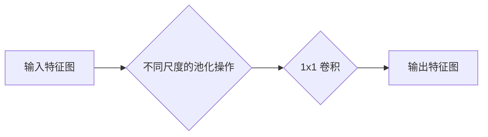
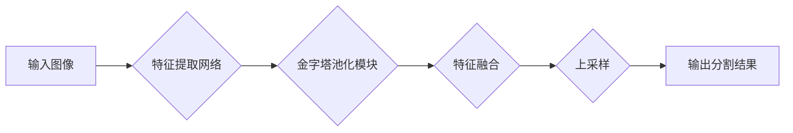

# PSPNet的视频教程：学习PSPNet的视频资源

## 1. 背景介绍

### 1.1 语义分割的挑战与发展

语义分割是计算机视觉领域一项重要的基础性任务，其目标是对图像中的每个像素进行分类，标注出其所属的语义类别。近年来，随着深度学习技术的快速发展，语义分割技术取得了显著的进步，涌现出许多优秀的算法模型，例如 FCN、SegNet、U-Net 等。然而，语义分割任务仍然面临着诸多挑战，例如：

* **上下文信息缺失:**  传统的卷积神经网络在进行特征提取时，感受野有限，难以捕捉到图像中的全局上下文信息，导致分割结果不够准确。
* **多尺度目标分割:**  现实场景中的目标大小不一，如何有效地对不同尺度的目标进行分割是一个难题。
* **计算复杂度高:**  语义分割模型通常需要较大的计算量和内存占用，难以应用于实时性要求较高的场景。

### 1.2 PSPNet的提出与优势

为了解决上述问题，PSPNet（Pyramid Scene Parsing Network）被提出。PSPNet 是一种基于深度学习的语义分割模型，其核心思想是利用金字塔池化模块（Pyramid Pooling Module，PPM）来捕捉不同尺度的上下文信息，从而提升模型的分割精度。

相比于其他语义分割模型，PSPNet 具有以下优势：

* **有效捕捉上下文信息:**  PPM 模块可以对不同尺度的特征图进行池化操作，从而捕捉到图像中的全局上下文信息，提升分割精度。
* **多尺度特征融合:**  PSPNet 将不同尺度的特征图进行融合，可以有效地对不同尺度的目标进行分割。
* **精度高，速度快:**  PSPNet 在多个语义分割数据集上都取得了领先的分割精度，并且速度较快。

## 2. 核心概念与联系

### 2.1 金字塔池化模块（PPM）

PPM 是 PSPNet 的核心模块，其作用是捕捉不同尺度的上下文信息。PPM 模块的结构如下图所示：



PPM 模块首先将输入特征图进行不同尺度的池化操作，例如最大池化或平均池化。然后，对每个池化后的特征图进行 1x1 卷积操作，以降低特征维度。最后，将所有特征图进行拼接，得到最终的输出特征图。

### 2.2 PSPNet 网络结构

PSPNet 的网络结构如下图所示：



PSPNet 首先使用一个特征提取网络（例如 ResNet）对输入图像进行特征提取。然后，将提取到的特征图输入到 PPM 模块中，捕捉不同尺度的上下文信息。接着，将 PPM 模块的输出特征图与特征提取网络的输出特征图进行融合。最后，对融合后的特征图进行上采样，得到最终的分割结果。

## 3. 核心算法原理具体操作步骤

### 3.1 特征提取

PSPNet 使用预训练的 ResNet 模型作为特征提取网络，将输入图像转换为特征图。

### 3.2 金字塔池化

将特征提取网络输出的特征图输入到 PPM 模块中，进行不同尺度的池化操作，捕捉不同尺度的上下文信息。

### 3.3 特征融合

将 PPM 模块输出的特征图与特征提取网络输出的特征图进行融合，得到包含丰富上下文信息的特征图。

### 3.4 上采样

对融合后的特征图进行上采样，将其恢复到原始图像的尺寸，得到最终的分割结果。

## 4. 数学模型和公式详细讲解举例说明

### 4.1 交叉熵损失函数

PSPNet 使用交叉熵损失函数来衡量模型预测结果与真实标签之间的差异。交叉熵损失函数的公式如下：

$$
L = -\frac{1}{N} \sum_{i=1}^{N} \sum_{c=1}^{C} y_{ic} \log(p_{ic})
$$

其中，$N$ 表示样本数量，$C$ 表示类别数量，$y_{ic}$ 表示第 $i$ 个样本属于第 $c$ 类的真实标签，$p_{ic}$ 表示模型预测第 $i$ 个样本属于第 $c$ 类的概率。

### 4.2 Softmax 函数

PSPNet 使用 Softmax 函数将模型的输出转换为概率分布。Softmax 函数的公式如下：

$$
p_i = \frac{e^{z_i}}{\sum_{j=1}^{C} e^{z_j}}
$$

其中，$z_i$ 表示模型对第 $i$ 类的预测分数，$p_i$ 表示模型预测第 $i$ 类的概率。

## 5. 项目实践：代码实例和详细解释说明

### 5.1 环境配置

在运行 PSPNet 代码之前，需要先配置好相应的环境。

* Python 3.x
* PyTorch 1.x
* torchvision
* CUDA 10.x 或更高版本

### 5.2 数据集准备

PSPNet 可以使用多种语义分割数据集进行训练和测试，例如 Cityscapes、ADE20K 等。

### 5.3 模型训练

```python
import torch
import torch.nn as nn
from torchvision import models

# 定义 PSPNet 模型
class PSPNet(nn.Module):
    def __init__(self, num_classes):
        super(PSPNet, self).__init__()

        # 加载预训练的 ResNet 模型
        resnet = models.resnet101(pretrained=True)

        # 获取 ResNet 的特征提取层
        self.layer0 = nn.Sequential(resnet.conv1, resnet.bn1, resnet.relu, resnet.maxpool)
        self.layer1 = resnet.layer1
        self.layer2 = resnet.layer2
        self.layer3 = resnet.layer3
        self.layer4 = resnet.layer4

        # 定义金字塔池化模块
        self.ppm = PPM(2048, [1, 2, 3, 6])

        # 定义分类器
        self.classifier = nn.Sequential(
            nn.Conv2d(4096, 512, kernel_size=3, padding=1, bias=False),
            nn.BatchNorm2d(512),
            nn.ReLU(inplace=True),
            nn.Dropout(0.1),
            nn.Conv2d(512, num_classes, kernel_size=1)
        )

    def forward(self, x):
        # 特征提取
        x = self.layer0(x)
        x = self.layer1(x)
        x = self.layer2(x)
        x = self.layer3(x)
        x = self.layer4(x)

        # 金字塔池化
        x = self.ppm(x)

        # 分类
        x = self.classifier(x)

        return x

# 定义金字塔池化模块
class PPM(nn.Module):
    def __init__(self, in_channels, out_channels, sizes=(1, 2, 3, 6)):
        super(PPM, self).__init__()

        # 定义不同尺度的池化层
        self.stages = []
        for size in sizes:
            self.stages.append(nn.Sequential(
                nn.AdaptiveAvgPool2d(output_size=(size, size)),
                nn.Conv2d(in_channels, out_channels, kernel_size=1, bias=False),
                nn.BatchNorm2d(out_channels),
                nn.ReLU(inplace=True)
            ))
        self.stages = nn.ModuleList(self.stages)

    def forward(self, x):
        # 对不同尺度的特征图进行池化操作
        h, w = x.size(2), x.size(3)
        features = [F.interpolate(stage(x), size=(h, w), mode='bilinear', align_corners=True) for stage in self.stages] + [x]

        # 将所有特征图进行拼接
        return torch.cat(features, dim=1)

# 定义训练函数
def train(model, train_loader, optimizer, criterion, device):
    model.train()

    for i, (images, labels) in enumerate(train_loader):
        images = images.to(device)
        labels = labels.to(device)

        # 前向传播
        outputs = model(images)

        # 计算损失函数
        loss = criterion(outputs, labels)

        # 反向传播
        optimizer.zero_grad()
        loss.backward()
        optimizer.step()

        # 打印训练信息
        if (i+1) % 10 == 0:
            print('Iteration: [{}/{}] Loss: {:.4f}'.format(i+1, len(train_loader), loss.item()))

# 定义测试函数
def test(model, test_loader, device):
    model.eval()

    with torch.no_grad():
        for i, (images, labels) in enumerate(test_loader):
            images = images.to(device)
            labels = labels.to(device)

            # 前向传播
            outputs = model(images)

            # 计算预测结果
            _, predicted = torch.max(outputs.data, 1)

            # 计算准确率
            correct = (predicted == labels).sum().item()
            total = labels.size(0) * labels.size(1) * labels.size(2)
            accuracy = correct / total

            # 打印测试信息
            print('Iteration: [{}/{}] Accuracy: {:.4f}'.format(i+1, len(test_loader), accuracy))

# 设置设备
device = torch.device('cuda' if torch.cuda.is_available() else 'cpu')

# 创建模型
model = PSPNet(num_classes=21).to(device)

# 定义优化器和损失函数
optimizer = torch.optim.Adam(model.parameters(), lr=0.001)
criterion = nn.CrossEntropyLoss()

# 加载数据集
train_loader = ...
test_loader = ...

# 训练模型
for epoch in range(100):
    train(model, train_loader, optimizer, criterion, device)

# 测试模型
test(model, test_loader, device)
```

## 6. 实际应用场景

PSPNet 在许多实际应用场景中都取得了成功，例如：

* **自动驾驶:**  PSPNet 可以用于道路场景的语义分割，识别道路、车辆、行人等目标，为自动驾驶系统提供环境感知信息。
* **医学图像分析:**  PSPNet 可以用于医学图像的语义分割，识别肿瘤、器官等目标，辅助医生进行诊断和治疗。
* **机器人视觉:**  PSPNet 可以用于机器人场景的语义分割，识别物体、障碍物等目标，帮助机器人进行导航和操作。

## 7. 工具和资源推荐

### 7.1 视频教程

* **PyTorch 中文教程 - 语义分割 PSPNet:**  https://www.bilibili.com/video/BV1tE411u72k
* **PSPNet 论文解读:**  https://www.bilibili.com/video/BV1zJ411F7yT

### 7.2 代码实现

* **PyTorch 官方实现:**  https://github.com/pytorch/vision/blob/master/torchvision/models/segmentation/pspnet.py
* **TensorFlow 实现:**  https://github.com/hellochick/PSPNet-tensorflow

## 8. 总结：未来发展趋势与挑战

PSPNet 是一种优秀的语义分割模型，其利用金字塔池化模块有效地捕捉了不同尺度的上下文信息，提升了模型的分割精度。未来，语义分割技术将朝着以下方向发展：

* **更加高效的模型:**  随着移动设备和嵌入式设备的普及，需要更加高效的语义分割模型，以满足实时性要求。
* **更加鲁棒的模型:**  现实场景中存在着各种各样的干扰因素，例如光照变化、遮挡等，需要更加鲁棒的语义分割模型，以应对这些挑战。
* **更加精细的分割:**  语义分割技术需要更加精细地分割目标，例如识别目标的部件、纹理等信息。

## 9. 附录：常见问题与解答

### 9.1 PSPNet 与 FCN 的区别是什么？

FCN 是最早的基于深度学习的语义分割模型之一，其主要思想是将全连接层替换为卷积层，从而实现端到端的语义分割。PSPNet 在 FCN 的基础上引入了金字塔池化模块，可以更好地捕捉不同尺度的上下文信息，从而提升分割精度。

### 9.2 PSPNet 的训练技巧有哪些？

* **数据增强:**  对训练数据进行随机裁剪、翻转等操作，可以扩充训练数据集，提升模型的泛化能力。
* **学习率调整:**  采用合适的学习率调整策略，例如学习率衰减、学习率预热等，可以加速模型的收敛速度，提升模型的性能。
* **模型融合:**  将多个 PSPNet 模型进行融合，可以进一步提升模型的分割精度。
