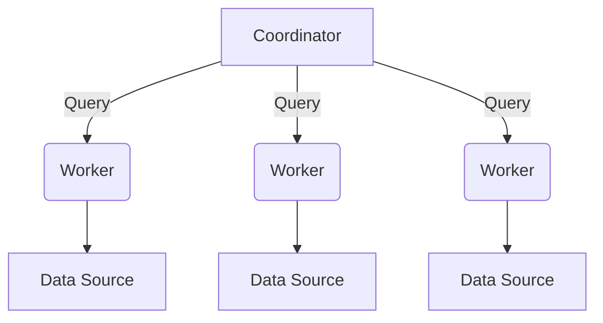
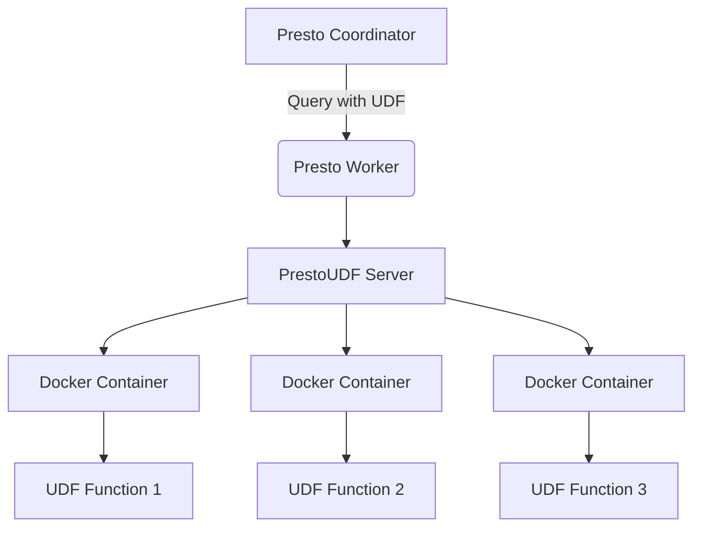

# PrestoUDF与数据仓库：构建高效数据分析平台

## 1.背景介绍

### 1.1 数据分析的重要性

在当今的数字时代,数据无疑成为了企业最宝贵的资产之一。企业每天都会产生大量的数据,涵盖了客户信息、交易记录、日志文件等多个方面。这些数据蕴含着巨大的商业价值,能够帮助企业更好地了解客户需求、优化业务流程、发现新的商机等。因此,对于企业而言,高效地分析和利用数据已经成为提升竞争力的关键因素。

### 1.2 数据仓库的作用

为了有效地管理和分析海量的企业数据,数据仓库(Data Warehouse)应运而生。数据仓库是一种面向主题的、集成的、非暂时的、支持管理决策的数据集合。它将来自不同数据源的数据进行ETL(Extract、Transform、Load)处理,并将其存储在一个集中的数据库中,为企业提供一个统一的数据视图。通过数据仓库,企业可以更高效地访问和分析数据,从而获得洞见和做出数据驱动的决策。

### 1.3 Presto和UDF在数据分析中的作用

Presto是Facebook开源的一款分布式SQL查询引擎,被广泛应用于交互式数据分析和商业智能领域。它能够快速查询跨多个数据源的海量数据,并支持标准的ANSI SQL语法。Presto的优势在于其高性能、可扩展性和简单易用性。

在数据分析过程中,用户定义函数(User-Defined Function,UDF)扮演着重要角色。UDF允许用户根据自己的需求定义自定义函数,从而扩展SQL的功能。通过UDF,用户可以实现各种复杂的数据处理逻辑,例如数据清洗、特征工程、机器学习模型评分等,极大地提高了数据分析的灵活性。

PrestoUDF正是将Presto和UDF结合在一起的解决方案,它使得开发者能够在Presto中轻松地编写和执行UDF。通过PrestoUDF,数据分析工作可以高度自动化,从而提升了数据分析的效率和质量。

## 2.核心概念与联系

### 2.1 Presto架构

为了更好地理解PrestoUDF,我们首先需要了解Presto的整体架构。Presto采用了主从(Master-Worker)架构,如下图所示:



Presto架构主要包括以下几个核心组件:

1. **Coordinator(协调器)**: 负责接收客户端的查询请求,解析并优化查询计划,然后将任务分发给Worker执行。
2. **Worker(工作节点)**: 负责实际执行查询任务,并从数据源读取数据。
3. **Data Source(数据源)**: Presto支持多种数据源,如Hive、Kafka、MySQL等,Worker可以并行地从这些数据源读取数据。

Presto的查询执行过程如下:

1. 客户端提交SQL查询到Coordinator。
2. Coordinator解析SQL,生成查询计划,并将查询任务分发给Worker。
3. Worker并行执行任务,从数据源读取数据并进行计算。
4. Worker将计算结果返回给Coordinator。
5. Coordinator汇总所有Worker的结果,并将最终结果返回给客户端。

通过分布式并行计算,Presto能够高效地处理大规模数据集。

### 2.2 UDF概念

用户定义函数(User-Defined Function, UDF)是一种允许用户在SQL中定义自定义函数的机制。UDF可以用多种编程语言(如Java、Python、R等)实现,并在SQL查询中像内置函数一样使用。

UDF的主要优势包括:

1. **扩展SQL功能**: UDF可以实现SQL无法直接表达的复杂逻辑,如数据清洗、特征工程、机器学习模型评分等。
2. **代码复用**: 通过将常用的数据处理逻辑封装为UDF,可以提高代码的可重用性和可维护性。
3. **性能优化**: 一些计算密集型任务可以通过UDF用底层语言(如C++)实现,从而获得更好的性能。

### 2.3 PrestoUDF

PrestoUDF是一个开源项目,它为Presto提供了UDF的支持。通过PrestoUDF,开发者可以使用Java、Python、R等多种语言编写UDF,并在Presto SQL查询中调用这些UDF。

PrestoUDF的核心思想是将UDF打包为Docker容器,并在Presto Worker节点上运行这些容器。当SQL查询需要执行UDF时,Worker会启动相应的容器,并将数据传递给容器进行计算。计算结果会返回给Worker,然后继续查询执行流程。

通过容器化的方式,PrestoUDF解决了以下几个关键问题:

1. **语言兼容性**: 不同语言编写的UDF可以在同一个Presto集群中运行。
2. **资源隔离**: 每个UDF在自己的容器中运行,互不干扰。
3. **依赖管理**: UDF可以打包所有依赖项到容器中,简化了部署流程。
4. **弹性扩展**: 可以根据需求动态调度更多的容器,从而实现弹性扩展。

## 3.核心算法原理具体操作步骤

### 3.1 PrestoUDF架构

PrestoUDF的整体架构如下图所示:



PrestoUDF架构主要包括以下几个核心组件:

1. **Presto Coordinator和Worker**: 与标准Presto架构类似,Coordinator负责分发查询任务,Worker负责执行任务。
2. **PrestoUDF Server**: 运行在每个Worker节点上,负责管理和调度UDF容器。
3. **Docker容器**: 每个UDF都打包为一个Docker容器,容器中包含UDF的代码和依赖项。
4. **UDF Function**: 在容器中运行的UDF函数实现。

当SQL查询中包含UDF时,PrestoUDF的执行流程如下:

1. Coordinator解析SQL,识别出需要执行的UDF,并将相关任务分发给Worker。
2. Worker上的PrestoUDF Server根据需要启动对应的UDF容器。
3. Worker将数据传递给UDF容器进行计算。
4. UDF容器执行UDF函数,并将结果返回给Worker。
5. Worker继续执行剩余的查询逻辑,最终将结果返回给Coordinator。

通过这种架构,PrestoUDF实现了UDF的动态调度和资源隔离,同时保持了Presto原有的分布式查询能力。

### 3.2 UDF容器化

PrestoUDF的关键在于将UDF函数容器化,以实现语言兼容性、资源隔离和依赖管理。我们以Java UDF为例,介绍容器化的具体步骤。

1. **编写UDF函数**

首先,我们需要编写实际的UDF函数。以下是一个简单的Java UDF示例,用于计算字符串的长度:

```java
import io.prestosql.spi.function.Description;
import io.prestosql.spi.function.ScalarFunction;
import io.prestosql.spi.function.SqlType;
import io.prestosql.spi.type.StandardTypes;

@ScalarFunction("string_length")
@Description("Returns the length of the given string")
public class StringLengthFunction {

    @SqlType(StandardTypes.BIGINT)
    public static long stringLength(@SqlType(StandardTypes.VARCHAR) Slice slice) {
        return slice.length();
    }
}
```

2. **构建UDF镜像**

接下来,我们需要将UDF函数打包为Docker镜像。PrestoUDF提供了一个基础镜像`prestosql/prestosql-rootfs`,我们可以在此基础上构建自己的UDF镜像。

以下是一个简单的Dockerfile示例:

```dockerfile
FROM prestosql/prestosql-rootfs:337

COPY target/function-1.0.jar /function.jar

RUN mkdir -p /usr/lib/presto/lib/bundle/function
RUN ln -s /function.jar /usr/lib/presto/lib/bundle/function/
```

在这个Dockerfile中,我们首先从`prestosql/prestosql-rootfs`基础镜像开始,然后将编译好的UDF函数JAR包复制到镜像中,并创建符号链接以便Presto能够加载这个UDF。

使用以下命令构建Docker镜像:

```
docker build -t my-udf-image .
```

3. **推送镜像到仓库**

为了让Presto Worker能够访问到UDF镜像,我们需要将镜像推送到Docker仓库中。例如,推送到Docker Hub:

```
docker push my-udf-image
```

4. **配置PrestoUDF**

最后,我们需要配置PrestoUDF Server,让它知道如何启动我们的UDF容器。在PrestoUDF Server的配置文件中,添加以下内容:

```yaml
functions:
  string-length:
    image: my-udf-image
    command: /docker-entrypoint.sh
```

这里我们指定了UDF函数的名称`string-length`,以及对应的Docker镜像和启动命令。

完成以上步骤后,我们就可以在Presto SQL中使用这个Java UDF了:

```sql
SELECT string_length('Hello, World!');
```

### 3.3 PrestoUDF Server

PrestoUDF Server是PrestoUDF架构中的关键组件,它负责管理和调度UDF容器。PrestoUDF Server的主要功能包括:

1. **容器管理**: 根据SQL查询中使用的UDF,动态启动、停止和销毁相应的容器。
2. **资源管理**: 监控和限制容器的CPU、内存等资源使用情况,防止资源耗尽。
3. **数据传输**: 将Presto Worker的数据传递给UDF容器,并接收容器的计算结果。
4. **容错处理**: 处理容器异常退出等错误情况,确保查询的正常执行。

PrestoUDF Server的工作原理如下:

1. 启动时,PrestoUDF Server会加载配置文件中定义的所有UDF。
2. 当Presto Worker接收到包含UDF的查询任务时,会通知PrestoUDF Server。
3. PrestoUDF Server根据查询中使用的UDF,启动相应的容器。
4. PrestoUDF Server将Presto Worker的数据传递给容器,并接收容器的计算结果。
5. 计算结果返回给Presto Worker,继续执行剩余的查询逻辑。
6. 查询完成后,PrestoUDF Server停止并销毁不再需要的容器。

为了提高效率,PrestoUDF Server会对容器进行缓存和复用,避免每次查询都重新启动容器。同时,PrestoUDF Server还支持水平扩展,可以在多个节点上运行多个实例,从而实现更高的吞吐量。

## 4.数学模型和公式详细讲解举例说明

在数据分析领域,数学模型和公式扮演着重要的角色。通过建立数学模型,我们可以更好地理解和描述数据中的模式和规律。在本节中,我们将介绍一些常见的数学模型和公式,并详细讲解它们在数据分析中的应用。

### 4.1 线性回归模型

线性回归模型是最常见的监督学习算法之一,广泛应用于预测和分析领域。线性回归模型的目标是找到一个最佳拟合直线,使得数据点与直线的残差平方和最小。

线性回归模型的数学表达式如下:

$$
y = \beta_0 + \beta_1 x_1 + \beta_2 x_2 + \cdots + \beta_n x_n + \epsilon
$$

其中:

- $y$ 是因变量(目标变量)
- $x_1, x_2, \cdots, x_n$ 是自变量(特征变量)
- $\beta_0, \beta_1, \cdots, \beta_n$ 是回归系数
- $\epsilon$ 是误差项(残差)

为了找到最佳拟合直线,我们需要估计回归系数 $\beta_0, \beta_1, \cdots, \beta_n$。通常采用最小二乘法(Ordinary Least Squares, OLS)来估计这些系数,目标是最小化残差平方和:

$$
\min \sum_{i=1}^{m} (y_i - (\beta_0 + \