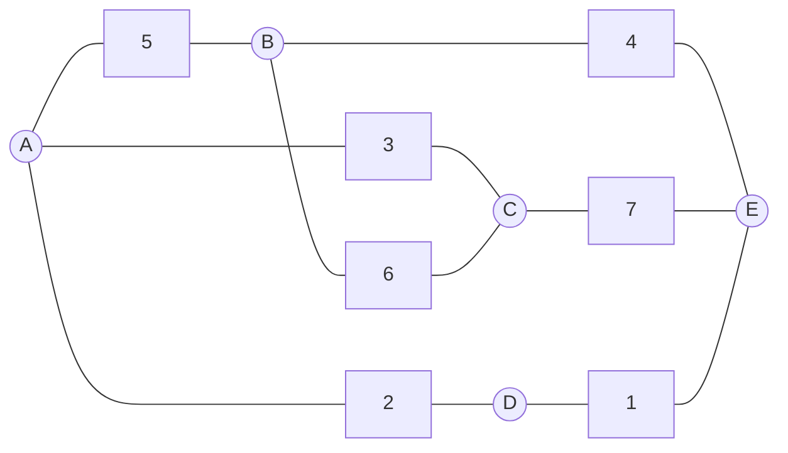
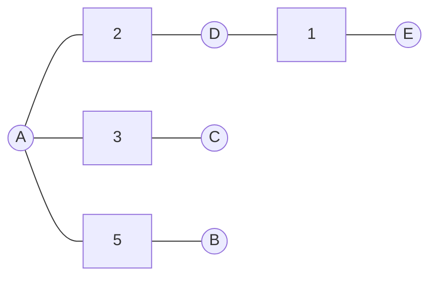

# Prim算法：原理、步骤、代码实现

## 1.背景介绍

### 1.1 最小生成树问题

在图论中，最小生成树(Minimum Spanning Tree, MST)是一个基本且重要的概念。给定一个加权无向连通图G=(V,E)，其中V是图中顶点的集合，E是图中边的集合，每条边都有一个与之相关的权重(weight)或代价(cost)。最小生成树问题就是要从图G中找出一个权重和最小的生成树，使得这个生成树包含了图G中所有的顶点，且没有形成环路。

最小生成树在现实生活中有广泛的应用场景，例如：

- 设计电路板时，需要用最短的线路连接各个元件。
- 设计城市交通网络时，需要修建公路连接所有城市，并使总的修建费用最低。
- 设计计算机网络时，需要用最少的线路连接所有计算机或路由器。
- 机器学习中的聚类算法。

因此，求解最小生成树是一个非常重要和经典的问题。

### 1.2 常见的求解最小生成树的算法

常见的求解最小生成树的算法有Kruskal算法和Prim算法。它们都能够高效地求解最小生成树问题。

- Kruskal算法是一种基于边权重从小到大的贪心算法。它从权重最小的边开始构建最小生成树，每次加入一条不与已选边构成环路的权重最小的边。
- Prim算法是一种基于点的贪心算法。它从一个顶点出发,每次将权重最小的边加入到最小生成树中,直到所有顶点都被加入为止。

本文将重点介绍Prim算法的原理、实现步骤和代码示例。

## 2.核心概念与联系

### 2.1 贪心算法

Prim算法是一种基于贪心思想的算法。贪心算法是一种在每一步选择中都采取在当前状态下最好或最优的选择,从而希望导致最后结果是最好或最优的算法。

贪心算法通常具有以下特点:

- 贪心选择性质:每一步都选择当前看起来最好的选择。
- 不可逆性:每一步选择完成后,就不可能再返回重新选择。

贪心算法不是对所有问题都能得到最优解,但对于一些适合采用贪心策略的问题,它可以有效地得到最优解或者近似最优解。

### 2.2 最小生成树的切分定理

Prim算法的正确性依赖于最小生成树的切分定理(Cut Property)。

切分定理定义如下:

> 给定一个加权无向连通图G=(V,E)，U是图G的一个非空真子集，构成的生成树T是图G的最小生成树的充分必要条件是：对于任何一条连接集合U和V-U的边(u,v)∈E且u∈U,v∈V-U，该边(u,v)的权重w(u,v)是所有连接U和V-U的边中权重最小的。

该定理为Prim算法提供了理论基础。Prim算法每次都选择连接已选择顶点集合和未选择顶点集合的权重最小的边,并将该边加入到生成树中。最终构建出的生成树就是最小生成树。

## 3.核心算法原理具体操作步骤

Prim算法的基本思想是从某个顶点出发,每次将权重最小的边加入到最小生成树中,直到所有顶点都被加入为止。具体步骤如下:

1. 从图G中任意选择一个顶点作为起始点,将其加入到最小生成树的顶点集合U中。初始时,U只包含这一个顶点。
2. 在连接集合U和V-U的所有边中,选择权重最小的边(u,v),将该边加入到最小生成树的边集合中,同时将顶点v也加入到集合U中。
3. 重复步骤2,直到所有顶点都被加入到集合U中,即最小生成树包含了图G中所有的顶点。

该算法的关键在于每次都选择连接已选择顶点集合U和未选择顶点集合V-U的权重最小的边,并将该边加入到最小生成树中。根据最小生成树的切分定理,这样构建出的生成树就是最小生成树。

算法的时间复杂度为O(E*logV),其中E是图中边的数量,V是图中顶点的数量。这是因为每次需要从连接U和V-U的所有边中选择权重最小的边,时间复杂度为O(logE),总共需要执行V-1次,所以总的时间复杂度为O(E*logV)。

## 4.数学模型和公式详细讲解举例说明

### 4.1 数学模型

Prim算法可以用数学模型来表示。给定一个加权无向连通图G=(V,E)和一个起始顶点s,我们需要找到一个生成树T=(V',E'),使得:

$$
\begin{align}
\text{minimize} \quad & \sum_{(u,v) \in E'} w(u,v) \\
\text{subject to} \quad & V' = V \\
& (V',E') \text{ is a tree}
\end{align}
$$

其中,w(u,v)表示边(u,v)的权重。目标函数是最小化生成树中所有边的权重之和。约束条件是生成树必须包含所有顶点,且必须是一棵树(不存在环路)。

### 4.2 切分定理的数学表达

最小生成树的切分定理可以用数学公式来表示。

设U是图G的一个非空真子集,V-U是U的补集。对于任何一条连接集合U和V-U的边(u,v)∈E且u∈U,v∈V-U,如果生成树T是图G的最小生成树,则必须有:

$$
w(u,v) = \min\limits_{(x,y) \in E, x \in U, y \in V-U} w(x,y)
$$

即边(u,v)的权重w(u,v)是所有连接U和V-U的边中权重最小的。这就是切分定理的数学表达式。

### 4.3 例子说明

考虑下面这个加权无向连通图:



如果我们从顶点A开始应用Prim算法,过程如下:

1. 初始时,U={A},V-U={B,C,D,E}。连接U和V-U的边有(A,B)、(A,C)和(A,D),其中权重最小的边是(A,D),权重为2。所以我们将边(A,D)加入到最小生成树中,同时将顶点D加入到U中。

2. 现在U={A,D},V-U={B,C,E}。连接U和V-U的边有(A,B)、(A,C)、(D,E),其中权重最小的边是(D,E),权重为1。所以我们将边(D,E)加入到最小生成树中,同时将顶点E加入到U中。

3. 现在U={A,D,E},V-U={B,C}。连接U和V-U的边有(A,B)、(A,C)和(B,E),其中权重最小的边是(A,C),权重为3。所以我们将边(A,C)加入到最小生成树中,同时将顶点C加入到U中。

4. 现在U={A,D,E,C},V-U={B}。连接U和V-U的边只有(B,A)和(B,C),其中权重最小的边是(B,A),权重为5。所以我们将边(B,A)加入到最小生成树中,同时将顶点B加入到U中。

5. 此时U=V,所有顶点都已经被加入到最小生成树中,算法结束。

最终得到的最小生成树如下:



该生成树的总权重为2+1+3+5=11,是该图的最小生成树。

## 4.项目实践:代码实例和详细解释说明

下面给出了Prim算法的Python代码实现,使用了优先队列(Priority Queue)来高效地选择权重最小的边。

```python
import heapq

def prim(graph, start):
    """
    Prim算法求解最小生成树
    
    参数:
    graph: 图的邻接表表示
    start: 起始顶点
    
    返回:
    最小生成树的边集合
    """
    
    # 初始化最小生成树的边集合
    mst = []
    
    # 初始化顶点到起始顶点的距离字典
    distances = {node: float('inf') for node in graph}
    distances[start] = 0
    
    # 初始化顶点到最小生成树中顶点的前驱字典
    predecessors = {}
    
    # 使用优先队列存储(距离,顶点)对
    pq = [(0, start)]
    
    while pq:
        # 取出距离最小的顶点
        current_dist, current_node = heapq.heappop(pq)
        
        # 如果该顶点已经在最小生成树中,则忽略
        if current_dist > distances[current_node]:
            continue
        
        # 否则,将该顶点加入到最小生成树中
        for neighbor, weight in graph[current_node].items():
            distance = weight
            
            # 如果通过当前顶点到达邻居顶点的距离更小
            if distance < distances[neighbor]:
                # 更新距离和前驱
                distances[neighbor] = distance
                predecessors[neighbor] = current_node
                heapq.heappush(pq, (distance, neighbor))
        
        # 如果当前顶点不是起始顶点,则将边加入到最小生成树中
        if current_node != start:
            mst.append((predecessors[current_node], current_node, distances[current_node]))
    
    return mst
```

代码解释:

1. 首先定义了`prim`函数,接受图的邻接表表示`graph`和起始顶点`start`作为输入。
2. 初始化最小生成树的边集合`mst`为空列表。
3. 初始化一个字典`distances`,存储每个顶点到起始顶点的距离,初始时除了起始顶点距离为0外,其他顶点距离设为正无穷大。
4. 初始化一个字典`predecessors`,存储每个顶点在最小生成树中的前驱节点。
5. 创建一个优先队列`pq`,存储(距离,顶点)对,初始时只包含起始顶点。
6. 进入主循环,每次从优先队列中取出距离最小的顶点`current_node`。
7. 如果`current_node`已经在最小生成树中(即`current_dist`大于`distances[current_node]`),则忽略该顶点。
8. 否则,遍历`current_node`的所有邻居节点`neighbor`。
9. 计算从`current_node`到`neighbor`的距离`distance`。
10. 如果通过`current_node`到达`neighbor`的距离`distance`比之前记录的`distances[neighbor]`更小,则更新`distances[neighbor]`和`predecessors[neighbor]`,并将`(distance, neighbor)`加入到优先队列中。
11. 如果`current_node`不是起始顶点,则将边`(predecessors[current_node], current_node, distances[current_node])`加入到最小生成树的边集合`mst`中。
12. 循环结束后,返回最小生成树的边集合`mst`。

该实现的时间复杂度为O(E*logV),其中E是图中边的数量,V是图中顶点的数量。这是因为每次从优先队列中取出最小距离的顶点需要O(logV)时间,总共需要执行V次,而遍历所有边需要O(E)时间。

下面是一个使用该实现的示例:

```python
# 图的邻接表表示
graph = {
    'A': {'B': 5, 'C': 3, 'D': 2},
    'B': {'A': 5, 'C': 6, 'E': 4},
    'C': {'A': 3, 'B': 6, 'E': 7},
    'D': {'A': 2, 'E': 1},
    'E': {'B': 4, 'C': 7, 'D': 1}
}

# 从顶点A开始
start = 'A'

# 调用Prim算法
mst = prim(graph, start)

# 打印最小生成树
print("最小生成树的边集合:")
for edge in mst:
    print(edge)
```

输出结果:

```
最小生成树的边集合:
('A', 'D', 