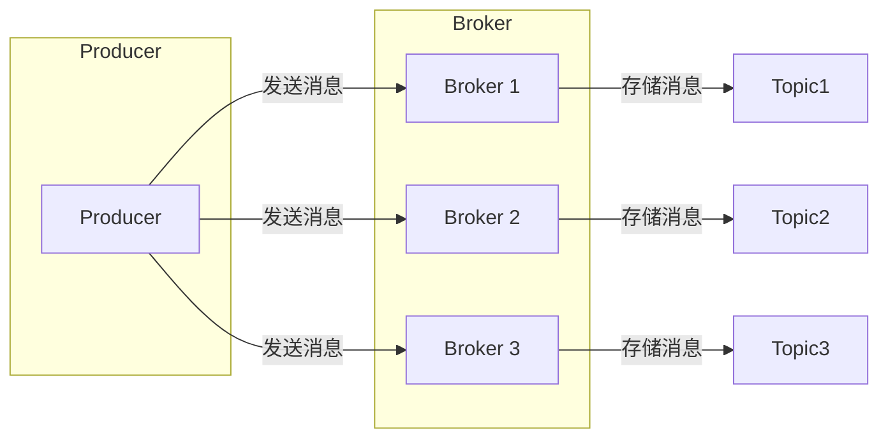

# Pulsar Producer 原理与代码实例讲解

## 1. 背景介绍

### 1.1 消息队列概述

消息队列（Message Queue）是一种异步通信协议，用于在分布式系统中不同组件之间传递消息。它允许发送方（Producer）将消息发送到一个队列中，而接收方（Consumer）则可以从队列中接收消息。消息队列的主要优点包括：

* **解耦：** 发送方和接收方不需要直接通信，而是通过消息队列进行交互，从而降低了系统耦合度。
* **异步：** 发送方可以将消息发送到队列后立即返回，而无需等待接收方处理消息，提高了系统吞吐量。
* **可靠性：** 消息队列可以持久化消息，确保消息不会丢失，即使接收方出现故障。

### 1.2 Pulsar 简介

Apache Pulsar 是一个开源的、分布式、多租户的消息和流平台，最初由 Yahoo! 开发，现在是 Apache 软件基金会的顶级项目。Pulsar 具有高性能、高可扩展性、高可靠性等特点，被广泛应用于各种场景，如：

* 日志收集和分析
* 数据管道
* 微服务通信
* 实时数据处理

### 1.3 Pulsar Producer 概述

Pulsar Producer 是 Pulsar 中负责发送消息的组件。它提供了一组 API，用于将消息发送到指定的 Topic。Pulsar Producer 支持多种消息发送模式，包括：

* 同步发送
* 异步发送
* 单条消息发送
* 批量消息发送

## 2. 核心概念与联系

### 2.1 Topic

Topic 是 Pulsar 中消息传递的基本单元，类似于消息队列中的队列。每个 Topic 都有一个唯一的名称，用于标识消息流。Producer 将消息发送到指定的 Topic，Consumer 则从指定的 Topic 接收消息。

### 2.2 Producer

Producer 是 Pulsar 中负责发送消息的组件。它提供了一组 API，用于将消息发送到指定的 Topic。

### 2.3 Broker

Broker 是 Pulsar 中负责存储和分发消息的服务器节点。每个 Broker 都可以处理多个 Topic 的消息。

### 2.4 Cluster

Cluster 是由多个 Broker 组成的逻辑单元，用于提供高可用性和可扩展性。

### 2.5 核心概念联系

下图展示了 Pulsar 中 Producer、Topic、Broker 和 Cluster 之间的联系：



## 3. 核心算法原理具体操作步骤

### 3.1 创建 Producer

创建 Pulsar Producer 的第一步是创建一个 Pulsar 客户端对象。然后，可以使用客户端对象创建 Producer 对象。创建 Producer 对象时，需要指定以下参数：

* **服务地址：** Pulsar 集群的服务地址。
* **Topic 名称：** 要发送消息的 Topic 名称。
* **Producer 名称：** Producer 的名称，用于标识不同的 Producer。

### 3.2 发送消息

创建 Producer 对象后，就可以使用 `send()` 方法发送消息。`send()` 方法接受一个消息对象作为参数，并返回一个 MessageId 对象，表示消息的唯一标识。

### 3.3 关闭 Producer

使用完 Producer 后，需要调用 `close()` 方法关闭 Producer。

## 4. 数学模型和公式详细讲解举例说明

Pulsar Producer 没有涉及复杂的数学模型和公式。

## 5. 项目实践：代码实例和详细解释说明

### 5.1 Maven 依赖

```xml
<dependency>
  <groupId>org.apache.pulsar</groupId>
  <artifactId>pulsar-client</artifactId>
  <version>2.10.0</version>
</dependency>
```

### 5.2 Java 代码示例

```java
import org.apache.pulsar.client.api.*;

public class PulsarProducerExample {

    public static void main(String[] args) throws Exception {
        // 创建 Pulsar 客户端
        PulsarClient client = PulsarClient.builder()
                .serviceUrl("pulsar://localhost:6650")
                .build();

        // 创建 Producer
        Producer<byte[]> producer = client.newProducer()
                .topic("my-topic")
                .producerName("my-producer")
                .create();

        // 发送消息
        for (int i = 0; i < 10; i++) {
            String message = "Message-" + i;
            producer.send(message.getBytes());
            System.out.println("Sent message: " + message);
        }

        // 关闭 Producer
        producer.close();

        // 关闭客户端
        client.close();
    }
}
```

### 5.3 代码解释

* 首先，创建了一个 Pulsar 客户端对象，并指定了 Pulsar 集群的服务地址。
* 然后，使用客户端对象创建了一个 Producer 对象，并指定了 Topic 名称和 Producer 名称。
* 接下来，使用 `send()` 方法发送了 10 条消息。
* 最后，关闭了 Producer 和客户端对象。

## 6. 实际应用场景

Pulsar Producer 可以应用于各种场景，例如：

* **日志收集：** 将应用程序日志发送到 Pulsar，用于集中存储和分析。
* **数据管道：** 将数据从一个系统传输到另一个系统，例如将数据库中的数据同步到 Elasticsearch。
* **微服务通信：** 在微服务架构中，可以使用 Pulsar Producer 将消息发送到指定的 Topic，实现服务之间的异步通信。

## 7. 工具和资源推荐

* **Apache Pulsar 官网：** https://pulsar.apache.org/
* **Pulsar Java 客户端文档：** https://pulsar.apache.org/docs/en/client-libraries-java/

## 8. 总结：未来发展趋势与挑战

随着大数据和云计算技术的不断发展，消息队列在分布式系统中的作用越来越重要。Pulsar 作为新一代消息队列，具有高性能、高可扩展性、高可靠性等特点，未来将在更多场景得到应用。

未来 Pulsar Producer 的发展趋势包括：

* **更高的性能和更低的延迟：** 随着硬件性能的提升和软件架构的优化，Pulsar Producer 的性能和延迟将进一步提升。
* **更丰富的功能：** Pulsar Producer 将提供更丰富的功能，例如事务消息、延迟消息等。
* **更易用性：** Pulsar Producer 的 API 将更加简洁易用，降低开发人员的使用门槛。

## 9. 附录：常见问题与解答

### 9.1 如何保证消息发送的可靠性？

Pulsar Producer 支持多种消息发送模式，可以根据实际需求选择合适的模式来保证消息发送的可靠性。例如，可以使用同步发送模式确保消息发送成功，或者使用异步发送模式结合消息确认机制来保证消息至少被发送一次。

### 9.2 如何处理消息发送失败的情况？

Pulsar Producer 提供了异常处理机制，可以在消息发送失败时捕获异常并进行处理。例如，可以尝试重新发送消息，或者将消息记录到日志中。
