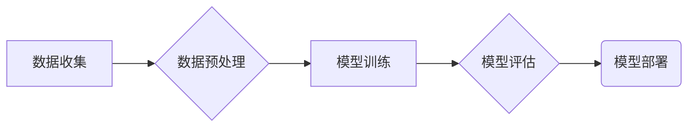

## Python深度学习实践：深度学习在医学图像分析中的运用

作者：禅与计算机程序设计艺术

## 1. 背景介绍

### 1.1 医学图像分析的意义

医学图像分析是指利用计算机技术对医学图像进行处理、分析和解释，以辅助医生进行疾病诊断、治疗方案制定和预后评估。常见的医学图像包括X光片、CT扫描、MRI扫描、超声图像等。医学图像分析在现代医学中扮演着越来越重要的角色，其意义主要体现在以下几个方面：

* **提高诊断准确率：**  医学图像分析可以帮助医生更准确地识别病灶，减少漏诊和误诊的概率。
* **辅助治疗方案制定：** 通过对医学图像的分析，医生可以更全面地了解患者的病情，从而制定更有效的治疗方案。
* **评估治疗效果：** 医学图像分析可以帮助医生评估治疗效果，及时调整治疗方案。
* **促进医学研究：** 医学图像分析为医学研究提供了新的思路和方法，推动了医学影像学的进步。

### 1.2 深度学习的优势

深度学习作为机器学习的一个重要分支，近年来在图像识别、语音识别、自然语言处理等领域取得了突破性进展。深度学习在医学图像分析领域的应用也越来越广泛，其优势主要体现在以下几个方面：

* **强大的特征提取能力：** 深度学习模型可以通过多层神经网络自动学习图像的特征，无需人工设计特征。
* **端到端的学习方式：** 深度学习模型可以从原始图像数据中直接学习，无需进行复杂的预处理。
* **优异的性能：** 在许多医学图像分析任务中，深度学习模型的性能已经超越了传统的机器学习方法。

## 2. 核心概念与联系

### 2.1 深度学习基础

#### 2.1.1 神经网络

神经网络是深度学习的基础，它是由大量神经元相互连接而成的网络结构。每个神经元接收来自其他神经元的输入，经过加权求和和非线性变换后输出到其他神经元。

#### 2.1.2 卷积神经网络 (CNN)

卷积神经网络是一种专门用于处理图像数据的深度学习模型。它通过卷积层、池化层和全连接层等结构，可以有效地提取图像的特征。

#### 2.1.3 循环神经网络 (RNN)

循环神经网络是一种专门用于处理序列数据的深度学习模型。它通过循环连接结构，可以有效地学习序列数据的时间依赖关系。

### 2.2 医学图像分析常用术语

#### 2.2.1 分割 (Segmentation)

分割是指将医学图像中的目标区域从背景中分离出来的过程。

#### 2.2.2 分类 (Classification)

分类是指根据医学图像的特征将其归类到不同的类别中。

#### 2.2.3 检测 (Detection)

检测是指在医学图像中定位和识别目标区域的过程。

### 2.3 核心概念联系

深度学习模型可以通过学习大量的医学图像数据，自动提取图像的特征，并用于医学图像的分割、分类和检测等任务。

## 3. 核心算法原理具体操作步骤

### 3.1 基于深度学习的医学图像分割

#### 3.1.1 U-Net

U-Net是一种常用的基于深度学习的医学图像分割模型。它采用编码器-解码器结构，可以有效地提取图像的多尺度特征。

**操作步骤：**

1. 将医学图像输入到U-Net模型中。
2. 编码器部分通过卷积层和池化层逐步提取图像的特征。
3. 解码器部分通过反卷积层和上采样层逐步恢复图像的分辨率。
4. 在解码器部分的每一层，将编码器部分对应的特征图进行拼接，以融合多尺度信息。
5. 最后，通过一个输出层输出分割结果。

#### 3.1.2 Mask R-CNN

Mask R-CNN是一种常用的基于深度学习的目标检测和分割模型。它可以同时检测图像中的目标区域，并对目标区域进行分割。

**操作步骤：**

1. 将医学图像输入到Mask R-CNN模型中。
2. 通过特征金字塔网络 (FPN) 提取图像的多尺度特征。
3. 通过区域建议网络 (RPN) 生成目标区域的候选框。
4. 对每个候选框进行分类和边界框回归。
5. 对分类为目标的候选框，通过分割分支输出目标区域的掩码。

### 3.2 基于深度学习的医学图像分类

#### 3.2.1 卷积神经网络 (CNN)

卷积神经网络是医学图像分类常用的深度学习模型。

**操作步骤：**

1. 将医学图像输入到CNN模型中。
2. 通过卷积层、池化层和全连接层逐步提取图像的特征。
3. 最后，通过一个输出层输出分类结果。

#### 3.2.2 迁移学习

迁移学习是指将预训练好的深度学习模型应用于新的任务。

**操作步骤：**

1. 选择一个在ImageNet等大型数据集上预训练好的CNN模型。
2. 将预训练模型的最后一层全连接层替换为新的全连接层。
3. 使用医学图像数据对新的全连接层进行微调。

## 4. 数学模型和公式详细讲解举例说明

### 4.1 卷积操作

卷积操作是卷积神经网络的核心操作，它可以提取图像的局部特征。

**公式：**

$$
(f * g)(t) = \int_{-\infty}^{\infty} f(\tau)g(t-\tau) d\tau
$$

其中，$f$ 是输入信号，$g$ 是卷积核，$*$ 表示卷积操作。

**举例说明：**

假设有一个 $3 \times 3$ 的输入图像和一个 $2 \times 2$ 的卷积核，卷积操作的过程如下：


```
输入图像：
1  2  3
4  5  6
7  8  9

卷积核：
1  0
0  1

卷积结果：
 5  8
12 15
```

### 4.2 损失函数

损失函数用于衡量深度学习模型的预测结果与真实标签之间的差异。

**举例说明：**

**交叉熵损失函数 (Cross-Entropy Loss)**

```
L = -\frac{1}{N} \sum_{i=1}^{N} y_i \log(p_i) + (1-y_i) \log(1-p_i)
```

其中，$N$ 是样本数量，$y_i$ 是第 $i$ 个样本的真实标签，$p_i$ 是模型对第 $i$ 个样本的预测概率。

## 5. 项目实践：代码实例和详细解释说明

### 5.1 使用 Python 和 TensorFlow 实现一个简单的医学图像分类器

**代码实例：**

```python
import tensorflow as tf

# 加载数据集
(x_train, y_train), (x_test, y_test) = tf.keras.datasets.cifar10.load_data()

# 数据预处理
x_train = x_train.astype('float32') / 255
x_test = x_test.astype('float32') / 255

# 构建模型
model = tf.keras.models.Sequential([
  tf.keras.layers.Conv2D(32, (3, 3), activation='relu', input_shape=(32, 32, 3)),
  tf.keras.layers.MaxPooling2D((2, 2)),
  tf.keras.layers.Conv2D(64, (3, 3), activation='relu'),
  tf.keras.layers.MaxPooling2D((2, 2)),
  tf.keras.layers.Flatten(),
  tf.keras.layers.Dense(10, activation='softmax')
])

# 编译模型
model.compile(optimizer='adam',
              loss='sparse_categorical_crossentropy',
              metrics=['accuracy'])

# 训练模型
model.fit(x_train, y_train, epochs=5)

# 评估模型
test_loss, test_acc = model.evaluate(x_test, y_test, verbose=2)
print('\nTest accuracy:', test_acc)
```

**代码解释：**

1. 首先，加载 CIFAR-10 数据集，并进行数据预处理。
2. 然后，构建一个简单的卷积神经网络模型，包括两个卷积层、两个池化层、一个扁平化层和一个全连接层。
3. 编译模型，指定优化器、损失函数和评估指标。
4. 使用训练数据训练模型，指定训练轮数。
5. 使用测试数据评估模型的性能。

## 6. 实际应用场景

深度学习在医学图像分析领域有着广泛的应用，例如：

* **肺癌诊断：** 使用深度学习模型对肺部CT图像进行分析，可以辅助医生进行肺癌的早期诊断。
* **乳腺癌诊断：** 使用深度学习模型对乳腺X光图像进行分析，可以辅助医生进行乳腺癌的早期诊断。
* **心脏病诊断：** 使用深度学习模型对心脏MRI图像进行分析，可以辅助医生进行心脏病的诊断。
* **脑疾病诊断：** 使用深度学习模型对脑部MRI图像进行分析，可以辅助医生进行脑肿瘤、阿尔茨海默病等脑疾病的诊断。

## 7. 工具和资源推荐

* **TensorFlow：** Google开源的深度学习框架，提供了丰富的API和工具，方便开发者构建和训练深度学习模型。
* **Keras：** 基于TensorFlow的高级神经网络API，可以更方便地构建和训练深度学习模型。
* **PyTorch：** Facebook开源的深度学习框架，提供了灵活的编程模型和高效的GPU加速。
* **Medical Image Computing and Computer Assisted Intervention (MICCAI)：** 医学图像计算与计算机辅助干预国际会议，是医学图像分析领域的顶级会议。

## 8. 总结：未来发展趋势与挑战

### 8.1 未来发展趋势

* **更加精准的模型：** 随着深度学习技术的不断发展，未来将会出现更加精准的医学图像分析模型。
* **更加个性化的医疗：** 深度学习可以根据患者的个体差异，提供更加个性化的医疗服务。
* **更加智能化的医疗设备：** 深度学习可以赋予医疗设备更加智能化的功能，例如自动诊断、辅助手术等。

### 8.2 面临的挑战

* **数据隐私和安全：** 医学图像数据包含患者的隐私信息，需要采取有效的措施保护数据隐私和安全。
* **模型可解释性：** 深度学习模型通常是一个黑盒子，需要提高模型的可解释性，以便医生更好地理解模型的决策过程。
* **跨领域合作：** 医学图像分析需要医学、计算机科学等多个领域的专家合作，才能取得更好的成果。

## 9. 附录：常见问题与解答

### 9.1 如何选择合适的深度学习模型？

选择合适的深度学习模型需要考虑多个因素，例如任务类型、数据集大小、计算资源等。

### 9.2 如何提高深度学习模型的性能？

提高深度学习模型的性能可以尝试以下方法：

* 使用更大的数据集
* 使用更深的网络结构
* 使用更好的优化算法
* 使用数据增强技术

### 9.3 如何将深度学习模型应用于实际场景？

将深度学习模型应用于实际场景需要考虑以下因素：

* 模型部署
* 模型监控
* 模型更新


## 10. Mermaid流程图



**解释：**

* 数据收集：收集医学图像数据。
* 数据预处理：对医学图像数据进行预处理，例如图像归一化、数据增强等。
* 模型训练：使用预处理后的数据训练深度学习模型。
* 模型评估：使用测试数据评估训练好的模型性能。
* 模型部署：将训练好的模型部署到实际应用环境中。
