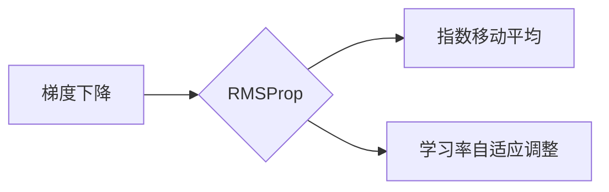

## 1. 背景介绍

### 1.1 梯度下降算法的局限性

在机器学习和深度学习领域，梯度下降算法是一种常用的优化算法，用于寻找目标函数的最小值。然而，传统的梯度下降算法存在一些局限性，例如：

* **学习率难以确定**:  过大的学习率可能导致算法不稳定，甚至发散，而过小的学习率会导致收敛速度过慢。
* **容易陷入局部最优**: 梯度下降算法可能会陷入局部最优解，而不是全局最优解。
* **在高维空间中收敛速度慢**: 对于高维数据，梯度下降算法的收敛速度会变得很慢。

### 1.2 RMSProp优化器的提出

为了解决这些问题，研究者们提出了各种改进的梯度下降算法，其中 RMSProp 优化器就是一种有效的优化算法。RMSProp 算法通过自适应地调整学习率，可以有效地克服传统梯度下降算法的局限性。

## 2. 核心概念与联系

### 2.1 指数移动平均

RMSProp 算法的核心思想是利用指数移动平均来计算梯度平方的累积平均值。指数移动平均是一种常用的时间序列分析方法，它可以用来平滑时间序列数据，并突出数据的长期趋势。

### 2.2 学习率自适应调整

RMSProp 算法根据梯度平方的累积平均值来调整学习率。当梯度平方较大时，学习率会减小，从而避免算法震荡；当梯度平方较小时，学习率会增大，从而加速算法收敛。

### 2.3 关系图



## 3. 核心算法原理具体操作步骤

### 3.1 初始化参数

* 设置初始学习率 $\alpha$。
* 设置衰减率 $\rho$，通常取值 0.9。
* 初始化梯度平方的累积平均值 $s$ 为 0。

### 3.2 计算梯度

计算目标函数关于参数的梯度 $\nabla J(\theta)$。

### 3.3 更新梯度平方的累积平均值

$$ s = \rho s + (1 - \rho) (\nabla J(\theta))^2 $$

### 3.4 更新参数

$$ \theta = \theta - \frac{\alpha}{\sqrt{s + \epsilon}} \nabla J(\theta) $$

其中，$\epsilon$ 是一个很小的常数，用于避免分母为 0。

## 4. 数学模型和公式详细讲解举例说明

### 4.1 指数移动平均公式

指数移动平均公式如下：

$$ s_t = \rho s_{t-1} + (1 - \rho) x_t $$

其中，$s_t$ 是时间 $t$ 的指数移动平均值，$x_t$ 是时间 $t$ 的实际值，$\rho$ 是衰减率。

### 4.2 RMSProp 算法公式

RMSProp 算法公式如下：

$$ s = \rho s + (1 - \rho) (\nabla J(\theta))^2 $$

$$ \theta = \theta - \frac{\alpha}{\sqrt{s + \epsilon}} \nabla J(\theta) $$

### 4.3 举例说明

假设我们有一个目标函数 $J(\theta) = \theta^2$，初始参数 $\theta = 1$，学习率 $\alpha = 0.1$，衰减率 $\rho = 0.9$。

* **第一步**: 计算梯度 $\nabla J(\theta) = 2 \theta = 2$。
* **第二步**: 更新梯度平方的累积平均值 $s = 0.9 \times 0 + (1 - 0.9) \times 2^2 = 0.4$。
* **第三步**: 更新参数 $\theta = 1 - \frac{0.1}{\sqrt{0.4 + 10^{-8}}} \times 2 \approx 0.68$。

## 5. 项目实践：代码实例和详细解释说明

### 5.1 TypeScript 代码实现

```typescript
class RMSProp {
  private learningRate: number;
  private decayRate: number;
  private epsilon: number;
  private accumulatedSquaredGradients: number[];

  constructor(learningRate: number, decayRate: number, epsilon: number) {
    this.learningRate = learningRate;
    this.decayRate = decayRate;
    this.epsilon = epsilon;
    this.accumulatedSquaredGradients = [];
  }

  optimize(parameters: number[], gradients: number[]): number[] {
    for (let i = 0; i < parameters.length; i++) {
      if (this.accumulatedSquaredGradients[i] === undefined) {
        this.accumulatedSquaredGradients[i] = 0;
      }
      this.accumulatedSquaredGradients[i] =
        this.decayRate * this.accumulatedSquaredGradients[i] +
        (1 - this.decayRate) * gradients[i] * gradients[i];
      parameters[i] -=
        (this.learningRate /
          Math.sqrt(this.accumulatedSquaredGradients[i] + this.epsilon)) *
        gradients[i];
    }
    return parameters;
  }
}
```

### 5.2 代码解释

* `learningRate`: 学习率。
* `decayRate`: 衰减率。
* `epsilon`: 一个很小的常数，用于避免分母为 0。
* `accumulatedSquaredGradients`: 梯度平方的累积平均值。
* `optimize()`: 优化函数，输入参数和梯度，输出更新后的参数。

## 6. 实际应用场景

### 6.1 深度学习

RMSProp 优化器在深度学习中被广泛应用，例如：

* 图像分类
* 目标检测
* 自然语言处理

### 6.2 其他领域

RMSProp 优化器也可以应用于其他领域，例如：

* 强化学习
* 控制理论

## 7. 总结：未来发展趋势与挑战

### 7.1 未来发展趋势

* 自适应学习率算法的进一步研究
* 与其他优化算法的结合
* 在更广泛的应用场景中的应用

### 7.2 挑战

* 理论分析和解释
* 参数调优
* 对噪声和异常值的鲁棒性

## 8. 附录：常见问题与解答

### 8.1 RMSProp 和 Adam 优化器的区别

RMSProp 和 Adam 优化器都是自适应学习率算法，但它们之间存在一些区别：

* Adam 优化器使用了动量，而 RMSProp 没有。
* Adam 优化器对梯度的一阶矩估计和二阶矩估计都进行了修正，而 RMSProp 只对二阶矩估计进行了修正。

### 8.2 如何选择合适的学习率

选择合适的学习率是 RMSProp 优化器成功的关键。通常情况下，可以尝试以下方法：

* 从一个较小的学习率开始，例如 0.001。
* 逐渐增加学习率，直到找到一个合适的学习率。
* 使用学习率调度器，例如指数衰减学习率调度器。
