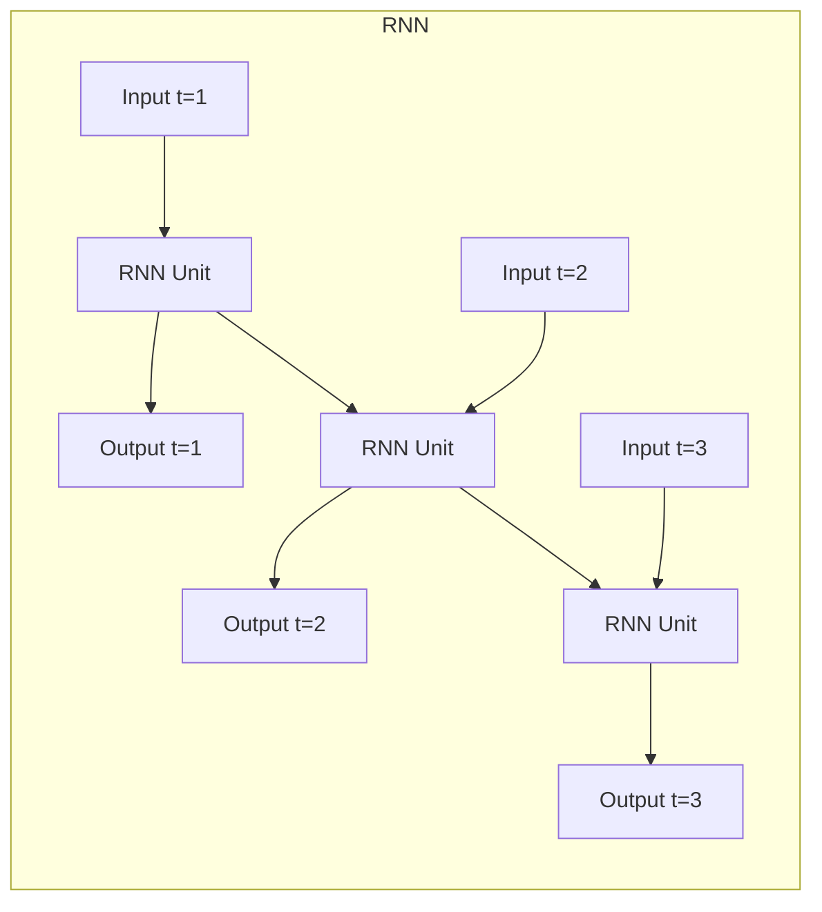

# RNN基本单元：捕捉时间信息

## 1. 背景介绍

### 1.1 序列数据的重要性

在当今的数字时代，我们被各种形式的序列数据所包围。无论是自然语言处理中的文本序列、语音识别中的音频序列,还是视频分析中的图像序列,序列数据无处不在。能够有效地处理和理解这些序列数据对于许多应用程序来说至关重要。

### 1.2 传统机器学习方法的局限性

传统的机器学习算法,如逻辑回归和支持向量机等,主要针对的是固定长度的向量输入。然而,序列数据具有变长和时间相关性的特点,这使得传统方法难以很好地捕捉序列数据中蕴含的时间模式和长期依赖关系。

### 1.3 循环神经网络(RNN)的兴起

为了解决序列数据处理的挑战,循环神经网络(Recurrent Neural Network, RNN)应运而生。RNN是一种特殊的神经网络架构,它专门设计用于处理序列数据。与传统的前馈神经网络不同,RNN通过内部循环机制,能够捕捉序列数据中的时间依赖关系,从而更好地建模和预测序列数据。

## 2. 核心概念与联系

### 2.1 RNN的基本思想

RNN的核心思想是将序列数据的每个时间步骤作为网络的一个输入,并在每个时间步骤更新网络的隐藏状态。这种隐藏状态就像网络的"记忆",它携带了过去时间步骤的信息,并影响着当前和未来时间步骤的计算。

$$
h_t = f_W(x_t, h_{t-1})
$$

其中 $h_t$ 表示时间步 $t$ 的隐藏状态, $x_t$ 是该时间步的输入, $h_{t-1}$ 是前一时间步的隐藏状态, $f_W$ 是根据网络参数 $W$ 定义的递归函数。

### 2.2 RNN的展开结构

为了更好地理解RNN的工作原理,我们可以将其展开成一个由多个相同网络单元复制而成的链式结构。每个网络单元对应一个时间步骤,并且隐藏状态在单元之间传递,实现了信息的时间传递。



### 2.3 RNN的变体

基于标准RNN的架构,研究人员提出了多种变体,如长短期记忆网络(LSTM)和门控循环单元(GRU),以解决标准RNN在捕捉长期依赖关系方面的困难。这些变体通过引入门控机制和记忆单元,使网络能够更好地控制信息的流动,从而提高了处理长序列的能力。

## 3. 核心算法原理具体操作步骤 

### 3.1 RNN的前向传播

在RNN的前向传播过程中,我们需要遍历序列的每个时间步骤,并计算相应的隐藏状态和输出。具体步骤如下:

1. 初始化隐藏状态 $h_0$ (通常设为全零向量)。
2. 对于每个时间步骤 $t$:
    a. 计算当前时间步的隐藏状态 $h_t$,通常使用像tanh这样的非线性激活函数:
    
    $$h_t = \tanh(W_{hx}x_t + W_{hh}h_{t-1} + b_h)$$
    
    其中 $W_{hx}$ 是输入到隐藏层的权重矩阵, $W_{hh}$ 是隐藏层到隐藏层的权重矩阵, $b_h$ 是隐藏层的偏置向量。
    
    b. 计算当前时间步的输出 $y_t$,通常使用像softmax这样的输出层激活函数:
    
    $$y_t = \text{softmax}(W_{yh}h_t + b_y)$$
    
    其中 $W_{yh}$ 是隐藏层到输出层的权重矩阵, $b_y$ 是输出层的偏置向量。

### 3.2 RNN的反向传播

与传统的前馈神经网络类似,RNN也需要通过反向传播算法来训练网络参数。不同之处在于,由于RNN具有循环结构,因此在计算梯度时需要考虑时间步骤之间的依赖关系。具体步骤如下:

1. 初始化输出层的误差项 $\delta_y^t$。
2. 反向遍历每个时间步骤 $t$:
    a. 计算隐藏层的误差项 $\delta_h^t$:
    
    $$\delta_h^t = \delta_y^t W_{yh}^T \odot \tanh'(h_t) + \delta_h^{t+1} W_{hh}^T$$
    
    其中 $\tanh'$ 是tanh函数的导数, $\odot$ 表示元素wise乘积。
    
    b. 计算梯度:
    
    $$\frac{\partial E}{\partial W_{hx}} += \delta_h^t x_t^T, \quad \frac{\partial E}{\partial W_{hh}} += \delta_h^t h_{t-1}^T, \quad \frac{\partial E}{\partial b_h} += \delta_h^t$$
    
    $$\frac{\partial E}{\partial W_{yh}} += \delta_y^t h_t^T, \quad \frac{\partial E}{\partial b_y} += \delta_y^t$$
    
    其中 $E$ 是损失函数。
    
3. 使用优化算法(如梯度下降)更新网络参数。

### 3.3 RNN在实践中的挑战

尽管RNN在理论上能够捕捉任意长度的序列,但在实践中,它们往往难以学习到很长的依赖关系。这是由于梯度在反向传播过程中会指数级衰减或爆炸,导致网络无法有效地捕捉长期依赖关系。为了解决这个问题,研究人员提出了LSTM和GRU等改进的RNN变体。

## 4. 数学模型和公式详细讲解举例说明

### 4.1 LSTM(长短期记忆网络)

LSTM是RNN最著名的变体之一,它通过引入门控机制和记忆单元,使网络能够更好地控制信息的流动,从而缓解了长期依赖问题。LSTM的核心思想是维护一个细胞状态(cell state),并通过遗忘门(forget gate)、输入门(input gate)和输出门(output gate)来控制信息的流动。

细胞状态的更新公式如下:

$$
c_t = f_t \odot c_{t-1} + i_t \odot \tilde{c}_t
$$

其中:
- $c_t$ 是时间步 $t$ 的细胞状态
- $c_{t-1}$ 是前一时间步的细胞状态
- $f_t$ 是遗忘门,决定了保留多少前一时间步的信息
- $i_t$ 是输入门,决定了absorb多少当前时间步的信息
- $\tilde{c}_t$ 是当前时间步的候选细胞状态
- $\odot$ 表示元素wise乘积

遗忘门、输入门和输出门的计算公式如下:

$$
f_t = \sigma(W_f [h_{t-1}, x_t] + b_f)
$$
$$
i_t = \sigma(W_i [h_{t-1}, x_t] + b_i)
$$
$$
o_t = \sigma(W_o [h_{t-1}, x_t] + b_o)
$$

其中 $\sigma$ 是sigmoid激活函数,用于将门的值约束在0到1之间。

最终的隐藏状态 $h_t$ 由细胞状态和输出门共同决定:

$$
h_t = o_t \odot \tanh(c_t)
$$

通过这种门控机制,LSTM能够更好地控制信息的流动,从而更有效地捕捉长期依赖关系。

### 4.2 GRU(门控循环单元)

GRU是另一种流行的RNN变体,它相比LSTM结构更加简单,但同样能够有效地解决长期依赖问题。GRU的核心思想是将遗忘门和输入门合并为一个更新门(update gate),并引入一个重置门(reset gate)来控制网络对先前隐藏状态的遗忘程度。

GRU的更新公式如下:

$$
z_t = \sigma(W_z [h_{t-1}, x_t] + b_z)
$$
$$
r_t = \sigma(W_r [h_{t-1}, x_t] + b_r)
$$
$$
\tilde{h}_t = \tanh(W_h [r_t \odot h_{t-1}, x_t] + b_h)
$$
$$
h_t = (1 - z_t) \odot h_{t-1} + z_t \odot \tilde{h}_t
$$

其中:
- $z_t$ 是更新门,决定了保留多少前一时间步的信息
- $r_t$ 是重置门,决定了忘记多少前一时间步的信息
- $\tilde{h}_t$ 是候选隐藏状态
- $h_t$ 是最终的隐藏状态

通过更新门和重置门的协调,GRU能够有效地控制信息的流动,从而捕捉长期依赖关系。与LSTM相比,GRU的结构更加简单,计算成本也更低,但在某些任务上的表现可能略差于LSTM。

## 5. 项目实践:代码实例和详细解释说明

为了更好地理解RNN的工作原理,我们将通过一个实际的代码示例来演示如何使用PyTorch实现一个简单的RNN模型。在这个示例中,我们将使用一个基于字符级别的语言模型来生成文本序列。

### 5.1 数据准备

首先,我们需要准备训练数据。在这个示例中,我们将使用一段文本作为训练数据,并将其转换为字符级别的序列。

```python
import torch
import string

# 训练数据
text = "Hello, world! This is an example of a language model. It will learn to generate text based on the input sequence."

# 将文本转换为字符序列
chars = set(text)
int2char = dict(enumerate(chars))
char2int = {char: ind for ind, char in int2char.items()}

# 将字符序列编码为整数序列
encoded = torch.tensor([char2int[char] for char in text], dtype=torch.long)
```

### 5.2 定义RNN模型

接下来,我们定义一个简单的RNN模型。在这个示例中,我们将使用一个单层的RNN,并使用tanh作为激活函数。

```python
import torch.nn as nn

class RNNModel(nn.Module):
    def __init__(self, input_size, hidden_size, output_size, num_layers=1):
        super(RNNModel, self).__init__()
        self.input_size = input_size
        self.hidden_size = hidden_size
        self.output_size = output_size
        self.num_layers = num_layers

        self.rnn = nn.RNN(input_size, hidden_size, num_layers, batch_first=True)
        self.fc = nn.Linear(hidden_size, output_size)

    def forward(self, x, hidden):
        batch_size = x.size(0)
        out, hidden = self.rnn(x, hidden)
        out = out.contiguous().view(-1, self.hidden_size)
        out = self.fc(out)
        return out, hidden

    def init_hidden(self, batch_size):
        return torch.zeros(self.num_layers, batch_size, self.hidden_size)
```

在这个模型中,我们首先定义了一个RNN层和一个全连接层。在前向传播过程中,我们将输入序列传递给RNN层,获得输出序列和更新后的隐藏状态。然后,我们将输出序列展平并传递给全连接层,以获得最终的输出。

### 5.3 训练模型

接下来,我们定义训练函数并训练模型。在这个示例中,我们将使用交叉熵损失函数和随机梯度下降优化器。

```python
import torch.optim as optim

# 超参数
input_size = len(chars)
hidden_size = 128
output_size = input_size
num_layers = 1
num_epochs = 100
batch_size = 1
learning_rate = 0.01

# 初始化模型和优化器
model = RNNModel(input_size, hidden_size, output_size, num_layers)
optimizer = optim.SGD(model.parameters(), lr=learning_rate)
criterion = nn.CrossEntropyLoss()

# 训练模型
for epoch in range(