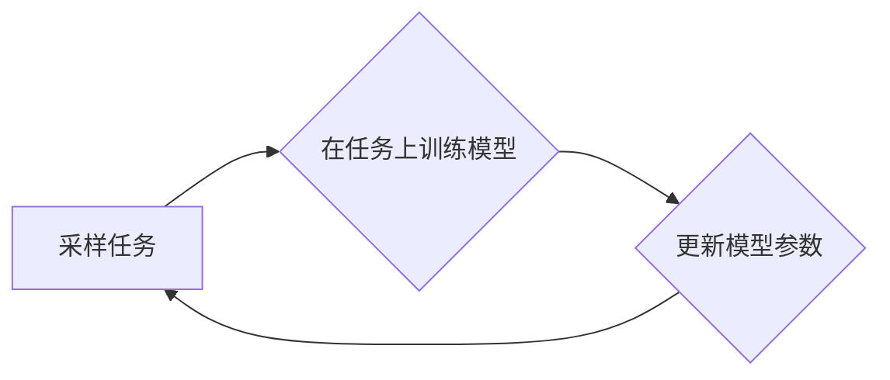

## 1. 背景介绍

### 1.1 元学习与少样本学习的兴起

近年来，深度学习在诸多领域取得了突破性进展，但其依赖于海量标注数据的特性也日益凸显。为了解决这一问题，元学习（Meta-Learning）和少样本学习（Few-shot Learning）应运而生。它们旨在使模型能够从少量数据中快速学习新概念，并将其泛化到未见过的数据中。

### 1.2 Reptile算法的提出

Reptile算法，全称为"Reptile: a Scalable Meta-Learning Algorithm"，由OpenAI于2018年提出。作为一种简单而有效的元学习算法，Reptile在少样本图像分类、强化学习等领域展现出强大的性能优势。

### 1.3 Reptile算法的优势

相较于其他元学习算法，Reptile算法具有以下优势：

* **简单易实现：** Reptile算法的原理和实现都非常简单，易于理解和应用。
* **计算效率高：** Reptile算法的训练过程不需要复杂的二阶导数计算，因此计算效率较高。
* **效果显著：** Reptile算法在多个少样本学习任务上都取得了优异的性能。


## 2. 核心概念与联系

### 2.1 元学习的基本概念

* **元学习的目标：** 学习如何学习，即训练一个能够快速适应新任务的模型。
* **元学习的过程：** 包括元训练和元测试两个阶段。在元训练阶段，模型在多个任务上进行训练，学习如何提取任务的共性特征；在元测试阶段，模型使用学到的元知识快速适应新任务。
* **任务（Task）：** 由数据集和目标函数组成，例如少样本图像分类任务。

### 2.2 Reptile算法的核心思想

Reptile算法的核心思想是通过在多个任务上进行训练，使模型的参数逐渐逼近一个能够快速适应新任务的“最佳点”。具体来说，Reptile算法采用以下步骤：

1. **采样任务：** 从任务分布中随机采样一个任务。
2. **在任务上训练模型：** 使用该任务的数据对模型进行训练，得到训练后的模型参数。
3. **更新模型参数：** 将模型参数向训练后的模型参数方向移动一小步。
4. **重复步骤1-3：** 多次重复上述步骤，直到模型收敛。

## 3. 核心算法原理具体操作步骤

### 3.1 Reptile算法的流程图



### 3.2 算法步骤详解

1. **初始化模型参数** $\theta$。
2. **循环迭代训练：**
    * 从任务分布 $p(T)$ 中随机采样一个任务 $T_i$。
    * 将模型参数 $\theta$ 复制一份，得到 $\phi$。
    * 使用任务 $T_i$ 的数据对模型参数 $\phi$ 进行 $k$ 步梯度下降更新，得到 $\phi_k$：
    $$
    \phi_{j+1} = \phi_j - \alpha \nabla_{\phi_j} \mathcal{L}_{T_i}(\phi_j)
    $$
    其中，$\alpha$ 是学习率，$\mathcal{L}_{T_i}$ 是任务 $T_i$ 的损失函数。
    * 更新模型参数 $\theta$：
    $$
    \theta \leftarrow \theta + \epsilon (\phi_k - \theta)
    $$
    其中，$\epsilon$ 是元学习率。
3. **重复步骤2**，直到模型收敛。


## 4. 数学模型和公式详细讲解举例说明

### 4.1 损失函数

Reptile算法可以使用任意的损失函数，例如交叉熵损失函数、均方误差损失函数等。

### 4.2 梯度下降更新公式

Reptile算法使用梯度下降法更新模型参数，其更新公式为：

$$
\phi_{j+1} = \phi_j - \alpha \nabla_{\phi_j} \mathcal{L}_{T_i}(\phi_j)
$$

其中：

* $\phi_j$ 是模型参数在第 $j$ 步迭代时的值。
* $\alpha$ 是学习率，控制每次参数更新的步长。
* $\nabla_{\phi_j} \mathcal{L}_{T_i}(\phi_j)$ 是损失函数 $\mathcal{L}_{T_i}$ 关于模型参数 $\phi_j$ 的梯度。

### 4.3 元学习率

元学习率 $\epsilon$ 控制模型参数向训练后的模型参数方向移动的步长。

### 4.4 举例说明

假设我们使用Reptile算法训练一个用于少样本图像分类的模型。

* 任务分布：包含多个少样本图像分类任务，每个任务包含5个类别，每个类别只有1张图片。
* 损失函数：交叉熵损失函数。
* 学习率：0.01。
* 元学习率：0.1。
* 迭代次数：1000。

在每次迭代中，Reptile算法会从任务分布中随机采样一个任务，并使用该任务的数据对模型进行训练。训练完成后，Reptile算法会将模型参数向训练后的模型参数方向移动一小步。

## 5. 项目实践：代码实例和详细解释说明

### 5.1 Python代码实现

```python
import torch
import torch.nn as nn
import torch.optim as optim

class Reptile(nn.Module):
    def __init__(self, model, lr, meta_lr):
        super(Reptile, self).__init__()
        self.model = model
        self.lr = lr
        self.meta_lr = meta_lr
        self.optimizer = optim.Adam(self.model.parameters(), lr=self.lr)

    def forward(self, x):
        return self.model(x)

    def inner_loop(self, task, k):
        # 复制模型参数
        phi = [p.clone() for p in self.model.parameters()]

        # 在任务上进行 k 步梯度下降更新
        for _ in range(k):
            # 计算损失函数
            loss = task(self.model)

            # 计算梯度
            self.optimizer.zero_grad()
            loss.backward()

            # 更新模型参数
            self.optimizer.step()

        # 返回训练后的模型参数
        return phi

    def outer_loop(self, tasks, num_iterations):
        for i in range(num_iterations):
            # 采样任务
            task = tasks.sample()

            # 在任务上训练模型
            phi = self.inner_loop(task, k=5)

            # 更新模型参数
            for p, phi_p in zip(self.model.parameters(), phi):
                p.data.copy_(p.data + self.meta_lr * (phi_p.data - p.data))
```

### 5.2 代码解释

* `Reptile` 类：表示Reptile算法的实现。
    * `__init__` 方法：初始化模型、学习率、元学习率和优化器。
    * `forward` 方法：定义模型的前向传播过程。
    * `inner_loop` 方法：在单个任务上进行训练，并返回训练后的模型参数。
    * `outer_loop` 方法：进行元训练，迭代更新模型参数。

### 5.3 使用示例

```python
# 定义模型
model = ...

# 定义任务分布
tasks = ...

# 创建 Reptile 对象
reptile = Reptile(model, lr=0.01, meta_lr=0.1)

# 进行元训练
reptile.outer_loop(tasks, num_iterations=1000)
```

## 6. 实际应用场景

Reptile算法可以应用于各种少样本学习任务，例如：

* **少样本图像分类：** 在只有少量标注数据的情况下，对图像进行分类。
* **少样本目标检测：** 在只有少量标注数据的情况下，检测图像中的目标。
* **强化学习：** 在只有少量交互数据的情况下，训练智能体完成特定任务。

## 7. 总结：未来发展趋势与挑战

### 7.1 未来发展趋势

* **更强大的元学习算法：** 研究更强大、更高效的元学习算法，以解决更复杂的少样本学习问题。
* **元学习与其他技术的结合：** 将元学习与其他技术（例如迁移学习、强化学习等）相结合，以提高模型的泛化能力。
* **元学习的应用拓展：** 将元学习应用于更多领域，例如自然语言处理、计算机视觉等。

### 7.2 面临的挑战

* **理论基础的完善：** 元学习的理论基础尚未完善，需要进一步研究其工作原理和泛化能力。
* **计算效率的提升：** 元学习算法的计算复杂度较高，需要进一步提高其计算效率。
* **数据的稀缺性：** 少样本学习任务的数据通常非常稀缺，需要开发更有效的数据增强和数据生成技术。

## 8. 附录：常见问题与解答

### 8.1 Reptile算法与MAML算法的区别是什么？

MAML（Model-Agnostic Meta-Learning）是另一种常用的元学习算法。与Reptile算法相比，MAML算法需要计算二阶导数，因此计算复杂度更高。但是，MAML算法在某些任务上可以取得比Reptile算法更好的性能。

### 8.2 Reptile算法的超参数如何选择？

Reptile算法的超参数包括学习率、元学习率、迭代次数等。这些超参数的选择需要根据具体的任务和数据集进行调整。

### 8.3 如何评估Reptile算法的性能？

可以使用标准的少样本学习评估指标来评估Reptile算法的性能，例如准确率、召回率、F1分数等。
