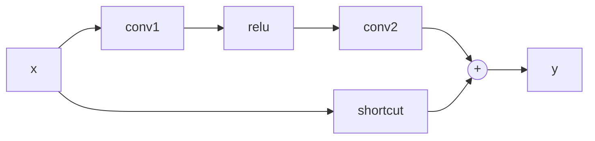
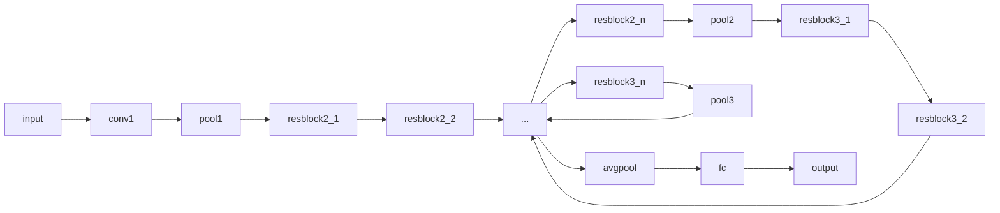

# ResNet原理与代码实例讲解

作者：禅与计算机程序设计艺术

## 1. 背景介绍

### 1.1 深度学习与图像识别

深度学习作为人工智能领域近年来最受关注的技术之一，已经在图像识别、语音识别、自然语言处理等领域取得了突破性进展。其中，图像识别是深度学习应用最为广泛的领域之一，其目标是从图像数据中自动识别出不同的物体、场景和行为。

### 1.2 深度神经网络的挑战：梯度消失/爆炸

随着深度学习的快速发展，人们开始尝试构建越来越深的网络模型，以期获得更好的性能。然而，随着网络深度的增加，训练过程中出现了一些问题，其中最突出的就是梯度消失/爆炸问题。

- **梯度消失**: 在深度神经网络中，梯度在反向传播过程中会逐渐衰减，当网络层数很深时，梯度可能会变得非常小，导致靠近输入层的参数无法得到有效更新。
- **梯度爆炸**: 与梯度消失相反，梯度爆炸指的是梯度在反向传播过程中呈指数级增长，导致参数更新过大，模型难以收敛。

### 1.3 ResNet的提出与意义

为了解决深度神经网络训练过程中的梯度消失/爆炸问题，何恺明等人于2015年提出了残差网络（Residual Network，ResNet）。ResNet通过引入残差连接（Residual Connection）的结构，成功地训练了数百层的深度神经网络，并在ImageNet图像识别比赛中取得了突破性的成果。

ResNet的提出具有重要的意义：

- **解决了深度神经网络训练过程中的梯度消失/爆炸问题**，使得训练更深的网络模型成为可能。
- **显著提升了深度神经网络的性能**，推动了图像识别等领域的发展。
- **促进了一系列后续研究**，例如DenseNet、ResNeXt等。

## 2. 核心概念与联系

### 2.1 残差块（Residual Block）

残差块是ResNet的核心模块，其结构如下图所示：



残差块包含两个主要部分：

- **主路径（Main Path）**: 包含两个卷积层、ReLU激活函数等常规网络层。
- **捷径连接（Shortcut Connection）**: 直接将输入 $x$ 加到主路径的输出上。

残差块的输出可以表示为：

$$y = F(x) + x$$

其中，$F(x)$ 表示主路径的输出。

### 2.2 残差连接的作用

残差连接的作用主要体现在以下两个方面：

- **缓解梯度消失/爆炸问题**: 由于捷径连接的存在，梯度在反向传播过程中可以绕过主路径，直接传递到浅层网络，从而缓解了梯度消失/爆炸问题。
- **增强信息流动**: 捷径连接可以将输入信息直接传递到输出，增强了网络中信息的流动，有利于网络学习更复杂的特征。

### 2.3 ResNet的网络结构

ResNet的网络结构通常由多个残差块堆叠而成，如下图所示：



ResNet的网络结构可以分为以下几个部分：

- **输入层**: 用于接收输入图像。
- **卷积层和池化层**: 用于提取图像特征。
- **残差块**: 用于学习更复杂的特征表示。
- **平均池化层**: 用于将特征图转换为固定长度的特征向量。
- **全连接层**: 用于输出分类结果。

## 3. 核心算法原理具体操作步骤

### 3.1 残差块的前向传播

残差块的前向传播过程可以分为以下几个步骤：

1. 将输入 $x$ 输入到主路径，得到输出 $F(x)$。
2. 将输入 $x$ 与主路径的输出 $F(x)$ 相加，得到残差块的输出 $y = F(x) + x$。

### 3.2 残差块的反向传播

残差块的反向传播过程可以分为以下几个步骤：

1. 计算损失函数对残差块输出 $y$ 的梯度 $\frac{\partial L}{\partial y}$。
2. 根据链式法则，计算损失函数对主路径输出 $F(x)$ 的梯度 $\frac{\partial L}{\partial F(x)} = \frac{\partial L}{\partial y} \cdot \frac{\partial y}{\partial F(x)} = \frac{\partial L}{\partial y}$。
3. 根据链式法则，计算损失函数对输入 $x$ 的梯度 $\frac{\partial L}{\partial x} = \frac{\partial L}{\partial y} \cdot \frac{\partial y}{\partial x} = \frac{\partial L}{\partial y} \cdot (1 + \frac{\partial F(x)}{\partial x})$。

从反向传播的公式可以看出，由于捷径连接的存在，梯度 $\frac{\partial L}{\partial x}$ 可以直接传递到输入 $x$，从而缓解了梯度消失问题。

## 4. 数学模型和公式详细讲解举例说明

### 4.1 残差连接的数学解释

残差连接可以看作是对恒等映射（Identity Mapping）的一种改进。

- **恒等映射**: $y = x$
- **残差连接**: $y = F(x) + x$

可以将残差连接看作是在恒等映射的基础上，学习一个残差函数 $F(x)$，用于拟合输入 $x$ 与输出 $y$ 之间的残差。

### 4.2 残差块的梯度推导

假设残差块的输入为 $x$，输出为 $y$，主路径的输出为 $F(x)$，损失函数为 $L$。

根据链式法则，可以得到损失函数对输入 $x$ 的梯度：

$$\frac{\partial L}{\partial x} = \frac{\partial L}{\partial y} \cdot \frac{\partial y}{\partial x}$$

其中，

$$\frac{\partial y}{\partial x} = \frac{\partial (F(x) + x)}{\partial x} = 1 + \frac{\partial F(x)}{\partial x}$$

因此，

$$\frac{\partial L}{\partial x} = \frac{\partial L}{\partial y} \cdot (1 + \frac{\partial F(x)}{\partial x})$$

从公式可以看出，由于捷径连接的存在，即使 $\frac{\partial F(x)}{\partial x}$ 很小，梯度 $\frac{\partial L}{\partial x}$ 也不会消失，从而缓解了梯度消失问题。

## 5. 项目实践：代码实例和详细解释说明

### 5.1 使用PyTorch实现ResNet

```python
import torch
import torch.nn as nn

class ResidualBlock(nn