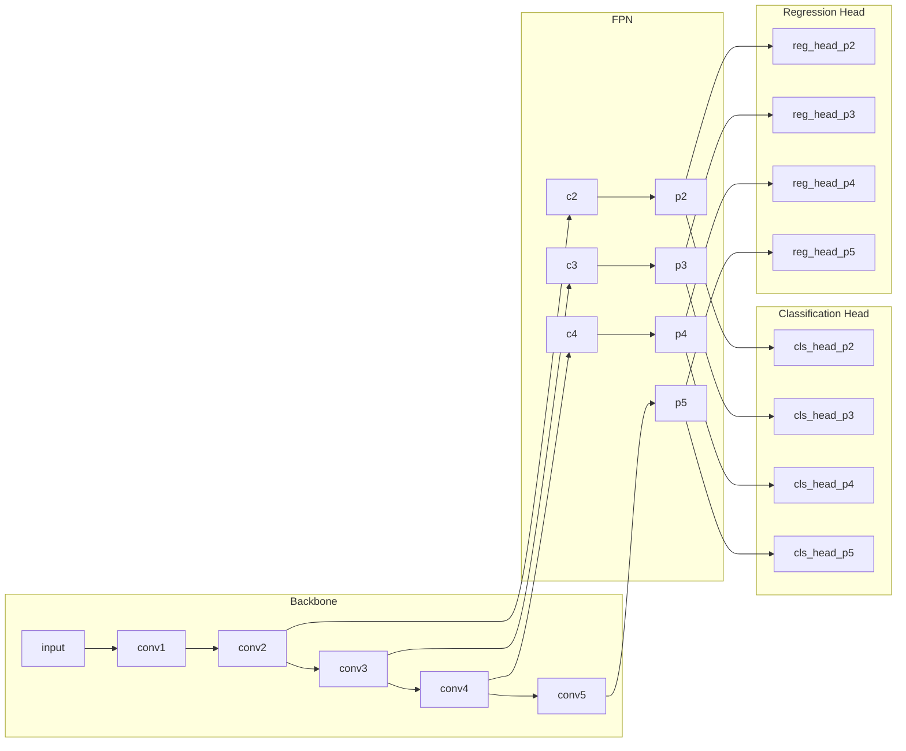

## 1. 背景介绍

### 1.1. 目标检测的挑战

目标检测是计算机视觉领域中的一个基本问题，其目标是在图像或视频中定位和识别不同类别的物体。近年来，随着深度学习的快速发展，目标检测技术取得了显著的进步。然而，目标检测仍然面临着一些挑战，例如：

* **类别不平衡**: 在许多实际应用场景中，不同类别的物体数量分布不均，例如交通场景中汽车的数量远多于行人。这种类别不平衡会导致模型偏向于识别数量较多的类别，而忽略数量较少的类别。
* **尺度变化**: 目标物体在图像中的尺度变化很大，例如远处的人和近处的人在图像中的大小差异很大。传统的目标检测算法难以有效地处理尺度变化。
* **计算复杂度**: 深度学习模型通常需要大量的计算资源和时间进行训练和推理，这限制了其在实时应用中的使用。

### 1.2. RetinaNet的提出

为了解决上述挑战，Facebook AI Research (FAIR) 于2017年提出了 RetinaNet，一种基于深度学习的单阶段目标检测算法。RetinaNet 的主要贡献在于：

* **Focal Loss**: 提出了一种新的损失函数 Focal Loss，用于解决类别不平衡问题。Focal Loss 通过降低易分类样本的权重，使得模型更加关注难分类样本，从而提高了整体的检测精度。
* **Feature Pyramid Network (FPN)**: 使用 FPN 来构建多尺度特征金字塔，从而有效地处理目标物体的尺度变化。

RetinaNet 在多个目标检测数据集上取得了 state-of-the-art 的结果，证明了其有效性和效率。

## 2. 核心概念与联系

### 2.1. 单阶段目标检测

传统的目标检测算法通常采用两阶段的方法，例如 R-CNN、Fast R-CNN 和 Faster R-CNN。这些算法首先会生成大量的候选区域，然后对每个候选区域进行分类和回归。与之不同的是，单阶段目标检测算法直接对输入图像进行预测，不需要生成候选区域，因此速度更快。

### 2.2. 特征金字塔网络 (FPN)

FPN 是一种用于构建多尺度特征金字塔的网络结构。它通过自上而下的路径和横向连接，将不同层次的特征图融合在一起，从而获得更丰富的语义信息和更精确定位信息。

### 2.3. Focal Loss

Focal Loss 是一种用于解决类别不平衡问题的损失函数。它通过降低易分类样本的权重，使得模型更加关注难分类样本。Focal Loss 的公式如下：

$$
FL(p_t) = -(1 - p_t)^\gamma \log(p_t)
$$

其中，$p_t$ 表示模型预测的类别概率，$\gamma$ 是一个控制难易样本权重比例的超参数。

### 2.4. RetinaNet架构

RetinaNet 的整体架构如下图所示：



* **Backbone**: 用于提取图像特征的卷积神经网络，例如 ResNet、ResNeXt 等。
* **FPN**: 用于构建多尺度特征金字塔。
* **Classification Head**: 用于预测每个锚点框所属类别的概率。
* **Regression Head**: 用于预测每个锚点框的偏移量。

## 3. 核心算法原理具体操作步骤

RetinaNet 的核心算法原理可以概括为以下几个步骤：

1. **特征提取**: 使用 Backbone 网络提取输入图像的特征图。
2. **特征金字塔构建**: 使用 FPN 构建多尺度特征金字塔。
3. **锚点框生成**: 在每个特征图上生成不同尺度和比例的锚点框。
4. **类别预测和边界框回归**: 使用 Classification Head 和 Regression Head 分别预测每个锚点框所属类别的概率和边界框的偏移量。
5. **非极大值抑制 (NMS)**: 使用 NMS 算法去除重叠的边界框。

## 4. 数学模型和公式详细讲解举例说明

### 4.1. Focal Loss

Focal Loss 的公式如下：

$$
FL(p_t) = -(1 - p_t)^\gamma \log(p_t)
$$

其中，$p_t$ 表示模型预测的类别概率，$\gamma$ 是一个控制难易样本权重比例的超参数。

* 当 $\gamma = 0$ 时，Focal Loss 等价于交叉熵损失函数。
* 当 $\gamma > 0$ 时，Focal Loss 会降低易分类样本的权重，使得模型更加关注难分类样本。

例如，假设模型预测一个样本属于类别 A 的概率为 0.9，属于类别 B 的概率为 0.1。如果 $\gamma = 2$，则 Focal Loss 对于类别 A 的损失为：

$$
FL(0.9) = -(1 - 0.9)^2 \log(0.9) = 0.0045
$$

对于类别 B 的损失为：

$$
FL(0.1) = -(1 - 0.1)^2 \log(0.1) = 0.81
$$

可以看出，Focal Loss 对于类别 B 的损失远大于类别 A，这使得模型更加关注类别 B。

### 4.2. 边界框回归

RetinaNet 使用 Smooth L1 Loss 来进行边界框回归。Smooth L1 Loss 的公式如下：

$$
L_{loc}(x, y) = \sum_{i=1}^N \sum_{t \in \{x, y, w, h\}} smooth_{L1}(x_i^t - y_i^t)
$$

其中，$x$ 表示预测的边界框，$y$ 表示真实的边界框，$N$ 表示边界框的数量，$smooth_{L1}$ 表示 Smooth L1 函数，其定义如下：

$$
smooth_{L1}(x) = \begin{cases}
0.5x^2 & \text{if } |x| < 1 \\
|x| - 0.5 & \text{otherwise}
\end{cases}
$$

Smooth L1 Loss 结合了 L1 Loss 和 L2 Loss 的优点，在 $|x|$ 较小时使用 L2 Loss，在 $|x|$ 较大时使用 L1 Loss，从而避免了梯度爆炸的问题。

## 5. 项目实践：代码实例和详细解释说明

```python
import torch
import torchvision

# 定义 RetinaNet 模型
class RetinaNet(torch.nn.Module):
    def __init__(self, num_classes):
        super(RetinaNet, self).__init__()
        # ...

    def forward(self, x):
        # ...

# 加载预训练的 ResNet50 模型作为 Backbone
backbone = torchvision.models.resnet50(pretrained=True)

# 创建 RetinaNet 模型
model = RetinaNet(num_classes=80)

# 定义优化器和损失函数
optimizer = torch.optim.SGD(model.parameters(), lr=0.01)
criterion = torchvision.ops.focal_loss.sigmoid_focal_loss

# 训练模型
for epoch in range(num_epochs):
    for images, targets in data_loader:
        # ...

        # 前向传播
        outputs = model(images)

        # 计算损失
        loss = criterion(outputs, targets)

        # 反向传播和参数更新
        optimizer.zero_grad()
        loss.backward()
        optimizer.step()

# 测试模型
model.eval()
with torch.no_grad():
    for images, targets in data_loader:
        # ...

        # 前向传播
        outputs = model(images)

        # 后处理
        # ...
```

### 代码解释

* `RetinaNet` 类定义了 RetinaNet 模型的结构。
* `torchvision.models.resnet50(pretrained=True)` 加载预训练的 ResNet50 模型作为 Backbone。
* `torchvision.ops.focal_loss.sigmoid_focal_loss` 定义了 Focal Loss 损失函数。
* `torch.optim.SGD` 定义了随机梯度下降优化器。
* 在训练循环中，首先进行前向传播，计算模型的输出。然后使用 Focal Loss 计算损失函数。最后进行反向传播和参数更新。
* 在测试循环中，首先将模型设置为评估模式。然后进行前向传播，计算模型的输出。最后进行后处理，例如非极大值抑制。

## 6. 实际应用场景

RetinaNet 在许多实际应用场景中都取得了很好的效果，例如：

* **自动驾驶**: RetinaNet 可以用于检测车辆、行人、交通信号灯等物体，为自动驾驶系统提供环境感知能力。
* **安防监控**: RetinaNet 可以用于检测可疑人员、物体和行为，提高安防系统的智能化水平。
* **医学影像分析**: RetinaNet 可以用于检测医学影像中的病变区域，辅助医生进行诊断。
* **工业检测**: RetinaNet 可以用于检测工业产品中的缺陷，提高产品质量。

## 7. 总结：未来发展趋势与挑战

RetinaNet 是一种高效且准确的单阶段目标检测算法，但它仍然面临着一些挑战，例如：

* **小目标检测**: RetinaNet 对于小目标的检测效果还有待提高。
* **遮挡目标检测**: 当目标物体被遮挡时，RetinaNet 的检测效果会下降。
* **实时性**: 虽然 RetinaNet 是一种单阶段目标检测算法，但它的实时性还有待提高。

未来，RetinaNet 的发展趋势包括：

* **改进 Focal Loss**: 研究更加鲁棒和高效的损失函数，进一步提高模型的检测精度。
* **改进 FPN**: 研究更加强大的特征金字塔网络结构，更好地处理目标物体的尺度变化。
* **轻量化**: 研究更加轻量化的 RetinaNet 模型，提高其在移动设备上的运行效率。

## 8. 附录：常见问题与解答

### 8.1. RetinaNet 与 Faster R-CNN 的区别是什么？

RetinaNet 是一种单阶段目标检测算法，而 Faster R-CNN 是一种两阶段目标检测算法。RetinaNet 直接对输入图像进行预测，不需要生成候选区域，因此速度更快。而 Faster R-CNN 首先会生成大量的候选区域，然后对每个候选区域进行分类和回归，因此精度更高。

### 8.2. Focal Loss 为什么能够解决类别不平衡问题？

Focal Loss 通过降低易分类样本的权重，使得模型更加关注难分类样本。这是因为易分类样本的损失值通常较小，对模型的训练贡献不大。而难分类样本的损失值通常较大，对模型的训练贡献更大。通过降低易分类样本的权重，Focal Loss 可以使得模型更加关注难分类样本，从而提高整体的检测精度。

### 8.3. 如何选择 RetinaNet 的超参数？

RetinaNet 的超参数包括 Backbone 网络、学习率、Focal Loss 的 $\gamma$ 参数等。选择合适的超参数可以提高模型的检测精度。通常情况下，可以使用网格搜索或随机搜索的方法来寻找最优的超参数。
