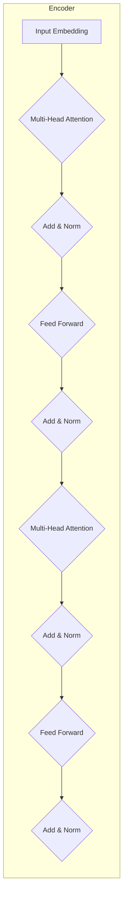

# RoBERTa在法律司法中的应用:智能法律的新契机

作者：禅与计算机程序设计艺术

## 1. 背景介绍

### 1.1 法律领域的信息化挑战

近年来，随着信息技术的快速发展和互联网的普及，法律行业也迎来了信息化浪潮。海量的法律条文、判决文书、学术论文等信息资源为法律工作者提供了前所未有的便利，但也带来了巨大的挑战：

* **信息过载**: 如何从海量的信息中快速准确地找到所需的信息？
* **知识提取**: 如何从非结构化的文本数据中提取关键的法律知识？
* **推理决策**: 如何利用已有的法律知识进行推理，并辅助法律工作者进行决策？

### 1.2 人工智能与法律的结合

人工智能技术的出现为解决这些挑战提供了新的思路。自然语言处理（NLP）作为人工智能的一个重要分支，近年来取得了突破性的进展，特别是基于深度学习的预训练语言模型，如BERT、RoBERTa等，在多项NLP任务中都取得了state-of-the-art的结果。这些技术可以应用于法律领域，实现智能化的信息检索、知识提取、法律咨询、案件分析等功能，从而提高法律工作效率，促进司法公正。

### 1.3 RoBERTa: 更强大的预训练语言模型

RoBERTa (**R**obustly **o**ptimized **BERT** **p**re-training **a**pproach) 是Google在2019年提出的一种改进版的BERT模型。相比于BERT，RoBERTa采用了更大的训练数据集、更长的训练时间以及更优化的训练策略，因此在多项NLP任务中都取得了更好的性能表现。

## 2. 核心概念与联系

### 2.1 预训练语言模型

预训练语言模型是指在大规模文本语料上进行预先训练的深度学习模型。这些模型可以学习到丰富的语言知识，并将其应用于下游的NLP任务中。常见的预训练语言模型包括BERT、RoBERTa、GPT等。

### 2.2  RoBERTa的特点

* **动态掩码**: RoBERTa在训练过程中采用动态掩码机制，每次输入模型的文本序列都会随机掩盖一部分词语，从而增强模型的泛化能力。
* **更大的训练数据集**: RoBERTa使用了比BERT更大的训练数据集，包括BookCorpus、Wikipedia、CC-NEWS等。
* **更长的训练时间**: RoBERTa的训练时间比BERT更长，从而可以学习到更深层次的语言特征。
* **移除NSP任务**: RoBERTa移除了BERT中的下一句预测（NSP）任务，因为研究表明该任务对模型性能提升不明显。

### 2.3 RoBERTa在法律领域的应用

RoBERTa强大的文本理解能力使其在法律领域具有广泛的应用前景，例如：

* **法律信息检索**:  可以根据用户输入的关键词或问题，快速准确地从海量的法律文本中检索出相关的信息。
* **法律文本分类**: 可以对法律文本进行自动分类，例如判决文书的案由分类、法律条文的类别分类等。
* **法律实体识别**: 可以识别法律文本中的实体信息，例如人名、地名、机构名、法条名等。
* **法律关系抽取**: 可以从法律文本中抽取法律关系，例如合同中的甲方、乙方、标的物、合同金额等。
* **法律问答**: 可以根据用户提出的法律问题，自动给出相应的法律解答。

## 3. 核心算法原理具体操作步骤

### 3.1 RoBERTa的模型结构

RoBERTa的模型结构与BERT基本相同，都是基于Transformer编码器-解码器结构。模型输入是文本序列的词向量表示，经过多层Transformer编码器处理后，得到每个词语的上下文表示。然后，根据不同的下游任务，可以使用不同的输出层来进行预测。

### 3.2 RoBERTa的训练过程

RoBERTa的训练过程主要包括以下步骤：

1. **数据预处理**: 对原始文本数据进行清洗、分词、构建词表等操作。
2. **模型初始化**: 使用预训练的词向量初始化模型参数。
3. **掩码语言模型训练**: 随机掩盖一部分输入词语，并使用模型预测被掩盖的词语。
4. **微调**: 在特定任务的数据集上对模型进行微调，以适应具体的应用场景。

### 3.3 RoBERTa的应用步骤

使用RoBERTa进行法律领域的应用，通常需要以下步骤：

1. **选择合适的预训练模型**:  根据具体的任务需求，选择合适的RoBERTa预训练模型。
2. **数据准备**:  准备标注好的法律文本数据集，用于模型的微调和评估。
3. **模型微调**: 在法律文本数据集上对RoBERTa模型进行微调，使其适应法律领域的语言特点。
4. **模型评估**: 使用测试集对微调后的模型进行评估，以衡量模型的性能。
5. **模型部署**: 将训练好的模型部署到实际应用环境中，为用户提供服务。

## 4. 数学模型和公式详细讲解举例说明

### 4.1 Transformer编码器

RoBERTa的核心模块是Transformer编码器，其结构如下图所示：



#### 4.1.1 多头注意力机制

多头注意力机制（Multi-Head Attention）是Transformer编码器的核心组件，它可以让模型关注输入序列中不同位置的信息，从而更好地理解文本语义。

其计算公式如下：

$$
\text{MultiHead}(\mathbf{Q}, \mathbf{K}, \mathbf{V}) = \text{Concat}(\text{head}_1, ..., \text{head}_h) \mathbf{W}^O
$$

其中：

* $\mathbf{Q}$、$\mathbf{K}$、$\mathbf{V}$ 分别表示查询矩阵、键矩阵和值矩阵。
* $h$ 表示注意力头的数量。
* $\text{head}_i = \text{Attention}(\mathbf{Q} \mathbf{W}_i^Q, \mathbf{K} \mathbf{W}_i^K, \mathbf{V} \mathbf{W}_i^V)$ 表示第 $i$ 个注意力头的输出。
* $\mathbf{W}_i^Q$、$\mathbf{W}_i^K$、$\mathbf{W}_i^V$ 分别表示第 $i$ 个注意力头的查询矩阵、键矩阵和值矩阵的权重矩阵。
* $\mathbf{W}^O$ 表示输出矩阵的权重矩阵。

#### 4.1.2 前馈神经网络

前馈神经网络（Feed Forward Network）是Transformer编码器中另一个重要组件，它用于对多头注意力机制的输出进行非线性变换，从而增强模型的表达能力。

其计算公式如下：

$$
\text{FFN}(\mathbf{x}) = \text{ReLU}(\mathbf{x} \mathbf{W}_1 + \mathbf{b}_1) \mathbf{W}_2 + \mathbf{b}_2
$$

其中：

* $\mathbf{x}$ 表示多头注意力机制的输出。
* $\mathbf{W}_1$、$\mathbf{b}_1$ 分别表示第一层全连接层的权重矩阵和偏置向量。
* $\text{ReLU}$ 表示ReLU激活函数。
* $\mathbf{W}_2$、$\mathbf{b}_2$ 分别表示第二层全连接层的权重矩阵和偏置向量。

### 4.2 掩码语言模型

掩码语言模型（Masked Language Model, MLM）是RoBERTa预训练阶段使用的主要任务之一，其目标是预测被掩盖的词语。

在训练过程中，RoBERTa会随机掩盖一部分输入词语，并使用模型预测被掩盖的词语。模型的损失函数是预测词语与真实词语之间的交叉熵损失函数。

### 4.3 微调

微调（Fine-tuning）是指在特定任务的数据集上对预训练模型进行进一步训练，以适应具体的应用场景。

在法律领域，通常需要使用标注好的法律文本数据集对RoBERTa模型进行微调。微调的过程通常包括以下步骤：

1. 将预训练的RoBERTa模型的参数加载到新的模型中。
2. 添加新的输出层，以适应具体的任务需求。
3. 使用标注好的法律文本数据集对模型进行训练。
4. 调整模型的超参数，例如学习率、批次大小等。

## 5. 项目实践：代码实例和详细解释说明

### 5.1 法律文本分类

本节将以法律文本分类为例，介绍如何使用RoBERTa进行法律领域的应用。

#### 5.1.1 数据集

本例使用的是CAIL2018数据集，该数据集包含了约10万篇中国裁判文书，每篇文书都被标注了案由类别。

#### 5.1.2 代码实现

```python
import torch
from transformers import RobertaTokenizer, RobertaForSequenceClassification

# 加载预训练的RoBERTa模型和词tokenizer
model_name = 'hfl/chinese-roberta-wwm-ext'
tokenizer = RobertaTokenizer.from_pretrained(model_name)
model = RobertaForSequenceClassification.from_pretrained(model_name, num_labels=10)

# 定义数据预处理函数
def preprocess_data(text):
    # 对文本进行分词、编码等操作
    inputs = tokenizer(text, padding=True, truncation=True, return_tensors='pt')
    return inputs

# 定义训练函数
def train(model, train_loader, optimizer, device):
    model.train()
    for batch in train_loader:
        # 将数据移动到设备上
        input_ids = batch['input_ids'].to(device)
        attention_mask = batch['attention_mask'].to(device)
        labels = batch['labels'].to(device)

        # 前向传播
        outputs = model(input_ids=input_ids, attention_mask=attention_mask, labels=labels)
        loss = outputs.loss

        # 反向传播和参数更新
        optimizer.zero_grad()
        loss.backward()
        optimizer.step()

# 定义评估函数
def evaluate(model, val_loader, device):
    model.eval()
    with torch.no_grad():
        for batch in val_loader:
            # 将数据移动到设备上
            input_ids = batch['input_ids'].to(device)
            attention_mask = batch['attention_mask'].to(device)
            labels = batch['labels'].to(device)

            # 前向传播
            outputs = model(input_ids=input_ids, attention_mask=attention_mask, labels=labels)
            loss = outputs.loss

            # 计算评估指标

    # 返回评估结果

# 加载数据集
train_dataset = ...
val_dataset = ...

# 创建数据加载器
train_loader = ...
val_loader = ...

# 定义优化器
optimizer = ...

# 定义设备
device = torch.device('cuda' if torch.cuda.is_available() else 'cpu')

# 模型训练和评估
for epoch in range(num_epochs):
    train(model, train_loader, optimizer, device)
    evaluate(model, val_loader, device)
```

#### 5.1.3 代码解释

* 首先，需要加载预训练的RoBERTa模型和词tokenizer。
* 然后，定义数据预处理函数，对原始文本数据进行分词、编码等操作。
* 接着，定义训练函数和评估函数，用于模型的训练和评估。
* 最后，加载数据集，创建数据加载器，定义优化器和设备，进行模型训练和评估。

## 6. 实际应用场景

### 6.1  智能法律咨询

传统的法律咨询方式效率低下，成本高昂。而基于RoBERTa的智能法律咨询系统可以为用户提供7*24小时的在线法律咨询服务。用户只需要输入相关法律问题，系统就可以自动给出相应的法律解答。

### 6.2  案件分析与预测

RoBERTa可以用于分析案件的案情、证据等信息，并预测案件的判决结果。这可以帮助法官和律师更好地了解案件情况，提高案件审理效率和判决准确率。

### 6.3  法律文本自动生成

RoBERTa可以用于生成法律文本，例如合同、协议、起诉状等。这可以大大减轻律师的工作负担，提高法律文本的生成效率和质量。

## 7. 工具和资源推荐

### 7.1 预训练模型

* **Hugging Face Transformers**: https://huggingface.co/transformers/
* **PaddleNLP**: https://github.com/PaddlePaddle/PaddleNLP

### 7.2 数据集

* **CAIL**: https://github.com/thunlp/CAIL
* **LexGLUE**: https://github.com/huggingface/datasets/tree/master/datasets/lex_glue

### 7.3 工具库

* **Transformers**: https://huggingface.co/transformers/
* **PaddleNLP**: https://github.com/PaddlePaddle/PaddleNLP
* **SpaCy**: https://spacy.io/

## 8. 总结：未来发展趋势与挑战

### 8.1 未来发展趋势

* **多模态法律信息处理**: 将文本、图像、音频、视频等多种模态的信息融合在一起，构建更全面的法律信息处理系统。
* **跨语言法律信息处理**:  打破语言壁垒，实现不同国家和地区法律信息的互联互通。
* **可解释性与可信赖性**: 提高人工智能法律系统的可解释性和可信赖性，使其更易于被法律工作者和公众所接受。

### 8.2  挑战

* **数据标注**: 法律文本的标注需要专业的法律知识，成本高昂。
* **模型泛化能力**:  法律领域存在大量的专业术语和复杂逻辑，模型的泛化能力有待进一步提升。
* **伦理和法律问题**: 人工智能法律系统的应用可能会引发伦理和法律问题，需要制定相应的规范和标准。

## 9. 附录：常见问题与解答

### 9.1 RoBERTa和BERT的区别是什么？

RoBERTa可以看作是BERT的改进版本，其主要区别在于：

* RoBERTa采用了更大的训练数据集、更长的训练时间以及更优化的训练策略。
* RoBERTa移除了BERT中的下一句预测（NSP）任务。
* RoBERTa在训练过程中采用动态掩码机制。

### 9.2 如何选择合适的RoBERTa预训练模型？

选择合适的RoBERTa预训练模型需要考虑以下因素：

* 任务类型：不同的任务类型需要选择不同的预训练模型。
* 数据集大小：数据集大小会影响模型的训练效果，数据集越大，可以选择更大的预训练模型。
* 计算资源：更大的预训练模型需要更多的计算资源。

### 9.3 如何提高RoBERTa在法律领域的应用效果？

* 使用更大的法律文本数据集对模型进行微调。
* 对法律文本进行预处理，例如实体识别、关系抽取等。
* 结合领域知识，优化模型结构和参数。