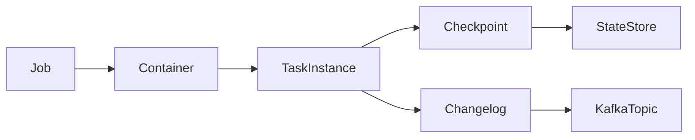
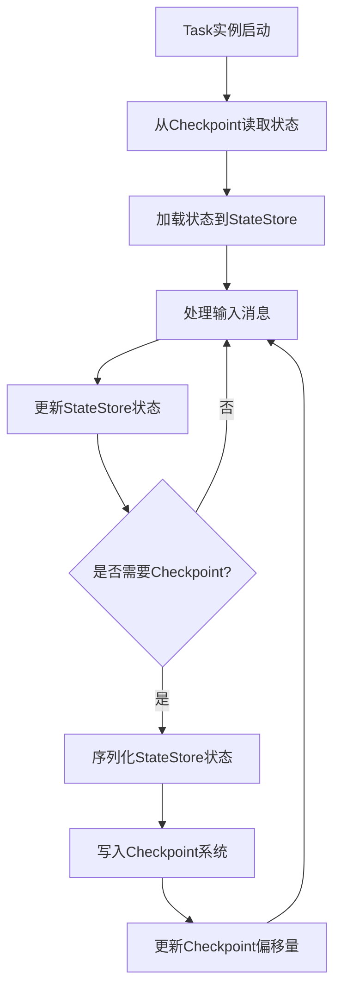

# Samza Checkpoint原理与代码实例讲解

## 1.背景介绍

### 1.1 什么是Samza?

Apache Samza是一个分布式流处理系统,最初由LinkedIn开发。它利用Apache Kafka作为消息传递系统,用于处理来自不同数据源的实时数据流。Samza的主要目标是为无限数据流提供高度可伸缩、容错、持久化的处理。

### 1.2 Samza的应用场景

Samza非常适合处理以下类型的应用场景:

- 实时数据处理和分析,如网络日志分析、用户行为分析等
- 实时数据转换,如实时ETL、规范化和清理数据等
- 实时监控和警报系统
- 连续查询和流式关联
- 异常数据检测

### 1.3 Checkpoint机制的重要性

在分布式流处理系统中,Checkpoint机制是确保系统高可用和容错的关键。由于流处理任务通常是无限的,系统必须能够从故障中恢复并继续处理,而不会丢失任何数据。Samza的Checkpoint机制通过持久化流处理任务的状态,使得系统可以从上次检查点恢复,从而提高了系统的可靠性和容错能力。

## 2.核心概念与联系

### 2.1 Task实例

在Samza中,每个流处理任务由一个或多个Task实例组成。Task实例是Samza的基本执行单元,负责从输入流中消费消息、处理消息并将结果输出到输出流。

### 2.2 容器(Container)

Samza使用容器(Container)作为执行环境。每个容器可以运行一个或多个Task实例。容器负责管理Task实例的生命周期、资源分配和故障恢复等。

### 2.3 Job

Job是Samza中最高层次的抽象概念,表示一个完整的流处理应用程序。一个Job由多个Task实例组成,这些Task实例分布在不同的容器中执行。

### 2.4 Checkpoint

Checkpoint是Samza用于持久化Task实例状态的机制。每个Task实例都会定期将其状态写入到Checkpoint系统中,以便在发生故障时可以从最近的Checkpoint恢复。Samza支持多种Checkpoint系统,包括Kafka、HDFS和RocksDB等。

### 2.5 Changelog

Changelog是Samza用于存储输出数据的机制。每个Task实例都会将其输出数据写入到Changelog中,以便在发生故障时可以从Changelog中恢复已处理的数据。Changelog通常使用Kafka主题作为存储介质。

### 2.6 核心概念关系图

下面是Samza中核心概念之间的关系图:



## 3.核心算法原理具体操作步骤

Samza的Checkpoint机制主要包括以下几个步骤:

### 3.1 初始化Checkpoint系统

在启动Task实例之前,Samza会先初始化配置的Checkpoint系统。如果使用Kafka作为Checkpoint系统,Samza会创建一个专用的Kafka主题来存储Checkpoint数据。

### 3.2 Task实例启动

当Task实例启动时,它会从Checkpoint系统中读取最新的状态,并将状态加载到内存中的状态存储(StateStore)中。如果是新启动的Task实例,则从初始状态开始。

### 3.3 处理输入消息

Task实例从输入流(例如Kafka主题)中消费消息,并根据业务逻辑对消息进行处理。处理过程中会更新Task实例的内存状态。

### 3.4 定期Checkpoint

Task实例会定期(通常是几秒钟一次)将内存中的状态持久化到Checkpoint系统中。这个过程称为Checkpoint。

Checkpoint的具体步骤如下:

1. 将内存中的状态序列化为字节数组
2. 将字节数组写入到Checkpoint系统中,例如Kafka主题
3. 等待Checkpoint系统确认写入成功
4. 更新内存中的Checkpoint偏移量(offset)

### 3.5 故障恢复

当Task实例发生故障(如容器崩溃)时,Samza会自动重启该Task实例。重启时,Task实例会从Checkpoint系统中读取最新的Checkpoint数据,并从最新的Checkpoint偏移量开始重新处理输入流。

### 3.6 算法流程图

下面是Samza Checkpoint算法的流程图:



## 4.数学模型和公式详细讲解举例说明

在Samza的Checkpoint机制中,并没有直接涉及复杂的数学模型和公式。不过,我们可以从可靠性和一致性的角度来分析Checkpoint机制。

### 4.1 可靠性分析

假设Task实例在时间$t_0$启动,并在时间$t_1$发生故障。我们定义以下变量:

- $R$: 输入流的消息数量
- $P$: 成功处理的消息数量
- $C$: Checkpoint的次数
- $L$: 最后一次Checkpoint到故障之间处理的消息数量

则可靠性$Reliability$可以表示为:

$$Reliability = \frac{P}{R} = \frac{C + L}{R}$$

由于$C$和$L$都是有限的正整数,因此$Reliability$的取值范围是$(0, 1]$。当$Reliability=1$时,表示没有任何消息丢失。

我们可以看到,Checkpoint的频率越高,即$C$越大,$Reliability$就越高。但是,频繁的Checkpoint也会带来更高的系统开销。因此,需要在可靠性和性能之间进行权衡。

### 4.2 一致性分析

在分布式系统中,一致性是一个重要的指标。对于Samza的Checkpoint机制,我们需要确保在任何时候,所有Task实例看到的状态都是一致的。

我们定义以下变量:

- $N$: Task实例的数量
- $S_i(t)$: 第$i$个Task实例在时间$t$的状态
- $C_i(t)$: 第$i$个Task实例在时间$t$的Checkpoint偏移量

则一致性$Consistency$可以表示为:

$$Consistency = \begin{cases}
1, & \text{if } \forall i, j \in [1, N], S_i(t) = S_j(t) \text{ and } C_i(t) = C_j(t)\\
0, & \text{otherwise}
\end{cases}$$

为了保证一致性,Samza采用了以下策略:

1. 使用全局有序的Kafka主题作为输入流,确保所有Task实例消费的消息顺序相同
2. 在Checkpoint之前,等待所有上游Task实例的Checkpoint完成
3. 使用全局有序的Kafka主题作为Changelog,确保所有Task实例的输出顺序相同

通过这些策略,Samza可以确保在任何时候,所有Task实例看到的状态都是一致的。

## 4.项目实践:代码实例和详细解释说明

在这一节,我们将通过一个简单的示例项目来演示如何在Samza中使用Checkpoint机制。我们将构建一个简单的WordCount应用程序,它从Kafka主题中读取文本消息,统计每个单词出现的次数,并将结果写入到另一个Kafka主题中。

### 4.1 项目设置

首先,我们需要设置Samza和Kafka的开发环境。您可以按照Apache Samza官方文档中的说明进行安装和配置。

### 4.2 创建Samza项目

接下来,我们使用Samza提供的Maven原型创建一个新的Samza项目:

```bash
mvn archetype:generate \
    -DarchetypeGroupId=org.apache.samza \
    -DarchetypeArtifactId=samza-quickstart-archetype \
    -DarchetypeVersion=1.8.0 \
    -DgroupId=com.example \
    -DartifactId=wordcount \
    -Dversion=1.0-SNAPSHOT \
    -DinteractiveMode=false
```

这将创建一个名为`wordcount`的新项目。

### 4.3 实现WordCount Task

在`wordcount/src/main/java/com/example/wordcount/task`目录下,创建一个名为`WordCountTask.java`的新文件,并添加以下代码:

```java
package com.example.wordcount.task;

import org.apache.samza.config.Config;
import org.apache.samza.system.IncomingMessageEnvelope;
import org.apache.samza.system.OutgoingMessageEnvelope;
import org.apache.samza.system.SystemStream;
import org.apache.samza.task.InitableTask;
import org.apache.samza.task.MessageTask;
import org.apache.samza.task.StreamTask;
import org.apache.samza.task.TaskCoordinator;

import java.util.HashMap;
import java.util.Map;

public class WordCountTask implements StreamTask, InitableTask, WindowableTask<Map<String, Integer>> {

    private Map<String, Integer> wordCounts = new HashMap<>();
    private TaskCoordinator coordinator;

    @Override
    public void init(Config config, TaskCoordinator coordinator) {
        this.coordinator = coordinator;
    }

    @Override
    public void process(IncomingMessageEnvelope envelope, MessageCollector collector, TaskCoordinator coordinator) {
        String message = (String) envelope.getMessage();
        String[] words = message.split("\\s+");

        for (String word : words) {
            wordCounts.put(word, wordCounts.getOrDefault(word, 0) + 1);
        }
    }

    @Override
    public Map<String, Integer> getState() {
        return wordCounts;
    }

    @Override
    public void restoreState(Map<String, Integer> state) {
        wordCounts = state;
    }

    @Override
    public void window(MessageCollector collector, TaskCoordinator coordinator) throws InterruptedException {
        for (Map.Entry<String, Integer> entry : wordCounts.entrySet()) {
            String word = entry.getKey();
            Integer count = entry.getValue();
            OutgoingMessageEnvelope envelope = new OutgoingMessageEnvelope(new SystemStream("kafka", "wordcount-output"), word + ":" + count);
            collector.send(envelope);
        }
        wordCounts.clear();
        coordinator.checkpoint(getState());
    }
}
```

这个`WordCountTask`实现了`StreamTask`、`InitableTask`和`WindowableTask`接口。它将从输入流中读取文本消息,统计每个单词出现的次数,并在每个窗口结束时将结果写入到输出流中。

注意,我们在`window`方法中调用了`coordinator.checkpoint(getState())`来触发Checkpoint操作。

### 4.4 配置Samza作业

在`wordcount/src/main/java/com/example/wordcount/task`目录下,创建一个名为`WordCountTaskFactory.java`的新文件,并添加以下代码:

```java
package com.example.wordcount.task;

import org.apache.samza.config.Config;
import org.apache.samza.task.StreamTaskFactory;

public class WordCountTaskFactory implements StreamTaskFactory {
    @Override
    public StreamTask createInstance() {
        return new WordCountTask();
    }

    @Override
    public void init(Config config) {
    }
}
```

这个`WordCountTaskFactory`类用于创建`WordCountTask`实例。

接下来,在`wordcount/src/main/java/com/example/wordcount`目录下,创建一个名为`WordCountApp.java`的新文件,并添加以下代码:

```java
package com.example.wordcount;

import com.example.wordcount.task.WordCountTaskFactory;
import org.apache.samza.application.StreamApplication;
import org.apache.samza.application.descriptors.StreamApplicationDescriptor;
import org.apache.samza.config.Config;
import org.apache.samza.operators.KV;
import org.apache.samza.operators.StreamGraphDefinition;
import org.apache.samza.serializers.KVSerde;
import org.apache.samza.serializers.StringSerde;
import org.apache.samza.system.kafka.descriptors.KafkaInputDescriptor;
import org.apache.samza.system.kafka.descriptors.KafkaOutputDescriptor;
import org.apache.samza.system.kafka.descriptors.KafkaSystemDescriptor;

public class WordCountApp implements StreamApplication {
    @Override
    public void describe(StreamApplicationDescriptor appDescriptor) {
        KafkaSystemDescriptor kafkaSystemDescriptor = new KafkaSystemDescriptor("kafka");
        KafkaInputDescriptor<KV<String, String>> inputDescriptor =
                kafkaSystemDescriptor.getInputDescriptor("wordcount-input", KVSerde.of(new StringSerde(), new StringSerde()));
        KafkaOutputDescriptor<String, String> outputDescriptor =
                kafkaSystemDescriptor.getOutputDescriptor("wordcount-output", new StringSerde(), new StringSerde());

        StreamGraphDefinition streamGraphDefinition = appDescriptor
                .getStreamGraphDefinition()
                .withTaskFactory(new WordCountTaskFactory());

        streamGraphDefinition
                .getInputStream(inputDescriptor)
                .map(KV::getValue)
                .window(new WordCountWindowableTask(), "word-count-task",