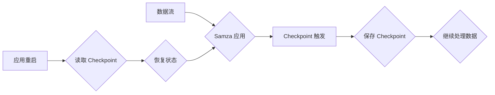

## Samza Checkpoint 机制：确保数据处理的可靠性

作者：禅与计算机程序设计艺术

## 1. 背景介绍

### 1.1 流处理与容错

在当今大数据时代，流处理已经成为处理海量实时数据的关键技术之一。与传统的批处理不同，流处理需要持续不断地接收、处理和输出数据，对系统的可靠性和容错性提出了更高的要求。试想一下，如果一个流处理应用程序在运行过程中突然崩溃，而没有及时保存处理进度，那么所有已经处理过的数据都将丢失，这对于许多关键业务来说是不可接受的。

### 1.2 Samza 简介

Apache Samza 是一个开源的分布式流处理框架，由 LinkedIn 开发并开源，用于处理高速异步消息流。它构建在 Apache Kafka 和 Apache Yarn 之上，具有高吞吐量、低延迟和良好的容错性等特点。

### 1.3 Checkpoint 机制的重要性

为了解决流处理中的容错问题，Samza 引入了 Checkpoint 机制。Checkpoint 机制可以定期地将应用程序的状态信息持久化到外部存储中，以便在应用程序发生故障时能够从上次保存的状态恢复，从而避免数据丢失和重复处理。

## 2. 核心概念与联系

### 2.1 Checkpoint

Checkpoint 是指应用程序在某个特定时间点的状态快照，包括已处理数据的偏移量、应用程序的内部状态等信息。

### 2.2 Checkpoint 存储

Checkpoint 信息需要被持久化到外部存储中，常见的 Checkpoint 存储系统包括：

* 本地文件系统
* 分布式文件系统（如 HDFS）
* 数据库

### 2.3 Checkpoint 触发机制

Samza 支持多种 Checkpoint 触发机制，包括：

* **基于时间的触发**: 每隔一段时间自动触发一次 Checkpoint。
* **基于消息数量的触发**: 每处理一定数量的消息后触发一次 Checkpoint。
* **手动触发**: 用户可以根据需要手动触发 Checkpoint。

### 2.4 状态恢复

当应用程序发生故障重启后，Samza 会从 Checkpoint 存储中读取最新的 Checkpoint 信息，并将应用程序的状态恢复到 Checkpoint 时刻，然后从上次处理的位置继续处理数据。

## 3. 核心算法原理具体操作步骤

### 3.1 Checkpoint 过程

1. 当 Checkpoint 被触发时，Samza 会暂停所有数据处理任务。
2. 每个任务将自己当前的状态信息写入到 Checkpoint 存储中，包括已处理数据的偏移量、应用程序的内部状态等。
3. 所有任务完成状态写入后，Samza 会将此次 Checkpoint 的元数据信息写入到 Checkpoint 存储中，标志着此次 Checkpoint 完成。
4. Samza 恢复所有数据处理任务，继续处理数据。

### 3.2 状态恢复过程

1. 当应用程序启动时，Samza 会从 Checkpoint 存储中读取最新的 Checkpoint 元数据信息。
2. 根据 Checkpoint 元数据信息，Samza 会找到每个任务对应的 Checkpoint 数据。
3. 每个任务从 Checkpoint 数据中读取自己的状态信息，并将应用程序的状态恢复到 Checkpoint 时刻。
4. 所有任务完成状态恢复后，Samza 会从上次处理的位置继续处理数据。

## 4. 数学模型和公式详细讲解举例说明

Samza 的 Checkpoint 机制并没有复杂的数学模型和公式，其核心思想是利用定期保存状态信息的方式来实现容错。

### 4.1 示例

假设一个 Samza 应用程序需要对一个 Kafka Topic 中的数据进行实时统计，并每隔 1 分钟将统计结果输出到另一个 Kafka Topic 中。

```
Kafka Topic 1 (输入) -> Samza 应用程序 -> Kafka Topic 2 (输出)
```

为了保证应用程序的可靠性，我们可以设置每处理 10000 条消息就进行一次 Checkpoint。

假设应用程序在处理了 8000 条消息后崩溃，那么在应用程序重启后，它会从 Checkpoint 存储中读取最新的 Checkpoint 信息，并将应用程序的状态恢复到处理了 7000 条消息的时刻，然后从第 7001 条消息继续处理。

## 5. 项目实践：代码实例和详细解释说明

### 5.1 配置 Checkpoint

在 Samza 中，可以通过配置文件来配置 Checkpoint 相关的参数，例如 Checkpoint 存储路径、触发机制、超时时间等。

```yaml
task.checkpoint.system: "org.apache.samza.checkpoint.kafka.KafkaCheckpointManagerFactory"
task.checkpoint.replication.factor: 3
task.checkpoint.change.log.kafka.producer.bootstrap.servers: "localhost:9092"
task.checkpoint.change.log.kafka.topic: "samza-checkpoint-topic"
task.checkpoint.duration: 60000
task.checkpoint.offset: 10000
```

### 5.2 实现 Checkpointable 接口

如果应用程序需要保存自定义的状态信息，需要实现 `Checkpointable` 接口，并实现 `getCheckpointData()` 和 `restoreFromCheckpoint()` 方法。

```java
public class MyTask implements StreamTask, Checkpointable {

  private int counter;

  @Override
  public void process(IncomingMessageEnvelope envelope, MessageCollector collector, TaskCoordinator coordinator) {
    // 处理消息
    counter++;
  }

  @Override
  public Map<String, Object> getCheckpointData() {
    Map<String, Object> checkpointData = new HashMap<>();
    checkpointData.put("counter", counter);
    return checkpointData;
  }

  @Override
  public void restoreFromCheckpoint(Map<String, Object> checkpointData) {
    this.counter = (int) checkpointData.get("counter");
  }
}
```

## 6. 实际应用场景

Samza 的 Checkpoint 机制可以应用于各种流处理场景，例如：

* **实时数据统计**: 定期保存统计结果，避免数据丢失。
* **实时监控**: 保存监控指标，以便在故障发生时进行告警。
* **实时推荐**: 保存用户行为数据，以便在用户下次访问时提供个性化推荐。

## 7. 总结：未来发展趋势与挑战

### 7.1 未来发展趋势

* **更细粒度的 Checkpoint**: 目前 Samza 的 Checkpoint 是基于任务级别的，未来可以考虑实现更细粒度的 Checkpoint，例如基于操作级别的 Checkpoint。
* **与状态管理系统集成**: Samza 可以与 Flink、Spark 等状态管理系统集成，提供更强大的状态管理功能。

### 7.2 面临的挑战

* **Checkpoint 性能**: Checkpoint 操作会对应用程序的性能造成一定的影响，需要不断优化 Checkpoint 的效率。
* **Checkpoint 一致性**: 在分布式系统中，保证 Checkpoint 的一致性是一个挑战。

## 8. 附录：常见问题与解答

### 8.1 Checkpoint 失败怎么办？

如果 Checkpoint 过程中出现错误，Samza 会尝试进行重试。如果重试多次后仍然失败，应用程序将会停止运行。

### 8.2 如何监控 Checkpoint 状态？

Samza 提供了相应的监控指标，可以用来监控 Checkpoint 的状态，例如 Checkpoint 时长、Checkpoint 成功率等。

### 8.3 如何选择合适的 Checkpoint 存储？

选择合适的 Checkpoint 存储需要考虑以下因素：

* **数据可靠性**: Checkpoint 存储需要保证数据的可靠性，避免数据丢失。
* **读写性能**: Checkpoint 存储的读写性能会影响应用程序的性能。
* **成本**: 不同的 Checkpoint 存储成本不同。


##  Mermaid 流程图



## 总结

本文详细介绍了 Apache Samza 的 Checkpoint 机制，包括其背景、核心概念、算法原理、代码实例、应用场景以及未来发展趋势等。Checkpoint 机制是保证流处理应用程序可靠性的重要手段，希望本文能够帮助读者更好地理解和应用 Samza。
