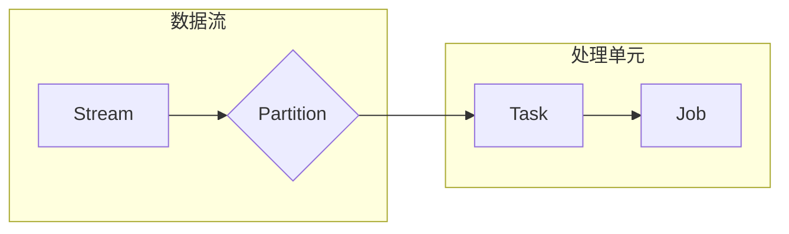

# Samza原理与代码实例讲解

作者：禅与计算机程序设计艺术

## 1. 背景介绍

### 1.1 什么是流处理

在当今大数据时代，海量数据实时产生并需要被快速处理。传统的批处理系统难以满足实时性要求，因此流处理应运而生。流处理是指对连续不断的数据流进行实时处理，并在数据到达时就对其进行分析和响应。

### 1.2 流处理框架的演进

早期的流处理框架主要基于消息队列，例如 Apache Kafka。这些框架能够处理高吞吐量的消息流，但缺乏对状态管理和复杂事件处理的支持。为了解决这些问题，新一代的流处理框架，例如 Apache Flink 和 Apache Samza，应运而生。这些框架提供了更强大的功能，例如：

* **状态管理:**  能够维护和更新处理过程中的状态信息，例如计数、求和等。
* **窗口操作:**  能够对一段时间内的数据进行聚合操作，例如计算过去一分钟的平均值。
* **Exactly-once 语义:**  保证每条消息只会被处理一次，即使发生故障也不会丢失数据。

### 1.3 Samza 简介

Apache Samza 是一个开源的分布式流处理框架，由 LinkedIn 开发并开源。它构建在 Apache Kafka 和 Apache Yarn 之上，具有以下特点：

* **高吞吐量和低延迟:**  能够处理每秒数百万条消息，并提供毫秒级的延迟。
* **容错性:**  支持故障自动恢复，保证数据不丢失。
* **可扩展性:**  可以轻松地扩展到数百个节点。
* **易于使用:**  提供了简单的 API 和丰富的文档。

## 2. 核心概念与联系

### 2.1 流(Stream)

在 Samza 中，流是指无限、连续的数据记录序列。每条记录可以是任何数据格式，例如 JSON、Avro 或 Protobuf。

### 2.2 分区(Partition)

为了实现并行处理，流被分成多个分区。每个分区都是一个有序的记录序列，并且只能由一个消费者实例处理。

### 2.3 任务(Task)

任务是 Samza 中最小的处理单元，负责处理一个或多个流分区。每个任务实例都运行在一个独立的容器中。

### 2.4 作业(Job)

作业是由多个任务组成的逻辑单元，用于完成特定的数据处理任务。

### 2.5 关系图



## 3. 核心算法原理具体操作步骤

### 3.1 数据流处理流程

Samza 的数据流处理流程如下：

1. **数据生产者** 将数据写入 Kafka 主题。
2. Samza **作业** 从 Kafka 主题读取数据。
3. 作业中的 **任务** 并行处理数据流分区。
4. 任务将处理结果写入输出流或外部存储系统。

### 3.2 状态管理

Samza 使用嵌入式键值存储来管理状态。每个任务实例都维护着自己的本地状态，并通过定期检查点来保证状态的一致性。

### 3.3 窗口操作

Samza 支持多种窗口操作，例如：

* **滚动窗口:**  将数据流分成固定大小的窗口。
* **滑动窗口:**  在滚动窗口的基础上，允许窗口之间存在重叠。
* **会话窗口:**  根据数据流中的活动间隔来划分窗口。

### 3.4 Exactly-once 语义

Samza 通过以下机制来保证 Exactly-once 语义：

* **偏移量管理:**  Samza 会跟踪每个任务实例处理的 Kafka 消息偏移量。
* **事务性状态更新:**  Samza 使用事务来保证状态更新的原子性。

## 4. 数学模型和公式详细讲解举例说明

Samza 中没有涉及复杂的数学模型和公式。

## 5. 项目实践：代码实例和详细解释说明

### 5.1 创建 Maven 项目

```bash
mvn archetype:generate \
    -DarchetypeGroupId=org.apache.samza \
    -DarchetypeArtifactId=samza-archetype-java \
    -DarchetypeVersion=0.14.1 \
    -DgroupId=com.example \
    -DartifactId=samza-example \
    -Dversion=1.0-SNAPSHOT
```

### 5.2 编写 Samza 任务

```java
import org.apache.samza.config.Config;
import org.apache.samza.system.IncomingMessageEnvelope;
import org.apache.samza.system.OutgoingMessageEnvelope;
import org.apache.samza.task.MessageCollector;
import org.apache.samza.task.StreamTask;
import org.apache.samza.task.TaskContext;
import org.apache.samza.task.TaskCoordinator;

public class WordCountTask implements StreamTask {

  @Override
  public void process(IncomingMessageEnvelope envelope, MessageCollector collector, TaskCoordinator coordinator) {
    String message = (String) envelope.getMessage();
    String[] words = message.split(" ");
    for (String word : words) {
      collector.send(new OutgoingMessageEnvelope(
          new SystemStream("kafka", "word-count-output"), word, word, 1));
    }
  }

  @Override
  public void init(Config config, TaskContext context) {
    // 初始化逻辑
  }
}
```

### 5.3 配置 Samza 作业

```yaml
# Kafka 配置
systems.kafka.samza.factory=org.apache.samza.system.kafka.KafkaSystemFactory
systems.kafka.producer.bootstrap.servers=localhost:9092
systems.kafka.consumer.zookeeper.connect=localhost:2181

# 任务配置
task.class=com.example.WordCountTask
task.inputs=kafka.word-count-input
task.system=kafka

# 作业配置
job.name=word-count
job.default.system=kafka
```

### 5.4 运行 Samza 作业

```bash
./bin/run-app.sh --config-factory=org.apache.samza.config.factories.PropertiesConfigFactory --config-path=./config/word-count.properties
```

## 6. 实际应用场景

Samza 适用于各种流处理场景，例如：

* **实时数据分析:**  例如网站流量分析、用户行为分析等。
* **事件驱动架构:**  例如订单处理、支付系统等。
* **机器学习:**  例如模型训练、实时预测等。

## 7. 工具和资源推荐

* **Apache Samza 官网:**  https://samza.apache.org/
* **Apache Kafka 官网:**  https://kafka.apache.org/

## 8. 总结：未来发展趋势与挑战

### 8.1 未来发展趋势

* **更强大的状态管理:**  支持更大规模的状态存储和更复杂的查询操作。
* **更灵活的部署方式:**  支持在 Kubernetes 等容器编排平台上部署。
* **与其他大数据生态系统的集成:**  例如 Apache Flink、Apache Beam 等。

### 8.2 面临的挑战

* **性能优化:**  如何进一步提高流处理的吞吐量和降低延迟。
* **状态一致性:**  如何保证在分布式环境下状态的一致性。
* **易用性:**  如何降低流处理的门槛，让更多开发者能够使用。

## 9. 附录：常见问题与解答

### 9.1 Samza 和 Flink 的区别是什么？

Samza 和 Flink 都是流行的流处理框架，但它们之间存在一些区别：

* **编程模型:**  Flink 提供了更高级的编程模型，例如 DataStream API 和 DataSet API，而 Samza 的编程模型相对简单。
* **状态管理:**  Flink 内置了多种状态后端，例如 RocksDB 和内存，而 Samza 默认使用嵌入式键值存储。
* **窗口操作:**  Flink 支持更丰富的窗口操作，例如会话窗口和全局窗口，而 Samza 的窗口操作相对有限。

### 9.2 Samza 如何保证 Exactly-once 语义？

Samza 通过偏移量管理和事务性状态更新来保证 Exactly-once 语义。

### 9.3 Samza 支持哪些数据源和数据目标？

Samza 支持多种数据源和数据目标，例如 Kafka、HDFS、数据库等。
