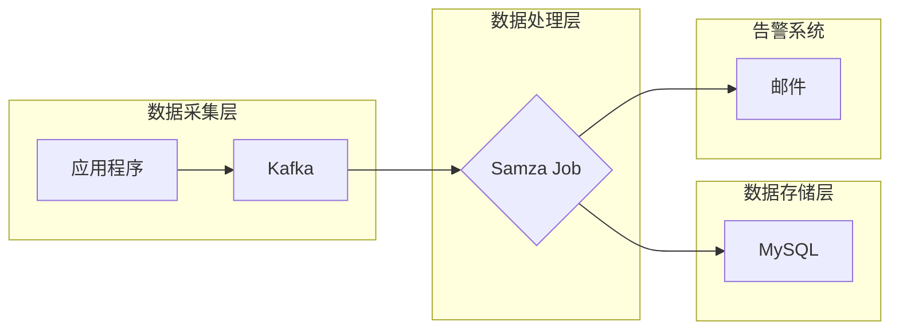

# Samza流处理日志管理与分析

作者：禅与计算机程序设计艺术

## 1. 背景介绍

### 1.1 日志数据的重要性

在当今数字化时代，海量的日志数据蕴藏着丰富的宝藏。从系统运行状态、用户行为模式到业务性能指标，日志数据忠实地记录着一切。有效地收集、处理和分析这些数据，对于保障系统稳定性、优化产品体验、挖掘商业价值至关重要。

### 1.2 传统日志处理方法的局限性

传统的日志处理方法，例如基于文件的存储和分析，往往面临着以下挑战：

* **海量数据处理能力不足:** 随着数据规模的爆炸式增长，传统方法难以应对海量日志数据的实时处理需求。
* **实时性难以保证:**  传统的批处理方式无法满足实时分析的需求，导致问题发现和响应滞后。
* **运维成本高昂:**  搭建和维护复杂的日志处理系统需要投入大量人力和物力。

### 1.3 Samza: 分布式流处理框架的优势

Apache Samza 是一款开源的分布式流处理框架，专为高吞吐量、低延迟的流式数据处理而设计。相比传统方法，Samza 具备以下优势：

* **高吞吐、低延迟:** Samza 基于 Kafka 等高性能消息队列构建，能够处理海量数据流，并保证毫秒级的处理延迟。
* **容错性强:** Samza 提供了完善的容错机制，即使在节点故障的情况下也能保证数据处理的连续性。
* **易于使用:** Samza 提供了简洁易用的 API 和丰富的配置选项，方便用户快速构建和部署流处理应用。

## 2. 核心概念与联系

### 2.1 流处理基本概念

* **流(Stream):**  连续不断的数据记录序列，例如用户点击流、传感器数据等。
* **事件(Event):**  流中的单个数据记录，代表一个具体的行为或状态变化。
* **生产者(Producer):**  向流中写入数据的应用程序或设备。
* **消费者(Consumer):**  从流中读取数据并进行处理的应用程序。
* **主题(Topic):**  用于对流进行逻辑分类，类似于消息队列中的队列。

### 2.2 Samza 核心组件

* **Samza Job:**  一个完整的流处理应用程序，由多个 Samza Task 组成。
* **Samza Task:**  Samza Job 中的最小处理单元，负责处理分配给它的数据分区。
* **Samza Container:**  运行 Samza Task 的容器，可以是 Yarn Container 或独立进程。
* **Kafka:**  高吞吐量、低延迟的分布式消息队列，作为 Samza 的数据源和数据管道。
* **YARN:**  Hadoop 的资源管理系统，负责 Samza Job 的资源分配和调度。

### 2.3 Samza 流处理流程

1. 数据生产者将日志数据写入 Kafka 集群。
2. Samza Job 从 Kafka 中读取数据。
3. Samza Job 将数据流拆分为多个分区，并分配给不同的 Samza Task 处理。
4. 每个 Samza Task 对分配给它的数据进行处理，并将结果输出到指定的目标系统，例如数据库、消息队列等。

## 3. 核心算法原理具体操作步骤

### 3.1 数据读取与分区

Samza 使用 Kafka Consumer API 从 Kafka 中读取数据。为了实现并行处理，Samza 会将数据流按照一定的规则进行分区。常见的分区策略包括：

* **轮询分区(Round Robin Partitioning):**  将数据均匀地分配给每个分区。
* **随机分区(Random Partitioning):**  随机选择一个分区写入数据。
* **基于键的分区(Key-based Partitioning):**  根据数据的某个键值进行分区，确保相同键值的数据会被分配到同一个分区。

### 3.2 状态管理

在流处理过程中，通常需要维护一些中间状态，例如计数器、聚合结果等。Samza 提供了两种状态管理机制：

* **本地状态(Local State):**  将状态存储在 Samza Task 的本地内存中，适用于状态数据量较小的情况。
* **远程状态(Remote State):**  将状态存储在外部数据库或键值存储系统中，适用于状态数据量较大的情况。

### 3.3 窗口操作

在实际应用中，我们通常需要对一段时间内的数据进行统计分析，例如计算过去一分钟的平均值、最大值等。Samza 提供了灵活的窗口操作机制，支持以下窗口类型：

* **滚动窗口(Tumbling Window):**  将数据流按照固定的时间间隔进行切分，例如每分钟一个窗口。
* **滑动窗口(Sliding Window):**  在滚动窗口的基础上，设置一个滑动步长，例如每 30 秒滑动一次，每次滑动 10 秒。
* **会话窗口(Session Window):**  根据数据流中的事件间隔进行动态切分，例如将连续活跃时间不超过 5 分钟的事件归为一个窗口。

## 4. 数学模型和公式详细讲解举例说明

### 4.1 数据流模型

在流处理中，我们通常将数据流抽象为一个无限长度的事件序列：

```
S = (e1, e2, e3, ..., en, ...)
```

其中，ei 表示第 i 个事件。

### 4.2 窗口函数

窗口函数用于对一段时间内的数据进行聚合计算，例如：

* **SUM(A):**  计算窗口内 A 字段的总和。
* **AVG(A):**  计算窗口内 A 字段的平均值。
* **MAX(A):**  计算窗口内 A 字段的最大值。
* **MIN(A):**  计算窗口内 A 字段的最小值。
* **COUNT():**  计算窗口内的事件数量。

### 4.3 举例说明

假设我们有一个用户点击流，每个事件包含以下字段：

* **user_id:**  用户 ID。
* **page_url:**  访问的页面 URL。
* **timestamp:**  事件发生时间戳。

现在我们需要统计每个用户每分钟的页面访问量，可以使用以下 Samza 代码实现：

```java
public class PageViewCountTask extends StreamTask {

    private KeyValueStore<String, Integer> pageViewCountStore;

    @Override
    public void init(Config config, TaskContext context) {
        // 初始化状态存储
        pageViewCountStore = (KeyValueStore<String, Integer>) context.getStore("page-view-count");
    }

    @Override
    public void process(IncomingMessageEnvelope envelope, MessageCollector collector, TaskCoordinator coordinator) {
        // 获取事件数据
        JSONObject event = new JSONObject(new String((byte[]) envelope.getMessage()));
        String userId = event.getString("user_id");
        long timestamp = event.getLong("timestamp");

        // 计算窗口开始时间
        long windowStart = timestamp - (timestamp % 60000);

        // 更新状态
        String key = userId + "-" + windowStart;
        int count = pageViewCountStore.getOrDefault(key, 0);
        pageViewCountStore.put(key, count + 1);

        // 输出结果
        collector.send(new OutgoingMessageEnvelope(
                new SystemStream("kafka", "page-view-count"),
                key,
                String.valueOf(count + 1).getBytes()
        ));
    }
}
```

## 5. 项目实践：代码实例和详细解释说明

### 5.1 需求分析

假设我们需要构建一个实时日志分析系统，用于监控应用程序的运行状态，并及时发现和告警异常情况。具体需求如下：

* **数据源:**  应用程序的日志文件。
* **数据格式:**  JSON 格式，包含以下字段：
    * **timestamp:**  日志时间戳。
    * **level:**  日志级别，例如 INFO、WARN、ERROR 等。
    * **message:**  日志消息内容。
* **分析目标:**
    * 统计每分钟不同级别的日志数量。
    * 当 ERROR 级别的日志数量超过一定阈值时触发告警。

### 5.2 系统架构



* **数据采集层:**  应用程序将日志数据写入 Kafka 集群。
* **数据处理层:**  Samza Job 从 Kafka 中读取数据，进行实时分析处理。
* **数据存储层:**  将分析结果存储到 MySQL 数据库中，方便后续查询和展示。
* **告警系统:**  当 ERROR 级别的日志数量超过阈值时，通过邮件发送告警信息。

### 5.3 代码实现

#### 5.3.1 Samza Job 代码

```java
public class LogAnalysisTask extends StreamTask {

    private static final Logger LOGGER = LoggerFactory.getLogger(LogAnalysisTask.class);

    private KeyValueStore<String, Integer> logCountStore;
    private int errorThreshold = 10;

    @Override
    public void init(Config config, TaskContext context) {
        // 初始化状态存储
        logCountStore = (KeyValueStore<String, Integer>) context.getStore("log-count");

        // 获取告警阈值
        errorThreshold = config.getInt("error.threshold", 10);
    }

    @Override
    public void process(IncomingMessageEnvelope envelope, MessageCollector collector, TaskCoordinator coordinator) {
        // 获取日志数据
        JSONObject log = new JSONObject(new String((byte[]) envelope.getMessage()));
        String level = log.getString("level");
        long timestamp = log.getLong("timestamp");

        // 计算窗口开始时间
        long windowStart = timestamp - (timestamp % 60000);

        // 更新状态
        String key = level + "-" + windowStart;
        int count = logCountStore.getOrDefault(key, 0);
        logCountStore.put(key, count + 1);

        // 触发告警
        if ("ERROR".equals(level) && count + 1 >= errorThreshold) {
            sendAlert(log);
        }

        // 输出结果
        collector.send(new OutgoingMessageEnvelope(
                new SystemStream("kafka", "log-count"),
                key,
                String.valueOf(count + 1).getBytes()
        ));
    }

    private void sendAlert(JSONObject log) {
        // 发送邮件告警
        LOGGER.warn("Error log count exceeds threshold: {}", log);
    }
}
```

#### 5.3.2 Samza Job 配置文件

```properties
task.class=com.example.LogAnalysisTask
systems.kafka.samza.factory=org.apache.samza.system.kafka.KafkaSystemFactory
systems.kafka.consumer.zookeeper.connect=localhost:2181
systems.kafka.producer.bootstrap.servers=localhost:9092
jobs.log-analysis.samza.system=kafka
jobs.log-analysis.samza.input=log-topic
jobs.log-analysis.samza.offset.default=oldest
jobs.log-analysis.samza.parallelism=1
jobs.log-analysis.error.threshold=10
```

### 5.4 部署和运行

1. 将 Samza Job 代码打包成 jar 包。
2. 将 jar 包上传到 Samza 集群。
3. 修改 Samza Job 配置文件，指定 Kafka 集群地址、主题名称等信息。
4. 使用 Samza 命令行工具启动 Samza Job。

## 6. 实际应用场景

Samza 流处理日志管理与分析技术在各个领域都有着广泛的应用，例如：

* **实时监控与告警:**  监控系统和应用程序的运行状态，及时发现和告警异常情况。
* **用户行为分析:**  分析用户行为模式，为产品优化和精准营销提供数据支持。
* **安全审计:**  记录用户操作行为，为安全事件调查提供依据。
* **业务指标监控:**  实时监控业务关键指标，例如订单量、交易额等，为业务决策提供数据支持。

## 7. 工具和资源推荐

* **Apache Samza 官网:**  https://samza.apache.org/
* **Apache Kafka 官网:**  https://kafka.apache.org/
* **Apache ZooKeeper 官网:**  https://zookeeper.apache.org/

## 8. 总结：未来发展趋势与挑战

随着大数据技术的不断发展，流处理技术也在不断演进。未来，Samza 流处理日志管理与分析技术将面临以下挑战和机遇：

* **更高的性能和可扩展性:**  随着数据规模的不断增长，需要不断提升 Samza 的性能和可扩展性，以满足海量数据处理的需求。
* **更丰富的功能和易用性:**  为了降低用户使用门槛，需要不断丰富 Samza 的功能和易用性，例如提供更友好的 API 和可视化工具。
* **与其他大数据技术的融合:**  为了构建更加完善的大数据解决方案，需要将 Samza 与其他大数据技术进行融合，例如 Spark、Flink 等。

## 9. 附录：常见问题与解答

### 9.1 Samza 和 Kafka 之间的关系是什么？

Kafka 是 Samza 的数据源和数据管道，Samza 使用 Kafka Consumer API 从 Kafka 中读取数据，并将处理结果输出到 Kafka。

### 9.2 Samza 支持哪些状态管理机制？

Samza 支持本地状态和远程状态两种状态管理机制。

### 9.3 Samza 如何保证数据处理的容错性？

Samza 通过 checkpoint 机制来保证数据处理的容错性。Samza 会定期将 Task 的状态信息写入 checkpoint，当 Task 发生故障时，可以从 checkpoint 中恢复状态，继续处理数据。