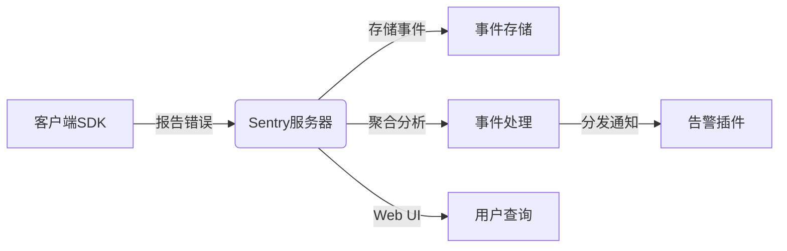

# Sentry原理与代码实例讲解

作者：禅与计算机程序设计艺术

## 1.背景介绍

在现代软件开发中,错误和异常监控是一个非常关键的环节。开发人员需要及时发现并修复应用程序中的错误和异常,以提高软件质量和用户体验。Sentry是一个开源的实时事件日志和聚合平台,它可以帮助开发人员实时监控和修复崩溃、错误和性能问题。

### 1.1 传统错误监控方式的局限性

传统的错误监控方式主要有以下几种:

- 日志文件:将错误信息记录到日志文件中,通过分析日志文件来定位问题。
- 邮件报警:当发生错误时,发送邮件通知开发人员。 
- 监控平台:使用第三方监控平台来监控应用的运行状况。

然而,这些方式都存在一定的局限性:

- 日志文件分散在各个服务器上,难以统一管理和实时分析。
- 邮件报警容易被忽略,且无法提供详细的错误信息。
- 传统监控平台通常侧重于系统指标,对应用层面的异常支持不足。

### 1.2 Sentry的优势

Sentry作为一款专业的应用错误监控平台,具有以下优势:

- 实时性:可以实时捕获和汇总错误信息,并立即通知开发人员。
- 聚合性:自动将相同的错误进行聚类,方便开发人员快速定位问题。
- 可定制性:支持灵活的告警策略和工作流配置,适应不同团队的工作方式。
- 多语言支持:支持主流的编程语言和框架,集成简单。
- 开源免费:核心组件开源,可以免费使用。

综上所述,Sentry凭借其强大的功能和便捷的使用方式,已经成为了众多开发团队进行错误监控的首选工具。

## 2.核心概念与联系

要深入理解Sentry的工作原理,首先需要了解其中的一些核心概念。

### 2.1 事件(Event)

事件是Sentry中的基本数据单元,它代表了一次应用错误或异常。一个事件通常包含以下信息:

- 错误标题和错误信息
- 发生错误的代码位置(文件名、行号、函数名等)
- 请求的URL、请求方法、请求参数
- 用户的IP、用户ID、用户代理等
- 错误发生时的栈追踪信息
- 服务器的主机名、运行环境等元数据

### 2.2 项目(Project) 

项目对应了一个应用服务,例如一个Web应用或者移动App。在Sentry中,每个项目都有唯一的DSN(数据源名称),SDK可以通过DSN来连接到对应的Sentry服务器。

### 2.3 组织(Organization)

组织用于管理多个项目。一个组织下可以创建多个团队(Team),一个团队可以访问多个项目。组织还可以配置安全策略、数据过滤规则等。

### 2.4 核心组件与联系

下图展示了Sentry的核心组件与联系:



1. 客户端SDK捕获应用错误,并上报给Sentry服务器。
2. Sentry服务器接收到错误报告后,将事件数据存储到事件存储中。
3. 事件处理组件从事件存储中读取数据,进行聚合分析,生成聚合事件。
4. 当触发告警规则时,告警插件发送通知给相关人员。
5. 用户可以通过Web UI来查询和分析聚合事件,追踪问题解决进度。

## 3.核心算法原理具体操作步骤

Sentry的核心算法是基于事件聚类的。它的主要目的是将相似的错误进行聚合,减少错误信息的冗余,方便开发人员快速定位和修复问题。

### 3.1 数据采集

1. SDK在应用代码中的适当位置初始化并配置好Sentry对象。
2. 应用发生错误时,SDK捕获异常对象及上下文信息,构建事件对象。
3. SDK将事件对象序列化后,通过网络发送给Sentry服务器。

### 3.2 数据存储

1. Sentry服务器接收到事件数据后,验证其合法性。
2. 事件写入Kafka等消息队列,在消息队列中进行nikname计算。
3. 消息消费者将事件数据以及nikname持久化到事件存储中。

nikname是一个哈希字符串,它代表了一类相似的事件。通过对错误信息中的关键数据进行哈希,可以将相似错误映射到同一个nikname。

### 3.3 事件聚合

1. 聚合处理器定期从事件存储中读取数据。 
2. 依据数据的nikname进行分组,相同nikname的事件归入同一个聚合事件。
3. 对每个聚合事件,更新其首次、最近发生时间,发生次数等统计信息。
4. 将更新后的聚合事件回写到事件存储。

### 3.4 报警与通知

1. 告警处理器依据预设的告警规则,周期性地检查聚合事件。
2. 当聚合事件的属性满足告警条件时,创建一个告警事件。
3. 新创建的告警事件会发送给告警插件。
4. 告警插件根据告警级别、订阅配置等,选择合适的通知渠道。
5. 通知渠道将告警内容发送给相应的处理人。

## 4.数学模型和公式详细讲解举例说明

在Sentry的错误聚类算法中,涉及到距离度量、向量化、相似度等数学概念。

### 4.1 编辑距离

编辑距离(Edit Distance),又称Levenshtein距离,是一种衡量两个字符串相似度的方法。它表示将一个字符串转化成另一个字符串所需要的最少编辑操作次数(插入、删除、替换)。

例如,字符串"kitten"和"sitting"的编辑距离是3,因为:

- kitten → sitten (将 k 替换为 s)
- sitten → sittin (将 e 替换为 i)  
- sittin → sitting (插入 g)

编辑距离的数学定义为:

给定两个字符串 $a$ 和 $b$,他们的编辑距离 $d(a,b)$ 满足:

$$
d(a,b) = 
\begin{cases}
\max(i,j) & \text{if} \min(i,j) = 0 \\
\min
\begin{cases}
d(a[i-1], b[j]) + 1 \\
d(a[i], b[j-1])+1 \\ 
d(a[i-1], b[j-1]) + 1_{(a_i\neq b_i)}
\end{cases}
& \text{else}
\end{cases}
$$

其中,$1_{(a_i\neq b_i)}$ 表示当第i个字符不同时,编辑距离加1,否则不变。

在Sentry中,可以使用编辑距离来衡量两条错误信息的相似度。编辑距离越小,说明两个错误越相似,更可能是同一类问题。

### 4.2 向量空间模型

向量空间模型(Vector Space Model, VSM)是一种将文本表示为向量的方法。它假定每个文档都是一个向量,向量的每个维度表示一个词项,其值为该词在文档中的权重。

常见的权重计算方法有:

- 词频(TF):某个词在文档中出现的频率。
- 逆文档频率(IDF):用总文档数除以包含该词的文档数,再取对数。
- TF-IDF:上面两者的乘积,即TF * IDF。

例如,假设有两个文档:

- D1: "The quick brown fox"
- D2: "quick fox jumps over the lazy dog"

它们的向量表示可以是:

```
(the, quick, brown, fox, jumps, over, lazy, dog)
D1: (1,    1,     1,   1,    0,    0,    0,   0)
D2: (0,    1,     0,   1,    1,    1,    1,   1)
```

通过计算两个向量的距离(欧氏距离、余弦相似度等),就可以衡量文档之间的相似程度。

在Sentry中,可以将异常堆栈信息进行向量化,从而比较不同错误之间的相似度。相似度高的错误更可能属于同一类问题。

### 4.3 simhash算法

simhash是Google提出的一种文档相似度算法。它的基本思想是将文本映射为二进制哈希向量,通过比较向量的汉明距离来判断相似度。

simhash的计算步骤如下:

1. 将文本分词,得到一组特征。
2. 对每个特征,用一个 f 位的指纹(hash)表示。
3. 对所有特征的指纹做加权累加,得到一个 f 维的向量 $V$。
4. 对向量 $V$ 的每一位做阈值比较:大于0则置1,小于0则置0。最终得到文档的 simhash 值。

两个文档的 simhash 计算出来后,就可以通过计算它们的汉明距离来衡量相似性。汉明距离表示两个等长字符串中对应位置不同字符的个数。距离越小,相似度越高。

Sentry在计算错误的nikname时,就使用了simhash算法。它会提取错误信息的关键特征(异常类型、错误消息、堆栈frames等),计算其simhash值作为nikname。simhash值相同的错误会被归入同一个聚合事件中。

## 4.项目实践：代码实例和详细解释说明

下面我们通过一个Python项目来演示如何使用Sentry进行错误监控。

### 4.1 配置Sentry SDK

首先需要安装Sentry SDK:

```bash
pip install sentry-sdk==1.5.0
```

然后在代码中初始化SDK:

```python
import sentry_sdk
from sentry_sdk.integrations.flask import FlaskIntegration

sentry_sdk.init(
    dsn="<your dsn>",
    integrations=[FlaskIntegration()],
    traces_sample_rate=1.0,
)
```

- dsn:Sentry项目的数据源名称,可以在Sentry的项目设置中找到。
- integrations:指定要使用的框架集成。
- traces_sample_rate:性能监控采样率,1.0表示100%采样。

### 4.2 模拟异常

在Web应用中,常见的异常有:HTTP 400错误、未捕获的异常等。我们可以在Flask路由中模拟一些异常:

```python
from flask import Flask

app = Flask(__name__)

@app.route('/error')
def error():
    raise ValueError("Something went wrong")

@app.route('/exception')
def exception():
    1 / 0

@app.errorhandler(404)
def not_found(e):
    return "404 Not Found", 404
```

上面的代码定义了两个会抛出异常的路由,以及一个404错误处理函数。

### 4.3 记录breadcrumbs

除了异常,Sentry还支持记录事件发生前的一些上下文信息,称为breadcrumbs。通过分析breadcrumbs,我们可以更好地复现问题。

```python
from sentry_sdk import capture_message

@app.route('/')
def index():
    sentry_sdk.add_breadcrumb(
        category='auth', 
        message='Authenticated user', 
        level='info',
    )
    
    capture_message("User made a request", level="info")
    
    return "Hello!"
```

`add_breadcrumb` 函数用于添加自定义的面包屑,而 `capture_message` 函数可以主动记录一条消息到Sentry。

### 4.4 测试与分析

启动Flask应用,在浏览器中访问几个错误路由。然后打开Sentry的Web UI,就可以看到报告的异常了。

我们可以查看异常的详细信息,包括:

- 异常类型和错误消息
- 异常发生的代码位置
- HTTP请求信息
- 异常次数、影响用户数
- 事件日志时间线

通过分析这些数据,我们可以快速定位和修复问题,提升应用质量。

## 5.实际应用场景

Sentry 在实际项目中有非常广泛的应用,下面是几个典型的应用场景。

### 5.1 Web应用

Web应用通过在前端和后端分别接入Sentry SDK,实现全