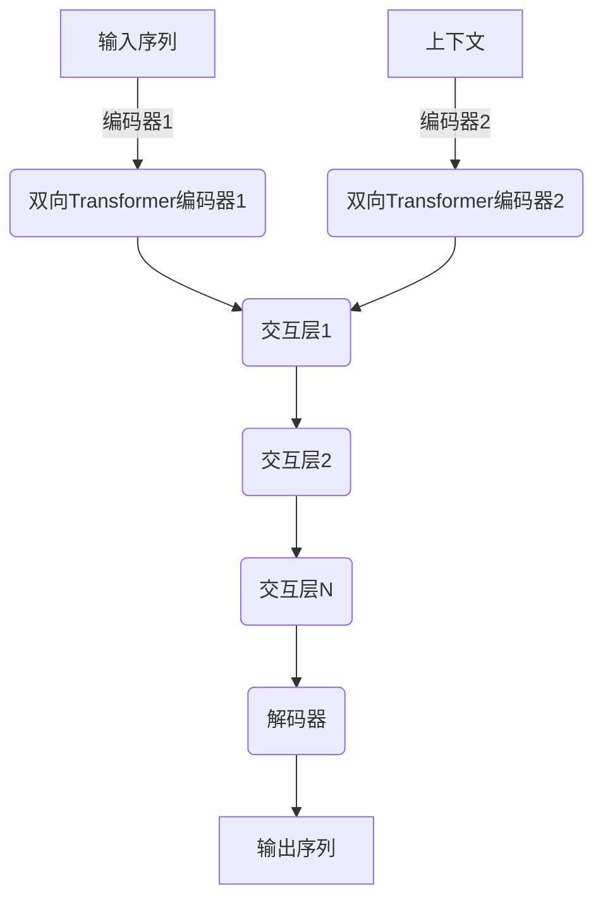

# SimMIM的社会影响力:对话人工智能的伦理考量

## 1.背景介绍

### 1.1 对话人工智能的兴起

近年来,对话人工智能(Conversational AI)技术取得了长足进步,其中以SimMIM(Siamese Multi-depth Transformer-based双向交互模型)为代表的新型对话模型表现出了令人瞩目的性能。这种新型对话系统能够通过深度学习技术自主获取知识,并与人类进行自然流畅的交互对话,在诸多领域展现出广阔的应用前景。

### 1.2 SimMIM的技术突破

SimMIM是一种革命性的对话AI模型,它采用了创新的Siamese双向Transformer编码器结构,能够同时对上下文语境进行编码,从而更好地捕捉对话的语义关联性。该模型通过引入多层交互机制,实现了上下文的多层次融合,大幅提高了对话的连贯性和响应质量。此外,SimMIM还融合了大规模语料预训练和对抗训练等先进技术,使其获得了更强的泛化能力和鲁棒性。

### 1.3 SimMIM的社会影响力

SimMIM等对话AI技术的突破,正在全方位改变着人类的生活、工作和交互方式。它们可应用于虚拟助手、客服机器人、教育辅导、心理咨询等多个领域,为人类提供高效、智能、个性化的服务。同时,这些系统所展现的人工智能水平,也在挑战人类对智能的认知边界。随着技术的发展和应用的深入,对话AI将对社会产生深远的影响,因此我们有必要对其潜在的伦理风险进行审慎评估和前瞻性思考。

## 2.核心概念与联系

### 2.1 对话AI的关键技术

构建高质量的对话AI系统,需要多种关键技术的融合:

#### 2.1.1 自然语言处理(NLP)

NLP技术是对话AI的基础,包括语音识别、语义理解、对话管理、自然语言生成等多个环节。高效的NLP算法能够实现人机之间自然流畅的语言交互。

#### 2.1.2 知识图谱

知识图谱为对话系统提供了丰富的结构化知识库,是支撑多轮对话和复杂推理的重要组成部分。构建大规模、高质量的知识图谱是对话AI发展的关键。

#### 2.1.3 深度学习模型

近年来,基于深度学习的语言模型在NLP领域取得了突破性进展,如Transformer、BERT等,它们赋予了对话系统强大的语义理解和生成能力,是对话AI性能不断提高的核心驱动力。

#### 2.1.4 人机交互技术

为提升用户体验,对话AI系统需要融合多模态交互技术,如语音交互、视觉交互等,实现自然人性化的交互方式。

### 2.2 SimMIM的核心创新

SimMIM的核心创新主要体现在三个方面:

#### 2.2.1 Siamese双向Transformer编码器

传统的Transformer编码器只对输入序列进行单向编码,而SimMIM采用了Siamese双向结构,能够同时对上下文和当前输入进行编码,更好地捕捉上下文语义关联。

#### 2.2.2 多层交互机制

SimMIM引入了多层交互机制,在不同层次上融合上下文和当前输入的表示,实现了上下文在不同语义层面的多层次融合,从而提高了对话的连贯性和响应质量。

#### 2.2.3 多策略优化训练

SimMIM采用了多种创新的训练策略,如对抗训练、交互训练、多任务学习等,使模型获得了更强的泛化能力、鲁棒性和一致性。

### 2.3 对话AI与其他技术的关联

对话AI是一个交叉学科,它与多个技术领域密切相关:

- 认知科学:对话AI需要借鉴认知科学中的理论和方法,以模拟人类的语言认知过程。
- 机器人技术:对话AI是智能机器人的核心部分,二者的发展相互促进。
- 大数据与云计算:构建对话AI需要利用大规模数据和强大的计算能力。
- 信息安全:对话系统中存在潜在的隐私和安全风险,需要相关技术的保障。

## 3.核心算法原理具体操作步骤

### 3.1 SimMIM模型架构

SimMIM的整体架构如下图所示:

该模型主要由以下几个核心模块组成:

1. **双向Transformer编码器**:使用Siamese结构的双向Transformer编码器,分别对输入序列和上下文序列进行编码。
2. **交互层**:多层交互层对编码器的输出进行交互融合,实现上下文在不同语义层面的融合。
3. **解码器**:基于交互层的输出,生成最终的对话响应序列。

### 3.2 双向Transformer编码器

传统的Transformer编码器是单向的,即只编码输入序列本身。而SimMIM采用了双向编码器结构,能够同时对输入序列和上下文序列进行编码,从而更好地捕捉两者之间的语义关联。

具体来说,对于输入序列 $X=\{x_1,x_2,...,x_n\}$ 和上下文序列 $C=\{c_1,c_2,...,c_m\}$,编码过程为:

$$\boldsymbol{H}^X = \textrm{TransformerEncoder}(X, X) \tag{1}$$
$$\boldsymbol{H}^C = \textrm{TransformerEncoder}(C, C) \tag{2}$$

其中, $\boldsymbol{H}^X \in \mathbb{R}^{n\times d}$ 和 $\boldsymbol{H}^C \in \mathbb{R}^{m\times d}$ 分别表示输入序列和上下文序列的编码表示,d为隐层维度。

### 3.3 多层交互机制

为了实现输入序列和上下文序列表示在不同语义层面的有效融合,SimMIM设计了多层交互机制。具体来说,在第l层交互中:

$$\boldsymbol{M}^{(l)} = \textrm{Interact}(\boldsymbol{H}^X, \boldsymbol{H}^C, \boldsymbol{M}^{(l-1)}) \tag{3}$$

其中, $\boldsymbol{M}^{(l)} \in \mathbb{R}^{n\times d}$ 表示第l层的交互输出, $\textrm{Interact}(\cdot)$ 是交互函数,可以是不同的实现方式,如注意力机制、门控机制等。初始层 $\boldsymbol{M}^{(0)}$ 可由 $\boldsymbol{H}^X$ 和 $\boldsymbol{H}^C$ 通过某种方式组合而成。

通过多层交互,输入序列和上下文序列的表示在不同层次上进行了融合,从而增强了模型对上下文语义的建模能力。

### 3.4 解码器及训练

SimMIM的解码器是基于Transformer解码器结构,以最后一层交互输出 $\boldsymbol{M}^{(L)}$ 作为输入,生成最终的响应序列 $Y=\{y_1,y_2,...,y_k\}$:

$$P(Y|\boldsymbol{M}^{(L)}) = \prod_{t=1}^k P(y_t|\boldsymbol{M}^{(L)}, y_1,...,y_{t-1}) \tag{4}$$

在训练过程中,SimMIM采用了一些创新的训练策略,如对抗训练、交互训练、多任务学习等,以提升模型的泛化能力、鲁棒性和一致性。

## 4.数学模型和公式详细讲解举例说明

在上一节中,我们介绍了SimMIM模型的核心原理和算法步骤,其中涉及了一些数学模型和公式。现在我们对这些公式进行更详细的讲解和举例说明。

### 4.1 双向Transformer编码器

公式(1)和(2)描述了SimMIM中的双向Transformer编码器,它们分别对输入序列X和上下文序列C进行编码,得到对应的编码表示 $\boldsymbol{H}^X$ 和 $\boldsymbol{H}^C$。

以输入序列X为例,我们具体看一下Transformer编码器的工作原理。假设 $X=\{x_1,x_2,x_3,x_4\}$,每个 $x_i$ 表示一个词的embedding向量。那么通过Transformer编码器,我们可以得到每个位置的编码表示:

$$\boldsymbol{H}^X = \begin{bmatrix}
\boldsymbol{h}_1^X\\
\boldsymbol{h}_2^X\\
\boldsymbol{h}_3^X\\
\boldsymbol{h}_4^X
\end{bmatrix}$$

其中, $\boldsymbol{h}_i^X \in \mathbb{R}^d$ 表示第i个位置的编码表示,它综合了该位置词的信息,以及通过self-attention机制获取的上下文信息。

例如,如果 $X=\text{"什么是对话人工智能?"}$, $\boldsymbol{h}_3^X$ 就会编码"对话人工智能"这个短语的语义,并融合了前后词的上下文信息。

### 4.2 多层交互机制

公式(3)描述了SimMIM的多层交互机制,用于在不同层次上融合输入序列和上下文序列的表示。我们以两层交互为例,具体看一下交互过程:

第0层初始化:
$$\boldsymbol{M}^{(0)} = \textrm{Concat}(\boldsymbol{H}^X, \boldsymbol{H}^C)$$

第1层交互:
$$\boldsymbol{M}^{(1)} = \textrm{Interact}(\boldsymbol{H}^X, \boldsymbol{H}^C, \boldsymbol{M}^{(0)})$$

第2层交互:
$$\boldsymbol{M}^{(2)} = \textrm{Interact}(\boldsymbol{H}^X, \boldsymbol{H}^C, \boldsymbol{M}^{(1)})$$

其中, $\textrm{Concat}(\cdot)$ 表示拼接操作, $\textrm{Interact}(\cdot)$ 可以是注意力机制等具体的交互函数。

例如,在第1层交互中,我们可以使用双向注意力机制,分别从 $\boldsymbol{H}^X$ 和 $\boldsymbol{H}^C$ 中获取相关的上下文信息,并与 $\boldsymbol{M}^{(0)}$ 融合,得到 $\boldsymbol{M}^{(1)}$,从而增强了输入序列表示对上下文的建模能力。

通过多层交互,SimMIM能够在不同语义层面上融合上下文信息,从而提高了对话质量。

### 4.3 解码器及训练目标

公式(4)描述了SimMIM的解码器,基于最后一层的交互输出 $\boldsymbol{M}^{(L)}$ 生成最终的响应序列Y。具体来说,解码器按照序列概率 $P(Y|\boldsymbol{M}^{(L)})$ 生成每个词 $y_t$,这是一个标准的序列生成问题。

在训练过程中,我们通常使用最大似然估计,将真实响应序列Y的概率最大化:

$$\mathcal{L} = -\log P(Y|\boldsymbol{M}^{(L)}) = -\sum_{t=1}^k \log P(y_t|\boldsymbol{M}^{(L)}, y_1,...,y_{t-1}) \tag{5}$$

除了基本的最大似然目标,SimMIM还采用了一些创新的训练策略,如对抗训练、交互训练等,来提升模型的鲁棒性和一致性。

例如,在对抗训练中,我们可以构造一些对抗样本,让模型在这些"困难"样本上进行训练,从而提高模型的泛化能力。假设对抗样本的标签为 $\hat{Y}$,对抗损失函数为:

$$\mathcal{L}_\text{adv} = -\log P(\hat{Y}|\boldsymbol{M}^{(L)}) \tag{6}$$

通过将对抗损失 $\