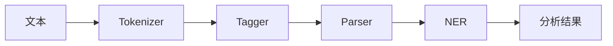

# Spacy 原理与代码实战案例讲解

作者：禅与计算机程序设计艺术

## 1. 背景介绍

### 1.1 自然语言处理与文本分析的挑战

自然语言处理（NLP）是人工智能领域的一个重要分支，旨在让计算机能够理解和处理人类语言。文本分析是 NLP 中的一个重要应用领域，涵盖了文本分类、情感分析、实体识别、关系抽取等多种任务。然而，由于自然语言的复杂性和歧义性，文本分析面临着诸多挑战：

* **词义消歧：**同一个词在不同的语境下可以有不同的含义。
* **句法分析：**自然语言的语法规则复杂，且存在很多例外情况。
* **语义理解：**理解文本的深层含义需要结合上下文信息进行推理。

### 1.2 Spacy: 工业级 Python NLP 库

为了应对这些挑战，研究者们开发了各种 NLP 工具和库。其中，Spacy 是一个开源的工业级 Python NLP 库，以其高效、准确和易用性著称。Spacy 提供了丰富的功能，包括：

* **预训练词向量：**Spacy 提供了多种语言的预训练词向量，可以捕捉词语之间的语义关系。
* **词性标注、命名实体识别、依存句法分析：**Spacy 内置了多种 NLP 模型，可以对文本进行深入分析。
* **自定义管道：**用户可以根据自己的需求定制 Spacy 的处理流程。
* **高效的处理速度：**Spacy 基于 Cython 开发，处理速度非常快。

## 2. 核心概念与联系

### 2.1  Spacy 的处理管道

Spacy 的核心是一个处理管道（Pipeline）。管道由一系列组件（Component）组成，每个组件负责一项特定的 NLP 任务。当文本输入管道时，它会依次经过每个组件进行处理，最终输出分析结果。

常见的 Spacy 组件包括：

* **Tokenizer：**将文本分割成单词或词素。
* **Tagger：**对每个单词进行词性标注。
* **Parser：**进行依存句法分析，识别句子中的主谓宾等成分。
* **NER：**识别文本中的命名实体，例如人名、地名、机构名等。



### 2.2  语言模型与词向量

Spacy 的许多功能依赖于语言模型。语言模型是一种统计模型，用于预测文本序列中下一个词出现的概率。Spacy 使用预训练的语言模型来生成词向量。

词向量是将词语映射到向量空间的一种表示方法。在向量空间中，语义相似的词语距离较近，语义不同的词语距离较远。词向量可以用于多种 NLP 任务，例如：

* **计算词语相似度：**可以使用余弦相似度等指标计算两个词向量的相似度。
* **寻找近义词：**可以找到与目标词向量距离最近的词向量，作为目标词的近义词。
* **进行文本分类：**可以使用词向量作为文本的特征表示，进行文本分类。


## 3. 核心算法原理具体操作步骤

### 3.1 词性标注

词性标注是将句子中的每个词语赋予一个词性的过程，例如名词、动词、形容词等。Spacy 使用统计模型进行词性标注。该模型基于词语本身的特征以及上下文信息进行预测。

**操作步骤：**

1. **加载语言模型：**首先需要加载 Spacy 的语言模型。
2. **处理文本：**使用 `nlp()` 函数处理文本，得到一个 `Doc` 对象。
3. **获取词性标注结果：**`Doc` 对象的 `pos_` 属性存储了每个词语的词性标注结果。

**代码示例：**

```python
import spacy

# 加载英文语言模型
nlp = spacy.load("en_core_web_sm")

# 处理文本
text = "The quick brown fox jumps over the lazy dog."
doc = nlp(text)

# 打印每个词语的词性标注结果
for token in doc:
    print(token.text, token.pos_)
```

**输出结果：**

```
The DET
quick ADJ
brown ADJ
fox NOUN
jumps VERB
over ADP
the DET
lazy ADJ
dog NOUN
. PUNCT
```

### 3.2 命名实体识别

命名实体识别是从文本中识别出命名实体的过程，例如人名、地名、机构名等。Spacy 使用统计模型进行命名实体识别。该模型基于词语本身的特征、上下文信息以及词语之间的关系进行预测。

**操作步骤：**

1. **加载语言模型：**首先需要加载 Spacy 的语言模型。
2. **处理文本：**使用 `nlp()` 函数处理文本，得到一个 `Doc` 对象。
3. **获取命名实体识别结果：**`Doc` 对象的 `ents` 属性存储了识别出的命名实体。

**代码示例：**

```python
import spacy

# 加载英文语言模型
nlp = spacy.load("en_core_web_sm")

# 处理文本
text = "Apple is looking at buying U.K. startup for $1 billion"
doc = nlp(text)

# 打印每个命名实体的文本和类型
for ent in doc.ents:
    print(ent.text, ent.label_)
```

**输出结果：**

```
Apple ORG
U.K. GPE
$1 billion MONEY
```


### 3.3 依存句法分析

依存句法分析是分析句子中词语之间的语法关系的过程。Spacy 使用基于转移的依存句法分析算法。该算法将句法分析问题转化为一系列转移动作，通过学习转移动作序列来预测句法结构。

**操作步骤：**

1. **加载语言模型：**首先需要加载 Spacy 的语言模型。
2. **处理文本：**使用 `nlp()` 函数处理文本，得到一个 `Doc` 对象。
3. **获取依存句法分析结果：**`Doc` 对象的 `dep_` 属性存储了每个词语的依存关系。

**代码示例：**

```python
import spacy

# 加载英文语言模型
nlp = spacy.load("en_core_web_sm")

# 处理文本
text = "The quick brown fox jumps over the lazy dog."
doc = nlp(text)

# 打印每个词语的文本、依存关系和父节点
for token in doc:
    print(token.text, token.dep_, token.head.text)
```

**输出结果：**

```
The det fox
quick amod fox
brown amod fox
fox nsubj jumps
jumps ROOT jumps
over prep jumps
the det dog
lazy amod dog
dog pobj over
. punct jumps
```

## 4. 数学模型和公式详细讲解举例说明

### 4.1 词向量模型：Word2Vec

Word2Vec 是一种常用的词向量模型，它可以学习词语的分布式表示。Word2Vec 有两种模型架构：

* **CBOW（Continuous Bag-of-Words）：**使用上下文词语预测目标词语。
* **Skip-gram：**使用目标词语预测上下文词语。

#### 4.1.1 CBOW 模型

CBOW 模型的目标是根据上下文词语预测目标词语。模型的输入是目标词语的上下文词语的词向量，输出是目标词语的词向量。

**模型公式：**

$$
\begin{aligned}
h &= \frac{1}{C} \sum_{i=1}^{C} v_{c_i} \\
\hat{y} &= softmax(U h + b)
\end{aligned}
$$

其中：

* $C$ 是上下文窗口的大小。
* $v_{c_i}$ 是第 $i$ 个上下文词语的词向量。
* $h$ 是隐藏层的输出。
* $U$ 是输出层的权重矩阵。
* $b$ 是输出层的偏置向量。
* $\hat{y}$ 是目标词语的预测概率分布。

**举例说明：**

假设我们要训练一个 CBOW 模型，上下文窗口大小为 2，目标词语是 "jumps"，上下文词语是 "fox" 和 "over"。模型的输入是 "fox" 和 "over" 的词向量，输出是 "jumps" 的词向量。模型的目标是最大化 "jumps" 在给定上下文 "fox" 和 "over" 时的预测概率。

#### 4.1.2 Skip-gram 模型

Skip-gram 模型的目标是根据目标词语预测上下文词语。模型的输入是目标词语的词向量，输出是上下文词语的词向量。

**模型公式：**

$$
\begin{aligned}
h &= v_w \\
\hat{y}_c &= softmax(U h + b_c)
\end{aligned}
$$

其中：

* $v_w$ 是目标词语的词向量。
* $h$ 是隐藏层的输出。
* $U$ 是输出层的权重矩阵。
* $b_c$ 是第 $c$ 个上下文词语的偏置向量。
* $\hat{y}_c$ 是第 $c$ 个上下文词语的预测概率分布。

**举例说明：**

假设我们要训练一个 Skip-gram 模型，目标词语是 "jumps"，上下文窗口大小为 2。模型的输入是 "jumps" 的词向量，输出是 "fox"、"over"、"the" 和 "lazy" 的词向量。模型的目标是最大化 "fox"、"over"、"the" 和 "lazy" 在给定目标词语 "jumps" 时的预测概率。

### 4.2 依存句法分析模型：基于转移的依存句法分析

基于转移的依存句法分析是一种常用的依存句法分析方法。该方法将句法分析问题转化为一系列转移动作，通过学习转移动作序列来预测句法结构。

**算法流程：**

1. **初始化：**将句子中的所有词语放入一个缓冲区中，构建一个空的依存弧集合。
2. **循环执行以下操作，直到缓冲区为空：**
    * **选择一个转移动作：**根据当前状态选择一个转移动作。
    * **执行转移动作：**根据选择的转移动作更新缓冲区和依存弧集合。
3. **输出依存弧集合：**依存弧集合表示了句子中词语之间的依存关系。

**常用的转移动作：**

* **SHIFT：**将缓冲区中的第一个词语移出，并将其作为依存树中的下一个节点。
* **LEFT-ARC：**将缓冲区中的第一个词语和栈顶词语连接起来，依存关系为栈顶词语指向缓冲区中的第一个词语。
* **RIGHT-ARC：**将缓冲区中的第一个词语和栈顶词语连接起来，依存关系为缓冲区中的第一个词语指向栈顶词语。

**举例说明：**

假设我们要对句子 "The quick brown fox jumps over the lazy dog." 进行依存句法分析。

**初始状态：**

* 缓冲区：["The", "quick", "brown", "fox", "jumps", "over", "the", "lazy", "dog", "."]
* 依存弧集合：[]

**转移动作序列：**

1. SHIFT
2. SHIFT
3. SHIFT
4. LEFT-ARC(det)
5. SHIFT
6. LEFT-ARC(amod)
7. SHIFT
8. LEFT-ARC(amod)
9. SHIFT
10. LEFT-ARC(nsubj)
11. SHIFT
12. SHIFT
13. SHIFT
14. LEFT-ARC(det)
15. SHIFT
16. LEFT-ARC(amod)
17. SHIFT
18. RIGHT-ARC(pobj)
19. RIGHT-ARC(prep)
20. SHIFT
21. RIGHT-ARC(punct)

**最终状态：**

* 缓冲区：[]
* 依存弧集合：[('The', 'fox', 'det'), ('quick', 'fox', 'amod'), ('brown', 'fox', 'amod'), ('fox', 'jumps', 'nsubj'), ('jumps', 'jumps', 'ROOT'), ('over', 'jumps', 'prep'), ('the', 'dog', 'det'), ('lazy', 'dog', 'amod'), ('dog', 'over', 'pobj'), ('.', 'jumps', 'punct')]

## 5. 项目实践：代码实例和详细解释说明

### 5.1  文本分类

**任务描述：**

使用 Spacy 训练一个文本分类模型，对电影评论进行情感分类。

**数据集：**

使用 IMDB 电影评论数据集，该数据集包含 50000 条电影评论，其中 25000 条用于训练，25000 条用于测试。

**代码实现：**

```python
import spacy
import random
from spacy.util import minibatch, compounding
from pathlib import Path

# 加载英文语言模型
nlp = spacy.load("en_core_web_sm")

# 定义文本分类器组件
class TextCategorizer(object):
    def __init__(self, nlp, label_list):
        self.nlp = nlp
        self.label_list = label_list
        self.classifier = self.nlp.create_pipe("textcat")
        self.classifier.add_label("POSITIVE")
        self.classifier.add_label("NEGATIVE")
        self.nlp.add_pipe(self.classifier, last=True)

    def train(self, train_data, epochs=10, batch_size=8):
        # 添加文本分类器到管道
        pipe_exceptions = ["textcat", "trf_wordpiecer", "trf_tok2vec"]
        other_pipes = [pipe for pipe in self.nlp.pipe_names if pipe not in pipe_exceptions]
        with self.nlp.disable_pipes(*other_pipes):
            optimizer = self.nlp.begin_training()
            losses = {}
            for epoch in range(epochs):
                random.shuffle(train_data)
                batches = minibatch(train_data, size=batch_size)
                for batch in batches:
                    texts, labels = zip(*batch)
                    self.nlp.update(texts, labels, sgd=optimizer, losses=losses)
                print(f"Epoch {epoch+1}, Loss: {losses['textcat']:.4f}")

    def predict(self, text):
        doc = self.nlp(text)
        return doc.cats

# 加载数据
train_data = []
with open("aclImdb/train/pos.txt", encoding="utf8") as f:
    for line in f:
        train_data.append((line, {"cats": {"POSITIVE": 1.0, "NEGATIVE": 0.0}}))
with open("aclImdb/train/neg.txt", encoding="utf8") as f:
    for line in f:
        train_data.append((line, {"cats": {"POSITIVE": 0.0, "NEGATIVE": 1.0}}))

# 创建文本分类器
textcat = TextCategorizer(nlp, ["POSITIVE", "NEGATIVE"])

# 训练模型
textcat.train(train_data, epochs=10, batch_size=8)

# 测试模型
test_text = "This movie was amazing!"
prediction = textcat.predict(test_text)
print(f"Prediction: {prediction}")
```

**代码解释：**

1. **加载语言模型：**首先加载 Spacy 的英文语言模型。
2. **定义文本分类器组件：**定义一个 `TextCategorizer` 类，该类包含训练和预测方法。
3. **加载数据：**加载 IMDB 电影评论数据集，并将数据转换成 Spacy 训练所需的格式。
4. **创建文本分类器：**创建一个 `TextCategorizer` 对象，并指定标签列表。
5. **训练模型：**调用 `train()` 方法训练文本分类模型。
6. **测试模型：**调用 `predict()` 方法对新的文本进行预测。

### 5.2  实体识别

**任务描述：**

使用 Spacy 训练一个实体识别模型，从新闻文本中识别人物实体。

**数据集：**

使用 CoNLL-2003 命名实体识别数据集，该数据集包含新闻文本，并标注了人物、地点、组织机构等实体。

**代码实现：**

```python
import spacy
import random
from spacy.util import minibatch, compounding
from pathlib import Path

# 加载英文语言模型
nlp = spacy.load("en_core_web_sm")

# 添加人物实体类型
ner = nlp.get_pipe("ner")
ner.add_label("PERSON")

# 训练模型
pipe_exceptions = ["ner", "trf_wordpiecer", "trf_tok2vec"]
other_pipes = [pipe for pipe in nlp.pipe_names if pipe not in pipe_exceptions]
with nlp.disable_pipes(*other_pipes):
    optimizer = nlp.begin_training()
    for iteration in range(10):
        random.shuffle(TRAIN_DATA)
        losses = {}
        batches = minibatch(TRAIN_DATA, size=compounding(4.0, 32.0, 1.001))
        for batch in batches:
            texts, annotations = zip