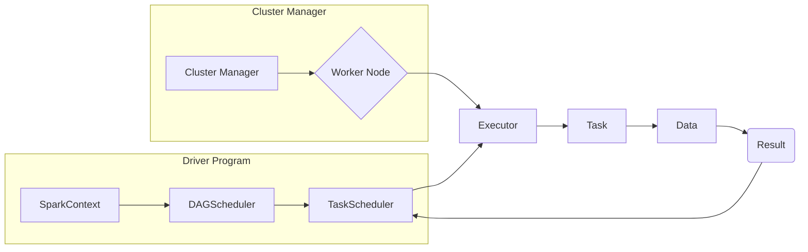

## 1. 背景介绍

### 1.1 大数据处理的挑战与演变

随着互联网和物联网技术的飞速发展，全球数据量呈爆炸式增长，传统的单机处理模式已经无法满足海量数据的处理需求。为了应对这一挑战，分布式计算应运而生，并迅速成为大数据处理的主流技术。从早期的 Hadoop MapReduce 到后来的 Spark、Flink 等，分布式计算框架不断演进，性能和易用性不断提升，极大地推动了大数据技术的普及和应用。

### 1.2 Spark 简介及其优势

Spark 是一种快速、通用、可扩展的集群计算引擎，专为处理大规模数据集而设计。与 Hadoop MapReduce 相比，Spark 具有以下显著优势：

* **更快的处理速度：** Spark 基于内存计算，将中间数据存储在内存中，避免了频繁的磁盘 I/O 操作，从而大大提高了数据处理速度。
* **更强的实时性：** Spark 支持实时流处理，可以对实时数据流进行低延迟处理，满足实时性要求较高的应用场景。
* **更易用：** Spark 提供了丰富的 API 和高级抽象，支持多种编程语言，例如 Java、Scala、Python 和 R，方便开发者快速上手。
* **更广泛的应用场景：** Spark 不仅可以用于批处理，还可以用于交互式查询、机器学习、图计算等多种应用场景。

### 1.3 Spark Driver 的作用和重要性

在 Spark 集群中，Driver 是一个关键组件，负责协调和管理整个应用程序的执行过程。它负责将用户提交的应用程序代码转换为可执行的任务，并将这些任务分配给 Executor 节点执行。同时，Driver 还负责收集 Executor 节点的执行结果，并将最终结果返回给用户。

了解 Spark Driver 的工作原理对于理解 Spark 应用程序的执行过程至关重要。只有深入理解了 Driver 的作用和机制，才能更好地进行 Spark 应用程序的开发、调试和性能优化。

## 2. 核心概念与联系

### 2.1 Spark 运行架构

为了更好地理解 Spark Driver 的作用，我们先来了解一下 Spark 的运行架构。Spark 运行架构主要由以下组件组成：

* **Driver:** 驱动程序，负责协调和管理整个应用程序的执行过程。
* **Executor:** 执行器，负责执行 Driver 分配的任务。
* **Cluster Manager:** 集群管理器，负责管理集群资源，例如 Yarn、Mesos 或 Standalone。
* **Worker Node:** 工作节点，指集群中可以运行 Executor 的节点。

下图展示了 Spark 运行架构的示意图：



### 2.2 Spark 应用程序执行流程

当用户提交一个 Spark 应用程序时，会经历以下步骤：

1. **启动 Driver：** 用户提交应用程序后，首先会启动一个 Driver 进程。
2. **创建 SparkContext：** Driver 进程启动后，会创建一个 SparkContext 对象，该对象是 Spark 应用程序的入口点，负责与集群管理器进行交互。
3. **构建 DAG：** SparkContext 会根据用户编写的代码构建一个 Directed Acyclic Graph (DAG)，该图描述了应用程序的计算流程。
4. **划分 Stage：** DAGScheduler 会将 DAG 划分为多个 Stage，每个 Stage 包含多个可以并行执行的任务。
5. **调度 Task：** TaskScheduler 会将 Task 分配给 Executor 节点执行。
6. **执行 Task：** Executor 节点收到 Task 后，会启动一个或多个线程执行 Task 中的代码。
7. **返回结果：** Executor 节点执行 Task 完成后，会将结果返回给 Driver。
8. **结束应用程序：** Driver 收集到所有 Task 的结果后，会结束应用程序。

### 2.3 Driver 的核心职责

在 Spark 应用程序的执行过程中，Driver 主要负责以下工作：

* **维护 SparkContext：** SparkContext 是 Spark 应用程序的入口点，Driver 负责创建和维护 SparkContext 对象。
* **构建 DAG：** Driver 负责根据用户编写的代码构建 DAG，并将其划分为多个 Stage。
* **调度 Task：** Driver 负责将 Task 分配给 Executor 节点执行，并监控 Task 的执行状态。
* **收集结果：** Driver 负责收集 Executor 节点的执行结果，并将最终结果返回给用户。
* **处理错误：** Driver 负责处理应用程序执行过程中出现的错误，例如 Task 执行失败、网络连接中断等。

## 3. 核心算法原理具体操作步骤

### 3.1 Spark Driver 初始化

当用户提交 Spark 应用程序时，首先会启动一个 Driver 进程。Driver 进程启动后，会进行以下初始化操作：

1. **加载 Spark 配置：** Driver 会加载 Spark 的配置文件，例如 `spark-defaults.conf` 和 `spark-env.sh`，并根据配置文件初始化 SparkConf 对象。
2. **创建 SparkContext：** Driver 会使用 SparkConf 对象创建 SparkContext 对象，SparkContext 是 Spark 应用程序的入口点，负责与集群管理器进行交互。
3. **注册应用程序：** Driver 会向集群管理器注册应用程序，并申请运行 Executor 所需的资源。

### 3.2 DAG 构建与 Stage 划分

SparkContext 创建完成后，会根据用户编写的代码构建 DAG。DAG 是一个有向无环图，描述了应用程序的计算流程。DAG 的构建过程如下：

1. **解析代码：** SparkContext 会解析用户编写的代码，识别出其中的 Transformation 和 Action 操作。
2. **构建 RDD 血缘关系：** Transformation 操作会生成新的 RDD，SparkContext 会记录 RDD 之间的血缘关系，形成一个 DAG。
3. **划分 Stage：** DAGScheduler 会根据 RDD 之间的依赖关系，将 DAG 划分为多个 Stage。Stage 是可以并行执行的任务集合，同一个 Stage 中的任务可以并行执行，不同 Stage 之间的任务需要按顺序执行。

### 3.3 Task 调度与执行

Stage 划分完成后，TaskScheduler 会将 Task 分配给 Executor 节点执行。Task 调度过程如下：

1. **选择 Executor：** TaskScheduler 会根据数据本地性原则，选择距离数据最近的 Executor 节点执行 Task。
2. **启动 Task：** TaskScheduler 会向 Executor 节点发送启动 Task 的请求，Executor 节点收到请求后，会启动一个或多个线程执行 Task。
3. **监控 Task 状态：** TaskScheduler 会监控 Task 的执行状态，如果 Task 执行失败，会尝试重新调度 Task 到其他 Executor 节点执行。

### 3.4 结果收集与返回

Executor 节点执行 Task 完成后，会将结果返回给 Driver。Driver 收集到所有 Task 的结果后，会将最终结果返回给用户。结果收集过程如下：

1. **Executor 返回结果：** Executor 节点执行 Task 完成后，会将结果写入到存储系统中，例如 HDFS 或本地磁盘。
2. **Driver 读取结果：** Driver 会从存储系统中读取 Executor 节点的执行结果。
3. **合并结果：** Driver 会将所有 Executor 节点的结果合并成最终结果。
4. **返回结果：** Driver 会将最终结果返回给用户。

## 4. 数学模型和公式详细讲解举例说明

在 Spark Driver 的工作过程中，涉及到一些重要的数学模型和公式，例如数据本地性、任务调度算法等。本节将对这些数学模型和公式进行详细讲解，并结合实例说明其应用。

### 4.1 数据本地性

数据本地性是指计算任务与数据之间的距离。在 Spark 中，数据本地性分为以下几种级别：

* **PROCESS_LOCAL：** 数据与计算任务在同一个进程中，速度最快。
* **NODE_LOCAL：** 数据与计算任务在同一个节点上，速度较快。
* **RACK_LOCAL：** 数据与计算任务在同一个机架上，速度一般。
* **ANY：** 数据与计算任务不在同一个机架上，速度最慢。

Spark 在调度 Task 时，会优先考虑数据本地性，尽量将 Task 调度到距离数据最近的 Executor 节点执行，以减少数据传输成本，提高应用程序的性能。

**示例：**

假设有一个 Spark 应用程序，需要对存储在 HDFS 上的数据进行处理。HDFS 文件存储在三个节点上，分别为 Node1、Node2 和 Node3。应用程序启动了两个 Executor 节点，分别为 Executor1 和 Executor2。Executor1 运行在 Node1 上，Executor2 运行在 Node2 上。

```
+-----+-----+-----+
| N1  | N2  | N3  |
+-----+-----+-----+
| D1  | D2  | D3  |
+-----+-----+-----+
| E1  | E2  |     |
+-----+-----+-----+
```

其中，D1、D2 和 D3 分别表示存储在 Node1、Node2 和 Node3 上的数据块。E1 和 E2 分别表示 Executor1 和 Executor2。

如果应用程序需要处理 D1 数据块，那么 Spark 会优先将 Task 调度到 Executor1 执行，因为 Executor1 与 D1 数据块在同一个节点上，数据本地性级别为 NODE_LOCAL。

如果应用程序需要处理 D3 数据块，那么 Spark 会将 Task 调度到 Executor1 或 Executor2 执行，因为 Executor1 和 Executor2 都与 D3 数据块不在同一个机架上，数据本地性级别为 ANY。

### 4.2 任务调度算法

Spark 支持多种任务调度算法，例如 FIFO、FAIR 和 Capacity Scheduler。

* **FIFO（先进先出）：** 按照任务提交的顺序调度任务。
* **FAIR（公平调度）：** 每个应用程序获取相同份额的集群资源。
* **Capacity Scheduler（容量调度）：** 根据应用程序的优先级和资源需求调度任务。

**示例：**

假设有两个 Spark 应用程序，分别为 Application1 和 Application2。Application1 提交了 10 个 Task，Application2 提交了 5 个 Task。

* 如果使用 FIFO 调度算法，那么 Application1 的 10 个 Task 会先被调度执行，然后才会调度 Application2 的 5 个 Task。
* 如果使用 FAIR 调度算法，那么 Application1 和 Application2 会平均获取集群资源，Application1 的 Task 和 Application2 的 Task 会交替执行。

## 5. 项目实践：代码实例和详细解释说明

### 5.1 WordCount 实例

下面以 WordCount 程序为例，演示 Spark Driver 的工作流程。WordCount 程序用于统计文本文件中每个单词出现的次数，是一个经典的 MapReduce 示例。

**代码示例：**

```scala
import org.apache.spark.{SparkConf, SparkContext}

object WordCount {
  def main(args: Array[String]): Unit = {
    // 创建 SparkConf 对象
    val conf = new SparkConf().setAppName("WordCount")
    // 创建 SparkContext 对象
    val sc = new SparkContext(conf)

    // 读取文本文件
    val textFile = sc.textFile("hdfs://...")

    // 统计单词出现次数
    val wordCounts = textFile
      .flatMap(_.split(" "))
      .map((_, 1))
      .reduceByKey(_ + _)

    // 打印结果
    wordCounts.foreach(println)

    // 关闭 SparkContext
    sc.stop()
  }
}
```

**代码解释：**

1. **创建 SparkConf 和 SparkContext 对象：** 首先，代码创建了一个 SparkConf 对象，并设置应用程序名称为 "WordCount"。然后，使用 SparkConf 对象创建了一个 SparkContext 对象，SparkContext 是 Spark 应用程序的入口点。
2. **读取文本文件：** 使用 `sc.textFile()` 方法读取 HDFS 上的文本文件，并将文件内容转换为一个 RDD。
3. **统计单词出现次数：** 使用 `flatMap()`、`map()` 和 `reduceByKey()` 方法对 RDD 进行转换，统计每个单词出现的次数。
4. **打印结果：** 使用 `foreach()` 方法遍历结果 RDD，并打印每个单词和其出现次数。
5. **关闭 SparkContext：** 最后，使用 `sc.stop()` 方法关闭 SparkContext。

**执行过程：**

1. 用户提交 WordCount 应用程序。
2. 启动 Driver 进程，Driver 进程加载 Spark 配置，并创建 SparkContext 对象。
3. SparkContext 根据代码构建 DAG，并将 DAG 划分为多个 Stage。
4. TaskScheduler 将 Task 分配给 Executor 节点执行。
5. Executor 节点读取 HDFS 上的文本文件，并执行 WordCount 逻辑。
6. Executor 节点将结果返回给 Driver。
7. Driver 收集所有结果，并将最终结果打印到控制台。

### 5.2 代码优化技巧

在实际项目中，可以通过以下技巧优化 Spark Driver 的性能：

* **减少数据混洗：** 数据混洗是指将数据从一个节点传输到另一个节点的过程，会增加网络传输成本。可以通过合理设计数据分区和使用广播变量等方式减少数据混洗。
* **使用 Kryo 序列化：** Kryo 序列化是一种高效的序列化方式，可以减少数据序列化和反序列化的时间。
* **调整 Executor 资源：** 可以根据应用程序的规模和数据量，调整 Executor 的数量和每个 Executor 的内存大小，以充分利用集群资源。

## 6. 实际应用场景

Spark Driver 广泛应用于各种大数据处理场景，例如：

* **批处理：** 例如，使用 Spark 处理日志文件，统计用户访问量、分析用户行为等。
* **实时流处理：** 例如，使用 Spark Streaming 处理实时数据流，进行实时监控、预警等。
* **机器学习：** 例如，使用 Spark MLlib 构建机器学习模型，进行预测、分类等。
* **图计算：** 例如，使用 Spark GraphX 进行社交网络分析、推荐系统等。

## 7. 工具和资源推荐

### 7.1 开发工具

* **IntelliJ IDEA：** 一款功能强大的 Java 集成开发环境，支持 Scala 和 Spark 开发。
* **Eclipse：** 一款开源的 Java 集成开发环境，支持 Scala 和 Spark 开发。
* **Zeppelin Notebook：** 一款交互式数据分析工具，支持 Spark 和 Python 等多种语言。

### 7.2 学习资源

* **Spark 官方网站：** https://spark.apache.org/
* **Spark Programming Guide：** https://spark.apache.org/docs/latest/programming-guide.html
* **Spark 源码：** https://github.com/apache/spark

## 8. 总结：未来发展趋势与挑战

### 8.1 未来发展趋势

* **云原生 Spark：** 随着云计算的普及，Spark 将更加紧密地与云平台集成，提供更便捷的部署和管理方式。
* **AI 与 Spark 的融合：** Spark 将与人工智能技术更加紧密地结合，例如，使用 Spark 进行分布式深度学习训练。
* **实时性与批处理的融合：** Spark 将进一步提升实时处理能力，同时支持批处理和流处理，满足更多应用场景的需求。

### 8.2 面临的挑战

* **数据安全与隐私保护：** 随着数据量的不断增长，数据安全和隐私保护问题日益突出，Spark 需要不断加强安全机制，保护用户数据安全。
* **性能优化：** 随着数据规模的不断扩大，Spark 需要不断优化性能，提高处理效率。
* **生态系统建设：** Spark 需要不断完善生态系统，提供更多工具和资源，方便开发者使用。

## 9. 附录：常见问题与解答

### 9.1 Spark Driver 的内存不足怎么办？

可以通过以下方式解决 Spark Driver 内存不足的问题：

* **增加 Driver 内存：** 可以通过 `spark.driver.memory` 参数增加 Driver 的内存大小。
* **减少 Driver 任务量：** 可以将部分任务放到 Executor 节点执行，减少 Driver 的工作负载。
* **优化代码：** 可以优化代码，减少内存使用。

### 9.2 Spark Driver 挂掉怎么办？

可以通过以下方式解决 Spark Driver 挂掉的问题：

* **使用 Yarn 或 Mesos 等集群管理器：** 集群管理器可以监控 Driver 的状态，如果 Driver 挂掉，会自动重启 Driver。
* **设置 Driver 重试次数：** 可以通过 `spark.driver.maxAttempts` 参数设置 Driver 的最大重试次数。

### 9.3 如何查看 Spark Driver 的日志？

可以通过以下方式查看 Spark Driver 的日志：

* **在 Spark Web UI 上查看：** 可以通过 Spark Web UI 查看 Driver 的日志信息。
* **在 Yarn 或 Mesos 等集群管理器上查看：** 可以通过 Yarn 或 Mesos 等集群管理器查看 Driver 的日志信息。
