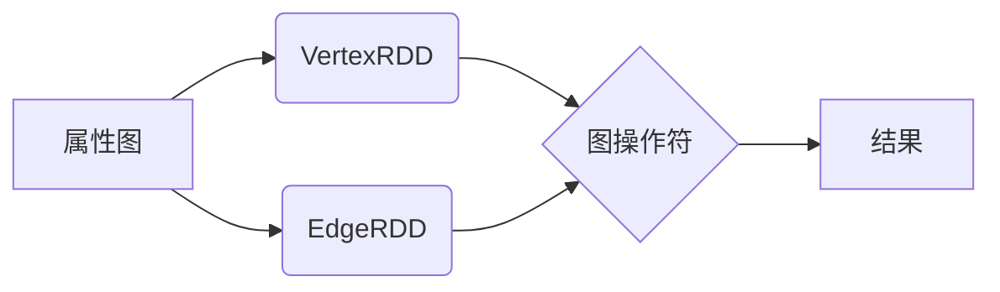

## 1. 背景介绍

### 1.1  大数据时代的图计算

近年来，随着社交网络、电子商务、物联网等领域的快速发展，图数据规模呈爆炸式增长，对图计算的需求也越来越强烈。图计算能够揭示数据之间的复杂关系，发现隐藏的模式和洞察，为决策提供有力支持。

### 1.2  Spark GraphX的诞生

Spark GraphX是Spark生态系统中用于图计算的组件，它结合了Spark的分布式计算能力和图算法的高效性，为大规模图处理提供了强大的解决方案。

### 1.3  GraphX的优势

* **高效性：** 基于Spark平台，支持分布式计算，能够处理大规模图数据。
* **易用性：** 提供了丰富的API和操作符，方便用户进行图分析和计算。
* **灵活性：** 支持多种图算法，并可以与Spark SQL等其他组件集成使用。


## 2. 核心概念与联系

### 2.1  属性图

GraphX使用属性图模型来表示图数据。属性图是一个有向图，其中节点和边都可以拥有属性。

* **节点（Vertex）：** 表示图中的实体，例如用户、商品、网页等。
* **边（Edge）：** 表示节点之间的关系，例如好友关系、购买关系、链接关系等。
* **属性（Property）：** 节点和边的附加信息，例如用户的年龄、商品的价格、网页的标题等。

### 2.2  RDD抽象

GraphX将图数据抽象为RDD（Resilient Distributed Datasets），并提供了两种类型的RDD：

* **VertexRDD:** 存储图的节点信息，每个元素是一个键值对，键为节点ID，值为节点属性。
* **EdgeRDD:** 存储图的边信息，每个元素是一个三元组，包含源节点ID、目标节点ID和边属性。

### 2.3  图操作符

GraphX提供了丰富的图操作符，用于对图数据进行各种操作，例如：

* **结构操作：** subgraph、reverse、joinVertices
* **属性操作：** mapVertices、mapEdges、aggregateMessages
* **图算法：** PageRank、Connected Components、Triangle Counting

### 2.4  核心概念联系图



## 3. 核心算法原理具体操作步骤

### 3.1 PageRank算法

#### 3.1.1 算法原理

PageRank算法用于评估网页的重要性，其基本思想是：一个网页的重要性由链接到它的网页的重要性决定。算法迭代计算每个网页的PageRank值，直到收敛。

#### 3.1.2 操作步骤

1. 初始化所有网页的PageRank值为1/N，其中N为网页总数。
2. 迭代执行以下步骤，直到收敛：
    * 对于每个网页，将其PageRank值平均分配给它链接到的网页。
    * 将每个网页的PageRank值更新为 (1 - d)/N + d * Σ(PR(i)/L(i))，其中d为阻尼因子，PR(i)为链接到该网页的网页i的PageRank值，L(i)为网页i的出度。

#### 3.1.3 代码实例

```scala
// 创建图
val graph = GraphLoader.edgeListFile(sc, "data/web-Google.txt")

// 运行PageRank算法
val ranks = graph.pageRank(0.0001).vertices

// 打印结果
ranks.collect().foreach(println)
```

### 3.2 Connected Components算法

#### 3.2.1 算法原理

Connected Components算法用于找到图中所有连通分量，即相互连通的节点集合。算法从每个节点开始，递归地访问与其相邻的节点，将它们标记为同一个连通分量。

#### 3.2.2 操作步骤

1. 初始化每个节点的连通分量ID为其自身ID。
2. 迭代执行以下步骤，直到收敛：
    * 对于每条边，将源节点和目标节点的连通分量ID设置为较小的ID。

#### 3.2.3 代码实例

```scala
// 创建图
val graph = GraphLoader.edgeListFile(sc, "data/graph.txt")

// 运行Connected Components算法
val cc = graph.connectedComponents().vertices

// 打印结果
cc.collect().foreach(println)
```

## 4. 数学模型和公式详细讲解举例说明

### 4.1 PageRank算法数学模型

$$
PR(A) = (1 - d) + d \sum_{i=1}^{n} \frac{PR(T_i)}{C(T_i)}
$$

其中：

* $PR(A)$：网页 A 的 PageRank 值
* $d$：阻尼因子，通常设置为 0.85
* $T_1, T_2, ..., T_n$：链接到网页 A 的网页集合
* $C(T_i)$：网页 $T_i$ 的出度，即链接到其他网页的数量

### 4.2 PageRank算法公式推导

假设一个网页 A，它被其他 n 个网页链接，分别是 $T_1, T_2, ..., T_n$。那么，网页 A 的 PageRank 值可以表示为：

$$
PR(A) = \frac{1-d}{N} + d (\frac{PR(T_1)}{C(T_1)} + \frac{PR(T_2)}{C(T_2)} + ... + \frac{PR(T_n)}{C(T_n)})
$$

其中：

* $\frac{1-d}{N}$：表示从任何一个网页都有可能跳转到网页 A 的概率，$N$ 为所有网页的数量
* $\frac{PR(T_i)}{C(T_i)}$：表示从网页 $T_i$ 跳转到网页 A 的概率，$C(T_i)$ 为网页 $T_i$ 的出度

将上式简化，就可以得到 PageRank 算法的公式：

$$
PR(A) = (1 - d) + d \sum_{i=1}^{n} \frac{PR(T_i)}{C(T_i)}
$$

### 4.3  举例说明

假设有 A、B、C 三个网页，A 链接到 B，B 链接到 A 和 C，C 链接到 A，阻尼因子 d=0.85。

* 初始化：PR(A) = PR(B) = PR(C) = 1/3
* 迭代 1：
    * PR(A) = (1-0.85) + 0.85 * (PR(B)/2 + PR(C)/1) = 0.475
    * PR(B) = (1-0.85) + 0.85 * (PR(A)/1) = 0.2625
    * PR(C) = (1-0.85) + 0.85 * (PR(B)/2) = 0.2625
* 迭代 2：
    * PR(A) = ...
    * PR(B) = ...
    * PR(C) = ...
* ... 直到 PR 值收敛

## 5. 项目实践：代码实例和详细解释说明

### 5.1  社交网络分析

#### 5.1.1 项目背景

社交网络分析可以帮助我们了解用户之间的关系、发现社群结构、预测用户行为等。

#### 5.1.2 数据集

使用 Twitter 用户关系数据集，该数据集包含用户 ID 和其关注的用户 ID。

#### 5.1.3 代码实例

```scala
// 读取数据
val users = sc.textFile("data/twitter_users.txt")
  .map(_.split(","))
  .map(x => (x(0).toLong, x(1).toLong))

// 创建图
val graph = Graph.fromEdgeTuples(users)

// 运行 Louvain 社区发现算法
val louvain = graph.louvain

// 获取每个节点所属的社区 ID
val community = louvain.vertices

// 打印结果
community.collect().foreach(println)
```

#### 5.1.4 代码解释

1. 读取 Twitter 用户关系数据集，并将每行数据转换为 (用户 ID, 关注的用户 ID) 的键值对。
2. 使用 `Graph.fromEdgeTuples()` 方法创建图。
3. 运行 Louvain 社区发现算法，该算法是一种基于贪婪算法的社区发现算法，能够快速找到图中的社群结构。
4. 使用 `louvain.vertices` 获取每个节点所属的社区 ID。
5. 打印结果。

### 5.2  商品推荐

#### 5.2.1 项目背景

商品推荐可以根据用户的历史行为和兴趣，推荐用户可能感兴趣的商品。

#### 5.2.2 数据集

使用 MovieLens 电影评分数据集，该数据集包含用户 ID、电影 ID、评分和时间戳。

#### 5.2.3 代码实例

```scala
// 读取数据
val ratings = sc.textFile("data/ratings.csv")
  .map(_.split(","))
  .map(x => Rating(x(0).toInt, x(1).toInt, x(2).toDouble))

// 创建图
val graph = Graph.fromEdges(ratings.map(x => Edge(x.user, x.product, x.rating)), 0.0)

// 计算每个用户的平均评分
val userAvgRatings = graph.aggregateMessages[(Double, Long)](
  ctx => { ctx.sendToSrc((ctx.attr, 1L)); ctx.sendToDst((ctx.attr, 1L)) },
  (a, b) => (a._1 + b._1, a._2 + b._2)
).mapValues(x => x._1 / x._2)

// 查找与用户共同评分过的商品
val userSimilarities = graph.aggregateMessages[Set[Int]](
  ctx => {
    if (ctx.srcAttr > userAvgRatings(ctx.srcId) && ctx.dstAttr > userAvgRatings(ctx.dstId)) {
      ctx.sendToSrc(Set(ctx.dstId))
      ctx.sendToDst(Set(ctx.srcId))
    }
  },
  (a, b) => a ++ b
)

// 推荐商品
val recommendations = userSimilarities.join(userAvgRatings)
  .flatMap { case (userId, (similarUsers, avgRating)) =>
    similarUsers.map(similarUserId => (similarUserId, avgRating))
  }
  .groupByKey()
  .mapValues { ratings =>
    ratings.toList.sortBy(-_._2).take(10).map(_._1)
  }

// 打印结果
recommendations.collect().foreach(println)
```

#### 5.2.4 代码解释

1. 读取 MovieLens 电影评分数据集，并将每行数据转换为 `Rating` 对象。
2. 使用 `Graph.fromEdges()` 方法创建图，边属性为评分。
3. 计算每个用户的平均评分，用于过滤评分较低的商品。
4. 查找与用户共同评分过的商品，并将商品 ID 发送给用户。
5. 将相似用户和平均评分连接起来，并按照平均评分排序，取前 10 个商品作为推荐结果。
6. 打印结果。

## 6. 工具和资源推荐

### 6.1  Spark GraphX官方文档

* 地址：https://spark.apache.org/docs/latest/graphx-programming-guide.html

### 6.2  GraphFrames

* 地址：https://graphframes.github.io/graphframes/docs/_site/user-guide.html
* 简介：GraphFrames 是建立在 Spark DataFrames 之上的图处理库，提供了更高级的 API 和功能。

### 6.3  Neo4j

* 地址：https://neo4j.com/
* 简介：Neo4j 是一款流行的图形数据库，支持高性能图查询和分析。

## 7. 总结：未来发展趋势与挑战

### 7.1  发展趋势

* **图神经网络 (GNN)：** 将深度学习技术应用于图数据，实现更强大的图分析和预测能力。
* **图数据库：** 随着图数据规模的不断增长，图数据库将成为存储和管理图数据的首选方案。
* **图计算与其他技术的融合：** 图计算将与机器学习、人工智能等技术深度融合，为解决更复杂的实际问题提供支持。

### 7.2  挑战

* **图数据的规模和复杂性：** 处理大规模、高维、动态变化的图数据仍然是一个挑战。
* **图算法的效率和可扩展性：** 设计高效、可扩展的图算法是图计算领域的重要研究方向。
* **图计算平台的易用性和可维护性：** 降低图计算平台的使用门槛，提高其可维护性，对于推动图计算技术的普及至关重要。

## 8. 附录：常见问题与解答

### 8.1  如何选择合适的图计算框架？

选择合适的图计算框架需要考虑以下因素：

* 数据规模和类型
* 计算需求
* 性能要求
* 开发成本
* 生态系统

### 8.2  Spark GraphX 和 GraphFrames 有什么区别？

* **API 设计：** GraphFrames 基于 Spark DataFrames，提供更高级、更易用的 API。
* **功能：** GraphFrames 提供了一些 Spark GraphX 没有的功能，例如 motif finding、statistical analysis。
* **性能：** Spark GraphX 在处理大规模图数据时通常具有更好的性能。

### 8.3  如何学习图计算？

* 学习图论基础知识。
* 了解常见的图算法。
* 选择一个图计算框架，并学习其 API 和使用方法。
* 实践项目，例如社交网络分析、商品推荐等。


希望这篇博客能够帮助你更好地理解 Spark GraphX 的原理和应用。
