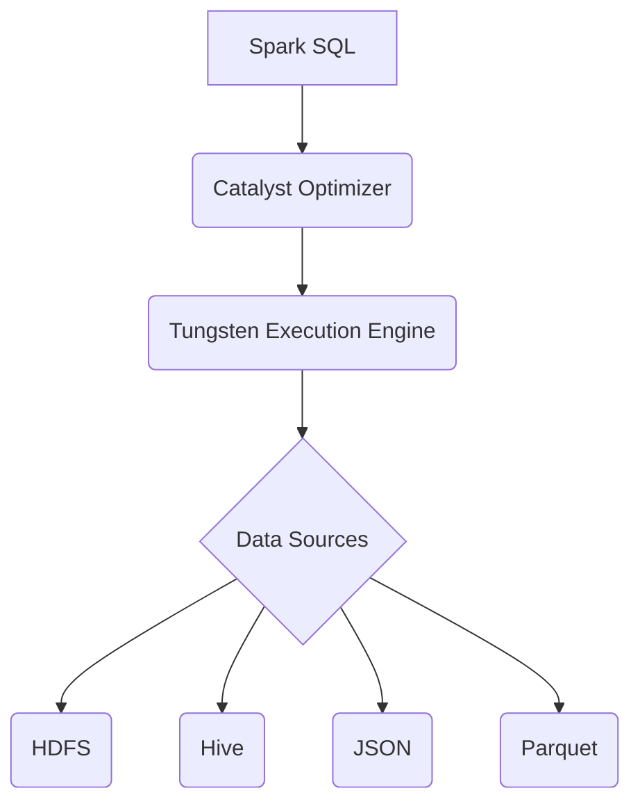

# Spark SQL 原理与代码实例讲解

作者：禅与计算机程序设计艺术

## 1. 背景介绍

### 1.1 大数据时代的SQL需求

随着互联网和移动互联网的快速发展，全球数据量呈爆炸式增长，传统的数据库系统已经难以满足海量数据的存储和处理需求。为了应对这一挑战，各种大数据处理技术应运而生，其中以 Hadoop 为代表的分布式计算框架成为了主流解决方案。然而，Hadoop 的 MapReduce 编程模型较为复杂，对于熟悉 SQL 的数据分析师和工程师来说不够友好。

为了降低大数据处理的门槛，Spark 应运而生。Spark 是一个快速、通用、可扩展的集群计算引擎，它提供了比 MapReduce 更高层次的抽象，并且支持多种编程语言，包括 Java、Scala、Python 和 R。Spark SQL 是 Spark 生态系统中的一个重要组件，它允许用户使用标准 SQL 语句来查询和分析存储在各种数据源中的数据，例如 HDFS、Hive、JSON 文件、Parquet 文件等。

### 1.2 Spark SQL 的优势

Spark SQL 之所以能够在大数据领域得到广泛应用，主要得益于以下几个方面的优势：

* **易用性：** Spark SQL 提供了标准的 SQL 接口，用户可以使用熟悉的 SQL 语句进行数据查询和分析，无需学习复杂的编程模型。
* **高性能：** Spark SQL 基于 Spark 的内存计算引擎，能够将数据缓存到内存中进行处理，从而大幅提升查询速度。
* **可扩展性：** Spark SQL 可以运行在由数百台甚至数千台服务器组成的集群上，能够处理 PB 级的数据量。
* **丰富的功能：** Spark SQL 支持多种数据源、数据类型、内置函数和用户自定义函数，能够满足各种复杂的数据分析需求。
* **活跃的社区：** Spark SQL 是 Apache 基金会的顶级项目，拥有庞大的开发者社区和活跃的生态系统，可以为用户提供丰富的文档、教程和技术支持。

## 2. 核心概念与联系

### 2.1 Spark SQL 架构

Spark SQL 的核心架构如下图所示：



* **Spark SQL:** Spark SQL 是 Spark 的模块之一，它提供了一种使用 SQL 或 DataFrame 和 Dataset API 来处理结构化数据的编程抽象。
* **Catalyst Optimizer:** Catalyst 是 Spark SQL 的查询优化器，它使用基于规则的优化技术将 SQL 查询转换为高效的执行计划。
* **Tungsten Execution Engine:** Tungsten 是 Spark SQL 的执行引擎，它负责将 Catalyst 生成的执行计划转换为物理执行计划，并调度任务到集群中执行。
* **Data Sources:** Spark SQL 支持多种数据源，包括 HDFS、Hive、JSON 文件、Parquet 文件等。

### 2.2 DataFrame 和 Dataset

DataFrame 和 Dataset 是 Spark SQL 中两种重要的数据抽象：

* **DataFrame:** DataFrame 是一个分布式数据集合，它以命名的列的形式组织数据，类似于关系型数据库中的表。DataFrame 提供了一种领域特定语言（DSL）来操作数据，例如 `select()`、`filter()`、`groupBy()` 等。
* **Dataset:** Dataset 是 DataFrame 的类型安全的版本，它在编译时进行类型检查，可以提供更好的代码提示和错误检查。

### 2.3 Catalyst Optimizer

Catalyst Optimizer 是 Spark SQL 的查询优化器，它使用基于规则的优化技术将 SQL 查询转换为高效的执行计划。Catalyst 的主要优化步骤包括：

* **词法分析和语法分析:** 将 SQL 查询语句解析成抽象语法树（AST）。
* **逻辑计划生成:** 将 AST 转换为逻辑计划，逻辑计划是一个关系代数表达式树。
* **逻辑计划优化:** 对逻辑计划进行优化，例如谓词下推、列裁剪、常量折叠等。
* **物理计划生成:** 将逻辑计划转换为物理计划，物理计划指定了如何在集群中执行查询。
* **物理计划优化:** 对物理计划进行优化，例如选择合适的连接算法、数据分区策略等。

## 3. 核心算法原理具体操作步骤

### 3.1 创建 DataFrame

可以使用以下几种方式创建 DataFrame：

* **从现有的 RDD 创建:**

```scala
val spark = SparkSession.builder().appName("Spark SQL Example").getOrCreate()

val data = Seq(
  ("Alice", 25),
  ("Bob", 30),
  ("Charlie", 28)
)
val rdd = spark.sparkContext.parallelize(data)

import spark.implicits._
val df = rdd.toDF("name", "age")
```

* **从外部数据源创建:**

```scala
val df = spark.read.json("data.json")
```

* **使用 case class 创建:**

```scala
case class Person(name: String, age: Int)
val data = Seq(
  Person("Alice", 25),
  Person("Bob", 30),
  Person("Charlie", 28)
)
import spark.implicits._
val df = spark.createDataFrame(data)
```

### 3.2 查询 DataFrame

可以使用以下几种方式查询 DataFrame：

* **使用 DSL:**

```scala
df.select("name").show()
df.filter($"age" > 25).show()
df.groupBy("age").count().show()
```

* **使用 SQL:**

```scala
df.createOrReplaceTempView("people")
spark.sql("SELECT * FROM people WHERE age > 25").show()
```

### 3.3 DataFrame 操作

DataFrame 提供了丰富的操作方法，例如：

* **select():** 选择指定的列。
* **filter():** 过滤符合条件的行。
* **groupBy():** 按指定的列分组。
* **orderBy():** 按指定的列排序。
* **join():** 连接两个 DataFrame。
* **union():** 合并两个 DataFrame。

## 4. 数学模型和公式详细讲解举例说明

### 4.1 关系代数

Spark SQL 的查询优化器基于关系代数进行优化，关系代数是一种基于集合的查询语言，它定义了一组操作符，可以对关系进行操作。常用的关系代数操作符包括：

* **选择（σ）:** 从关系中选择满足条件的元组。
* **投影（π）:** 从关系中选择指定的属性。
* **并集（∪）:** 合并两个关系。
* **交集（∩）:** 求两个关系的公共部分。
* **差集（-）:** 求两个关系的差集。
* **笛卡尔积（×）:** 将两个关系的每个元组合并成一个新的元组。
* **连接（⋈）:** 根据指定的条件连接两个关系。

### 4.2 查询优化示例

假设有一个名为 `orders` 的 DataFrame，包含以下数据：

| order_id | customer_id | product_id | amount |
|---|---|---|---|
| 1 | 100 | 1 | 10 |
| 2 | 101 | 2 | 20 |
| 3 | 100 | 3 | 30 |
| 4 | 102 | 1 | 40 |

现在要查询所有订单金额大于 20 的订单，可以使用以下 SQL 语句：

```sql
SELECT * FROM orders WHERE amount > 20
```

Catalyst Optimizer 会将该 SQL 语句转换为以下逻辑计划：

```
Relation(orders)
  Filter(amount > 20)
```

然后，Catalyst Optimizer 会对逻辑计划进行优化，例如将 Filter 操作下推到 Relation 操作，以减少数据读取量：

```
Filter(amount > 20)
  Relation(orders)
```

最后，Catalyst Optimizer 会将逻辑计划转换为物理计划，并调度任务到集群中执行。

## 5. 项目实践：代码实例和详细解释说明

### 5.1 Word Count 示例

本示例演示如何使用 Spark SQL 统计文本文件中每个单词出现的次数。

```scala
import org.apache.spark.sql.SparkSession

object WordCount {
  def main(args: Array[String]): Unit = {
    val spark = SparkSession.builder().appName("Word Count").getOrCreate()

    val textFile = spark.read.textFile("input.txt")

    import spark.implicits._
    val counts = textFile
      .flatMap(line => line.split(" "))
      .map(word => (word, 1))
      .reduceByKey(_ + _)

    counts.show()

    spark.stop()
  }
}
```

**代码解释：**

1. 创建 SparkSession 对象。
2. 读取文本文件到 DataFrame 中。
3. 使用 flatMap() 方法将每行文本拆分成单词。
4. 使用 map() 方法将每个单词映射成 (word, 1) 的键值对。
5. 使用 reduceByKey() 方法统计每个单词出现的次数。
6. 使用 show() 方法打印结果。

### 5.2 数据分析示例

本示例演示如何使用 Spark SQL 对销售数据进行分析。

```scala
import org.apache.spark.sql.SparkSession
import org.apache.spark.sql.functions._

object SalesAnalysis {
  def main(args: Array[String]): Unit = {
    val spark = SparkSession.builder().appName("Sales Analysis").getOrCreate()

    val sales = spark.read.format("csv")
      .option("header", "true")
      .option("inferSchema", "true")
      .load("sales.csv")

    // 计算总销售额
    val totalSales = sales.agg(sum("amount")).first().getDouble(0)
    println(s"Total sales: $totalSales")

    // 计算每个产品的销售额
    val productSales = sales
      .groupBy("product_id")
      .agg(sum("amount").alias("total_amount"))
      .orderBy(desc("total_amount"))
    productSales.show()

    // 计算每个客户的平均订单金额
    val customerAvgOrderAmount = sales
      .groupBy("customer_id")
      .agg(avg("amount").alias("avg_order_amount"))
      .orderBy(desc("avg_order_amount"))
    customerAvgOrderAmount.show()

    spark.stop()
  }
}
```

**代码解释：**

1. 创建 SparkSession 对象。
2. 读取销售数据到 DataFrame 中。
3. 使用 agg() 方法计算总销售额。
4. 使用 groupBy() 和 agg() 方法计算每个产品的销售额。
5. 使用 groupBy() 和 agg() 方法计算每个客户的平均订单金额。

## 6. 工具和资源推荐

* **Apache Spark 官网:** https://spark.apache.org/
* **Spark SQL 文档:** https://spark.apache.org/docs/latest/sql/
* **Databricks 社区版:** https://databricks.com/try-databricks
* **Spark 入门教程:** https://spark.apache.org/docs/latest/getting-started.html

## 7. 总结：未来发展趋势与挑战

### 7.1 未来发展趋势

* **更智能的查询优化器:** 随着机器学习和人工智能技术的发展，Spark SQL 的查询优化器将会变得更加智能，能够自动识别数据模式和查询意图，并生成更优的执行计划。
* **更丰富的内置函数和数据类型:** Spark SQL 将会支持更多的内置函数和数据类型，以满足更广泛的数据分析需求。
* **更紧密的云集成:** Spark SQL 将会与云平台进行更紧密的集成，例如 Amazon EMR、Google Cloud Dataproc 和 Azure HDInsight，以提供更便捷的大数据处理服务。

### 7.2 面临的挑战

* **处理非结构化数据:** 虽然 Spark SQL 在处理结构化数据方面表现出色，但在处理非结构化数据（例如文本、图像、视频）方面还存在一些挑战。
* **实时数据处理:** 随着物联网和流媒体应用的普及，实时数据处理需求日益增长，Spark SQL 需要进一步提升实时数据处理能力。
* **安全性和隐私保护:** 随着数据量的不断增长，数据安全性和隐私保护问题日益突出，Spark SQL 需要采取更有效的措施来保障数据的安全性和隐私。

## 8. 附录：常见问题与解答

### 8.1 如何查看 Spark SQL 的执行计划？

可以使用 `explain()` 方法查看 Spark SQL 的执行计划，例如：

```scala
spark.sql("SELECT * FROM orders WHERE amount > 20").explain()
```

### 8.2 如何缓存 DataFrame？

可以使用 `cache()` 方法将 DataFrame 缓存到内存中，例如：

```scala
df.cache()
```

### 8.3 如何将 DataFrame 保存到外部数据源？

可以使用 `write()` 方法将 DataFrame 保存到外部数据源，例如：

```scala
df.write.format("parquet").save("output.parquet")
```
