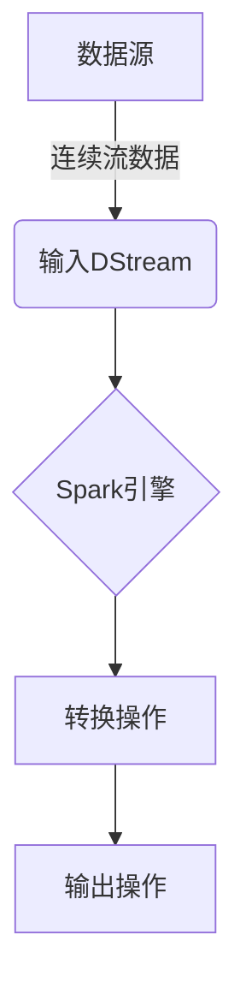
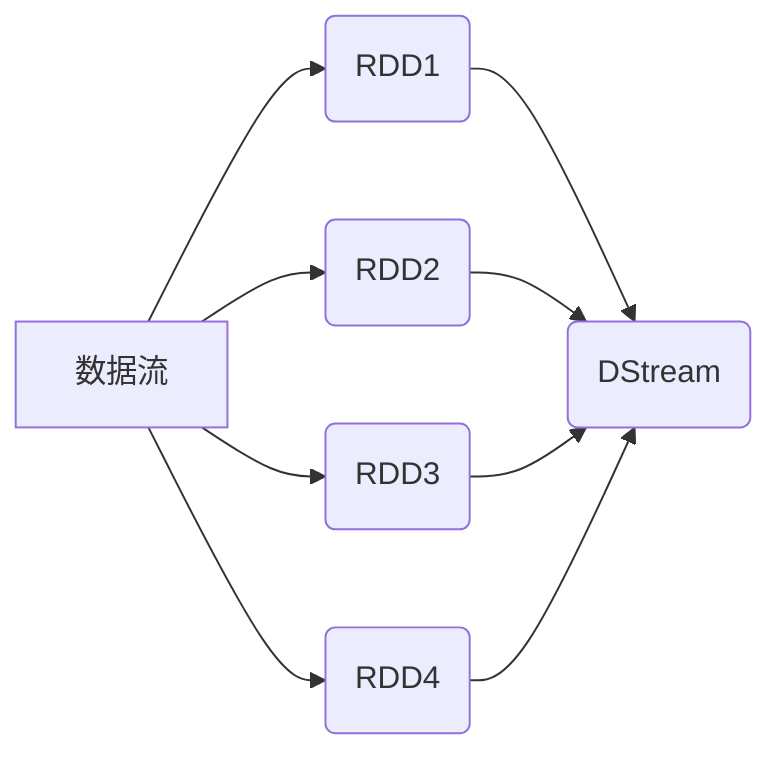
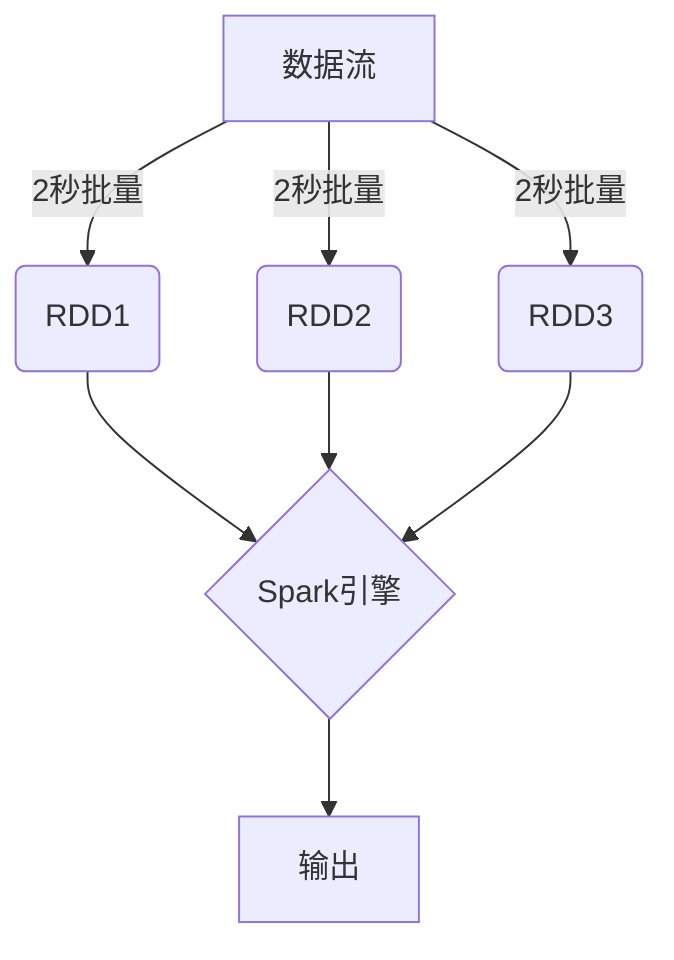

# Spark Streaming 原理与代码实例讲解

## 1. 背景介绍

### 1.1 大数据流处理的需求

在当今快速发展的数字时代，数据正以前所未有的速度和规模被产生。从社交媒体上传的图片和视频、网络日志、传感器数据到金融交易记录等等,都构成了持续不断的数据流。传统的批处理系统无法及时处理这些持续到来的数据流,因此出现了对实时数据流处理的迫切需求。

### 1.2 Spark Streaming 的诞生

Apache Spark 是一个开源的大数据处理框架,它提供了一种称为 Spark Streaming 的流处理引擎。Spark Streaming 可以实时地从许多数据源(如 Kafka、Flume、Kinesis 等)中获取数据流,并使用 Spark 的高度容错且可扩展的计算引擎对数据进行处理。

### 1.3 Spark Streaming 的优势

相比传统的流处理系统,Spark Streaming 具有以下几个关键优势:

1. **容错性强**: Spark Streaming 能够从源头重新计算,并根据检查点机制进行恢复,从而提供了高容错能力。
2. **统一的批处理和流处理**: Spark Streaming 将流处理视为一系列小批量,从而可以使用相同的代码和集群资源来处理批处理和流处理工作负载。
3. **与Spark生态系统集成**: 由于Spark Streaming构建于Spark之上,因此可以无缝集成Spark的各种库,如Spark SQL、MLlib、GraphX等。
4. **高度可伸缩**: Spark Streaming 可以轻松扩展到数千个节点的集群,并利用内存计算来提高处理速度。

## 2. 核心概念与联系 

### 2.1 Spark Streaming 架构

Spark Streaming 的架构主要包括以下几个核心组件:

1. **输入 DStream**: 连续的数据流被表示为一个无休止的输入数据流,称为 DStream(Discretized Stream)。
2. **Spark 引擎**: Spark 引擎用于执行流式计算,包括调度、内存管理、容错等。
3. **输出操作**: 经过处理后的数据流可以被重新发送到文件系统、数据库或实时仪表盘。



### 2.2 DStream(Discretized Stream)

DStream 是 Spark Streaming 中最核心的抽象概念。它代表一个连续的数据流,其内部由一系列连续的 RDD(Resilient Distributed Dataset) 组成。



每个 RDD 都包含一个特定时间间隔内的数据,如下所示:

```
DStream = Stream of RDDs
           = RDD1 U RDD2 U RDD3 U ...
```

通过对 DStream 应用各种转换操作(如 `map`、`filter`、`reduceByKey` 等),可以生成新的 DStream,从而构建流式计算的数据流水线。

### 2.3 处理模型

Spark Streaming 采用微批处理的模式,将连续的数据流划分为一系列小批量(如 2 秒一批)。每个批量都被当作一个 Spark RDD 来处理,从而可以复用 Spark 现有的批处理架构。



这种处理模型带来了以下优势:

1. **容错性**: 由于基于 RDD,可以通过检查点和重新计算来实现容错。
2. **一致性**: 批处理和流处理使用相同的代码,有助于代码复用和一致性。
3. **集成**: 可以与 Spark 生态系统中的其他库(如 Spark SQL、MLlib 等)无缝集成。

## 3. 核心算法原理具体操作步骤

### 3.1 数据接收

Spark Streaming 可以从多种来源接收数据流,如 Kafka、Flume、Kinesis 等。下面以 Kafka 为例,介绍如何创建输入 DStream。

```scala
import org.apache.spark.streaming.kafka010.KafkaUtils
import org.apache.spark.streaming.{StreamingContext, Seconds}

val kafkaParams = Map(
  "bootstrap.servers" -> "localhost:9092",
  "key.deserializer" -> classOf[StringDeserializer],
  "value.deserializer" -> classOf[StringDeserializer],
  "group.id" -> "spark-streaming-consumer",
  "auto.offset.reset" -> "latest"
)

val topics = Array("topic1", "topic2")

val stream = KafkaUtils.createDirectStream(
  streamingContext,
  LocationStrategies.PreferConsistent,
  ConsumerStrategies.Subscribe[String, String](topics, kafkaParams)
)
```

在上面的示例中,我们首先定义了 Kafka 的配置参数,然后使用 `KafkaUtils.createDirectStream` 创建了一个从 Kafka 主题 `topic1` 和 `topic2` 中读取数据的输入 DStream。

### 3.2 转换操作

获取到输入 DStream 后,我们可以对其应用各种转换操作,如 `map`、`flatMap`、`filter`、`reduceByKey` 等,从而构建出所需的数据流水线。

```scala
val words = stream.flatMap(record => record.value().split(" "))
val pairs = words.map(word => (word, 1))
val wordCounts = pairs.reduceByKey(_ + _)
```

在上面的示例中,我们首先将每条记录拆分为单词,然后对单词进行计数,最终得到每个单词出现的次数。

需要注意的是,Spark Streaming 的转换操作与 Spark 核心的 RDD 转换操作非常相似,这使得批处理和流处理的代码可以高度复用。

### 3.3 输出操作

经过一系列转换后,我们可以将计算结果输出到各种目的地,如文件系统、数据库或仪表盘等。

```scala
wordCounts.print()
```

上面的示例将单词计数结果打印到控制台。除此之外,我们还可以使用 `foreachRDD` 操作对每个 RDD 执行任意操作,如将数据写入外部系统。

```scala
wordCounts.foreachRDD { rdd =>
  rdd.foreachPartition { partitionRecords =>
    val conn = createNewConnection() // 获取数据库连接
    partitionRecords.foreach { record =>
      val word = record._1
      val count = record._2
      saveToDatabase(word, count, conn) // 保存到数据库
    }
    conn.close()
  }
}
```

上面的示例演示了如何将计算结果保存到数据库中。我们使用 `foreachRDD` 对每个 RDD 执行操作,在每个分区内获取数据库连接,然后将分区中的记录保存到数据库中。

### 3.4 容错机制

Spark Streaming 提供了强大的容错机制,确保在发生故障时可以恢复计算状态。主要包括以下两种方式:

1. **基于 RDD 的容错**

由于 DStream 内部由 RDD 组成,因此可以利用 RDD 的容错机制来实现容错。如果在计算某个 RDD 时发生故障,Spark 会自动重新计算该 RDD。

2. **检查点机制**

Spark Streaming 还提供了检查点机制,可以定期将计算状态保存到外部存储系统(如 HDFS)中。发生故障时,可以从检查点中恢复状态,而不必从头开始重新计算。

```scala
val checkpointDir = "/path/to/checkpoint/dir"
streamingContext.checkpoint(checkpointDir)
```

上面的示例展示了如何为 Spark Streaming 应用程序设置检查点目录。在运行时,计算状态会定期保存到指定的目录中。

## 4. 数学模型和公式详细讲解举例说明

在 Spark Streaming 中,常见的数学模型和公式主要涉及到以下几个方面:

### 4.1 滑动窗口操作

滑动窗口操作是流处理中一种常见的技术,用于对一段时间内的数据进行聚合计算。Spark Streaming 提供了 `window` 操作来支持滑动窗口。

假设我们有一个 DStream,表示每秒钟产生的键值对 $(k, v)$。我们希望计算最近 30 秒内每个键的总和。可以使用以下代码:

```scala
val windowedSum = pairs.window(Seconds(30)).reduceByKey(_ + _)
```

其中,`window(Seconds(30))` 表示创建一个 30 秒的滑动窗口。对于每个新到达的 RDD,窗口会向前滑动,保留最近 30 秒的数据。

更一般地,我们可以定义一个长度为 $n$ 秒、步长为 $m$ 秒的滑动窗口。设 $t$ 为当前时间,则窗口范围为 $[t-n+m, t]$。

$$
\text{Window Range} = [t-n+m, t]
$$

其中,$n$ 表示窗口长度(秒),决定了聚合计算涵盖的时间范围;$m$ 表示步长(秒),决定了窗口滑动的频率。

### 4.2 状态管理

在流处理中,我们常常需要维护一些状态信息,如累加器、广播变量等。Spark Streaming 提供了 `updateStateByKey` 操作,用于管理键值对的状态。

假设我们有一个 DStream,表示每秒钟产生的键值对 $(k, \text{seq}(v_1, v_2, \ldots))$,其中 $v_i$ 是一个数值。我们希望计算每个键的最新值以及历史最大值。可以使用以下代码:

```scala
val updatedValues = pairs.updateStateByKey { (values, state) =>
  val currentValue = values.sum
  val previousMax = state.getOrElse(0.0)
  val newMax = math.max(currentValue, previousMax)
  Some((currentValue, newMax))
}
```

在上面的示例中,`updateStateByKey` 接收一个函数,该函数将当前批次的值和上一个状态作为输入,计算并返回新的状态。

更一般地,设 $k$ 为键,$v_t$ 为时间 $t$ 时刻的值,我们希望维护一个状态 $s_t$。则 `updateStateByKey` 的更新函数可以表示为:

$$
s_t = f(k, v_t, s_{t-1})
$$

其中,$f$ 是用户定义的更新函数,用于根据当前值 $v_t$ 和上一个状态 $s_{t-1}$ 计算新的状态 $s_t$。

### 4.3 连接操作

在流处理中,常常需要将多个数据流进行连接。Spark Streaming 提供了 `join`、`leftOuterJoin`、`cogroup` 等操作,用于实现流与流、流与数据集之间的连接。

假设我们有两个 DStream,分别表示用户行为流和用户配置流。我们希望将两个流连接,得到每个用户的行为及对应配置。可以使用以下代码:

```scala
val userBehaviors = ... // 用户行为流
val userConfigs = ... // 用户配置流

val joinedStream = userBehaviors.join(userConfigs)
```

在上面的示例中,`join` 操作将两个流按照键进行内连接,生成一个新的 DStream,其中每个记录包含了用户行为和对应的配置信息。

更一般地,设有两个 DStream $A$ 和 $B$,其中 $A$ 的记录为 $(k, v_A)$,$B$ 的记录为 $(k, v_B)$。则 `join` 操作可以表示为:

$$
A \Join B = \{ (k, (v_A, v_B)) \mid k \in A.keys \cap B.keys \}
$$

其中,结果 DStream 中的每个记录包含了来自 $A$ 和 $B$ 的值。

## 4. 项目实践:代码实例和详细解释说明

在本节,我们将通过一个实际项目案例,演示如何使用 Spark Streaming 进行实时数据处理。

### 4.1 项目背景

假设我们是一家电子商务公司,需要实时分析网站访问日志,以了解用户行为并优化网站体验。具体需求如下:

1. 从 Kafka 中实时