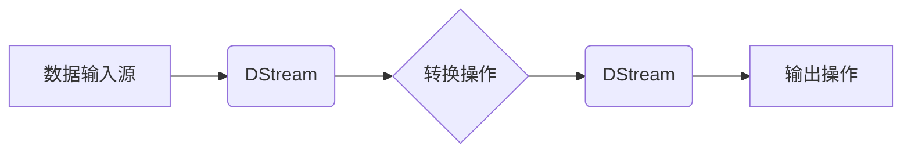

## 1. 背景介绍

### 1.1 大数据时代的实时数据处理需求
随着互联网和物联网技术的飞速发展，全球数据量呈爆炸式增长，其中蕴藏着巨大的商业价值和社会效益。实时数据处理作为大数据领域的关键技术之一，能够帮助企业及时洞察市场变化、优化运营效率、提升用户体验，并在金融风控、交通监控、智能制造等领域发挥着越来越重要的作用。

### 1.2 传统实时处理框架的局限性
传统的实时处理框架，如 Storm 和 Flink，在处理高吞吐、低延迟的流式数据时，存在着一些局限性：

* **编程复杂度高:** 开发者需要深入理解底层实现机制，才能编写高效的实时处理逻辑。
* **状态管理困难:** 实时处理任务通常需要维护大量的状态信息，而传统框架的状态管理机制较为复杂，难以保证数据一致性和容错性。
* **难以与批处理系统集成:** 实时处理和批处理通常是相互独立的系统，难以实现数据的无缝衔接和统一分析。

### 1.3 Spark Streaming的优势与应用
Spark Streaming 作为 Apache Spark 生态系统中的核心组件之一，凭借其易用性、高性能、可扩展性等优势，迅速成为实时数据处理领域的主流框架。与传统实时处理框架相比，Spark Streaming 具有以下优势：

* **基于 Spark 的易用性:** Spark Streaming 沿用了 Spark 的编程模型和 API，开发者可以利用熟悉的 Spark 技术栈快速上手实时数据处理。
* **微批处理架构带来的高吞吐:** Spark Streaming 采用微批处理的架构，将流式数据按照时间窗口切分成一个个微批次进行处理，从而实现高吞吐量的数据处理能力。
* **可扩展性强:** Spark Streaming 可以运行在 Standalone、YARN、Mesos 等多种资源管理平台上，并支持动态调整计算资源，以满足不同规模的实时处理需求。

## 2. 核心概念与联系

### 2.1 离散流（DStream）
DStream 是 Spark Streaming 对无限数据流的抽象表示，它将连续不断的数据流按照时间间隔切分成一个个离散的 RDD 集合。每个 RDD 都包含了特定时间段内的数据，开发者可以像操作静态数据一样对 DStream 进行各种转换和操作。

### 2.2 输入源（Input Sources）
Spark Streaming 支持多种数据输入源，包括：

* **文件系统:** 从 HDFS、本地文件系统等读取数据。
* **消息队列:** 从 Kafka、Flume 等消息队列系统中消费数据。
* **Socket:** 从网络 Socket 连接中接收数据。
* **自定义数据源:** 开发者可以根据实际需求自定义数据输入源。

### 2.3 转换操作（Transformations）
Spark Streaming 提供了丰富的转换操作，用于对 DStream 进行数据清洗、转换、聚合等操作，例如：

* **map:** 对 DStream 中的每个元素进行映射操作。
* **flatMap:** 将 DStream 中的每个元素映射成多个元素。
* **filter:** 过滤 DStream 中满足条件的元素。
* **reduceByKey:** 按照 Key 对 DStream 中的元素进行聚合操作。
* **window:** 将 DStream 按照时间窗口进行分组。

### 2.4 输出操作（Output Operations）
Spark Streaming 的输出操作用于将处理结果输出到外部系统，例如：

* **print:** 将 DStream 的内容打印到控制台。
* **saveAsTextFiles:** 将 DStream 的内容保存到文本文件。
* **foreachRDD:** 对 DStream 中的每个 RDD 进行自定义操作。
* **updateStateByKey:** 更新 DStream 中的 Key-Value 状态信息。

### 2.5 核心概念之间的联系



数据从输入源进入 Spark Streaming 后，首先被转换成 DStream。开发者可以使用各种转换操作对 DStream 进行处理，最终通过输出操作将处理结果输出到外部系统。

## 3. 核心算法原理具体操作步骤

### 3.1 微批处理架构

Spark Streaming 采用微批处理的架构，将连续不断的数据流按照时间间隔（Batch Interval）切分成一个个微批次进行处理。每个微批次的数据都会被转换成一个 RDD，Spark Streaming 会启动一系列的 Task 来并行处理这些 RDD。

### 3.2 DStream 的实现机制

DStream 本身是一个抽象类，它不存储任何数据，而是维护了一系列的 RDD 引用。每个 RDD 对应一个时间窗口内的数据，DStream 通过操作这些 RDD 来实现对数据流的处理。

### 3.3 数据接收与处理流程

1. **数据接收:** Spark Streaming 首先从数据源接收数据，并将数据存储在内存或磁盘中。
2. **数据切片:** Spark Streaming 按照预先设定的时间间隔，将接收到的数据切分成一个个微批次。
3. **RDD 生成:** 每个微批次的数据都会被转换成一个 RDD。
4. **任务调度:** Spark Streaming 将 RDD 的计算任务提交到 Spark 集群中进行调度和执行。
5. **结果输出:** 计算结果会被输出到外部系统或存储介质中。

## 4. 数学模型和公式详细讲解举例说明

### 4.1 滑动窗口模型

滑动窗口模型是 Spark Streaming 中常用的时间窗口模型之一，它可以用于计算一段时间范围内的数据统计信息。滑动窗口模型包含两个参数：

* **窗口长度（Window Length）：** 统计的时间窗口长度。
* **滑动步长（Sliding Interval）：** 每次滑动的时间间隔。

例如，一个窗口长度为 10 秒，滑动步长为 5 秒的滑动窗口，会每 5 秒统计一次过去 10 秒内的数据。

```
时间轴: 0  1  2  3  4  5  6  7  8  9 10 11 12 13 14 15 ...
窗口 1: [     ]
窗口 2:      [     ]
窗口 3:           [     ]
窗口 4:                [     ]
...
```

### 4.2 reduceByKeyAndWindow 操作

`reduceByKeyAndWindow` 操作可以用于对滑动窗口内的数据进行聚合计算。例如，下面的代码演示了如何使用 `reduceByKeyAndWindow` 操作统计每个单词在过去 10 秒内出现的次数：

```scala
val lines = streamingContext.socketTextStream("localhost", 9999)
val words = lines.flatMap(_.split(" "))
val wordCounts = words.map(x => (x, 1))
  .reduceByKeyAndWindow((a: Int, b: Int) => a + b, Seconds(10), Seconds(5))
wordCounts.print()
```

### 4.3 updateStateByKey 操作

`updateStateByKey` 操作可以用于维护和更新 DStream 中的 Key-Value 状态信息。例如，下面的代码演示了如何使用 `updateStateByKey` 操作统计每个单词出现的总次数：

```scala
val lines = streamingContext.socketTextStream("localhost", 9999)
val words = lines.flatMap(_.split(" "))
val wordCounts = words.map(x => (x, 1))
  .updateStateByKey((newValues: Seq[Int], runningCount: Option[Int]) => {
    val currentCount = newValues.sum
    val previousCount = runningCount.getOrElse(0)
    Some(currentCount + previousCount)
  })
wordCounts.print()
```

## 5. 项目实践：代码实例和详细解释说明

### 5.1 实时日志分析

#### 5.1.1 项目背景

假设我们有一个 Web 应用，每天会产生大量的日志数据，我们希望能够实时地对这些日志数据进行分析，以便及时发现系统问题和用户行为模式。

#### 5.1.2 实现步骤

1. **创建 Spark Streaming 应用:** 首先，我们需要创建一个 Spark Streaming 应用，并设置好 Spark Streaming 的相关参数，例如 Batch Interval、Master URL 等。

```scala
import org.apache.spark.SparkConf
import org.apache.spark.streaming.{Seconds, StreamingContext}

object LogAnalysis {
  def main(args: Array[String]): Unit = {
    val conf = new SparkConf().setAppName("LogAnalysis")
    val streamingContext = new StreamingContext(conf, Seconds(5))

    // ...
  }
}
```

2. **创建数据输入流:** 接下来，我们需要创建一个数据输入流，用于接收来自 Web 应用的日志数据。这里我们使用 `socketTextStream` 方法创建一个监听本地 9999 端口的 Socket 数据流。

```scala
val lines = streamingContext.socketTextStream("localhost", 9999)
```

3. **数据清洗和转换:** 接收到的日志数据通常包含一些不需要的信息，我们需要对数据进行清洗和转换，以便提取出我们感兴趣的信息。这里我们使用 `flatMap` 操作将每行日志数据按照空格分割成单词，并使用 `filter` 操作过滤掉不需要的单词。

```scala
val words = lines.flatMap(_.split(" ")).filter(!_.isEmpty)
```

4. **实时统计分析:** 现在我们已经得到了清洗后的单词数据流，我们可以使用 Spark Streaming 提供的各种算子对数据进行实时统计分析。这里我们使用 `map` 操作将每个单词转换成 (word, 1) 的键值对，并使用 `reduceByKeyAndWindow` 操作统计每个单词在过去 10 秒内出现的次数。

```scala
val wordCounts = words.map(x => (x, 1))
  .reduceByKeyAndWindow((a: Int, b: Int) => a + b, Seconds(10), Seconds(5))
```

5. **结果输出:** 最后，我们需要将统计结果输出到外部系统或存储介质中。这里我们使用 `print` 操作将结果打印到控制台。

```scala
wordCounts.print()
```

6. **启动 Spark Streaming 应用:** 完成以上步骤后，我们就可以启动 Spark Streaming 应用，开始实时接收和处理日志数据了。

```scala
streamingContext.start()
streamingContext.awaitTermination()
```

#### 5.1.3 完整代码

```scala
import org.apache.spark.SparkConf
import org.apache.spark.streaming.{Seconds, StreamingContext}

object LogAnalysis {
  def main(args: Array[String]): Unit = {
    val conf = new SparkConf().setAppName("LogAnalysis")
    val streamingContext = new StreamingContext(conf, Seconds(5))

    val lines = streamingContext.socketTextStream("localhost", 9999)
    val words = lines.flatMap(_.split(" ")).filter(!_.isEmpty)
    val wordCounts = words.map(x => (x, 1))
      .reduceByKeyAndWindow((a: Int, b: Int) => a + b, Seconds(10), Seconds(5))

    wordCounts.print()

    streamingContext.start()
    streamingContext.awaitTermination()
  }
}
```

## 6. 实际应用场景

### 6.1 实时推荐系统

Spark Streaming 可以用于构建实时推荐系统，根据用户的实时行为数据，为用户推荐感兴趣的商品或内容。

### 6.2 金融风控

Spark Streaming 可以用于实时监测金融交易数据，识别异常交易行为，预防金融欺诈。

### 6.3 物联网数据分析

Spark Streaming 可以用于实时处理来自传感器、智能设备等物联网设备的数据，实现设备监控、故障预警等功能。

## 7. 工具和资源推荐

### 7.1 Apache Spark 官方文档

Apache Spark 官方文档提供了 Spark Streaming 的详细介绍、API 文档、示例代码等资源。

### 7.2 Spark Streaming Programming Guide

Spark Streaming Programming Guide 是 Spark Streaming 的编程指南，详细介绍了 Spark Streaming 的架构、API、应用场景等内容。

### 7.3 Learning Spark Streaming

Learning Spark Streaming 是一本关于 Spark Streaming 的入门书籍，适合初学者学习 Spark Streaming 的基本概念和使用方法。

## 8. 总结：未来发展趋势与挑战

### 8.1 未来发展趋势

* **与深度学习技术的融合:** Spark Streaming 可以与 TensorFlow、PyTorch 等深度学习框架集成，实现更加智能化的实时数据分析。
* **流式 SQL 的发展:** 流式 SQL 可以简化实时数据处理的开发流程，提高开发效率。
* **边缘计算的兴起:** Spark Streaming 可以部署在边缘设备上，实现更加实时的数据处理和分析。

### 8.2 面临的挑战

* **高并发、低延迟的处理能力:** 随着数据量的不断增长，Spark Streaming 需要不断提升其高并发、低延迟的处理能力。
* **数据一致性和容错性:** 实时数据处理需要保证数据的一致性和容错性，以确保处理结果的准确性。
* **与其他系统的集成:** Spark Streaming 需要与其他大数据系统进行无缝集成，才能发挥其最大的价值。

## 9. 附录：常见问题与解答

### 9.1 Spark Streaming 如何保证数据的一致性？

Spark Streaming 通过 checkpoint 机制来保证数据的一致性。checkpoint 机制会定期将 DStream 的元数据和数据持久化到可靠的存储介质中，当出现故障时，可以从 checkpoint 点恢复数据，保证数据处理的 exactly-once 语义。

### 9.2 Spark Streaming 如何处理数据延迟？

Spark Streaming 提供了多种机制来处理数据延迟，例如：

* **设置合理的 Batch Interval:** Batch Interval 越小，数据处理的延迟越低，但也会增加系统的处理压力。
* **使用 window 操作:** window 操作可以将数据按照时间窗口进行分组，从而减少数据延迟的影响。
* **使用 updateStateByKey 操作:** updateStateByKey 操作可以维护和更新 DStream 中的状态信息，从而避免重复计算。

### 9.3 Spark Streaming 与 Flink 的区别是什么？

Spark Streaming 和 Flink 都是主流的实时数据处理框架，它们之间既有区别也有联系：

* **架构:** Spark Streaming 采用微批处理的架构，而 Flink 采用基于事件驱动的架构。
* **延迟:** Flink 的延迟通常比 Spark Streaming 更低。
* **状态管理:** Flink 的状态管理机制比 Spark Streaming 更加完善。
* **生态系统:** Spark 生态系统比 Flink 生态系统更加成熟。