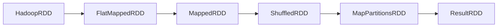

# Spark Task原理与代码实例讲解

作者：禅与计算机程序设计艺术

## 1. 背景介绍
### 1.1 大数据处理的挑战
#### 1.1.1 数据量的急剧增长
#### 1.1.2 实时处理的需求
#### 1.1.3 传统数据处理模式的局限性
### 1.2 Spark的诞生
#### 1.2.1 Spark的起源与发展历程
#### 1.2.2 Spark的核心理念与设计目标
### 1.3 Spark的生态系统
#### 1.3.1 Spark Core
#### 1.3.2 Spark SQL
#### 1.3.3 Spark Streaming
#### 1.3.4 MLlib
#### 1.3.5 GraphX

## 2. 核心概念与联系
### 2.1 RDD(Resilient Distributed Dataset)
#### 2.1.1 RDD的定义与特性
#### 2.1.2 RDD的创建方式
#### 2.1.3 RDD的操作：Transformation与Action
### 2.2 DAG(Directed Acyclic Graph)
#### 2.2.1 DAG的概念
#### 2.2.2 DAG在Spark中的应用
#### 2.2.3 DAG调度器的工作原理
### 2.3 Task
#### 2.3.1 Task的定义
#### 2.3.2 Task与RDD的关系
#### 2.3.3 Task的类型：ShuffleMapTask与ResultTask

## 3. 核心算法原理与具体操作步骤
### 3.1 Task的生成过程
#### 3.1.1 Job的提交
#### 3.1.2 DAG的生成
#### 3.1.3 Stage的划分
#### 3.1.4 Task的创建
### 3.2 Task的执行过程
#### 3.2.1 Task的调度与分配
#### 3.2.2 Executor的工作原理 
#### 3.2.3 Task的运行与结果处理
### 3.3 Shuffle过程详解
#### 3.3.1 Shuffle的定义与作用
#### 3.3.2 Map端的Shuffle Write
#### 3.3.3 Reduce端的Shuffle Read

## 4. 数学模型和公式详细讲解举例说明
### 4.1 RDD的容错机制
#### 4.1.1 基于Lineage的容错原理
RDD通过记录数据的变换关系(Lineage),而不是具体的数据,来实现容错。当某个分区的数据丢失时,可以通过Lineage重新计算出丢失的数据。设RDD $R_n$由RDD $R_{n-1}$经过变换 $f_n$得到:
$$R_n=f_n(R_{n-1})$$
若 $R_n$的分区 $R_{ni}$丢失,则可以通过对 $R_{n-1}$应用 $f_n$重新计算:
$$R_{ni}=f_n(R_{n-1i})$$
通过这种方式,Spark可以只记录RDD的转换关系,在需要时再恢复数据,而无需在执行过程中对中间结果做Checkpoint,从而大幅减少数据存储开销,提高计算效率。  

#### 4.1.2 Checkpoint机制
对于Lineage过长或任务关键的RDD,Spark还提供了Checkpoint机制。可以通过调用`rdd.checkpoint()`方法,将RDD的数据保存到可靠存储(如HDFS)以避免重复计算。例如:
```scala
val rdd = sc.textFile("hdfs://...")  
             .map(_+1)
rdd.checkpoint() // 对rdd执行Checkpoint  
rdd.collect() 
```

### 4.2 Stage划分算法
DAG Scheduler根据RDD之间的依赖关系,将Job划分为若干个Stage。划分的依据是:Stage的边界处必须是宽依赖(即Shuffle)。具体算法如下:
1. 从结果RDD反向遍历,遇到Shuffle切分Stage,遇到窄依赖(map、filter等)合并到当前Stage。
2. 将所有最终RDD都遍历完后,每个Stage内部的RDD管道就形成了一个TaskSet。TaskSet中的Task可以并行执行。
3. 最后将所有Stage按照依赖关系连接成DAG。

可以用数学公式来表示。定义原始RDD为 $R_0$,经过一系列变换 $f_1,f_2,...,f_n$ 得到最终RDD $R_n$:
$$R_n=f_n \circ ... \circ f_2 \circ f_1(R_0)$$

若 $f_i$和 $f_{i+1}$之间为宽依赖(需要Shuffle),则在 $R_i$和 $R_{i+1}$ 之间切分Stage:

$$
\begin{aligned}
Stage_0 &= \{R_0, ..., R_{i}\} \\
Stage_1 &= \{R_{i+1}, ..., R_n\}
\end{aligned}
$$

将窄依赖尽可能pipeline到同一个Stage,可以减少Shuffle次数,提高执行效率。

## 5. 项目实践：代码实例和详细解释说明
下面通过一个WordCount的例子,演示Spark任务的执行过程。

```scala
val textFile = sc.textFile("hdfs://...")
val counts = textFile.flatMap(line => line.split(" "))
                     .map(word => (word, 1))
                     .reduceByKey(_ + _)
counts.collect()
```

1. textFile是一个HadoopRDD,代表HDFS上的文本文件。需要根据文件的数据块数量划分分区。
2. flatMap是一个窄依赖,对每一行文本进行分词,生成新的RDD。该RDD的分区数与父RDD一致。
3. map也是一个窄依赖,将每个单词转换为(word, 1)的形式。
4. reduceByKey是一个宽依赖,需要对数据按照key进行重新划分和Shuffle。这里会引入新的Stage。Shuffle过程如下:
    - 在Map端,根据key的哈希值对数据进行分区,每个Reducer负责一个分区。
    - 将每个分区内的数据按照key进行聚合,得到(word, Seq(1,1...))的结果
    - 将结果写入磁盘,通过网络传输到Reducer所在节点
    - Reducer从磁盘读取属于自己的数据分区,再按key进行归并和reduce计算,得到每个单词的出现次数
5. 最后一步collect将结果RDD的数据收集回Driver节点。collect是一个Action,会触发Job的提交和任务的执行。

实际生成的DAG如下:


可以看到,前三个RDD(A/B/C)被pipeline到同一个Stage,中间只有窄依赖。ShuffledRDD引入了宽依赖,触发了Stage的切分。Shuffle后再进行map端的聚合(MapPartitionsRDD),最后将结果返回给Driver(ResultRDD)。

## 6. 实际应用场景
Spark广泛应用于各类大数据处理场景,例如:
- 批处理:使用Spark Core和Spark SQL对海量数据进行离线处理和分析,生成报表或数据仓库
- 流处理:使用Spark Streaming或Structured Streaming处理实时数据流,如日志分析、欺诈检测等
- 机器学习:使用MLlib进行大规模机器学习,如推荐系统、用户画像等
- 图计算:使用GraphX进行复杂网络结构和关系的分析挖掘,如社交网络、金融风控等

一些具体的应用案例:
- 蚂蚁金服使用Spark Streaming分析海量支付日志,实时识别异常交易和欺诈行为,提升风控能力
- 腾讯使用Spark和HBase构建实时推荐系统,基于用户行为和社交关系实时生成个性化推荐
- 滴滴使用Spark Streaming+Kafka+HBase处理海量车辆轨迹数据,优化调度系统和需求预测
- 京东使用Spark GraphX分析商品关联网络,优化营销策略和商品推荐
- 携程使用Spark MLlib进行旅客行为分析和个性化推荐,提升交易转化率

## 7. 相关工具和资源推荐
- Spark官网: https://spark.apache.org/
- Databricks(Spark商业化公司):https://databricks.com/
- Spark权威指南(官方文档):
https://spark.apache.org/docs/latest/
- Mastering Apache Spark(电子书):
https://jaceklaskowski.gitbooks.io/mastering-apache-spark/
- Spark源码分析系列文章:
https://github.com/lw-lin/CoolplaySpark
- Spark技术分享网站:
https://sparkbyexamples.com/, https://sparkfunction.cn  

## 8. 总结:未来的发展趋势与挑战
### 8.1 Spark的优势
 - 通用性:提供了多样化的工具集,覆盖了大数据处理的方方面面 
- 易用性:使用Scala、Java、Python、R等多种语言API,简化了大数据处理的复杂度
- 性能优越:得益于RDD的设计和DAG优化,Spark在性能上有数量级的提升

### 8.2 未来的发展趋势
- 云原生:Spark正向云平台迁移,提供按需资源分配、自动容错等云端能力
- 机器学习:MLlib不断完善,与TensorFlow等深度学习框架的集成会更加紧密
- 语言层面:更高层的语法抽象如Data Frame、Dataset会成为主流
- 生态繁荣:围绕Spark的各类工具会不断涌现,如数据湖、湖仓一体等

### 8.3 面临的挑战
- 调优难度大:如何权衡memory、cpu、网络等资源,并发数、分区数如何设置,仍需要大量的实践经验
- 生态碎片化:各类开源工具鱼龙混杂,如何甄别和选择需要耗费精力
- 动态资源管理:大数据作业的资源需求是动态变化的,而当前的资源分配相对静态
- AI大一统:深度学习正蓬勃发展,会对以Spark为代表的传统大数据处理带来什么影响,还有待观察

总之,Spark作为大数据处理的中坚力量,其地位短期内难以撼动。但计算机技术日新月异,保持创新和拥抱变化,将是Spark生态必须直面的命题。

## 9. 附录:常见问题与解答

### Q1:什么是Spark Application、Job、Stage和Task?
A1: 
- Application:用户编写的Spark程序,包含一个Driver和若干Executor
- Job:一个Action(如collect、count等)会生成一个Job,一个Application可以运行多个Job 
- Stage:Job会根据宽窄依赖关系被拆分为多组Task,每组任务被称为Stage,按照先后次序执行
- Task:Stage是由多个并行任务组成的,每个任务处理RDD的一个分区,这就是Task

### Q2:Spark为什么比MapReduce快?
A2:主要有以下几个原因:
- 内存计算:Spark将中间结果保存在内存中,避免了不必要的磁盘IO
- DAG调度:对任务划分和调度进行了优化,尽可能减少Shuffle等耗时操作
- 任务管道:多个map和filter操作可以pipeline到一个任务中,大幅减少任务调度开销

### Q3:Spark为什么需要Shuffle?
A3:Shuffle是Spark重分区和聚合数据的一种机制,其必要性主要有:
- 按key进行聚合的操作,如ByKey系列算子,需要将相同key的数据划分到同一个分区
- 当父RDD的分区数与子RDD不一致时,需要Shuffle来重新分区
- 当算子的语义依赖于数据的全局信息时,如求TopN,中位数等

### Q4:RDD Lineage是什么?
A4:RDD Lineage是RDD之间的依赖关系链,记录了RDD的元数据信息和转换关系(Transformation),而不是实际的数据。当RDD的部分分区数据丢失时,Spark可以根据这个Lineage重新计算出丢失的数据,无需回溯到源头从头计算。同时Lineage也是Spark构建DAG和调度优化的基础。

### Q5:RDD、DataFrame和Dataset的区别是什么?
A5:RDD、DataFrame和Dataset都是Spark的数据抽象,但在语义和特性上略有差异:
- RDD是最基础的数据结构,以分布式Java对象的形式存在,适合非结构化数据
- DataFrame以列式存储结构(如Parquet)描述结构化数据,对标关系型数据库的二维表,支持SQL查询
- Dataset是DataFrame的泛化,支持强类型,可以认为是 "带类型的RDD" 或 "可编程的DataFrame"
- 就数据结构而言