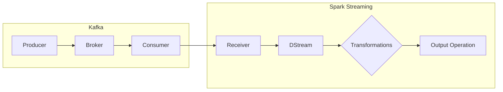

## Spark Streaming 与 Apache Kafka 集成实践

作者：禅与计算机程序设计艺术

## 1. 背景介绍

### 1.1  大数据时代的实时流处理需求

随着互联网和物联网的快速发展，全球数据量呈爆炸式增长，其中蕴藏着巨大的商业价值。为了及时洞察数据变化趋势，做出快速响应，实时流处理技术应运而生。实时流处理是指对数据流进行连续不断的计算、分析和处理，并在尽可能低的延迟下返回结果。

### 1.2  Spark Streaming 与 Apache Kafka 简介

Apache Spark 是一种快速、通用、可扩展的集群计算系统，其子项目 Spark Streaming 提供了可扩展、高吞吐、容错的实时流处理功能。Apache Kafka 是一个分布式、高吞吐、低延迟的发布-订阅消息系统，常用于构建实时数据管道和流处理应用程序。

### 1.3  Spark Streaming 与 Kafka 集成的优势

- **高吞吐量和低延迟：** Kafka 的高吞吐量和低延迟特性使其成为 Spark Streaming 接收数据的理想选择，能够处理海量实时数据流。
- **容错性：** Kafka 和 Spark Streaming 都具有容错机制，可以保证数据在处理过程中的可靠性和一致性。
- **可扩展性：** Kafka 和 Spark Streaming 都可以水平扩展，以满足不断增长的数据处理需求。
- **易用性：** Spark Streaming 提供了高级 API，可以方便地与 Kafka 集成，简化了开发流程。

## 2. 核心概念与联系

### 2.1  Spark Streaming 核心概念

- **DStream：** 离散化数据流（Discretized Stream）是 Spark Streaming 对实时数据流的抽象，表示连续的数据流。
- **Receiver：** 接收器负责从外部数据源（如 Kafka）接收数据，并将数据存储在 Spark 的内存中。
- **Transformation：** 转换操作对 DStream 进行处理，例如 map、filter、reduceByKey 等。
- **Output Operation：** 输出操作将处理后的数据输出到外部系统，例如数据库、消息队列等。

### 2.2  Apache Kafka 核心概念

- **Topic：** 主题是发布消息的逻辑分类，类似于数据库中的表。
- **Producer：** 生产者将消息发布到指定的主题。
- **Consumer：** 消费者订阅一个或多个主题，并处理发布到这些主题的消息。
- **Broker：** Kafka 集群中的服务器，负责存储消息、处理消息请求等。

### 2.3  Spark Streaming 与 Kafka 集成架构



- Kafka Producer 将数据发布到 Kafka Topic。
- Spark Streaming Receiver 从 Kafka Topic 消费数据，创建 DStream。
- Spark Streaming 对 DStream 进行 Transformation 操作，例如过滤、聚合等。
- Spark Streaming 将处理后的结果通过 Output Operation 输出到外部系统，例如数据库、控制台等。

## 3. 核心算法原理与具体操作步骤

### 3.1  Spark Streaming 从 Kafka 接收数据的两种方式

- **Receiver-based Approach：** 
    - Spark Streaming 启动一个或多个 Receiver 进程，每个 Receiver 负责消费一个或多个 Kafka 分区的数据。
    - Receiver 将接收到的数据存储在 Spark Executor 的内存中，并定期将数据写入磁盘进行 checkpoint。
    - 优点：数据接收和处理在不同的进程中进行，可以提高数据接收的效率。
    - 缺点：需要额外的资源来运行 Receiver 进程，并且可能会丢失数据（如果 Receiver 进程崩溃）。

- **Direct Approach（推荐）：** 
    - Spark Streaming 直接从 Kafka 读取数据，不需要启动 Receiver 进程。
    - Spark Streaming 会根据 Kafka 的消费偏移量来跟踪已处理的数据，保证数据不会丢失。
    - 优点：减少了数据传输的开销，提高了数据处理的效率，并且保证了数据的可靠性。
    - 缺点：需要 Spark 和 Kafka 版本兼容。

### 3.2  使用 Direct Approach 集成 Spark Streaming 与 Kafka 的步骤

1. **添加依赖：** 在 Spark 应用程序中添加 Spark Streaming 和 Kafka 集成的依赖。
2. **创建 SparkConf 对象：** 配置 Spark 应用程序的运行参数，例如应用程序名称、Master URL 等。
3. **创建 StreamingContext 对象：** 指定 Spark Streaming 应用程序的批处理间隔。
4. **创建 DirectStream 对象：** 使用 KafkaUtils.createDirectStream() 方法创建 DirectStream 对象，指定 Kafka 集群地址、消费主题等参数。
5. **对 DStream 进行操作：** 使用 Spark Streaming 提供的 Transformation 和 Output Operation 对 DStream 进行处理。
6. **启动 Spark Streaming 应用程序：** 调用 StreamingContext 的 start() 方法启动 Spark Streaming 应用程序。
7. **等待应用程序结束：** 调用 StreamingContext 的 awaitTermination() 方法等待应用程序结束。

## 4. 数学模型和公式详细讲解举例说明

### 4.1  数据倾斜问题

在使用 Spark Streaming 处理数据时，可能会遇到数据倾斜问题，即某些 key 对应的数据量远远大于其他 key，导致某些 Executor 处理时间过长，影响整体性能。

### 4.2  解决数据倾斜的方法

- **预聚合：** 在将数据发送到 Spark Streaming 之前，先对数据进行预聚合，减少数据量。
- **Key 随机化：** 对 key 进行随机化处理，将数据分散到不同的 Executor 上处理。
- **增加分区数：** 增加 Kafka Topic 的分区数，将数据分散到更多的 Executor 上处理。

## 5. 项目实践：代码实例和详细解释说明

```scala
import org.apache.kafka.clients.consumer.ConsumerRecord
import org.apache.kafka.common.serialization.StringDeserializer
import org.apache.spark.SparkConf
import org.apache.spark.streaming.kafka010._
import org.apache.spark.streaming.kafka010.LocationStrategies.PreferConsistent
import org.apache.spark.streaming.kafka010.ConsumerStrategies.Subscribe
import org.apache.spark.streaming.{Seconds, StreamingContext}

object SparkStreamingKafkaIntegration {

  def main(args: Array[String]): Unit = {

    // 1. 创建 SparkConf 对象
    val sparkConf = new SparkConf().setAppName("SparkStreamingKafkaIntegration").setMaster("local[*]")

    // 2. 创建 StreamingContext 对象
    val ssc = new StreamingContext(sparkConf, Seconds(5))

    // 3. 设置 Kafka 参数
    val kafkaParams = Map[String, Object](
      "bootstrap.servers" -> "localhost:9092",
      "key.deserializer" -> classOf[StringDeserializer],
      "value.deserializer" -> classOf[StringDeserializer],
      "group.id" -> "spark-streaming-group",
      "auto.offset.reset" -> "latest",
      "enable.auto.commit" -> (false: java.lang.Boolean)
    )

    // 4. 创建 DirectStream 对象
    val topics = Array("test")
    val stream = KafkaUtils.createDirectStream[String, String](
      ssc,
      PreferConsistent,
      Subscribe[String, String](topics, kafkaParams)
    )

    // 5. 对 DStream 进行操作
    val words = stream.flatMap(record => record.value.split(" "))
    val wordCounts = words.map(x => (x, 1L)).reduceByKey(_ + _)

    // 6. 将结果打印到控制台
    wordCounts.print()

    // 7. 启动 Spark Streaming 应用程序
    ssc.start()

    // 8. 等待应用程序结束
    ssc.awaitTermination()
  }
}
```

**代码解释：**

- 代码首先创建 SparkConf 和 StreamingContext 对象，配置 Spark Streaming 应用程序的运行参数。
- 然后设置 Kafka 参数，包括 Kafka 集群地址、消费主题、消费组 ID 等。
- 接着使用 KafkaUtils.createDirectStream() 方法创建 DirectStream 对象，指定 Kafka 参数和消费主题。
- 然后对 DStream 进行操作，这里统计单词出现的频率。
- 最后将结果打印到控制台，并启动 Spark Streaming 应用程序。

## 6. 实际应用场景

Spark Streaming 与 Kafka 的集成可以应用于各种实时数据处理场景，例如：

- **实时日志分析：** 收集和分析应用程序日志、系统日志等，实时监控系统运行状态，及时发现和处理问题。
- **实时用户行为分析：** 收集和分析用户访问网站、使用应用程序的行为数据，实时了解用户行为模式，优化产品和服务。
- **实时欺诈检测：** 收集和分析交易数据、用户行为数据等，实时检测欺诈行为，减少损失。

## 7. 工具和资源推荐

- **Apache Spark 官方文档：** https://spark.apache.org/docs/latest/
- **Apache Kafka 官方文档：** https://kafka.apache.org/documentation/
- **Spark Streaming Programming Guide：** https://spark.apache.org/docs/latest/streaming-programming-guide.html

## 8. 总结：未来发展趋势与挑战

### 8.1  未来发展趋势

- **更低的延迟：** 随着实时性要求的不断提高，未来流处理技术将朝着更低的延迟方向发展。
- **更强大的处理能力：** 随着数据量的不断增长，未来流处理技术需要具备更强大的处理能力，以满足海量数据的处理需求。
- **更智能化的分析：** 未来流处理技术将与人工智能技术深度融合，实现更智能化的数据分析和预测。

### 8.2  挑战

- **数据质量：** 实时数据流通常来自不同的数据源，数据质量参差不齐，如何保证数据质量是流处理技术面临的挑战之一。
- **状态管理：** 流处理应用程序通常需要维护状态信息，例如计数器、窗口聚合结果等，如何高效地管理状态信息是另一个挑战。
- **容错性：** 流处理应用程序需要保证数据在处理过程中的可靠性和一致性，如何实现高容错性也是一个挑战。

## 9. 附录：常见问题与解答

### 9.1  如何保证 Spark Streaming 应用程序的 exactly-once 语义？

可以使用 Spark Streaming 提供的 checkpoint 机制来保证 exactly-once 语义。checkpoint 机制会定期将应用程序的状态信息写入到可靠的存储系统中，例如 HDFS。当应用程序发生故障时，可以从 checkpoint 中恢复状态信息，继续处理数据。

### 9.2  如何处理数据倾斜问题？

可以使用预聚合、key 随机化、增加分区数等方法来解决数据倾斜问题。

### 9.3  如何监控 Spark Streaming 应用程序的运行状态？

可以使用 Spark UI 或第三方监控工具来监控 Spark Streaming 应用程序的运行状态，例如 Ganglia、 Graphite 等。