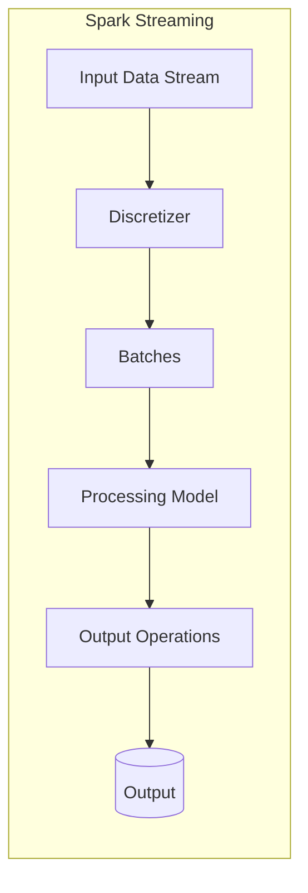
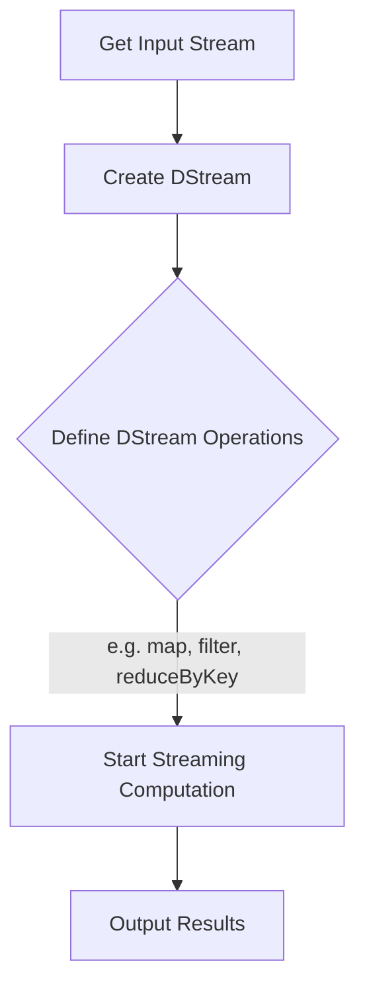

# SparkStreaming在时序数据分析中的应用

## 1.背景介绍

### 1.1 时序数据分析的重要性

在当今数据驱动的世界中,时序数据无处不在。从物联网传感器的实时读数到金融交易记录,再到用户在线活动日志,时序数据正成为各行业的关键资产。及时分析这些不断产生的数据流对于发现潜在见解、优化业务流程、检测异常模式和做出实时决策至关重要。

### 1.2 传统批处理分析的局限性

传统上,时序数据分析主要依赖于批处理系统,如Apache Hadoop。这些系统会定期收集并处理累积的数据。然而,在当今快速变化的环境中,这种方法存在明显缺陷:

- 高延迟:批处理作业通常需要很长时间才能完成,无法满足实时分析的需求。
- 数据窗口丢失:批处理作业只能处理固定的数据窗口,可能会错过连续数据流中的关键事件和模式。
- 运维成本高:需要复杂的工作流编排和资源管理。

### 1.3 流式处理的兴起

为了应对上述挑战,流式处理应运而生。流式处理系统旨在实时、连续地处理数据流,而不是等待批处理作业完成。这种范式为时序数据分析带来了全新的可能性,包括:

- 低延迟:数据可以在生成后几秒钟内得到处理。
- 连续处理:不再有数据窗口丢失的风险。
- 实时见解:可快速发现异常模式并及时采取行动。

Apache Spark Streaming作为Apache Spark生态系统中的流处理引擎,凭借其强大的数据处理能力和与Spark生态系统的无缝集成,在时序数据分析领域占据重要地位。

## 2.核心概念与联系

### 2.1 Spark Streaming架构概览

Spark Streaming将实时数据流视为一系列不断到达的数据批次。每个批次由一定时间范围内的数据记录组成,如下图所示:



1. **Discretizer(离散器)**: 将输入数据流拆分成小的批次,每个批次包含特定时间段内的数据记录。
2. **Processing Model(处理模型)**: Spark的核心,使用RDD(Resilient Distributed Dataset)对每个批次执行转换和操作。
3. **Output Operations(输出操作)**: 将处理后的数据推送到文件系统、数据库或实时仪表板等目标系统。

### 2.2 DStream(Discretized Stream)

在Spark Streaming中,连续的数据流被表示为一个不可变、有序和可重播的数据集 - DStream(Discretized Stream)。DStream是Spark中RDD序列的抽象,其中每个RDD包含特定时间间隔内的数据记录。

DStream支持诸如映射(map)、过滤(filter)、连接(join)、聚合(aggregate)等丰富的数据处理操作,这些操作可以批量应用于整个数据流。

### 2.3 Spark核心与Spark Streaming的集成

Spark Streaming紧密集成了Spark核心,可以直接利用Spark的强大功能:

- **通用执行引擎**: Spark Streaming使用相同的执行引擎来处理批处理和流数据。
- **统一编程模型**: 用户可以使用相同的API(如RDD操作)来处理静态数据和流数据。
- **代码重用**:可以直接在Spark Streaming应用中复用现有的Spark批处理代码。
- **统一环境管理**:Spark和Spark Streaming可以在同一个集群环境中运行,避免了环境管理的复杂性。

这种紧密集成使得Spark Streaming成为一种高效、统一的流数据处理解决方案。

## 3.核心算法原理具体操作步骤

### 3.1 Spark Streaming基本工作流程

Spark Streaming的基本工作流程包括以下几个主要步骤:

1. **获取输入数据流**:从诸如Kafka、Flume、Kinesis等源头获取实时数据流。
2. **创建DStream**:根据数据源和批次间隔,将输入数据流转换为DStream。
3. **定义DStream操作**:使用DStream API(如map、filter、reduceByKey等)定义对数据流的处理逻辑。
4. **启动流计算**:调用`start()`方法启动流计算,Spark Streaming将持续处理数据流直到被手动停止。
5. **输出操作**:将处理后的结果输出到外部系统,如文件系统、数据库或仪表板。



### 3.2 有状态转换与无状态转换

Spark Streaming提供了两种类型的DStream转换:

1. **无状态转换(Stateless Transformations)**:这类转换使用当前批次中的数据,不依赖于之前批次的结果。例如`map`、`filter`、`flatMap`等。

2. **有状态转换(Stateful Transformations)**:这类转换需要记住来自先前批次的数据,以便进行更复杂的计算。例如`updateStateByKey`、`window`等。有状态转换通常用于维护某种类型的"状态",如计算移动平均值或实现会话窗口。

```scala
// 无状态转换示例:对传感器数据进行过滤和映射
val sensorData = ...  // 从Kafka获取传感器数据流
val filtered = sensorData.filter(_.temperature > 30.0)
val alerts = filtered.map(data => Alert(data.id, data.temperature))

// 有状态转换示例:计算最近10秒内传感器数据的平均值
val averages = sensorData
  .map(r => (r.id, r.temperature))
  .window(Seconds(10))
  .reduceByKey((v1, v2) => (v1 + v2) / 2)
```

### 3.3 容错机制

Spark Streaming旨在实现流处理的"恰好一次语义"——即每条记录都被精确处理一次。为了实现这一目标,Spark Streaming采用了以下容错机制:

1. **输入数据源可重播**:输入数据源(如Kafka、HDFS)能够在发生故障时重新提供数据。

2. **使用Checkpoint检查点**:Spark Streaming可以定期将已处理数据的元数据保存到容错存储(如HDFS)中。发生故障时,可以从最后一个检查点重新启动。

3. **预写式日志(Write Ahead Log)**:Spark Streaming在更新数据时,会先将更新记录写入容错存储。这确保了计算结果在写入外部系统之前已持久化。

4. **确定性重放**:在恢复计算时,Spark Streaming能够确定性地重放输入数据并重新计算结果。

通过这些机制,Spark Streaming可以在发生故障时恢复并继续处理数据流,从而实现端到端的恰好一次语义。

## 4.数学模型和公式详细讲解举例说明

在时序数据分析中,常用的数学模型和公式包括:

### 4.1 移动平均模型

移动平均模型用于平滑时序数据,减少噪音影响。它通过计算最近N个时间点的均值来预测下一个时间点的值。公式如下:

$$\overline{x}_t = \frac{1}{N}\sum_{i=0}^{N-1}x_{t-i}$$

其中:
- $\overline{x}_t$是时间t的移动平均值
- $x_{t-i}$是时间t-i的实际观测值
- N是移动窗口的大小

在Spark Streaming中,可以使用`window`操作来实现移动平均:

```scala
val windowedCounts = dataStream
  .map(r => (r.id, r.value)) // 提取id和value
  .window(Seconds(30), Seconds(10)) // 30秒窗口,每10秒滑动一次
  .reduceByKey((v1, v2) => v1 + v2) // 求和
  .map(t => (t._1, t._2 / 3.0)) // 计算平均值(窗口大小为3)
```

### 4.2 指数加权移动平均模型(EWMA)

EWMA是一种改进的移动平均模型,它给予最近的观测值更高的权重。公式如下:

$$\text{EWMA}_t = \alpha \cdot x_t + (1 - \alpha) \cdot \text{EWMA}_{t-1}$$

其中:
- $\text{EWMA}_t$是时间t的EWMA值
- $x_t$是时间t的实际观测值
- $\alpha$是平滑系数(0 < $\alpha$ < 1),决定了新数据的权重

较大的$\alpha$值会给予最新数据更高的权重,从而使EWMA对最新变化更敏感。

### 4.3 异常检测算法

时序数据分析中的一项关键任务是检测异常值或异常模式。常用的异常检测算法包括:

1. **基于统计的方法**:利用数据的统计特征(如均值、标准差)构建正常值范围,超出该范围即被视为异常。

2. **基于预测模型的方法**:构建时序预测模型(如ARIMA、指数平滑等),将实际观测值与预测值的差异较大的情况标记为异常。

3. **基于距离的方法**:利用距离度量(如欧几里得距离、DTW距离等)衡量当前数据与历史正常模式的相似性,过于不相似则被标记为异常。

4. **基于深度学习的方法**:利用递归神经网络、自编码器等深度学习模型自动学习时序数据的正常模式,将与学习到的模式差异较大的情况标记为异常。

这些算法可以结合Spark Streaming和Spark MLlib来实现实时异常检测。

## 4.项目实践:代码实例和详细解释说明

让我们通过一个实际案例来演示如何使用Spark Streaming进行时序数据分析。假设我们需要从Kafka中消费网站用户活动数据流,并实时统计每个会话的页面浏览量(PV)和独立访客数(UV)。

### 4.1 创建Spark Streaming环境

首先,我们需要创建Spark Streaming环境并设置Checkpoint目录:

```scala
import org.apache.spark.streaming.{Seconds, StreamingContext}

val sparkConf = new SparkConf().setAppName("WebAnalytics")
val ssc = new StreamingContext(sparkConf, Seconds(5))
ssc.checkpoint("hdfs://namenode:8020/checkpoint")
```

### 4.2 从Kafka获取数据流

接下来,我们使用Kafka Direct Stream创建输入DStream:

```scala
import org.apache.spark.streaming.kafka010.KafkaUtils
import org.apache.spark.streaming.kafka010.LocationStrategies.PreferConsistent
import org.apache.kafka.common.serialization.StringDeserializer

val kafkaParams = Map(
  "bootstrap.servers" -> "kafka1:9092,kafka2:9092",
  "key.deserializer" -> classOf[StringDeserializer],
  "value.deserializer" -> classOf[StringDeserializer],
  "group.id" -> "webanalytics",
  "auto.offset.reset" -> "latest",
  "enable.auto.commit" -> (false: java.lang.Boolean)
)

val topics = Array("web-logs")
val stream = KafkaUtils.createDirectStream[String, String](
  ssc,
  PreferConsistent,
  ConsumerStrategies.Subscribe[String, String](topics, kafkaParams)
)
```

### 4.3 解析日志数据

然后,我们解析原始日志数据,提取会话ID、用户ID和请求URL:

```scala
case class LogEntry(sessionId: String, userId: String, url: String)

val logs = stream.map(record => {
  val fields = record.value().split(",")
  LogEntry(fields(0), fields(1), fields(2))
})
```

### 4.4 统计PV和UV

接下来,我们使用`updateStateByKey`有状态转换来维护每个会话的PV和UV计数器:

```scala
import org.apache.spark.streaming.State

val initialState = (0, Set[String]())

def updateFunction(currentValues: Seq[LogEntry], state: State[(Int, Set[String])]): 
  Option[(Int, Set[String])] = {

  val (pv, users) = currentValues.foldLeft(state.getOrElse(initialState)) {
    case ((pv, users), LogEntry(sessionId, userId, _)) =>
      (pv + 1, users + userId)
  }
  Some((pv, users))
}

val statsStream = logs.mapWithState(StateSpec.function(updateFunction _))
```

`updateFunction`接收当前批次的日志数据和上一个状态,