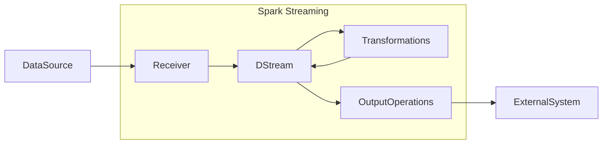

# SparkStreaming在网络安全领域的应用

## 1. 背景介绍

### 1.1 网络安全的重要性

在当今互联网时代，网络安全已经成为一个至关重要的问题。随着越来越多的个人和组织依赖网络进行日常活动和业务运营,网络攻击的风险也日益增加。网络攻击不仅可能导致数据泄露、系统瘫痪等直接后果,还可能造成巨大的经济损失和声誉损害。因此,有效的网络安全措施对于保护关键基础设施、敏感数据和个人隐私至关重要。

### 1.2 大数据和实时数据处理的需求

传统的网络安全系统通常依赖于签名匹配和规则引擎等技术来检测已知的威胁。然而,随着网络攻击形式的不断演进和新型攻击手段的出现,这种基于已知威胁的检测方式已经无法满足当前的需求。相反,我们需要一种能够实时处理大量网络流量数据、发现异常模式并及时响应的解决方案。

### 1.3 SparkStreaming的优势

Apache Spark是一个开源的大数据处理框架,它提供了一种高效、灵活的方式来处理大规模数据集。SparkStreaming是Spark的流式处理组件,它允许开发人员以流式方式处理实时数据流,并与Spark的批处理功能无缝集成。SparkStreaming具有以下优势:

1. 高吞吐量和低延迟
2. 容错和恢复能力
3. 与Spark生态系统的集成
4. 支持多种数据源和输出目标

基于这些优势,SparkStreaming在网络安全领域有着广阔的应用前景。

## 2. 核心概念与联系

### 2.1 流式处理

流式处理是指连续不断地处理数据流,而不是像批处理那样一次性处理整个数据集。在网络安全领域,我们需要实时处理网络流量数据,以便及时发现潜在的威胁和异常行为。SparkStreaming提供了一种高效的流式处理方式,可以实时处理来自多个数据源的数据流。

### 2.2 有状态流处理

传统的流处理系统通常是无状态的,每个数据元素都是独立处理的。然而,在网络安全场景中,我们往往需要跟踪和维护状态信息,例如会话数据、连接模式等。SparkStreaming支持有状态流处理,允许开发人员使用有状态的转化操作来维护和更新状态信息。

### 2.3 流与批处理的融合

SparkStreaming采用了微批处理的架构,将流式数据切分成小批次,并使用Spark的批处理引擎进行处理。这种设计使得SparkStreaming能够充分利用Spark的优势,如容错、内存计算等,同时还能与Spark生态系统中的其他组件无缝集成。

### 2.4 机器学习与实时分析

通过将SparkStreaming与Spark MLlib(机器学习库)相结合,我们可以在流式数据上应用各种机器学习算法,如anomaly detection(异常检测)、clustering(聚类)等,从而实现实时的网络威胁检测和分析。

## 3. 核心算法原理具体操作步骤

### 3.1 SparkStreaming架构概览

SparkStreaming的核心架构包括以下几个主要组件:

1. **Receiver**:接收来自数据源的流式数据,并将其存储在Spark的内存中。
2. **Streaming Context**:SparkStreaming的主要入口点,用于创建流式应用程序并设置相关参数。
3. **DStream**:代表一个连续的数据流,由一系列的RDD(Resilient Distributed Dataset)组成。
4. **Transformations**:对DStream应用各种转化操作,如map、filter、join等。
5. **Output Operations**:将处理后的DStream输出到外部系统,如文件系统、数据库等。

下图展示了SparkStreaming的基本工作流程:



### 3.2 数据接收

SparkStreaming支持多种数据源,包括Kafka、Flume、Kinesis等。我们可以使用相应的Receiver来接收这些数据源的流式数据。以Kafka为例,我们可以创建一个KafkaUtils.createStream()来从Kafka主题中读取数据流。

```scala
val kafkaParams = Map(
  "bootstrap.servers" -> "kafka-broker-1:9092,kafka-broker-2:9092",
  "group.id" -> "spark-streaming-consumer"
)

val topics = Set("network-traffic-topic")

val stream = KafkaUtils.createDirectStream(
  streamingContext,
  LocationStrategies.PreferConsistent,
  ConsumerStrategies.Subscribe[String, String](topics, kafkaParams)
)
```

### 3.3 数据处理

接收到流式数据后,我们可以对其应用各种转化操作。以网络流量数据为例,我们可能需要执行以下操作:

1. **数据清洗**:过滤掉无效或格式错误的记录。
2. **特征提取**:从原始数据中提取出相关特征,如源IP、目标IP、端口号等。
3. **会话重建**:将相关的网络流量数据组合成会话,以便进行更高层次的分析。
4. **行为分析**:应用机器学习算法(如anomaly detection)来检测异常行为。
5. **警报生成**:根据分析结果生成安全警报。

以下是一个简单的示例,展示了如何对网络流量数据进行基本处理:

```scala
val cleanedStream = stream
  .map(record => parseRecord(record.value())) // 数据清洗和特征提取
  .filter(_.isValid) // 过滤无效记录

val sessionizedStream = cleanedStream
  .mapValues(v => SessionBuilder.add(v)) // 会话重建
  .reduceByKey((s1, s2) => s1.merge(s2)) // 合并会话

val alertStream = sessionizedStream
  .map(session => analyzeSession(session)) // 行为分析
  .filter(_.isAnomalous) // 过滤正常会话
  .map(alert => generateAlert(alert)) // 生成警报
```

### 3.4 输出操作

处理完成后,我们可以将结果输出到各种目标系统,如文件系统、数据库或消息队列。SparkStreaming提供了多种输出操作,如foreachRDD、saveAsObjectFile等。以下是一个将警报输出到Kafka主题的示例:

```scala
alertStream.foreachRDD { rdd =>
  rdd.foreachPartition { alerts =>
    val producer = createKafkaProducer()
    alerts.foreach { alert =>
      val record = new ProducerRecord[String, Alert]("security-alerts", alert)
      producer.send(record)
    }
    producer.flush()
    producer.close()
  }
}
```

## 4. 数学模型和公式详细讲解举例说明

在网络安全领域,我们经常需要应用各种数学模型和算法来检测异常行为和潜在威胁。以下是一些常见的模型和算法:

### 4.1 异常检测算法

异常检测算法旨在发现与正常模式偏离的数据点或模式。在网络安全领域,我们可以将其应用于检测异常的网络流量、恶意软件活动等。常见的异常检测算法包括:

1. **基于统计的方法**:假设正常数据服从某种已知分布(如高斯分布),异常数据点偏离了这种分布。常用的统计量包括均值、标准差、马氏距离等。
2. **基于邻近度的方法**:基于数据点之间的距离或相似性来判断是否为异常。例如,孤立森林(Isolation Forest)算法通过隔离异常点来检测异常。
3. **基于聚类的方法**:将数据划分为多个聚类,异常点位于小聚类或远离任何聚类中心。例如,DBSCAN算法可用于检测密度异常。

以孤立森林算法为例,其核心思想是通过随机选择特征和随机选择分割值来递归地构建二叉树,直到所有实例都被隔离。由于异常点具有更小的路径长度,因此可以根据路径长度来识别异常点。

孤立森林的工作原理可以用以下伪代码表示:

```
IsolationTree(X, limit, n):
    if |X| <= limit or n = 0:
        return exNode
    else:
        q = randomSelect(X.columns)
        p = randomSelect(X[q])
        return inNode(q, p, IsolationTree(X[X[q] < p], limit, n-1),
                            IsolationTree(X[X[q] >= p], limit, n-1))

IsolationForest(X, t, ψ):
    Trees = []
    for i in range(t):
        Trees.append(IsolationTree(X, ψ, height(X)))
    return 1/t * sum(path_length(x, Trees) for x in X)
```

其中:
- $X$是输入数据集
- $t$是要构建的树的数量
- $\psi$是子采样大小限制
- $height(X)$是数据集$X$的理论最大树高度,通常设置为$\log_2 |X|$
- $path\_length(x, Trees)$是实例$x$在所有树中的平均路径长度

通过比较实例的路径长度和正常实例的路径长度,我们可以识别出异常点。

### 4.2 网络流量建模

为了有效地检测网络异常,我们需要先对正常的网络流量进行建模。常见的建模技术包括:

1. **基于统计的模型**:使用统计量(如平均值、标准差等)来描述网络流量特征的分布。
2. **基于时间序列的模型**:将网络流量视为时间序列,并使用ARIMA、GARCH等模型进行预测和异常检测。
3. **基于机器学习的模型**:使用无监督或半监督的机器学习算法(如聚类、高斯混合模型等)来发现网络流量的内在模式。

以ARIMA(自回归综合移动平均)模型为例,它是一种广泛应用于时间序列分析的模型。ARIMA模型由三个部分组成:自回归(AR)部分、综合(I)部分和移动平均(MA)部分。

ARIMA模型的一般形式为ARIMA(p, d, q),其中:
- $p$是自回归项的阶数
- $d$是差分的阶数
- $q$是移动平均项的阶数

对于一个时间序列$\{y_t\}$,ARIMA(p, d, q)模型可以表示为:

$$
y_t = c + \phi_1 y_{t-1} + \phi_2 y_{t-2} + \dots + \phi_p y_{t-p} + \theta_1 \epsilon_{t-1} + \theta_2 \epsilon_{t-2} + \dots + \theta_q \epsilon_{t-q} + \epsilon_t
$$

其中:
- $c$是常数项
- $\phi_i (i=1,2,\dots,p)$是自回归系数
- $\theta_j (j=1,2,\dots,q)$是移动平均系数
- $\epsilon_t$是白噪声误差项,服从均值为0、方差为$\sigma^2$的正态分布

在网络安全领域,我们可以使用ARIMA模型来预测正常的网络流量水平,并将实际观测值与预测值进行比较,从而检测异常情况。

## 4. 项目实践:代码实例和详细解释说明

在本节中,我们将通过一个实际的项目示例来展示如何使用SparkStreaming进行网络安全分析。我们将使用一个开源的网络流量数据集,并实现一个简单的异常检测系统。

### 4.1 数据集介绍

我们将使用来自UNSW-NB15数据集的网络流量数据。该数据集包含了各种正常和异常网络活动,如DoS攻击、Worm蠕虫、Exploits等。数据集中的每条记录包含49个特征,描述了源IP、目标IP、协议、端口号等信息。

### 4.2 项目设置

首先,我们需要导入所需的Spark库:

```scala
import org.apache.spark.sql.SparkSession
import org.apache.spark.streaming.{StreamingContext, Time}
```

接下来,我们创建SparkSession和StreamingContext:

```scala
val spark = SparkSession.builder()
  .appName("NetworkSecurityAnalyzer")
  .getOrCreate()

val ssc = new StreamingContext(spark.sparkContext, Seconds(5))
```

### 4.3 数据接收和预处理

我们将模拟从Kafka主题接收网络流量数据。为了简单起见,我们将使用本地文件作为输入源:

```scala
val inputPath = "path/to/network/traffic/data"
val inputStream = ssc.textFile