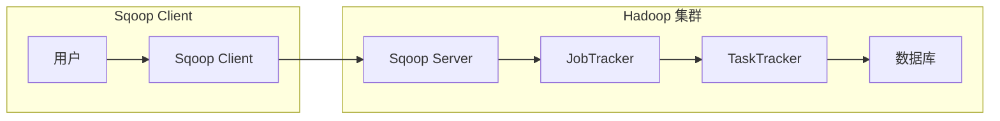

# Sqoop原理与代码实例讲解

作者：禅与计算机程序设计艺术

## 1. 背景介绍

### 1.1 大数据时代的数据迁移挑战

随着互联网和移动互联网的快速发展，全球数据量呈爆炸式增长，企业积累的数据也越来越多。这些数据通常存储在不同的系统中，例如关系型数据库（RDBMS）、NoSQL 数据库、Hadoop 分布式文件系统（HDFS）等。为了进行数据分析、挖掘和机器学习等操作，需要将数据从不同的数据源迁移到数据仓库或数据湖中。

然而，传统的 ETL（Extract, Transform, Load）工具在处理大规模数据迁移时面临着许多挑战，例如：

* **性能瓶颈:** 传统 ETL 工具通常采用单机架构，难以处理海量数据的迁移任务。
* **数据格式兼容性问题:** 不同的数据源和目标系统可能使用不同的数据格式，导致数据迁移过程中出现兼容性问题。
* **开发和维护成本高:** 传统 ETL 工具通常需要编写大量的代码来处理数据转换和加载逻辑，开发和维护成本较高。

### 1.2 Sqoop 的诞生背景

为了解决上述问题，Apache Sqoop 应运而生。Sqoop 是一个用于在 Hadoop 和结构化数据存储（如关系数据库）之间传输数据的工具。它能够高效地将数据从关系数据库导入到 Hadoop 中，也可以将 Hadoop 中的数据导出到关系数据库中。

Sqoop 的主要特点包括：

* **高性能:** Sqoop 基于 MapReduce 框架实现，能够并行处理数据迁移任务，具有很高的性能。
* **易于使用:** Sqoop 提供了简单易用的命令行接口和 Java API，方便用户进行数据迁移操作。
* **数据格式支持广泛:** Sqoop 支持多种数据格式，包括文本文件、Avro、Parquet 等。
* **可扩展性强:** Sqoop 支持用户自定义数据转换逻辑，可以满足各种数据迁移需求。

## 2. 核心概念与联系

### 2.1 Sqoop 架构

Sqoop 采用 Client-Server 架构，主要包括以下组件：

* **Sqoop Client:** 负责与用户交互，接收用户提交的 Sqoop 命令，并将命令发送给 Sqoop Server。
* **Sqoop Server:** 负责解析 Sqoop 命令，生成 MapReduce 作业，并提交到 Hadoop 集群执行。
* **Hadoop 集群:** 负责执行 Sqoop 生成的 MapReduce 作业，完成数据的迁移任务。
* **数据库:** 数据迁移的源或目标数据源，例如 MySQL、Oracle、PostgreSQL 等关系型数据库。



### 2.2 数据导入流程

Sqoop 数据导入流程如下：

1. 用户使用 Sqoop Client 提交数据导入命令。
2. Sqoop Server 解析命令，连接到源数据库，获取表结构和数据切片信息。
3. Sqoop Server 根据数据切片信息生成多个 MapReduce 作业。
4. Hadoop 集群执行 MapReduce 作业，从源数据库读取数据。
5. MapReduce 作业将读取到的数据写入到 HDFS 或 Hive 中。

### 2.3 数据导出流程

Sqoop 数据导出流程如下：

1. 用户使用 Sqoop Client 提交数据导出命令。
2. Sqoop Server 解析命令，连接到目标数据库，获取表结构信息。
3. Sqoop Server 从 HDFS 或 Hive 中读取数据。
4. Sqoop Server 根据表结构信息将数据写入到目标数据库中。

## 3. 核心算法原理具体操作步骤

### 3.1 数据切片算法

Sqoop 使用数据切片算法将数据表分割成多个数据块，每个数据块由一个 Map 任务处理。Sqoop 支持以下数据切片方式：

* **水平切片:** 根据表的主键或唯一索引进行切片，确保每个 Map 任务处理不重复的数据。
* **垂直切片:** 根据表的列进行切片，每个 Map 任务处理表中的一部分列。

### 3.2 数据导入操作步骤

使用 Sqoop 将数据从 MySQL 导入到 HDFS 的步骤如下：

1. **安装 Sqoop:** 从 Apache Sqoop 官网下载 Sqoop 安装包，并解压到指定目录。
2. **配置 Sqoop:** 配置 Sqoop 的环境变量，包括 `SQOOP_HOME`、`PATH` 和 `CLASSPATH`。
3. **创建 Sqoop 作业:** 使用 `sqoop job` 命令创建 Sqoop 作业，指定数据源、目标路径等参数。
4. **运行 Sqoop 作业:** 使用 `sqoop job --exec` 命令运行 Sqoop 作业。

```bash
# 创建 Sqoop 作业
sqoop job \
  --create import_mysql_data \
  -- import \
  --connect jdbc:mysql://localhost:3306/testdb \
  --username root \
  --password password \
  --table employees \
  --target-dir /user/hadoop/employees

# 运行 Sqoop 作业
sqoop job --exec import_mysql_data
```

### 3.3 数据导出操作步骤

使用 Sqoop 将数据从 HDFS 导出到 MySQL 的步骤如下：

1. **创建 Sqoop 作业:** 使用 `sqoop job` 命令创建 Sqoop 作业，指定数据源、目标表等参数。
2. **运行 Sqoop 作业:** 使用 `sqoop job --exec` 命令运行 Sqoop 作业。

```bash
# 创建 Sqoop 作业
sqoop job \
  --create export_mysql_data \
  -- export \
  --connect jdbc:mysql://localhost:3306/testdb \
  --username root \
  --password password \
  --table employees \
  --export-dir /user/hadoop/employees

# 运行 Sqoop 作业
sqoop job --exec export_mysql_data
```

## 4. 数学模型和公式详细讲解举例说明

### 4.1 数据切片公式

假设数据表 `employees` 包含 10000 条记录，主键为 `id`，使用 4 个 Map 任务进行数据导入，则每个 Map 任务处理的数据范围如下：

```
Map 1: id >= 1 and id <= 2500
Map 2: id > 2500 and id <= 5000
Map 3: id > 5000 and id <= 7500
Map 4: id > 7500 and id <= 10000
```

### 4.2 数据导入性能计算

Sqoop 数据导入性能取决于多个因素，例如：

* **数据量:** 数据量越大，数据导入时间越长。
* **网络带宽:** 网络带宽越大，数据传输速度越快。
* **Map 任务数量:** Map 任务数量越多，数据导入的并行度越高，但也会增加 Hadoop 集群的负载。

## 5. 项目实践：代码实例和详细解释说明

### 5.1 数据导入代码实例

以下代码示例演示了如何使用 Java API 将数据从 MySQL 导入到 HDFS：

```java
import org.apache.sqoop.client.SqoopClient;
import org.apache.sqoop.model.MConnection;
import org.apache.sqoop.model.MLink;
import org.apache.sqoop.model.MJob;
import org.apache.sqoop.model.MInput;
import org.apache.sqoop.model.MFrom;
import org.apache.sqoop.model.MTo;
import org.apache.sqoop.submission.counter.CounterGroup;
import org.apache.sqoop.submission.counter.Counter;
import org.apache.sqoop.submission.status.SubmissionStatus;

public class ImportData {

  public static void main(String[] args) {

    // 创建 Sqoop 客户端
    String url = "http://localhost:12000/sqoop/";
    SqoopClient client = new SqoopClientBuilder(url).build();

    // 创建连接
    MConnection connection = client.createMConnection();
    connection.setName("mysql_connection");
    connection.setConnectorPart("GENERIC_JDBC_CONNECTOR");
    connection.getConnectionForms().getJdbcForm().setConnectionString("jdbc:mysql://localhost:3306/testdb");
    connection.getConnectionForms().getJdbcForm().setUserName("root");
    connection.getConnectionForms().getJdbcForm().setPassword("password");
    client.saveConnection(connection);

    // 创建链接
    MLink link = client.createMLink("mysql_connection");
    link.setName("mysql_link");
    client.saveLink(link);

    // 创建作业
    MJob job = client.createMJob(link.getName(), "hdfs-connector");
    job.setName("import_mysql_data");

    // 设置输入
    MInput input = job.getInput();
    input.setName("mysql_input");
    MFrom from = input.getFrom();
    from.setName("mysql_from");
    from.setType("TABLE");
    from.getTable().setSchema("testdb");
    from.getTable().setName("employees");
    input.setFrom(from);

    // 设置输出
    MTo to = job.getOutput();
    to.setName("hdfs_to");
    to.setType("HDFS");
    to.getHdfs().setOutputDirectory("/user/hadoop/employees");
    job.setOutput(to);

    // 保存作业
    client.saveJob(job);

    // 运行作业
    long jobId = client.submitJob(job.getName()).getExternalJobId();
    System.out.println("Job ID: " + jobId);

    // 等待作业完成
    while (true) {
      SubmissionStatus status = client.getJobStatus(jobId);
      System.out.println("Job Status: " + status);

      if (status.isFinished()) {
        if (status.isSuccessful()) {
          CounterGroup counterGroup = client.getCounterGroup(jobId);
          Counter recordCount = counterGroup.getCounter("org.apache.sqoop.manager.SqlManager", "RECORD_COUNT");
          System.out.println("Imported Records: " + recordCount.getValue());
        } else {
          System.err.println("Job Failed!");
          System.err.println(client.getJobError(jobId));
        }
        break;
      }

      Thread.sleep(1000);
    }

    // 关闭客户端
    client.close();
  }
}
```

### 5.2 数据导出代码实例

以下代码示例演示了如何使用 Java API 将数据从 HDFS 导出到 MySQL：

```java
import org.apache.sqoop.client.SqoopClient;
import org.apache.sqoop.model.MConnection;
import org.apache.sqoop.model.MLink;
import org.apache.sqoop.model.MJob;
import org.apache.sqoop.model.MInput;
import org.apache.sqoop.model.MFrom;
import org.apache.sqoop.model.MTo;
import org.apache.sqoop.submission.counter.CounterGroup;
import org.apache.sqoop.submission.counter.Counter;
import org.apache.sqoop.submission.status.SubmissionStatus;

public class ExportData {

  public static void main(String[] args) {

    // 创建 Sqoop 客户端
    String url = "http://localhost:12000/sqoop/";
    SqoopClient client = new SqoopClientBuilder(url).build();

    // 创建连接
    MConnection connection = client.createMConnection();
    connection.setName("mysql_connection");
    connection.setConnectorPart("GENERIC_JDBC_CONNECTOR");
    connection.getConnectionForms().getJdbcForm().setConnectionString("jdbc:mysql://localhost:3306/testdb");
    connection.getConnectionForms().getJdbcForm().setUserName("root");
    connection.getConnectionForms().getJdbcForm().setPassword("password");
    client.saveConnection(connection);

    // 创建链接
    MLink link = client.createMLink("mysql_connection");
    link.setName("mysql_link");
    client.saveLink(link);

    // 创建作业
    MJob job = client.createMJob(link.getName(), "hdfs-connector");
    job.setName("export_mysql_data");

    // 设置输入
    MFrom from = job.getInput().getFrom();
    from.setName("hdfs_from");
    from.setType("TEXT_FILE");
    from.getTextFile().setInputDirectory("/user/hadoop/employees");

    // 设置输出
    MTo to = job.getOutput();
    to.setName("mysql_to");
    to.setType("TABLE");
    to.getTable().setSchema("testdb");
    to.getTable().setName("employees");
    to.getTable().setReplaceData(true);

    // 保存作业
    client.saveJob(job);

    // 运行作业
    long jobId = client.submitJob(job.getName()).getExternalJobId();
    System.out.println("Job ID: " + jobId);

    // 等待作业完成
    while (true) {
      SubmissionStatus status = client.getJobStatus(jobId);
      System.out.println("Job Status: " + status);

      if (status.isFinished()) {
        if (status.isSuccessful()) {
          CounterGroup counterGroup = client.getCounterGroup(jobId);
          Counter recordCount = counterGroup.getCounter("org.apache.sqoop.manager.SqlManager", "RECORD_COUNT");
          System.out.println("Exported Records: " + recordCount.getValue());
        } else {
          System.err.println("Job Failed!");
          System.err.println(client.getJobError(jobId));
        }
        break;
      }

      Thread.sleep(1000);
    }

    // 关闭客户端
    client.close();
  }
}
```

## 6. 实际应用场景

### 6.1 数据仓库建设

在数据仓库建设中，Sqoop 可以用于将关系型数据库中的数据导入到 Hadoop 中，作为数据分析和挖掘的基础数据。

### 6.2 数据库迁移

Sqoop 可以用于将数据从一个数据库迁移到另一个数据库，例如将 MySQL 数据库迁移到 Oracle 数据库。

### 6.3 数据备份和恢复

Sqoop 可以用于将数据库中的数据备份到 HDFS 中，也可以将 HDFS 中的数据恢复到数据库中。

## 7. 工具和资源推荐

### 7.1 Apache Sqoop 官网

Apache Sqoop 官网提供了 Sqoop 的下载、文档、教程等资源。

* 网址: http://sqoop.apache.org/

### 7.2 Sqoop 用户邮件列表

Sqoop 用户邮件列表是 Sqoop 用户交流和讨论的平台。

* 邮箱地址: user@sqoop.apache.org

## 8. 总结：未来发展趋势与挑战

### 8.1 未来发展趋势

* **支持更多的数据源和目标系统:** Sqoop 将会支持更多的数据源和目标系统，例如 NoSQL 数据库、云存储等。
* **更强大的数据转换功能:** Sqoop 将会提供更强大的数据转换功能，例如支持自定义函数、数据清洗等。
* **更易于使用的界面:** Sqoop 将会提供更易于使用的图形界面，方便用户进行数据迁移操作。

### 8.2 面临的挑战

* **数据安全:** Sqoop 需要访问敏感数据，因此数据安全是一个重要的挑战。
* **性能优化:** 随着数据量的不断增长，Sqoop 需要不断进行性能优化，以满足大规模数据迁移的需求。
* **与其他大数据工具的集成:** Sqoop 需要与其他大数据工具（例如 Hive、Spark 等）进行集成，以构建完整的数据处理流程。

## 9. 附录：常见问题与解答

### 9.1 如何解决 Sqoop 数据导入速度慢的问题？

* **增加 Map 任务数量:** 可以通过 `-m` 参数增加 Map 任务数量，提高数据导入的并行度。
* **优化数据库连接参数:** 可以通过 `--connect-timeout`、`--socket-timeout` 等参数优化数据库连接参数。
* **使用压缩:** 可以使用 `--compress` 参数启用数据压缩，减少数据传输量。

### 9.2 如何解决 Sqoop 数据导入过程中出现的数据类型错误？

* **指定数据类型:** 可以通过 `--map-column-java` 参数指定数据类型映射关系。
* **使用自定义数据转换器:** 可以编写自定义数据转换器来处理特殊的数据类型转换逻辑。

### 9.3 如何监控 Sqoop 作业的运行状态？

* **使用 Sqoop 命令行工具:** 可以使用 `sqoop job --status` 命令查看 Sqoop 作业的运行状态。
* **使用 Hadoop YARN 界面:** 可以使用 Hadoop YARN 界面查看 Sqoop 作业的运行状态。


## 10. 后记

本文详细介绍了 Sqoop 的原理、使用方法、应用场景以及未来发展趋势。Sqoop 作为一个强大的数据迁移工具，在数据仓库建设、数据库迁移、数据备份和恢复等方面发挥着重要作用。随着大数据技术的不断发展，Sqoop 也将会不断发展和完善，为企业提供更加高效、安全、可靠的数据迁移解决方案。
