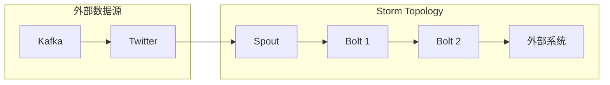

##  Storm Bolt原理与代码实例讲解

## 1. 背景介绍

### 1.1 什么是实时流处理？

在当今这个数据爆炸式增长的时代，海量数据的实时处理成为了许多企业和组织的迫切需求。实时流处理是指对连续不断的数据流进行低延迟、高吞吐量的处理，并在数据到达时就对其进行分析和响应，而不是像传统批处理那样需要等待所有数据都收集完毕后才能进行处理。

### 1.2 Storm简介

Apache Storm 是一个免费开源的分布式实时计算系统，它简单易用，支持多种编程语言，并且具有高容错性、高扩展性和高性能等特点，被广泛应用于实时数据分析、机器学习、风险控制等领域。

### 1.3 Bolt在Storm中的作用

在 Storm 中，数据处理的基本单元是 Bolt。Bolt 是一个独立的处理逻辑单元，它接收来自 Spout 或其他 Bolt 的数据，进行处理后，可以选择将结果输出到其他 Bolt 或外部系统。Bolt 可以执行各种操作，例如过滤、聚合、连接、函数运算等。


## 2. 核心概念与联系

### 2.1 数据模型：Tuple

在 Storm 中，数据以 Tuple 的形式进行传输。Tuple 是一个有序的值列表，每个值可以是任何类型，例如整数、字符串、浮点数等。

### 2.2  拓扑结构：Spout、Bolt和Topology

Storm 集群中的处理逻辑以拓扑结构(Topology)的形式组织。一个 Topology 由多个 Spout 和 Bolt 组成，它们之间通过数据流进行连接。

- **Spout**:  Spout 是 Topology 中数据源的抽象，负责从外部数据源读取数据，并将数据转换为 Tuple 的形式发射到 Topology 中。
- **Bolt**:  Bolt 是 Topology 中数据处理的单元，负责接收来自 Spout 或其他 Bolt 的 Tuple，进行处理后，可以选择将结果输出到其他 Bolt 或外部系统。
- **Topology**: Topology 是 Storm 中最高级别的抽象，它定义了 Spout 和 Bolt 之间的数据流向，以及整个应用程序的处理逻辑。


### 2.3  核心概念之间的联系

- Spout 从外部数据源读取数据，并将数据转换为 Tuple 的形式发射到 Topology 中。
- Bolt 接收来自 Spout 或其他 Bolt 的 Tuple，进行处理后，可以选择将结果输出到其他 Bolt 或外部系统。
- Topology 定义了 Spout 和 Bolt 之间的数据流向，以及整个应用程序的处理逻辑。

下图展示了 Storm 中的核心概念之间的联系：




## 3. 核心算法原理具体操作步骤

### 3.1 Bolt 的生命周期

1. **初始化阶段**: 当 Bolt 首次启动时，会调用 `prepare()` 方法进行初始化操作，例如连接数据库、加载配置文件等。
2. **处理阶段**: 当 Bolt 接收到来自 Spout 或其他 Bolt 的 Tuple 时，会调用 `execute()` 方法进行处理。
3. **清理阶段**: 当 Topology 关闭时，会调用 `cleanup()` 方法进行清理操作，例如关闭数据库连接、释放资源等。

### 3.2  Bolt 的实现方式

Bolt 可以使用 Java、Python 等多种语言进行实现。下面以 Java 为例，介绍 Bolt 的具体实现方式：

```java
public class MyBolt extends BaseBasicBolt {

    private static final long serialVersionUID = 1L;

    @Override
    public void prepare(Map stormConf, TopologyContext context) {
        // 初始化操作，例如连接数据库、加载配置文件等
    }

    @Override
    public void execute(Tuple input, BasicOutputCollector collector) {
        // 处理逻辑
        // ...

        // 发射 Tuple
        collector.emit(new Values(...));
    }

    @Override
    public void declareOutputFields(OutputFieldsDeclarer declarer) {
        // 定义输出字段
        declarer.declare(new Fields(...));
    }

    @Override
    public void cleanup() {
        // 清理操作，例如关闭数据库连接、释放资源等
    }
}
```

### 3.3 Bolt 的并行度

Bolt 的并行度是指 Bolt 实例的数量，可以通过设置 `setBolt()` 方法中的 `parallelism_hint` 参数来控制。例如，如果将 `parallelism_hint` 设置为 2，则 Storm 会创建 2 个 Bolt 实例来并行处理数据。

## 4. 数学模型和公式详细讲解举例说明

### 4.1 数据流模型

Storm 使用数据流模型来描述数据在 Topology 中的流动过程。数据流可以看作是一个无限的 Tuple 序列，每个 Tuple 都包含一个或多个数据项。

### 4.2  窗口函数

窗口函数可以对数据流进行分组和聚合操作，例如计算一段时间内的平均值、最大值、最小值等。

#### 4.2.1 滑动窗口

滑动窗口是指在数据流上定义一个固定大小的窗口，并随着时间的推移滑动窗口，对窗口内的数据进行聚合操作。

#### 4.2.2  滚动窗口

滚动窗口是指在数据流上定义一个固定大小的窗口，并按照固定的时间间隔滚动窗口，对窗口内的数据进行聚合操作。

### 4.3  可靠性机制

Storm 提供了多种可靠性机制来保证数据处理的可靠性，例如消息确认机制、重试机制等。

#### 4.3.1  消息确认机制

Storm 使用消息确认机制来保证数据处理的可靠性。Spout 发射的每个 Tuple 都会被分配一个唯一的 ID，Bolt 在处理完 Tuple 后，需要向 Spout 发送确认消息，告知 Spout 该 Tuple 已经被成功处理。如果 Spout 在一定时间内没有收到确认消息，则会重新发射该 Tuple。

#### 4.3.2  重试机制

Storm 提供了重试机制来处理 Bolt 处理失败的情况。如果 Bolt 在处理 Tuple 时发生异常，则 Storm 会将该 Tuple 重新发送给 Bolt 进行处理。

## 5. 项目实践：代码实例和详细解释说明

### 5.1 WordCount 示例

WordCount 是一个经典的实时流处理示例，它统计一段文本中每个单词出现的次数。

#### 5.1.1 数据源

本示例使用 Kafka 作为数据源，将一段英文文本发送到 Kafka 的一个 Topic 中。

#### 5.1.2  Topology

本示例的 Topology 包括一个 Spout 和两个 Bolt：

- **KafkaSpout**: 从 Kafka 的 Topic 中读取数据，并将数据转换为 Tuple 的形式发射到 Topology 中。
- **SplitSentenceBolt**: 将句子拆分为单词。
- **WordCountBolt**: 统计每个单词出现的次数。

#### 5.1.3  代码实现

##### 5.1.3.1  KafkaSpout

```java
public class KafkaSpout extends BaseRichSpout {

    private static final long serialVersionUID = 1L;

    private KafkaConsumer<String, String> consumer;
    private ConsumerRecords<String, String> records;
    private Iterator<ConsumerRecord<String, String>> iterator;

    @Override
    public void open(Map conf, TopologyContext context, SpoutOutputCollector collector) {
        // 创建 KafkaConsumer
        Properties props = new Properties();
        props.put("bootstrap.servers", "localhost:9092");
        props.put("group.id", "wordcount-group");
        props.put("key.deserializer", StringDeserializer.class.getName());
