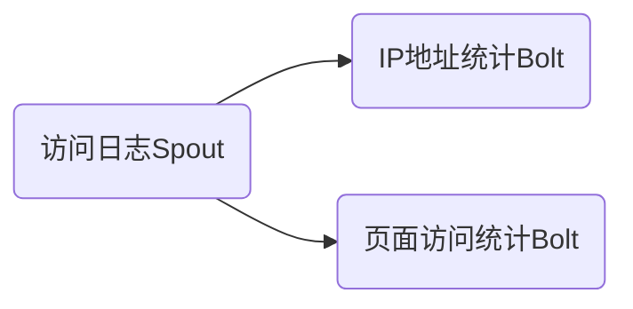

## 1. 背景介绍

### 1.1 大数据时代的实时计算挑战

随着互联网和物联网技术的快速发展，全球数据量呈爆炸式增长，传统的批处理系统已经无法满足实时性要求越来越高的业务需求。例如，电商平台需要实时分析用户行为数据进行个性化推荐，金融机构需要实时监控交易数据进行风险控制，社交网络需要实时分析用户关系进行好友推荐等。

实时计算应运而生，它能够对海量数据进行低延迟、高吞吐的处理，为各种实时应用提供强有力的技术支撑。在众多实时计算引擎中，Apache Storm以其简单易用、高性能、高容错等优点，成为了实时计算领域的重要选择。

### 1.2 Storm简介

Apache Storm是一个免费开源的分布式实时计算系统，由Nathan Marz创建，并于2011年开源，后来成为Apache顶级项目。Storm的特点包括：

* **简单易用:** Storm 使用 Java 和 Clojure 编写，API 简洁易懂，学习曲线平缓。
* **高性能:** Storm 使用 ZeroMQ 进行消息传递，并支持多种消息传递策略，能够实现高吞吐、低延迟的数据处理。
* **高容错:** Storm 具有强大的容错机制，能够自动处理节点故障，保证数据处理的可靠性。
* **可扩展性:** Storm 支持水平扩展，可以轻松地添加或减少节点，以满足不断增长的数据处理需求。

### 1.3 Storm Topology概述

Topology是Storm中最高级别的抽象，它表示一个实时计算应用程序的逻辑结构。一个Topology由多个Spout和Bolt组成，它们之间通过数据流进行连接，形成一个有向无环图（DAG）。

* **Spout:** 数据源，负责从外部数据源（如Kafka、Flume等）读取数据，并将数据转换为Tuple发送到Topology中。
* **Bolt:** 处理单元，负责接收来自Spout或其他Bolt的Tuple，进行数据处理，并将处理结果发送到下一个Bolt或输出到外部系统。

## 2. 核心概念与联系

### 2.1 Spout

#### 2.1.1 Spout类型

* **可靠Spout:** 保证每个Tuple都会被成功处理，如果Tuple处理失败，会重发Tuple。
* **不可靠Spout:** 不保证每个Tuple都会被成功处理，如果Tuple处理失败，不会重发Tuple。

#### 2.1.2 Spout方法

* `nextTuple():` 从数据源读取数据，并将其转换为Tuple发送到Topology中。
* `ack(Object msgId):` 当Tuple被成功处理时，Storm会调用该方法，通知Spout该Tuple已经被成功处理。
* `fail(Object msgId):` 当Tuple处理失败时，Storm会调用该方法，通知Spout该Tuple处理失败。

### 2.2 Bolt

#### 2.2.1 Bolt类型

* **普通Bolt:** 接收来自Spout或其他Bolt的Tuple，进行数据处理，并将处理结果发送到下一个Bolt或输出到外部系统。
* **路由Bolt:** 接收来自Spout或其他Bolt的Tuple，根据Tuple的字段值，将Tuple路由到不同的Bolt进行处理。

#### 2.2.2 Bolt方法

* `prepare(Map stormConf, TopologyContext context, OutputCollector collector):` 初始化Bolt，获取配置信息、上下文信息和输出收集器。
* `execute(Tuple input):` 处理接收到的Tuple，并将处理结果发送到下一个Bolt或输出到外部系统。
* `declareOutputFields(OutputFieldsDeclarer declarer):` 声明Bolt输出的Tuple的字段名称。

### 2.3 数据流分组

数据流分组定义了Bolt如何接收来自Spout或其他Bolt的Tuple。

* **随机分组（Shuffle Grouping）:** 将Tuple随机分配给Bolt的多个实例，以实现负载均衡。
* **字段分组（Fields Grouping）:** 根据Tuple中指定字段的值，将Tuple发送到相同的Bolt实例，以确保相同字段值的Tuple被同一个Bolt实例处理。
* **全局分组（Global Grouping）:** 将所有Tuple发送到Bolt的第一个实例，适用于需要集中处理数据的场景。
* **直接分组（Direct Grouping）:** 由发送Tuple的Bolt指定接收Tuple的Bolt实例，适用于需要精确控制数据流的场景。
* **本地或随机分组（Local or Shuffle Grouping）:** 如果目标Bolt在同一个工作进程中，则使用本地分组，否则使用随机分组。

### 2.4 可靠性机制

Storm通过以下机制保证数据处理的可靠性：

* **消息确认机制:** Spout发送的每个Tuple都会被分配一个唯一的ID，Bolt处理完Tuple后，会向Spout发送确认消息，Spout根据确认消息判断Tuple是否被成功处理。
* **超时机制:** 如果Spout在指定时间内没有收到Tuple的确认消息，则认为Tuple处理失败，会重发Tuple。
* **事务性Topology:** Storm支持事务性Topology，可以保证数据处理的原子性。

## 3. 核心算法原理具体操作步骤

### 3.1 Topology提交执行流程

1. 客户端将Topology提交到Nimbus节点。
2. Nimbus节点将Topology信息写入ZooKeeper。
3. Supervisor节点从ZooKeeper读取Topology信息，并根据Topology信息启动Worker进程。
4. Worker进程从ZooKeeper读取Task信息，并启动Executor线程。
5. Executor线程执行Spout或Bolt的代码，进行数据处理。

### 3.2 消息传递机制

Storm使用ZeroMQ进行消息传递，并支持多种消息传递策略：

* **点对点（Point-to-Point）:** 一个消息发送者对应一个消息接收者。
* **发布/订阅（Publish/Subscribe）:** 一个消息发送者对应多个消息接收者。

### 3.3 容错机制

* **Worker进程故障:** Supervisor节点会定期检测Worker进程的健康状况，如果发现Worker进程故障，会重新启动Worker进程。
* **节点故障:** 如果Supervisor节点故障，Nimbus节点会将该节点上的Task重新分配到其他Supervisor节点上执行。

## 4. 数学模型和公式详细讲解举例说明

本节内容主要介绍Storm中涉及的一些数学模型和公式，并结合具体例子进行讲解说明。

### 4.1 数据吞吐量

数据吞吐量是衡量实时计算系统性能的重要指标之一，它表示单位时间内处理的数据量。Storm的数据吞吐量可以用以下公式计算：

```
Throughput = (Number of Tuples Processed * Tuple Size) / Time
```

其中：

* **Number of Tuples Processed:** 处理的Tuple数量。
* **Tuple Size:** Tuple的大小，单位为字节。
* **Time:** 处理时间，单位为秒。

**例子：**

假设一个Storm Topology每秒钟处理1000个Tuple，每个Tuple的大小为1KB，则该Topology的数据吞吐量为：

```
Throughput = (1000 * 1024) / 1 = 1024000 B/s = 1 MB/s
```

### 4.2 数据延迟

数据延迟是指数据从进入实时计算系统到处理完成所需的时间，也是衡量实时计算系统性能的重要指标之一。Storm的数据延迟可以用以下公式计算：

```
Latency = Processing Time + Transmission Time
```

其中：

* **Processing Time:** 数据处理时间。
* **Transmission Time:** 数据传输时间。

**例子：**

假设一个Storm Topology的处理时间为100ms，数据传输时间为10ms，则该Topology的数据延迟为：

```
Latency = 100 + 10 = 110 ms
```

## 5. 项目实践：代码实例和详细解释说明

本节内容将通过一个具体的项目实例，演示如何使用Storm开发实时计算应用程序。

### 5.1 项目需求

假设我们需要开发一个实时计算应用程序，用于统计网站的访问日志信息，并将统计结果输出到控制台。

### 5.2 项目架构



### 5.3 代码实现

#### 5.3.1 访问日志Spout

```java
public class AccessLogSpout extends BaseRichSpout {

    private SpoutOutputCollector collector;

    @Override
    public void open(Map conf, TopologyContext context, SpoutOutputCollector collector) {
        this.collector = collector;
    }

    @Override
    public void nextTuple() {
        // 从访问日志文件中读取一行数据
        String logLine = readLogLine();

        // 将日志行解析为Tuple
        Tuple tuple = parseLogLine(logLine);

        // 发送Tuple
        collector.emit(tuple);
    }

    @Override
    public void declareOutputFields(OutputFieldsDeclarer declarer) {
        // 声明输出Tuple的字段名称
        declarer.declare(new Fields("ip", "url", "timestamp"));
    }

    // 从访问日志文件中读取一行数据
    private String readLogLine() {
        // ...
    }

    // 将日志行解析为Tuple
    private Tuple parseLogLine(String logLine) {
        // ...
    }
}
```

#### 5.3.2 IP地址统计Bolt

```java
public class IpCountBolt extends BaseBasicBolt {

    private Map<String, Integer> ipCountMap = new HashMap<>();

    @Override
    public void execute(Tuple input, BasicOutputCollector collector) {
        // 获取IP地址
        String ip = input.getStringByField("ip");

        // 统计IP地址出现的次数
        if (ipCountMap.containsKey(ip)) {
            ipCountMap.put(ip, ipCountMap.get(ip) + 1);
        } else {
            ipCountMap.put(ip, 1);
        }

        // 输出统计结果
        System.out.println("IP地址：" + ip + "，访问次数：" + ipCountMap.get(ip));
    }

    @Override
    public void declareOutputFields(OutputFieldsDeclarer declarer) {
        // 不需要输出Tuple
    }
}
```

#### 5.3.3 页面访问统计Bolt

```java
public class PageViewCountBolt extends BaseBasicBolt {

    private Map<String, Integer> pageViewCountMap = new HashMap<>();

    @Override
    public void execute(Tuple input, BasicOutputCollector collector) {
        // 获取页面URL
        String url = input.getStringByField("url");

        // 统计页面访问次数
        if (pageViewCountMap.containsKey(url)) {
            pageViewCountMap.put(url, pageViewCountMap.get(url) + 1);
        } else {
            pageViewCountMap.put(url, 1);
        }

        // 输出统计结果
        System.out.println("页面URL：" + url + "，访问次数：" + pageViewCountMap.get(url));
    }

    @Override
    public void declareOutputFields(OutputFieldsDeclarer declarer) {
        // 不需要输出Tuple
    }
}
```

#### 5.3.4 Topology定义

```java
public class AccessLogTopology {

    public static void main(String[] args) throws Exception {
        // 创建Topology
        TopologyBuilder builder = new TopologyBuilder();

        // 添加Spout
        builder.setSpout("accessLogSpout", new AccessLogSpout(), 1);

        // 添加Bolt
        builder.setBolt("ipCountBolt", new IpCountBolt(), 2).shuffleGrouping("accessLogSpout");
        builder.setBolt("pageViewCountBolt", new PageViewCountBolt(), 2).shuffleGrouping("accessLogSpout");

        // 创建LocalCluster
        LocalCluster cluster = new LocalCluster();

        // 提交Topology
        cluster.submitTopology("accessLogTopology", new Config(), builder.createTopology());

        // 等待一段时间
        Thread.sleep(10000);

        // 关闭LocalCluster
        cluster.shutdown();
    }
}
```

### 5.4 代码解释

* `AccessLogSpout`：从访问日志文件中读取数据，并将数据转换为Tuple发送到Topology中。
* `IpCountBolt`：统计每个IP地址出现的次数，并将统计结果输出到控制台。
* `PageViewCountBolt`：统计每个页面URL的访问次数，并将统计结果输出到控制台。
* `AccessLogTopology`：定义Topology的结构，并将Topology提交到LocalCluster上运行。

## 6. 实际应用场景

Storm可以应用于各种实时计算场景，例如：

* **实时数据分析:** 实时分析用户行为数据，进行个性化推荐、风险控制等。
* **日志分析:** 实时收集、处理和分析日志数据，用于系统监控、故障诊断等。
* **传感器数据处理:** 实时处理来自传感器的数据，用于环境监测、智能交通等。
* **社交网络分析:** 实时分析用户关系，进行好友推荐、趋势分析等。

## 7. 工具和资源推荐

* **Apache Storm官网:** https://storm.apache.org/
* **Storm官方文档:** https://storm.apache.org/documentation.html
* **Storm源码仓库:** https://github.com/apache/storm

## 8. 总结：未来发展趋势与挑战

### 8.1 未来发展趋势

* **与其他大数据技术融合:** Storm可以与其他大数据技术（如Hadoop、Spark等）进行融合，构建更加完善的实时计算解决方案。
* **机器学习与人工智能:** Storm可以与机器学习和人工智能技术相结合，实现更加智能化的实时计算应用。
* **边缘计算:** 随着物联网技术的快速发展，Storm可以应用于边缘计算场景，实现更加实时、高效的数据处理。

### 8.2 面临的挑战

* **数据一致性:** 在分布式环境下，保证数据的一致性是一个挑战。
* **状态管理:** Storm的状态管理功能相对薄弱，需要依赖外部存储系统。
* **性能优化:** 随着数据量的不断增长，如何提高Storm的性能是一个挑战。

## 9. 附录：常见问题与解答

### 9.1 如何保证Storm Topology的可靠性？

Storm通过消息确认机制、超时机制和事务性Topology等机制保证数据处理的可靠性。

### 9.2 如何提高Storm Topology的性能？

可以通过以下方式提高Storm Topology的性能：

* 优化代码逻辑，减少数据处理时间。
* 使用更高效的数据结构和算法。
* 调整Topology的并行度，充分利用集群资源。
* 使用缓存机制，减少数据读取次数。
* 监控Topology的运行状态，及时发现并解决性能瓶颈。

### 9.3 Storm与Spark Streaming有什么区别？

Storm和Spark Streaming都是常用的实时计算引擎，但它们在设计理念和应用场景上有所区别：

* **Storm** 是一个纯粹的实时计算引擎，数据以流的形式进行处理，延迟更低，适用于对实时性要求非常高的场景。
* **Spark Streaming** 是基于微批处理的实时计算引擎，数据以微批的形式进行处理，延迟相对较高，但吞吐量更大，适用于对吞吐量要求较高的场景。