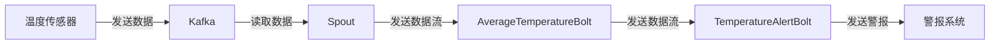

# 《StormBolt在物联网中的应用》

## 1. 背景介绍

### 1.1 物联网概述

物联网(Internet of Things, IoT)是一种将各种信息传感设备与互联网相连的网络,旨在实现物与物、人与物之间的智能化互联。随着技术的不断进步,物联网已经渗透到我们生活的各个领域,如智能家居、智能交通、智能医疗等。物联网设备通过收集和传输大量数据,为我们提供了更加智能化和自动化的服务。

### 1.2 物联网数据处理的挑战

然而,物联网设备产生的数据量巨大且种类繁多,如何高效地处理和分析这些海量数据成为了一个巨大的挑战。传统的数据处理方式往往无法满足物联网对实时性和可扩展性的需求。因此,我们需要一种新的数据处理框架来应对这些挑战。

### 1.3 Apache Storm介绍

Apache Storm是一个分布式的实时计算系统,它可以实现流式数据的可靠处理。Storm采用了主从架构,由一个主节点(Nimbus)和多个从节点(Supervisor)组成。数据流经Storm集群时,会被切分为多个数据流(Stream),并由Storm的核心组件Bolt进行处理。

## 2. 核心概念与联系

### 2.1 Spout

Spout是Storm中的数据源,它从外部数据源(如Kafka、HDFS等)读取数据,并将数据注入到Storm的拓扑(Topology)中。Spout需要实现一个接口,用于生成数据流。

### 2.2 Bolt

Bolt是Storm的核心处理单元,它负责对数据流进行转换、过滤、聚合等操作。Bolt可以订阅一个或多个Spout或其他Bolt的输出流,并执行相应的处理逻辑。Bolt也需要实现一个接口,用于定义处理逻辑。

### 2.3 Topology

Topology是Storm中的核心概念,它定义了Spout和Bolt之间的数据流向,以及它们之间的并行度。一个Topology可以包含多个Spout和Bolt,它们之间通过Stream进行数据传递。

### 2.4 Storm集群

Storm集群由一个主节点(Nimbus)和多个从节点(Supervisor)组成。Nimbus负责分发代码、分配任务和监控整个集群的状态。Supervisor则负责执行实际的任务,即运行Spout和Bolt。

## 3. 核心算法原理具体操作步骤

### 3.1 数据流模型

Storm采用了数据流模型,它将数据流视为一个无限的流,由一系列的元组(Tuple)组成。每个Tuple都包含一个或多个键值对,用于表示数据。Spout将数据注入到Topology中,形成一个数据流。这个数据流经过一系列Bolt的处理,最终产生期望的结果。

### 3.2 Bolt处理流程

Bolt是Storm中最关键的组件,它负责对数据流进行处理。Bolt的处理流程如下:

1. **订阅数据流**: Bolt需要订阅一个或多个Spout或其他Bolt的输出流。
2. **执行处理逻辑**: 当Bolt接收到数据流中的Tuple时,它会执行预定义的处理逻辑。处理逻辑可以包括转换、过滤、聚合等操作。
3. **发射新的数据流**: 处理完成后,Bolt可以选择发射一个或多个新的Tuple,形成新的数据流。
4. **持久化或输出结果**: 最后一个Bolt可以将处理结果持久化到外部存储系统(如HDFS、HBase等),或者直接输出到控制台或文件中。

### 3.3 并行处理

Storm支持数据流的并行处理,这意味着一个Spout或Bolt可以有多个实例同时运行,以提高处理能力。Storm使用了一种称为"分组(Grouping)"的机制来确定如何将数据流分发到不同的Bolt实例。常见的分组策略包括:

- **随机分组(Shuffle Grouping)**: 将数据流随机分发到不同的Bolt实例。
- **字段分组(Fields Grouping)**: 根据Tuple中的某些字段值将数据流分发到相同的Bolt实例。
- **全局分组(Global Grouping)**: 将整个数据流发送到同一个Bolt实例。

### 3.4 容错机制

Storm采用了一种称为"至少一次(At Least Once)"的容错机制,以确保数据流的可靠性。当一个Bolt实例失败时,Storm会自动重新启动该实例,并从最后一个成功处理的位置重新处理数据流。为了实现这一点,Storm使用了一种称为"锚点(Anchor)"的机制来跟踪每个Tuple的处理状态。

## 4. 数学模型和公式详细讲解举例说明

在处理物联网数据时,我们经常需要对数据进行一些数学运算,如聚合、滤波等。Storm提供了一种灵活的机制,允许我们在Bolt中嵌入自定义的数学模型和公式。

### 4.1 滑动窗口

在处理物联网数据时,我们经常需要对一段时间内的数据进行聚合或滤波操作。这种情况下,我们可以使用滑动窗口(Sliding Window)模型。

滑动窗口模型可以用以下公式表示:

$$
y_t = f(x_{t-n+1}, x_{t-n+2}, \dots, x_t)
$$

其中:

- $y_t$ 表示时间 $t$ 时的输出值
- $x_i$ 表示时间 $i$ 时的输入值
- $n$ 表示窗口大小
- $f$ 表示聚合或滤波函数

例如,如果我们要计算最近 5 个数据点的移动平均值,则可以使用以下公式:

$$
y_t = \frac{1}{5}(x_{t-4} + x_{t-3} + x_{t-2} + x_{t-1} + x_t)
$$

在Storm中,我们可以在Bolt的处理逻辑中实现这个公式,并维护一个长度为 5 的队列来存储最近的 5 个数据点。

### 4.2 卡尔曼滤波

卡尔曼滤波(Kalman Filter)是一种常用的数据融合算法,它可以估计出一个被加性噪声干扰的信号的真实值。在物联网领域,卡尔曼滤波经常被用于传感器数据的滤波和融合。

卡尔曼滤波的基本公式如下:

$$
\begin{aligned}
\hat{x}_k^- &= A\hat{x}_{k-1} + B u_k \\
P_k^- &= AP_{k-1}A^T + Q \\
K_k &= P_k^-H^T(HP_k^-H^T + R)^{-1} \\
\hat{x}_k &= \hat{x}_k^- + K_k(z_k - H\hat{x}_k^-) \\
P_k &= (I - K_kH)P_k^-
\end{aligned}
$$

其中:

- $\hat{x}_k$ 表示时间 $k$ 时的状态估计值
- $P_k$ 表示时间 $k$ 时的估计误差协方差矩阵
- $K_k$ 表示时间 $k$ 时的卡尔曼增益
- $A$、$B$、$H$ 分别表示系统模型、控制模型和观测模型
- $Q$、$R$ 分别表示过程噪声和观测噪声的协方差矩阵

在Storm中,我们可以在Bolt的处理逻辑中实现卡尔曼滤波算法,并将其应用于传感器数据的滤波和融合。

## 4. 项目实践: 代码实例和详细解释说明

为了更好地理解 Storm 在物联网领域的应用,我们将通过一个实际项目来演示如何使用 Storm 处理物联网数据。在这个项目中,我们将模拟一个温度监控系统,该系统从多个传感器收集温度数据,并使用 Storm 进行实时处理和分析。

### 4.1 项目架构

我们的项目架构如下:



1. 温度传感器将采集到的温度数据发送到 Kafka 队列中。
2. Storm 的 Spout 从 Kafka 中读取数据,并将其注入到 Topology 中。
3. `AverageTemperatureBolt` 计算每个传感器最近 10 个数据点的移动平均温度。
4. `TemperatureAlertBolt` 监测移动平均温度,如果超过预设阈值,则发送警报到警报系统。

### 4.2 代码实现

#### 4.2.1 Spout

我们首先创建一个 `KafkaSpout`,它从 Kafka 中读取温度数据,并将其注入到 Topology 中。

```java
public class KafkaSpout extends BaseRichSpout {
    private SpoutOutputCollector collector;
    private KafkaConsumer<String, String> consumer;

    @Override
    public void open(Map conf, TopologyContext context, SpoutOutputCollector collector) {
        this.collector = collector;
        // 配置 Kafka 消费者
        Properties props = new Properties();
        props.put("bootstrap.servers", "localhost:9092");
        props.put("group.id", "storm-consumer");
        props.put("key.deserializer", StringDeserializer.class.getName());
        props.put("value.deserializer", StringDeserializer.class.getName());
        consumer = new KafkaConsumer<>(props);
        consumer.subscribe(Collections.singletonList("temperature-data"));
    }

    @Override
    public void nextTuple() {
        ConsumerRecords<String, String> records = consumer.poll(Duration.ofMillis(100));
        for (ConsumerRecord<String, String> record : records) {
            collector.emit(new Values(record.value()));
        }
    }

    @Override
    public void ack(Object msgId) {
        // 不需要手动确认消息,由 Kafka 自动处理
    }

    @Override
    public void fail(Object msgId) {
        // 不需要手动处理失败消息,由 Kafka 自动重新发送
    }
}
```

#### 4.2.2 AverageTemperatureBolt

`AverageTemperatureBolt` 计算每个传感器最近 10 个数据点的移动平均温度。我们使用一个 `Map` 来存储每个传感器的温度数据队列,并在收到新数据时计算移动平均值。

```java
public class AverageTemperatureBolt extends BaseRichBolt {
    private OutputCollector collector;
    private Map<String, Deque<Double>> sensorTemperatures;

    @Override
    public void prepare(Map stormConf, TopologyContext context, OutputCollector collector) {
        this.collector = collector;
        this.sensorTemperatures = new HashMap<>();
    }

    @Override
    public void execute(Tuple input) {
        String sensorId = input.getStringByField("sensorId");
        double temperature = input.getDoubleByField("temperature");

        Deque<Double> temperatureQueue = sensorTemperatures.computeIfAbsent(sensorId, k -> new LinkedList<>());
        temperatureQueue.addLast(temperature);

        if (temperatureQueue.size() > 10) {
            temperatureQueue.removeFirst();
        }

        double averageTemperature = temperatureQueue.stream()
                .mapToDouble(Double::doubleValue)
                .average()
                .orElse(0.0);

        collector.emit(new Values(sensorId, averageTemperature));
    }

    @Override
    public void declareOutputFields(OutputFieldsDeclarer declarer) {
        declarer.declare(new Fields("sensorId", "averageTemperature"));
    }
}
```

#### 4.2.3 TemperatureAlertBolt

`TemperatureAlertBolt` 监测移动平均温度,如果超过预设阈值,则发送警报到警报系统。

```java
public class TemperatureAlertBolt extends BaseRichBolt {
    private OutputCollector collector;
    private double temperatureThreshold;

    @Override
    public void prepare(Map stormConf, TopologyContext context, OutputCollector collector) {
        this.collector = collector;
        this.temperatureThreshold = 30.0; // 设置温度阈值为 30 度
    }

    @Override
    public void execute(Tuple input) {
        String sensorId = input.getStringByField("sensorId");
        double averageTemperature = input.getDoubleByField("averageTemperature");

        if (averageTemperature > temperatureThreshold) {
            System.out.println("Warning: Sensor " + sensorId + " average temperature " + averageTemperature + " exceeds threshold!");
            // 发送警报到警报系统
        }
    }

    @Override
    public void declareOutputFields(OutputFieldsDeclarer declarer) {
        // 没有输出字段
    }
}
```

#### 4.2.4 Topology 定义

最后