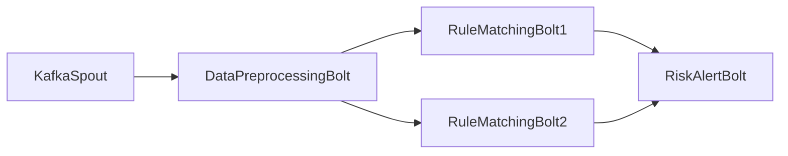

## Storm项目实战：构建实时风控系统

作者：禅与计算机程序设计艺术

## 1. 背景介绍

### 1.1 风控系统的重要性与挑战

在当今数字化时代，随着互联网金融、电子商务等行业的蓬勃发展，风险控制变得愈发重要。实时风控系统作为保障企业安全运营的关键环节，其重要性不言而喻。然而，构建高效、精准的实时风控系统并非易事，主要面临以下挑战：

* **海量数据实时处理:**  现代应用每天产生海量数据，实时风控系统需要具备高吞吐量、低延迟的数据处理能力。
* **复杂规则快速响应:**  风控规则通常涉及多维度数据分析和复杂逻辑判断，系统需要能够快速响应规则变化并做出实时决策。
* **高可靠性和可扩展性:**  风控系统需要具备高可用性和容错性，以应对突发流量和系统故障，并支持灵活扩展以满足不断增长的业务需求。

### 1.2 Storm: 分布式实时计算利器

Apache Storm 是一个免费、开源的分布式实时计算系统，以其高性能、容错性、易用性等优点，成为构建实时风控系统的理想选择。

### 1.3 本文目标与结构

本文将以构建实时风控系统为目标，详细介绍如何利用 Storm 框架实现实时数据流处理、规则引擎集成和风险事件告警。文章结构如下：

* 第一章：背景介绍，阐述实时风控系统的重要性与挑战，以及选择 Storm 的理由。
* 第二章：核心概念与联系，介绍 Storm 的核心概念和组件，以及它们之间的关系。
* 第三章：核心算法原理具体操作步骤，以一个具体的风控场景为例，详细讲解如何使用 Storm 实现实时数据处理和规则判断。
* 第四章：数学模型和公式详细讲解举例说明，介绍常用的风控模型和算法，并结合实际案例进行讲解。
* 第五章：项目实践：代码实例和详细解释说明，提供完整的 Storm 风控项目代码，并对关键代码进行详细解释。
* 第六章：实际应用场景，介绍实时风控系统在不同行业的应用案例。
* 第七章：工具和资源推荐，推荐一些常用的 Storm 开发工具和学习资源。
* 第八章：总结：未来发展趋势与挑战，总结实时风控系统的未来发展趋势，并探讨面临的挑战。
* 第九章：附录：常见问题与解答，解答一些常见问题。

## 2. 核心概念与联系

### 2.1 Storm 架构概览

Storm 集群采用主从架构，主要由 Nimbus、Supervisor 和 Zookeeper 三个组件构成:

* **Nimbus:** 负责资源调度、任务分配和监控整个集群的状态。
* **Supervisor:** 负责接收 Nimbus 分配的任务，启动和监控 Worker 进程。
* **Zookeeper:** 负责维护集群元数据信息，例如 Nimbus 和 Supervisor 的状态信息，以及 Topology 的配置信息。

### 2.2 核心概念

* **Topology:** Storm 中计算任务的抽象，由 Spout 和 Bolt 组成一个有向无环图 (DAG)。
* **Spout:** 数据源的抽象，负责从外部数据源读取数据并将其转换为 Tuple 发送给 Bolt 处理。
* **Bolt:** 数据处理逻辑的抽象，负责接收 Spout 发送的 Tuple，进行数据处理后，可以选择将结果输出到外部系统或者发送给其他 Bolt 继续处理。
* **Tuple:** Storm 中数据传输的基本单元，是一个有序的值列表。
* **Stream:**  无限的数据流，由 Tuple 组成。

### 2.3 组件间关系

* Nimbus 将 Topology 提交到 Zookeeper 上。
* Supervisor 从 Zookeeper 上获取 Topology 信息，并根据配置启动相应数量的 Worker 进程。
* Worker 进程启动后，会向 Nimbus 注册，并定期发送心跳信息。
* Nimbus 根据 Topology 的 DAG 结构，将 Spout 和 Bolt 分配到不同的 Worker 上执行。
* Spout 从外部数据源读取数据，并将其转换为 Tuple 发送到 Bolt 处理。
* Bolt 接收 Spout 发送的 Tuple，进行数据处理后，可以选择将结果输出到外部系统或者发送给其他 Bolt 继续处理。

## 3. 核心算法原理具体操作步骤

### 3.1 风控场景示例

假设我们正在构建一个电商平台的实时风控系统，需要对用户的下单行为进行实时风险评估。具体的业务规则如下:

* **规则一:**  如果用户在过去 1 分钟内下单次数超过 3 次，则判定为高风险用户。
* **规则二:**  如果用户的下单金额超过其过去 7 天平均下单金额的 2 倍，则判定为高风险用户。

### 3.2 数据流处理流程

为了实现上述风控规则，我们可以设计如下数据流处理流程:

1. **数据采集:**  从 Kafka 等消息队列中实时获取用户的下单数据。
2. **数据预处理:**  对原始数据进行清洗、转换和格式化，例如提取用户 ID、下单时间、下单金额等关键信息。
3. **规则匹配:**  将预处理后的数据与预定义的规则进行匹配，识别出高风险用户。
4. **风险事件告警:**  将识别出的高风险用户和相关信息发送到告警系统，以便及时采取措施。

### 3.3 Storm 实现方案

我们可以使用 Storm 框架来实现上述数据流处理流程，具体的 Topology 结构如下图所示:



* **KafkaSpout:**  从 Kafka 中实时获取用户的下单数据，并将每条数据封装成一个 Tuple 发送给 DataPreprocessingBolt 处理。
* **DataPreprocessingBolt:**  对原始数据进行清洗、转换和格式化，例如提取用户 ID、下单时间、下单金额等关键信息。
* **RuleMatchingBolt1:**  根据规则一，判断用户在过去 1 分钟内下单次数是否超过 3 次，如果超过则发送告警信息到 RiskAlertBolt。
* **RuleMatchingBolt2:**  根据规则二，判断用户的下单金额是否超过其过去 7 天平均下单金额的 2 倍，如果超过则发送告警信息到 RiskAlertBolt。
* **RiskAlertBolt:**  接收来自 RuleMatchingBolt1 和 RuleMatchingBolt2 的告警信息，并将高风险用户和相关信息发送到告警系统。

## 4. 数学模型和公式详细讲解举例说明

### 4.1 风险评分模型

在实际应用中，我们通常会使用风险评分模型来对用户的风险等级进行量化评估。常见的风险评分模型包括:

* **线性回归模型:**  使用线性函数来拟合风险与特征之间的关系。
* **逻辑回归模型:**  使用 sigmoid 函数来预测用户属于高风险用户的概率。
* **决策树模型:**  使用树形结构来学习一系列规则，用于对用户进行分类。

### 4.2 模型训练与评估

为了训练一个有效的风险评分模型，我们需要准备大量的历史数据，并将其划分为训练集和测试集。我们可以使用训练集来训练模型，并使用测试集来评估模型的性能指标，例如准确率、召回率、F1 值等。

## 5. 项目实践：代码实例和详细解释说明

### 5.1 项目环境搭建

* 安装 Java 8 或更高版本。
* 安装 Maven 3 或更高版本。
* 安装 Storm 1.2.3 或更高版本。
* 安装 Kafka 2.12-2.4.0 或更高版本。

### 5.2 项目代码结构

```
├── pom.xml
└── src
    └── main
        └── java
            └── com
                └── example
                    └── storm
                        ├── KafkaSpout.java
                        ├── DataPreprocessingBolt.java
                        ├── RuleMatchingBolt1.java
                        ├── RuleMatchingBolt2.java
                        └── RiskAlertBolt.java

```

### 5.3 代码实例

#### 5.3.1 KafkaSpout.java

```java
import org.apache.storm.kafka.spout.KafkaSpout;
import org.apache.storm.kafka.spout.KafkaSpoutConfig;

public class KafkaSpout extends KafkaSpout<String, String> {

    public KafkaSpout() {
        super(KafkaSpoutConfig.builder("localhost:9092", "order_topic")
                .setGroupId("storm_consumer_group")
                .build());
    }
}
```

#### 5.3.2 DataPreprocessingBolt.java

```java
import org.apache.storm.topology.BasicOutputCollector;
import org.apache.storm.topology.OutputFieldsDeclarer;
import org.apache.storm.topology.base.BaseBasicBolt;
import org.apache.storm.tuple.Fields;
import org.apache.storm.tuple.Tuple;
import org.apache.storm.tuple.Values;

import java.util.Map;

public class DataPreprocessingBolt extends BaseBasicBolt {

    @Override
    public void execute(Tuple input, BasicOutputCollector collector) {
        String orderJson = input.getString(0);

        // 对原始数据进行清洗、转换和格式化
        Map<String, Object> orderMap = JsonUtils.fromJson(orderJson, Map.class);
        String userId = (String) orderMap.get("user_id");
        long orderTime = (long) orderMap.get("order_time");
        double orderAmount = (double) orderMap.get("order_amount");

        // 将预处理后的数据发送给 RuleMatchingBolt 处理
        collector.emit(new Values(userId, orderTime, orderAmount));
    }

    @Override
    public void declareOutputFields(OutputFieldsDeclarer declarer) {
        declarer.declare(new Fields("user_id", "order_time", "order_amount"));
    }
}
```

#### 5.3.3 RuleMatchingBolt1.java

```java
import org.apache.storm.topology.BasicOutputCollector;
import org.apache.storm.topology.OutputFieldsDeclarer;
import org.apache.storm.topology.base.BaseBasicBolt;
import org.apache.storm.tuple.Fields;
import org.apache.storm.tuple.Tuple;
import org.apache.storm.tuple.Values;

import java.util.Map;
import java.util.concurrent.ConcurrentHashMap;

public class RuleMatchingBolt1 extends BaseBasicBolt {

    private Map<String, Integer> userOrderCountMap = new ConcurrentHashMap<>();

    @Override
    public void execute(Tuple input, BasicOutputCollector collector) {
        String userId = input.getStringByField("user_id");
        long orderTime = input.getLongByField("order_time");

        // 计算用户在过去 1 分钟内的下单次数
        int orderCount = getUserOrderCount(userId, orderTime);

        // 如果下单次数超过 3 次，则发送告警信息
        if (orderCount > 3) {
            collector.emit(new Values(userId, "下单频率过高"));
        }
    }

    private int getUserOrderCount(String userId, long orderTime) {
        // TODO: 实现逻辑，统计用户在过去 1 分钟内的下单次数
        return 0;
    }

    @Override
    public void declareOutputFields(OutputFieldsDeclarer declarer) {
        declarer.declare(new Fields("user_id", "risk_info"));
    }
}
```

#### 5.3.4 RuleMatchingBolt2.java

```java
import org.apache.storm.topology.BasicOutputCollector;
import org.apache.storm.topology.OutputFieldsDeclarer;
import org.apache.storm.topology.base.BaseBasicBolt;
import org.apache.storm.tuple.Fields;
import org.apache.storm.tuple.Tuple;
import org.apache.storm.tuple.Values;

import java.util.Map;
import java.util.concurrent.ConcurrentHashMap;

public class RuleMatchingBolt2 extends BaseBasicBolt {

    private Map<String, Double> userAvgOrderAmountMap = new ConcurrentHashMap<>();

    @Override
    public void execute(Tuple input, BasicOutputCollector collector) {
        String userId = input.getStringByField("user_id");
        double orderAmount = input.getDoubleByField("order_amount");

        // 获取用户的过去 7 天平均下单金额
        double avgOrderAmount = getUserAvgOrderAmount(userId);

        // 如果下单金额超过平均下单金额的 2 倍，则发送告警信息
        if (orderAmount > avgOrderAmount * 2) {
            collector.emit(new Values(userId, "下单金额异常"));
        }
    }

    private double getUserAvgOrderAmount(String userId) {
        // TODO: 实现逻辑，计算用户的过去 7 天平均下单金额
        return 0;
    }

    @Override
    public void declareOutputFields(OutputFieldsDeclarer declarer) {
        declarer.declare(new Fields("user_id", "risk_info"));
    }
}
```

#### 5.3.5 RiskAlertBolt.java

```java
import org.apache.storm.topology.BasicOutputCollector;
import org.apache.storm.topology.OutputFieldsDeclarer;
import org.apache.storm.topology.base.BaseBasicBolt;
import org.apache.storm.tuple.Tuple;

public class RiskAlertBolt extends BaseBasicBolt {

    @Override
    public void execute(Tuple input, BasicOutputCollector collector) {
        String userId = input.getStringByField("user_id");
        String riskInfo = input.getStringByField("risk_info");

        // 将高风险用户和相关信息发送到告警系统
        System.out.println("用户 ID: " + userId + ", 风险信息: " + riskInfo);
    }

    @Override
    public void declareOutputFields(OutputFieldsDeclarer declarer) {
        // 不需要输出数据
    }
}
```

## 6. 实际应用场景

实时风控系统在各个行业都有着广泛的应用，例如：

* **电商:**  实时监测用户下单行为，识别刷单、盗号等风险。
* **金融:**  实时监测账户交易行为，识别洗钱、欺诈等风险。
* **社交:**  实时监测用户发布内容，识别垃圾广告、色情信息等风险。
* **游戏:**  实时监测玩家游戏行为，识别外挂、刷金币等风险。

## 7. 工具和资源推荐

* **Storm 官网:**  https://storm.apache.org/
* **Storm 官方文档:**  https://storm.apache.org/documentation.html
* **Kafka 官网:**  https://kafka.apache.org/
* **Zookeeper 官网:**  https://zookeeper.apache.org/

## 8. 总结：未来发展趋势与挑战

### 8.1 未来发展趋势

* **人工智能技术应用:**  将人工智能技术应用于风控领域，例如利用机器学习算法自动识别风险模式和规则。
* **多源数据融合:**  整合来自不同数据源的数据，例如用户行为数据、设备信息、网络环境等，构建更加全面和精准的风控体系。
* **云原生架构:**  将风控系统部署到云平台上，利用云计算的弹性和可扩展性来应对不断增长的业务需求。

### 8.2 面临的挑战

* **数据安全与隐私保护:**  如何保障用户数据的安全和隐私，是实时风控系统面临的一大挑战。
* **模型可解释性:**  如何解释人工智能模型的决策逻辑，提高模型的可信度和透明度，也是一个需要解决的问题。
* **技术人才短缺:**  实时风控系统涉及的技术领域广泛，需要具备相关专业知识和技能的人才。


## 9. 附录：常见问题与解答

### 9.1 如何保证 Storm 集群的高可用性？

为了保证 Storm 集群的高可用性，我们可以采取以下措施：

* **Nimbus HA:**  配置多个 Nimbus 节点，并使用 Zookeeper 进行主备切换。
* **Supervisor HA:**  在每个节点上部署多个 Supervisor 进程，并配置 Supervisor 的自动重启机制。
* **数据可靠性:**  使用 Kafka 等消息队列来保证数据的可靠传输，并配置 Storm 的 ACK 机制来确保数据被成功处理。

### 9.2 如何监控 Storm 集群的运行状态？

Storm 提供了丰富的监控指标，可以通过 Storm UI、JMX、Ganglia 等工具来监控集群的运行状态，例如：

* **Topology 吞吐量**
* **Spout 发送速率**
* **Bolt 处理延迟**
* **Worker 资源使用情况**

### 9.3 如何调试 Storm 程序？

我们可以使用以下方法来调试 Storm 程序：

* **打印日志:**  在代码中添加日志打印语句，并将日志输出到文件或控制台。
* **远程调试:**  使用 IDE 的远程调试功能，连接到 Storm 集群中的 Worker 进程进行调试。
* **Storm UI:**  通过 Storm UI 查看 Topology 的运行状态、Spout 和 Bolt 的处理情况，以及错误信息等。

### 9.4 如何优化 Storm 程序的性能？

我们可以通过以下方式来优化 Storm 程序的性能：

* **合理设置并行度:**  根据数据量和处理逻辑的复杂度，合理设置 Spout 和 Bolt 的并行度。
* **使用高效的数据结构和算法:**  选择合适的数据结构和算法来存储和处理数据，例如使用 HashMap 来存储用户数据，使用快速排序算法来对数据进行排序。
* **减少数据传输量:**  尽量在 Bolt 内部完成数据处理，减少数据在网络中的传输量。
* **使用序列化框架:**  使用 Kryo、ProtoBuf 等序列化框架来提高数据的序列化和反序列化效率。