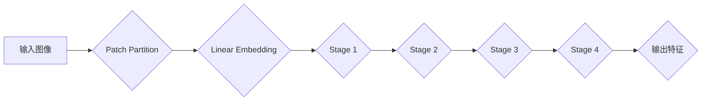
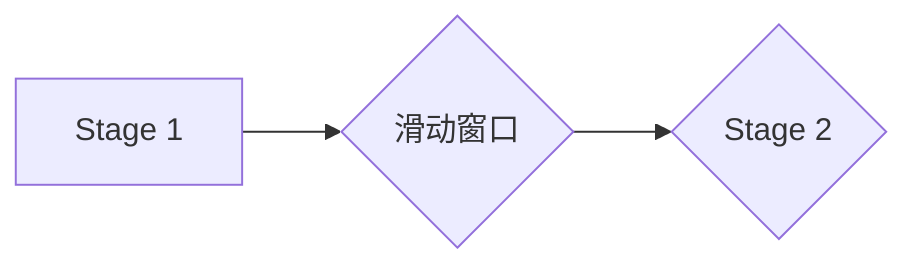
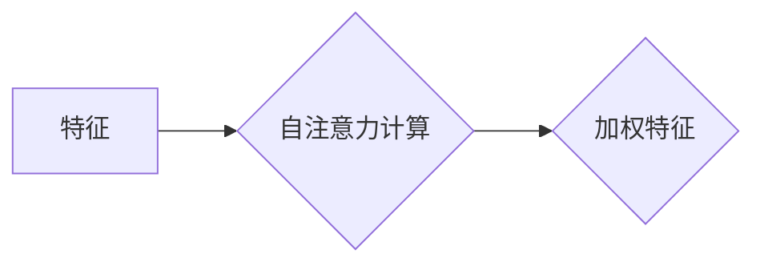
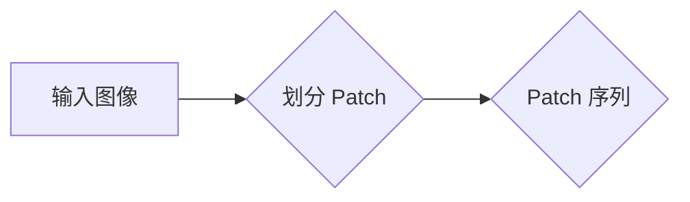
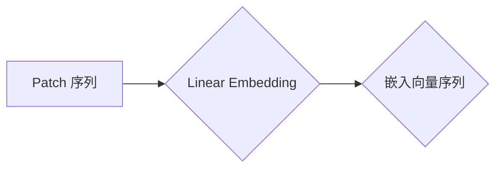
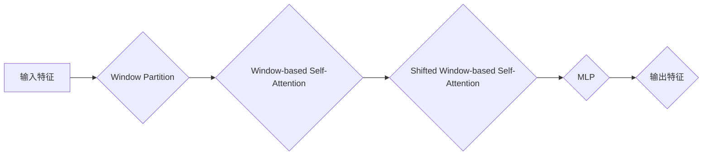
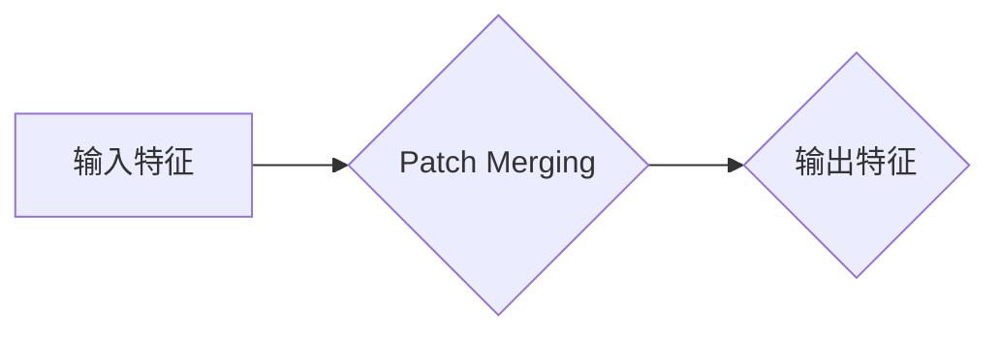
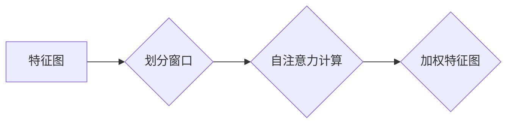

## 1. 背景介绍

### 1.1  Transformer的崛起与挑战

近年来，Transformer 模型在自然语言处理领域取得了巨大成功，其强大的特征提取能力和全局建模能力使其在各种任务中表现出色。然而，传统的 Transformer 模型在处理图像等高分辨率数据时面临着巨大的挑战，其计算复杂度和内存占用随着输入图像尺寸的增加而急剧上升，限制了其在实际应用中的可扩展性。

### 1.2 Swin Transformer的诞生

为了解决 Transformer 模型在图像处理中的局限性，微软亚洲研究院的研究人员提出了 Swin Transformer 模型。Swin Transformer 通过引入**层次化结构**和**滑动窗口机制**，有效地降低了计算复杂度，并提升了模型对局部特征的捕捉能力，使其能够更好地处理高分辨率图像。

### 1.3 Swin Transformer的优势

相比于传统的 Transformer 模型，Swin Transformer 具有以下优势：

* **计算复杂度更低:** Swin Transformer 的计算复杂度与图像尺寸呈线性关系，而传统 Transformer 的计算复杂度与图像尺寸呈平方关系。
* **局部特征提取能力更强:** Swin Transformer 的滑动窗口机制使其能够更好地捕捉图像的局部特征，从而提升模型的表达能力。
* **层次化结构:** Swin Transformer 的层次化结构使其能够更好地处理不同尺度的图像特征，从而提升模型的泛化能力。


## 2. 核心概念与联系

### 2.1  层次化结构

Swin Transformer 的核心思想是将输入图像划分为多个不重叠的**窗口**，并在每个窗口内进行局部自注意力计算。然后，通过**滑动窗口**的方式将不同窗口的特征融合在一起，从而实现全局建模。

**图 1 Swin Transformer 的层次化结构**



### 2.2 滑动窗口机制

Swin Transformer 的滑动窗口机制是指在每个阶段，将窗口的位置进行**偏移**，使得不同窗口的特征能够相互交互。这种机制有效地扩展了模型的感受野，并提升了其对全局信息的捕捉能力。

**图 2 Swin Transformer 的滑动窗口机制**



### 2.3 自注意力机制

与传统的 Transformer 模型一样，Swin Transformer 也采用了**自注意力机制**来计算特征之间的关系。自注意力机制通过计算特征之间的相似度，来对特征进行加权，从而突出重要的特征信息。

**图 3 Swin Transformer 的自注意力机制**



## 3. 核心算法原理具体操作步骤

### 3.1 Patch Partition

Swin Transformer 的第一步是将输入图像划分为多个不重叠的**patch**。每个 patch 的大小为 $P \times P$，其中 $P$ 为 patch 的边长。

**图 4 Swin Transformer 的 Patch Partition**



### 3.2 Linear Embedding

将每个 patch 转换为一个向量表示，可以使用线性层进行嵌入。

**图 5 Swin Transformer 的 Linear Embedding**



### 3.3 Swin Transformer Block

Swin Transformer 的核心模块是**Swin Transformer Block**，它由以下几个部分组成:

* **Window Partition:** 将输入特征图划分为多个不重叠的窗口。
* **Window-based Self-Attention:** 在每个窗口内进行局部自注意力计算。
* **Shifted Window-based Self-Attention:** 通过滑动窗口的方式将不同窗口的特征融合在一起。
* **MLP:** 多层感知机，用于特征变换。

**图 6 Swin Transformer Block**



### 3.4 Patch Merging

在每个阶段结束后，使用**Patch Merging**操作来降低特征图的分辨率，并增加特征的感受野。

**图 7 Swin Transformer 的 Patch Merging**



## 4. 数学模型和公式详细讲解举例说明

### 4.1  自注意力机制

自注意力机制的核心公式如下：

$$
Attention(Q, K, V) = softmax(\frac{QK^T}{\sqrt{d_k}})V
$$

其中，$Q$、$K$、$V$ 分别表示查询矩阵、键矩阵和值矩阵，$d_k$ 表示键矩阵的维度。

**举例说明:**

假设我们有一个 $4 \times 4$ 的特征图，将其划分为 $2 \times 2$ 的窗口。在每个窗口内，我们可以计算特征之间的自注意力。

**图 8 Swin Transformer 的自注意力计算**



### 4.2 滑动窗口机制

滑动窗口机制的核心公式如下：

$$
Shifted Window(X) = Roll(X, shift=(-M // 2, -M // 2))
$$

其中，$X$ 表示输入特征图，$M$ 表示窗口的大小，$Roll$ 表示循环移位操作。

**举例说明:**

假设我们有一个 $4 \times 4$ 的特征图，窗口大小为 $2 \times 2$。在第一阶段，窗口的位置为 $(0, 0)$。在第二阶段，窗口的位置将偏移 $(-1, -1)$，即 $(1, 1)$。

**图 9 Swin Transformer 的滑动窗口机制**


## 5. 项目实践：代码实例和详细解释说明

### 5.1  Swin Transformer Block 的 Python 实现

```python
import torch
import torch.nn as nn

class SwinTransformerBlock(nn.Module):
    def __init__(self, dim, input_resolution, num_heads, window_size=7, shift_size=0,
                 mlp_ratio=4., qkv_bias=True, qk_scale=None, drop=0., attn_drop=0., drop_path