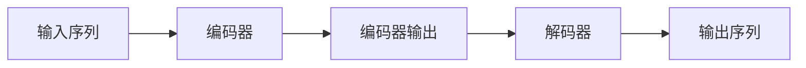

## 1. 背景介绍

### 1.1 代码生成技术的兴起

近年来，随着人工智能技术的快速发展，代码生成技术逐渐成为了软件工程领域的研究热点。传统的代码编写方式需要程序员耗费大量的时间和精力，而代码生成技术则可以将部分重复性、规律性的代码编写工作自动化，从而提高软件开发效率和质量。

### 1.2 深度学习在代码生成中的应用

深度学习作为人工智能领域的重要分支，近年来在自然语言处理、图像识别等领域取得了突破性进展。研究者们也开始尝试将深度学习技术应用于代码生成领域，并取得了一系列令人瞩目的成果。

### 1.3 Transformer模型的优势

Transformer模型是一种基于自注意力机制的深度学习模型，最初由 Vaswani 等人于 2017 年提出，并在机器翻译任务中取得了显著的效果。相比于传统的循环神经网络 (RNN) 模型，Transformer 模型具有以下优势：

* **并行计算能力强:** Transformer 模型可以并行处理序列数据，从而大幅提高训练和推理速度。
* **长距离依赖关系建模能力强:** Transformer 模型中的自注意力机制可以捕捉到序列数据中长距离的依赖关系，这对于理解代码的语义信息至关重要。

## 2. 核心概念与联系

### 2.1 Transformer 模型结构

Transformer 模型主要由编码器和解码器两部分组成，如下图所示：



* **编码器:** 编码器负责将输入序列编码成一个上下文向量，其中包含了输入序列的语义信息。
* **解码器:** 解码器根据编码器输出的上下文向量，逐个生成输出序列中的元素。

### 2.2 自注意力机制

自注意力机制是 Transformer 模型的核心组件，它可以让模型关注输入序列中不同位置的信息，从而捕捉到序列数据中的长距离依赖关系。

### 2.3 代码生成中的关键问题

将 Transformer 模型应用于代码生成领域，需要解决以下关键问题：

* **代码表示:** 如何将代码转换成 Transformer 模型可以处理的数值表示？
* **代码生成:** 如何利用 Transformer 模型生成语法正确、语义合理的代码？
* **评估指标:** 如何评估代码生成模型的性能？

## 3. 核心算法原理具体操作步骤

### 3.1 代码表示方法

常用的代码表示方法包括：

* **基于词袋模型的表示:** 将代码视为一个词袋，忽略代码的语法结构和语义信息。
* **基于抽象语法树 (AST) 的表示:** 将代码解析成 AST，然后将 AST 转换成 Transformer 模型可以处理的数值表示。
* **基于代码预训练模型的表示:** 利用大规模代码数据集预训练一个代码编码器，然后使用该编码器将代码转换成数值表示。

### 3.2 代码生成过程

代码生成过程可以分为以下几个步骤：

1. **编码输入序列:** 将输入序列 (例如，自然语言描述) 编码成上下文向量。
2. **初始化解码器状态:** 初始化解码器的状态，例如，使用编码器输出的上下文向量初始化解码器的隐藏状态。
3. **循环生成代码:** 循环执行以下步骤，直到生成结束符：
    * 将解码器当前状态输入到解码器中。
    * 解码器输出一个概率分布，表示下一个词的概率。
    * 根据概率分布选择下一个词。
    * 将选择的词加入到已生成的代码序列中。
    * 更新解码器状态。

### 3.3 训练过程

代码生成模型的训练过程通常使用 Teacher Forcing 算法，其基本思想是在训练过程中，将真实的代码序列作为解码器的输入，而不是使用解码器自身生成的代码序列。

## 4. 数学模型和公式详细讲解举例说明

### 4.1 自注意力机制

自注意力机制的计算公式如下：

$$
\text{Attention}(Q, K, V) = \text{softmax}(\frac{QK^T}{\sqrt{d_k}})V
$$

其中：

* $Q$ 表示查询矩阵，$K$ 表示键矩阵，$V$ 表示值矩阵。
* $d_k$ 表示键矩阵的维度。
* $\text{softmax}$ 函数用于将注意力权重归一化到 0 到 1 之间。

### 4.2 Transformer 模型编码器

Transformer 模型编码器由多个编码器层堆叠而成，每个编码器层包含以下两个子层：

* **多头自注意力层:** 计算输入序列的自注意力表示。
* **前馈神经网络层:** 对自注意力表示进行非线性变换。

### 4.3 Transformer 模型解码器

Transformer 模型解码器与编码器类似，也由多个解码器层堆叠而成，每个解码器层包含以下三个子层：

* **掩码多头自注意力层:** 计算解码器输入序列的自注意力表示，并使用掩码机制防止模型关注到未来的词。
* **编码器-解码器注意力层:** 计算编码器输出的上下文向量与解码器输入序列之间的注意力表示。
* **前馈神经网络层:** 对注意力表示进行非线性变换。

## 5. 项目实践：代码实例和详细解释说明

### 5.1 代码生成任务

本节以 Python 代码生成为例，介绍如何使用 Transformer 模型生成 Python 代码。

### 5.2 数据集

使用 Python 代码数据集，例如，CodeSearchNet 数据集。

### 5.3 代码实现

```python
import torch
import torch.nn as nn
from transformers import GPT2Tokenizer, GPT2LMHeadModel

# 加载预训练的 GPT-2 模型和词tokenizer
tokenizer = GPT2Tokenizer.from_pretrained('gpt2')
model = GPT2LMHeadModel.from_pretrained('gpt2')

# 定义代码生成函数
def generate_code(input_text, max_length=100):
    # 将输入文本转换成模型输入
    input_ids = tokenizer.encode(input_text, add_special_tokens=True)
    input_ids = torch.tensor([input_ids])

    # 生成代码
    output = model.generate(input_ids, max_length=max_length)

    # 将模型输出转换成代码
    code = tokenizer.decode(output[0], skip_special_tokens=True)
    return code

# 示例
input_text = "编写一个函数，用于计算两个数的和。"
code = generate_code(input_text)
print(code)
```

### 5.4 结果分析

运行以上代码，可以得到如下 Python 代码：

```python
def sum(a, b):
  return a + b
```

## 6. 实际应用场景

### 6.1 代码自动补全

代码自动补全可以根据程序员当前输入的代码，预测接下来可能输入的代码，从而提高代码编写效率。

### 6.2 代码摘要生成

代码摘要生成可以根据代码的功能，自动生成代码的自然语言描述，方便程序员理解和维护代码。

### 6.3 代码翻译

代码翻译可以将一种编程语言的代码转换成另一种编程语言的代码，方便程序员进行跨语言开发。

## 7. 总结：未来发展趋势与挑战

### 7.1 未来发展趋势

* **更大规模的代码数据集:** 随着代码数据的不断积累，未来将会出现更大规模、更高质量的代码数据集，这将进一步推动代码生成技术的发展。
* **更强大的代码生成模型:** 研究者们将不断探索更强大的代码生成模型，例如，结合代码结构信息的 Transformer 模型、基于图神经网络的代码生成模型等。
* **更广泛的应用场景:** 代码生成技术将会应用于更多的软件工程领域，例如，代码测试、代码修复、代码重构等。

### 7.2 面临的挑战

* **代码语义理解:** 代码生成模型需要能够理解代码的语义信息，才能生成语法正确、语义合理的代码。
* **代码评估指标:** 目前还没有一种完美的代码评估指标，可以准确地评估代码生成模型的性能。
* **代码安全性:** 代码生成模型生成的代码需要保证安全性，避免出现安全漏洞。

## 8. 附录：常见问题与解答

### 8.1 Transformer 模型如何处理变长序列？

Transformer 模型使用位置编码来处理变长序列，位置编码将每个词的位置信息编码成一个向量，并将其加到词嵌入中。

### 8.2 如何提高代码生成模型的性能？

可以通过以下方法提高代码生成模型的性能：

* **使用更大规模的代码数据集进行训练。**
* **使用更强大的代码生成模型。**
* **使用更有效的训练技巧，例如，学习率调度、模型集成等。**

### 8.3 代码生成技术有哪些局限性？

代码生成技术目前还存在一些局限性，例如：

* **生成的代码可能不符合代码规范。**
* **生成的代码可能存在语义错误。**
* **生成的代码可能难以维护。**
