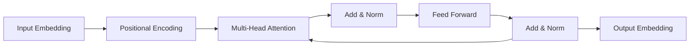

# Transformer在隐私计算中的应用探索

作者：禅与计算机程序设计艺术

## 1. 背景介绍  
### 1.1 隐私计算的重要性
在当今大数据时代,数据已成为推动社会进步和经济发展的重要资源。然而,随着数据量的爆炸式增长和数据应用场景的不断拓展,数据隐私保护问题日益突出。传统的数据处理方式难以平衡数据利用和隐私保护之间的矛盾,亟需新的计算模式来解决这一难题。隐私计算作为保护数据隐私和安全的新兴技术,为解决上述问题提供了新的思路和方向。

### 1.2 Transformer模型概述
Transformer是一种基于注意力机制的深度学习模型,由Vaswani等人于2017年提出。与传统的循环神经网络(RNN)和卷积神经网络(CNN)不同,Transformer完全依赖于注意力机制来计算序列间的相关性,无需使用循环或卷积操作。Transformer在自然语言处理领域取得了巨大成功,特别是在机器翻译、文本摘要、问答系统等任务上表现出色。

### 1.3 Transformer在隐私计算中的应用前景
Transformer强大的特征提取和表示学习能力,使其在隐私计算领域具有广阔的应用前景。通过引入Transformer模型,可以在保护数据隐私的前提下,实现高效、智能的数据分析和挖掘。本文将重点探讨Transformer在隐私计算中的应用,分析其优势和挑战,并提出未来的研究方向。

## 2. 核心概念与联系
### 2.1 隐私计算的定义与分类
隐私计算是指在保护数据隐私的前提下对数据进行存储、计算和分析的技术。狭义的隐私计算主要包括安全多方计算、同态加密和可信执行环境等技术。广义的隐私计算还包括差分隐私、联邦学习等隐私保护技术。

### 2.2 Transformer的核心思想
Transformer的核心思想是利用注意力机制来捕捉序列中不同位置之间的依赖关系。具体来说,Transformer包含两个主要组件:编码器(Encoder)和解码器(Decoder)。编码器用于将输入序列转换为隐向量表示,解码器根据编码器的输出和之前生成的信息预测下一个目标词。Transformer中的关键创新是引入了自注意力机制(Self-Attention),使得模型能够在不依赖循环和卷积的情况下建模长距离依赖。

### 2.3 Transformer与隐私计算的融合
将Transformer引入隐私计算领域,可以充分发挥其在特征提取和表示学习方面的优势,提高隐私计算的效率和性能。例如,在联邦学习中,可以使用Transformer作为本地模型,通过注意力机制来提取数据的关键特征,从而减少需要上传的数据量;在安全多方计算中,可以利用Transformer对加密数据进行编码和解码,实现隐私保护下的数据分析;在可信执行环境中,可以将Transformer作为可信应用,确保模型训练和推理过程的安全性。

## 3. 核心算法原理具体操作步骤
### 3.1 Transformer的整体架构
Transformer的整体架构如下图所示:

- 输入嵌入(Input Embedding):将输入序列中的每个词(或字符)映射为固定维度的隐向量。
- 位置编码(Positional Encoding):为每个隐向量添加位置信息,使模型能够捕捉词序关系。
- 多头注意力(Multi-Head Attention):将注意力机制应用多次,从不同的子空间捕捉词之间的依赖关系。
- 残差连接和层标准化(Add & Norm):将多头注意力的输出与输入相加,并进行层标准化,有助于稳定训练过程。
- 前馈神经网络(Feed Forward):对每个位置的隐向量应用一个全连接层,增强模型的表示能力。
- 输出嵌入(Output Embedding):将最终的隐向量映射回词表空间,生成预测结果。

### 3.2 自注意力机制详解
自注意力机制是Transformer的核心组件,用于捕捉序列中不同位置之间的依赖关系。具体步骤如下:

1. 计算查询(Query)、键(Key)和值(Value)矩阵:
$$
Q = X W^Q, K = X W^K, V = X W^V
$$
其中,$X$为输入序列的隐向量表示,$W^Q$、$W^K$、$W^V$为可学习的参数矩阵。

2. 计算注意力权重:
$$
A = \text{softmax}(\frac{QK^T}{\sqrt{d_k}})
$$
其中,$d_k$为键向量的维度,用于缩放点积结果,避免softmax函数的梯度消失问题。

3. 计算注意力输出:
$$
\text{Attention}(Q,K,V) = AV
$$
将注意力权重与值矩阵相乘,得到注意力机制的输出。

多头注意力通过将查询、键、值矩阵线性投影到不同的子空间,并行执行多次自注意力,最后将结果拼接起来,从而捕捉更丰富的语义信息。

### 3.3 位置编码的作用与实现
由于Transformer不包含循环和卷积操作,因此需要显式地为输入序列引入位置信息。位置编码的作用就是为每个隐向量添加唯一的位置标识,使模型能够区分不同位置的词。常见的位置编码方式有:

- 正弦位置编码:使用不同频率的正弦函数来表示位置信息。
- 可学习的位置编码:将位置编码参数化,通过训练来自适应地学习位置表示。

以正弦位置编码为例,其计算公式为:

$$
PE_{(pos,2i)} = \sin(pos/10000^{2i/d_{model}})
$$
$$
PE_{(pos,2i+1)} = \cos(pos/10000^{2i/d_{model}})
$$

其中,$pos$为位置索引,$i$为隐向量维度的索引,$d_{model}$为隐向量的维度。将位置编码与输入嵌入相加,即可将位置信息融入到隐向量表示中。

## 4. 数学模型和公式详细讲解举例说明
### 4.1 Scaled Dot-Product Attention
在自注意力机制中,查询、键、值矩阵的计算可以表示为:

$$
Q = XW^Q, K = XW^K, V = XW^V
$$

其中,$X \in \mathbb{R}^{n \times d_{model}}$为输入序列的隐向量表示,$W^Q, W^K, W^V \in \mathbb{R}^{d_{model} \times d_k}$为可学习的参数矩阵,$n$为序列长度,$d_{model}$为隐向量维度,$d_k$为查询、键、值矩阵的维度。

假设输入序列为"I love NLP"，对应的隐向量表示为:

$$
X = \begin{bmatrix}
0.1 & 0.2 & 0.3 \\
0.4 & 0.5 & 0.6 \\
0.7 & 0.8 & 0.9
\end{bmatrix}
$$

设$d_{model}=3$,$d_k=2$,则参数矩阵可以随机初始化为:

$$
W^Q = \begin{bmatrix}
0.1 & 0.2 \\
0.3 & 0.4 \\
0.5 & 0.6
\end{bmatrix},
W^K = \begin{bmatrix}
0.7 & 0.8 \\
0.9 & 0.1 \\
0.2 & 0.3  
\end{bmatrix},
W^V = \begin{bmatrix}
0.4 & 0.5 \\
0.6 & 0.7 \\
0.8 & 0.9
\end{bmatrix}
$$

计算查询、键、值矩阵:

$$
Q = XW^Q = \begin{bmatrix}
0.32 & 0.44 \\
0.77 & 1.04 \\
1.22 & 1.64
\end{bmatrix},
K = XW^K = \begin{bmatrix}
0.94 & 1.07 \\
1.54 & 1.67 \\
2.14 & 2.27  
\end{bmatrix},
V = XW^V = \begin{bmatrix}
0.74 & 0.95 \\
1.24 & 1.55 \\
1.74 & 2.15
\end{bmatrix}
$$

接下来,计算注意力权重矩阵:

$$
A = \text{softmax}(\frac{QK^T}{\sqrt{d_k}}) = \text{softmax}(\begin{bmatrix}
1.21 & 1.76 & 2.32 \\
1.76 & 2.71 & 3.66 \\  
2.32 & 3.66 & 5.00
\end{bmatrix})
= \begin{bmatrix}
0.09 & 0.24 & 0.67 \\
0.09 & 0.24 & 0.67 \\
0.09 & 0.24 & 0.67
\end{bmatrix}
$$

最后,计算注意力输出:

$$
\text{Attention}(Q,K,V) = AV = \begin{bmatrix}
1.49 & 1.85 \\  
1.49 & 1.85 \\
1.49 & 1.85
\end{bmatrix}
$$

通过Scaled Dot-Product Attention,模型能够根据查询向量与不同位置的键向量的相似度,动态地分配注意力权重,从而聚焦于序列中的关键信息。

### 4.2 Multi-Head Attention
多头注意力通过并行执行多个Scaled Dot-Product Attention,并将结果拼接起来,以捕捉输入序列在不同子空间的表示。设多头注意力的头数为$h$,则每个头的维度为$d_k=d_v=d_{model}/h$。

对于第$i$个头,其查询、键、值矩阵为:

$$
Q_i = XW_i^Q, K_i = XW_i^K, V_i = XW_i^V
$$

其中,$W_i^Q \in \mathbb{R}^{d_{model} \times d_k}, W_i^K \in \mathbb{R}^{d_{model} \times d_k}, W_i^V \in \mathbb{R}^{d_{model} \times d_v}$。

计算第$i$个头的注意力输出:

$$
\text{head}_i = \text{Attention}(Q_i, K_i, V_i)
$$

将所有头的输出拼接起来,并通过一个线性变换得到最终的多头注意力输出:

$$
\text{MultiHead}(Q,K,V) = \text{Concat}(\text{head}_1, ..., \text{head}_h)W^O
$$

其中,$W^O \in \mathbb{R}^{hd_v \times d_{model}}$为可学习的参数矩阵。

假设有2个头,每个头的维度为$d_k=d_v=2$,则多头注意力的计算过程如下:

第一个头:
$$
Q_1 = XW_1^Q, K_1 = XW_1^K, V_1 = XW_1^V \\
\text{head}_1 = \text{Attention}(Q_1, K_1, V_1)
$$

第二个头:
$$
Q_2 = XW_2^Q, K_2 = XW_2^K, V_2 = XW_2^V \\
\text{head}_2 = \text{Attention}(Q_2, K_2, V_2)
$$

拼接两个头的输出,并进行线性变换:

$$
\text{MultiHead}(Q,K,V) = \text{Concat}(\text{head}_1, \text{head}_2)W^O
$$

多头注意力允许模型在不同的表示子空间中学习到更丰富的语义信息,提高了Transformer的建模能力。

### 4.3 Positional Encoding
Transformer使用正弦位置编码来引入序列中词的位置信息。对于位置$pos$和维度$i$,位置编码的计算公式为:

$$
PE_{(pos,2i)} = \sin(pos/10000^{2i/d_{model}}) \\
PE_{(pos,2i+1)} = \cos(pos/10000^{2i/d_{model}})
$$

其中,$d_{model}$为隐向量的维度。

以$d_{model}=4$为例,计算前3个位置的位置编码:

位置0:
$$
PE_{(0,0)}